# Jspgou商城应用项目构建-华为云

# 基于云部署tomcat和jdk使jspgou项目上线


笔记本：千锋教育Linux云计算实训项目

Author： Youngfit

Email：ashiyufei[@youngfit.com ]() 

QQ：908367919

微信：yxlmqq1028

更新时间：2022/9/18


```plain
静态界面：html
动态界面 ：php java python
传统的web服务器只能解析静态界面:apache nginx
如果解析动态界面,需要使用容器
web容器:
    web容器: uwsgi php tomcat
    tomcat部署jspgou商城
```


部署篇


JDK是整个java开发的核心，它包含了JAVA的运行环境（JVM+Java系统类库）和JAVA工具。


http://openjdk.java.net/    //jdk官网


http://tomcat.apache.org  //tomcat官网


#### 一、上传服务包


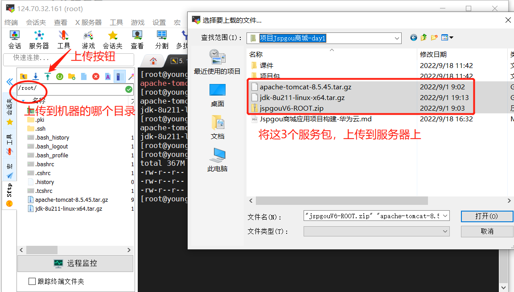


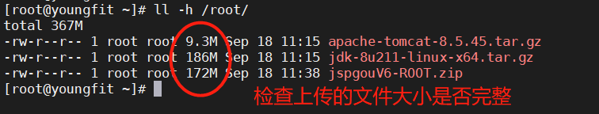


#### 二、部署Tomcat应用


```plain
1.安装JDK和tomcat
JDK 是整个Java的核心，包括了Java运行环境（Java Runtime Envirnment），一堆Java工具和Java基础的类库(rt.jar)。不论什么Java应用服务器实质都是内置了某个版本的JDK
[root@youngfit ~]# tar -xvzf jdk-8u211-linux-x64.tar.gz  -C /usr/local/
[root@youngfit ~]# tar -xvzf apache-tomcat-8.5.45.tar.gz -C /usr/local/
[root@youngfit ~]# cd /usr/local
[root@youngfit local]# mv jdk1.8.0_211/ java
[root@youngfit local]# mv apache-tomcat-8.5.45/ tomcat
```

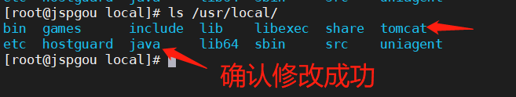

```plain
2.配置环境变量
PATH：存放系统搜索指定的二进制程序的路径，依次在路径找，找不到就报错
[root@youngfit ~]# vim /etc/profile #在最后添加以下内容
JAVA_HOME=/usr/local/java
PATH=$JAVA_HOME/bin:$PATH #使用JAVA_HOME下的JAVA命令
export JAVA_HOME PATH
CATALINA_HOME=/usr/local/tomcat #Tomcat安装目录
export CATALINA_HOME
[root@youngfit ~]# source /etc/profile
3.检测
[root@youngfit ~]# java -version
```

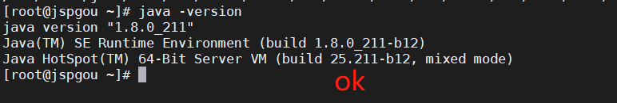

```plain
4.启动Tomcat
[root@youngfit ~]# /usr/local/tomcat/bin/startup.sh
(如何关闭呢：[root@youngfit ~]# /usr/local/tomcat/bin/shutdown.sh)
5.检查是否启动成功
[root@youngfit ~]# netstat -tnlp | grep java
tcp 0 0 ::ffff:127.0.0.1:8005 :::* LISTEN 6191/java
tcp 0 0 :::8009 :::* LISTEN 6191/java
tcp 0 0 :::8080 :::* LISTEN 6191/java
6.测试
http://公网IP地址:8080/
```

#### 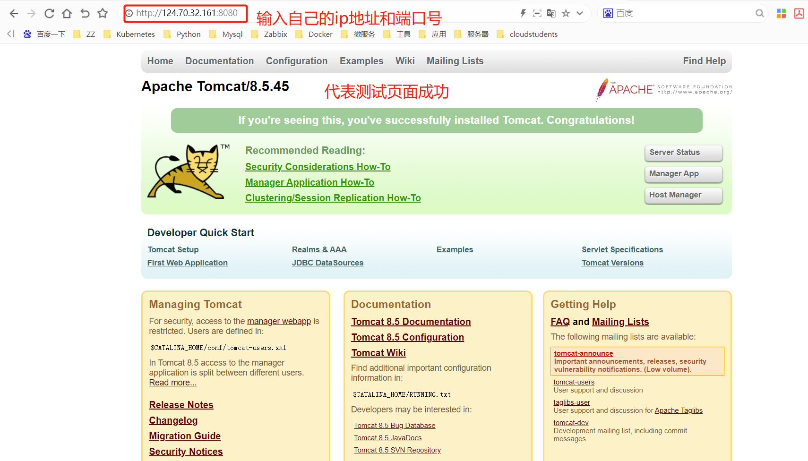

访问测试成功之后，先将tomcat停止，执行以下命令

```plain
[root@youngfit ~]# /usr/local/tomcat/bin/shutdown.sh
```

如果访问不到，请修改华为云安全组策略，将端口打开

我这里直接打开所有端口

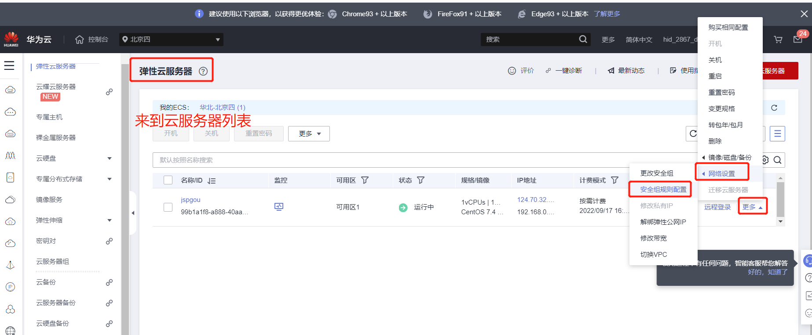

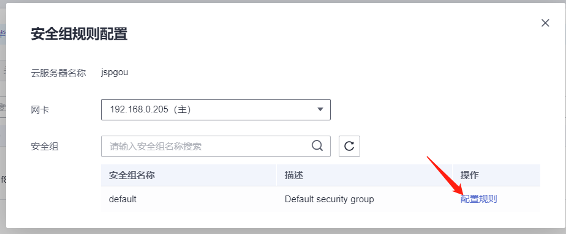

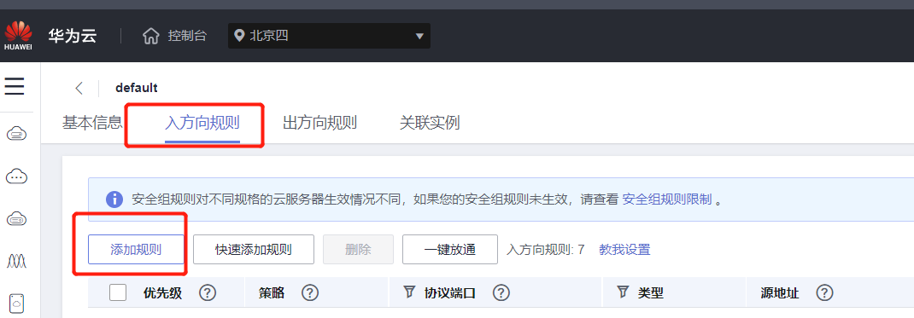

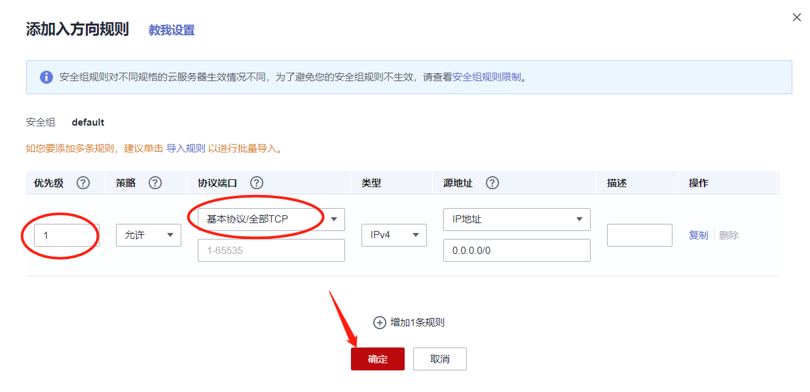

#### 三、安装数据库


```plain
1.使用mariadb
[root@youngfit ~]# yum -y install mariadb mariadb-server
[root@youngfit ~]# systemctl start mariadb
[root@youngfit ~]# mysql
create database jspgou default charset=utf8;	//在数据库中操作，创建数据库并指定字符集
flush privileges;		//(可选操作)
quit;  //退出数据库
```


#### 四、部署jspgou


```plain
[root@youngfit ~]# ls /usr/local/tomcat/webapps/ #默认网站的主目录
docs examples host-manager manager ROOT
[root@youngfit ~]# rm -rf /usr/local/tomcat/webapps/ROOT
[root@youngfit ~]# unzip jspgouV6-ROOT.zip
```

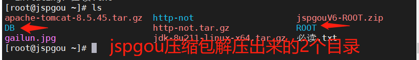

```plain
[root@youngfit ~]# cp -r ROOT/ /usr/local/tomcat/webapps/
```

#### 五、更改数据库链接


```plain
程序包内vim /usr/local/tomcat/webapps/ROOT/WEB-INF/config/jdbc.properties文件第20行左右
jdbc.url=jdbc:mysql://127.0.0.1:3306/创建好的数据库名?characterEncoding=UTF-8
jdbc.username=root
jdbc.password=
```


#### 六、导入数据


```plain
[root@youngfit ~]# cd DB
[root@youngfit DB]#  mysql -u root -p -D jspgou < jspgou.sql
```


#### 七、再次启动Tomcat服务


```shell
[root@youngfit ~]# cd /usr/local/tomcat/bin/startup.sh
```


#### 八、访问测试


```plain
登录地址：http://公网IP地址:8080/
```


```plain
系统管理后台登录：http://公网IP地址:8080/jeeadmin/jspgou/index.do
```


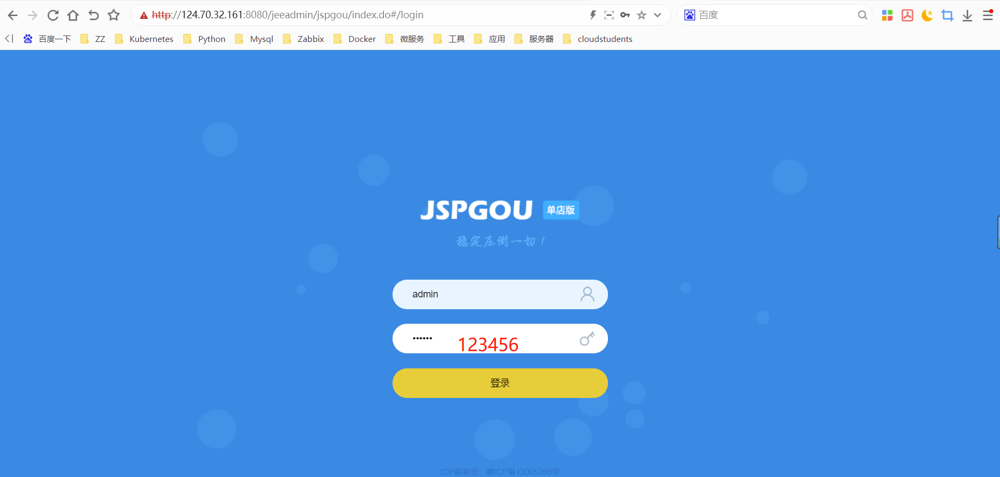


```plain
用户名：admin
密 码：123456
```


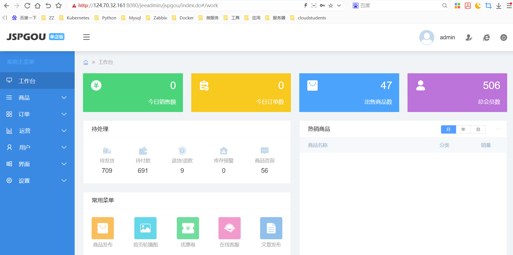