​      

# VMware Workstation安装(Linux内核)银河麒麟V10系统图文详解_kylin-server-10-sp1-release-build04-20200711-x86_6-CSDN博客

------

###### 1.下载 银河麒麟系统V10 服务版镜像包：

Kylin-Server-10-SP1-Release-Build04-20200711-x86_64.iso

百度云盘链接：https://pan.baidu.com/s/1z0GCEadvefUA8R988qDP5Q
 提取码：1l0g

###### 2.运行VMware Workstation，创建新的虚拟机：

###### 3.选中“典型”，下一步：

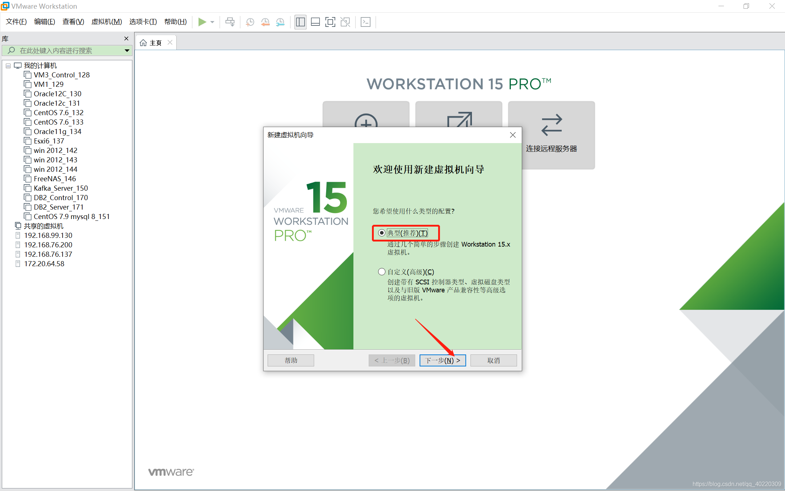

###### 4.安装程序光盘映像文件（浏览——文件存放路径），选中ISO镜像文件，点击下一步：

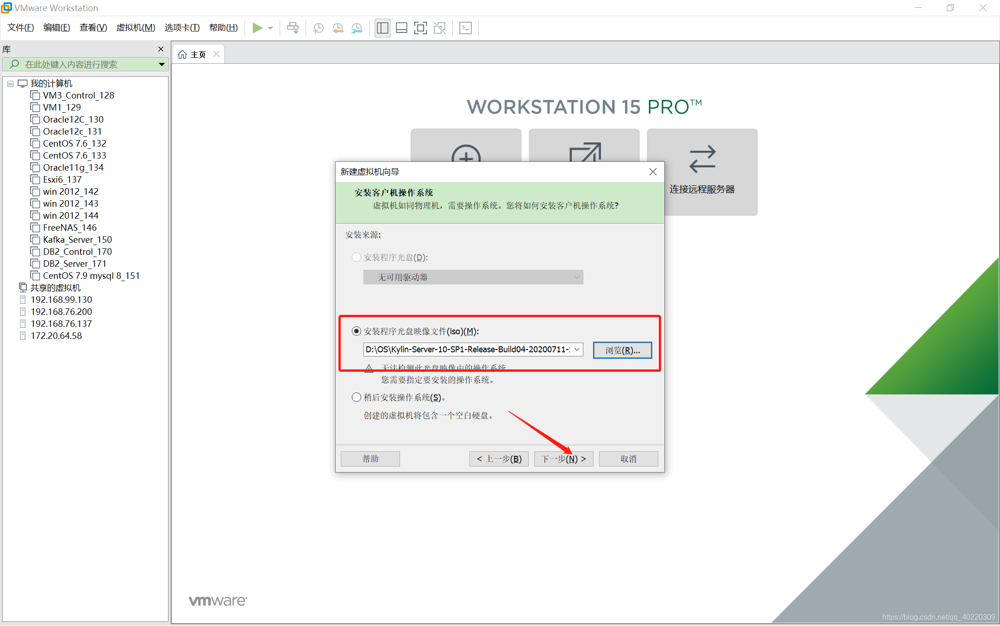

###### 5.虚拟机中安装操作系统选择Linux，下一步：

###### 6.输入虚拟机名称，选择虚机存放的位置，点击下一步：

###### 7.根据需要自定义设置磁盘大小，下一步：

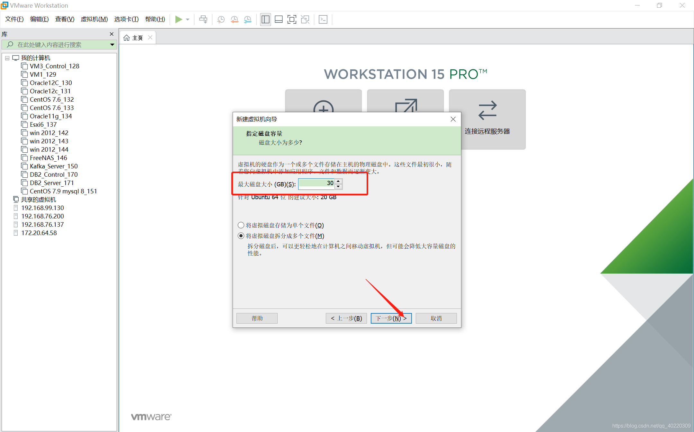

###### 8.也可以根据需要自定义硬件，修改完点击完成：

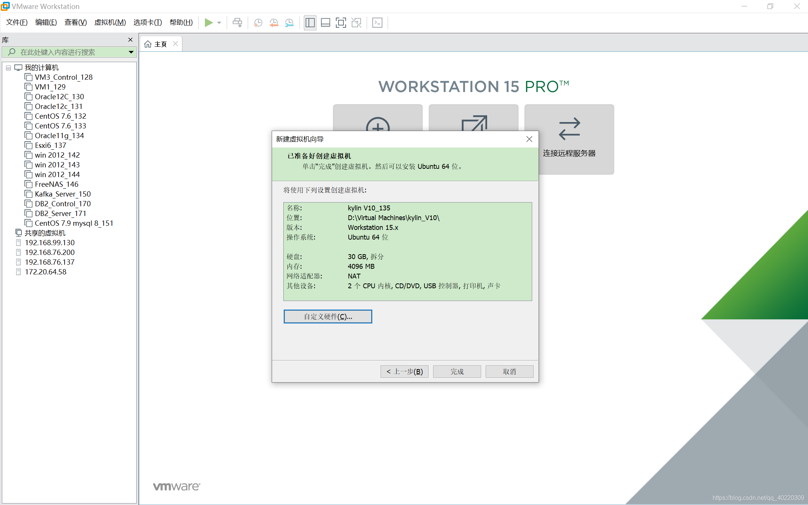

###### 9. 点击“开启此虚拟机”：

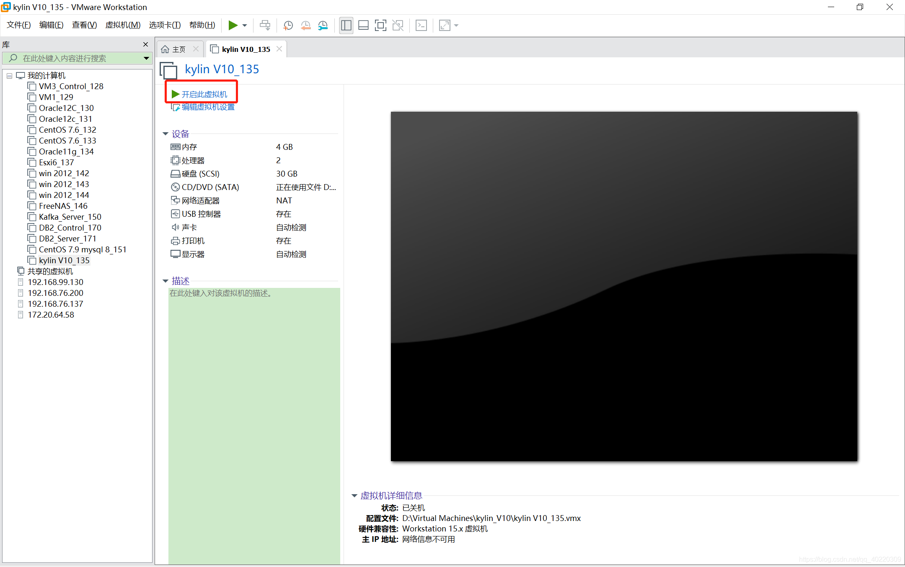

###### 10.启动界面如下图，选择“安装银河麒麟操作系统”，回车：

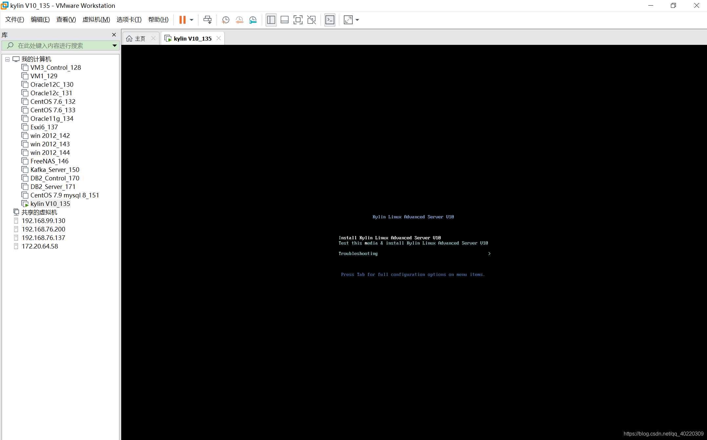

###### 11.安装设置，设置好后选择完成，设置root密码：

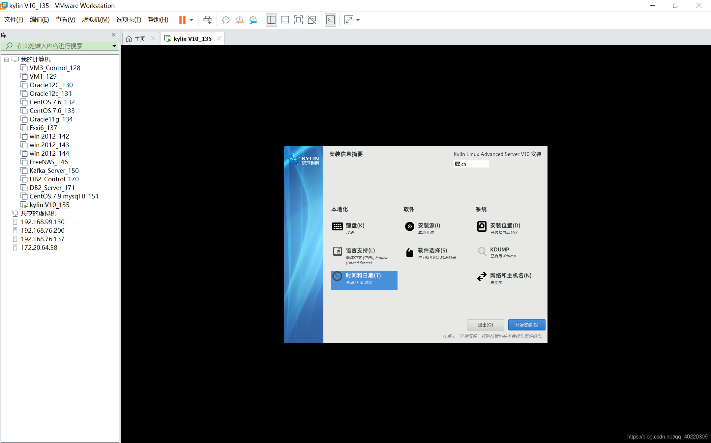
 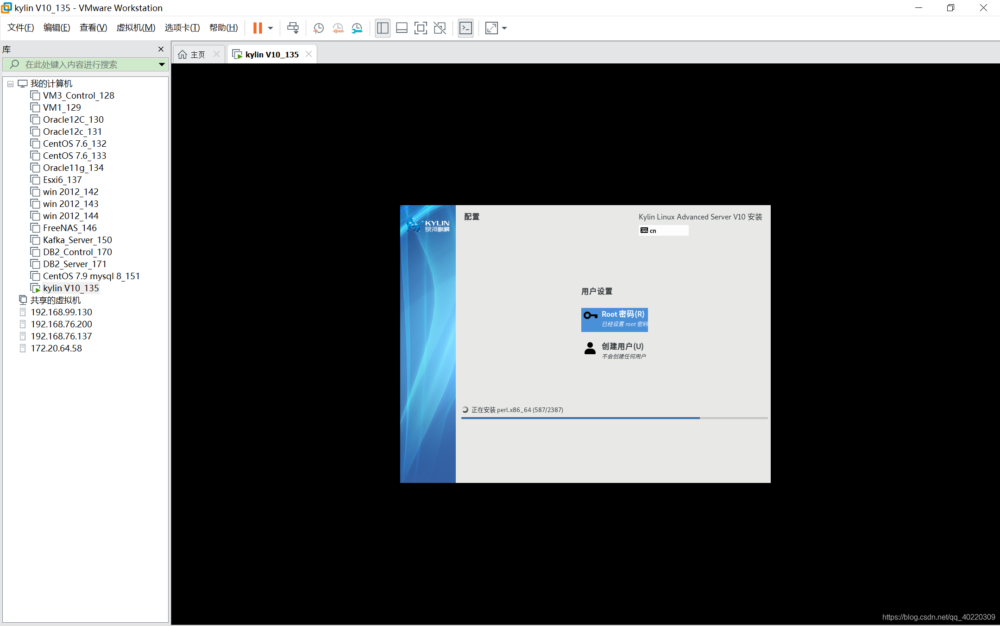

###### 12.安装完成后，点击重启：

 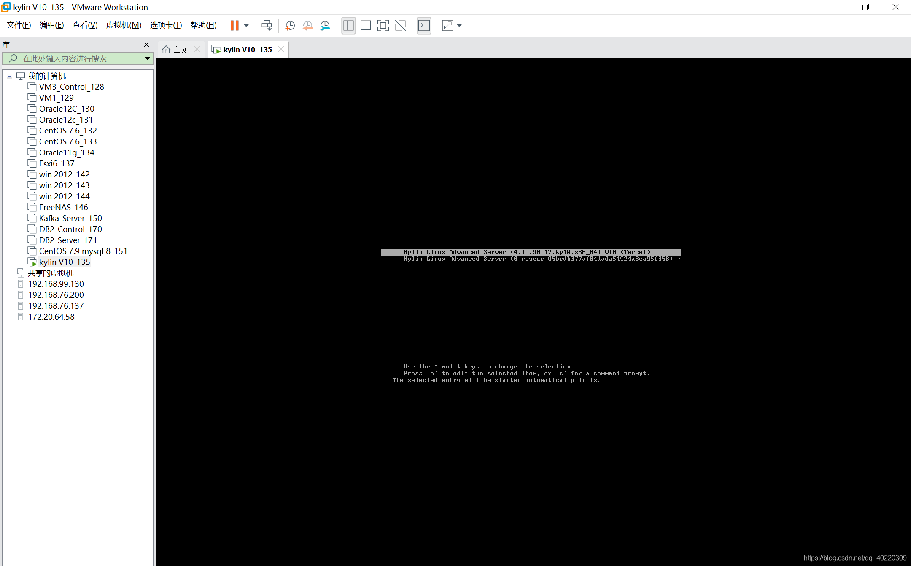

###### 13.重启好后进入初始设置：

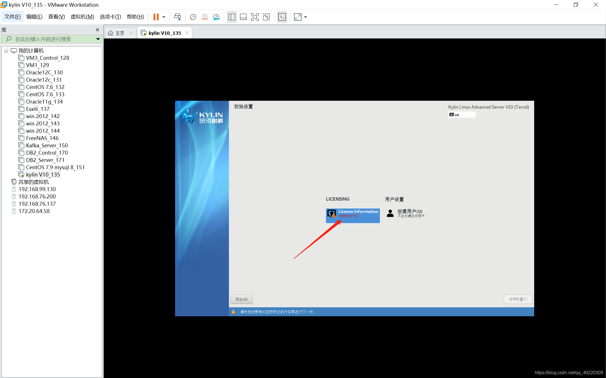
 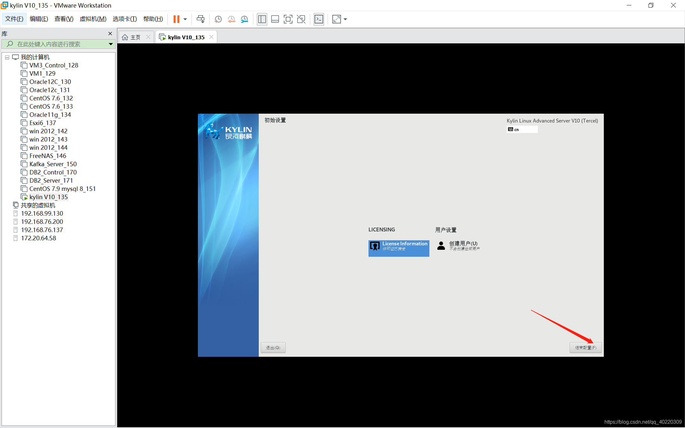

###### 14.因为安装的系统是服务版系统，所以是进不去GUI桌面的，按Ctrl+Alt+F2进入终端，进入主目录，到此银河麒麟系统就安装结束啦：

 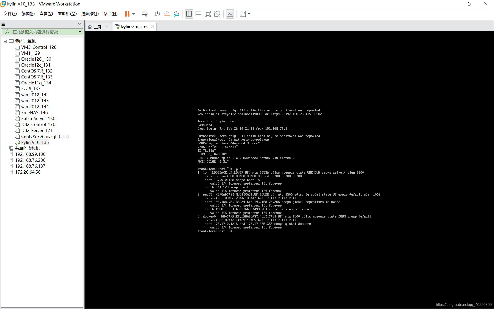

​              