# Linux只允许密钥登录

# Linux服务器远程连接只允许密钥文件


1.点击Xshell菜单栏的工具，选择新建用户密钥生成向导，进行密钥对生成操作。


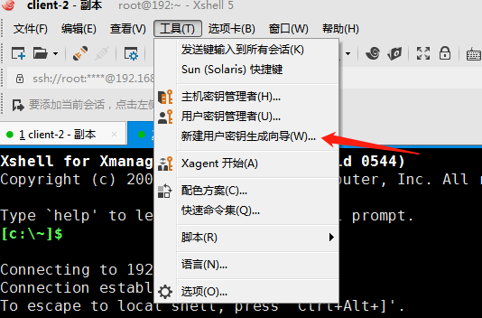


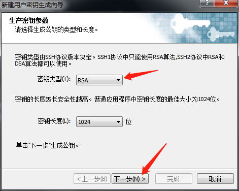


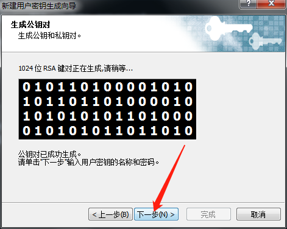


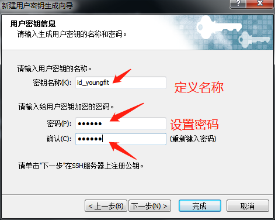


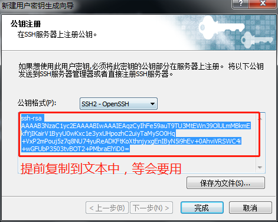


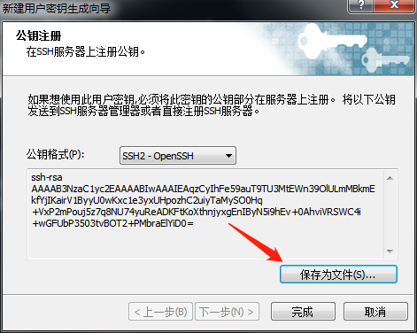


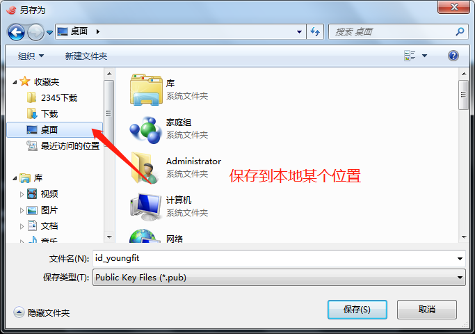


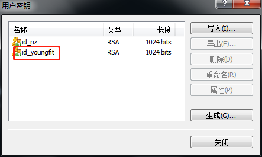


2.这个时候，你已经有了一个密钥，需要开始设定服务器的配置，启用密钥认证登录，同时为了系统安全着想，关闭密码认证的方式！


```shell
# vim /etc/ssh/sshd_config
```


修改下面几处：


```shell
PubkeyAuthentication  yes  #启用PublicKey认证。
AuthorizedKeysFile       .ssh/authorized_keys  #PublicKey文件路径。
PasswordAuthentication  no  #不适用密码认证登录。
```


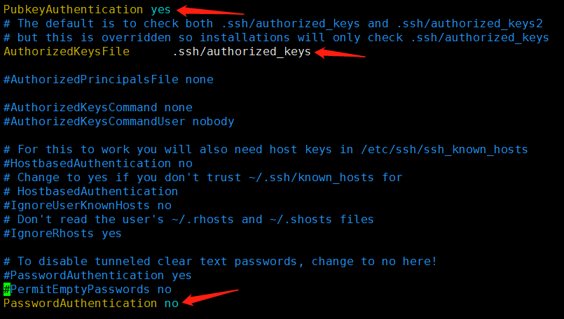


```shell
[root@192 .ssh]# vim /root/.ssh/authorized_keys
将公钥内容复制到此文本中
```


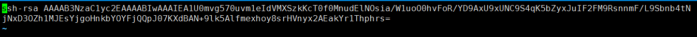


3.接着，修改该文件的权限，否则可能会遇到问题！


```shell
[root@192 .ssh]# chmod 600 authorized_keys
```


4.重启ssh服务


```shell
[root@192 .ssh]# systemctl restart sshd
```


5.至此，登录测试吧！你会发现输入完用户，密码一栏是灰色的！

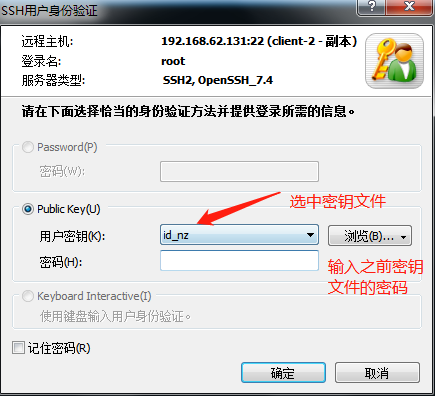


登录成功，配置完成！


禁止root用户远程登录

```shell
# vim /etc/ssh/sshd_config
```

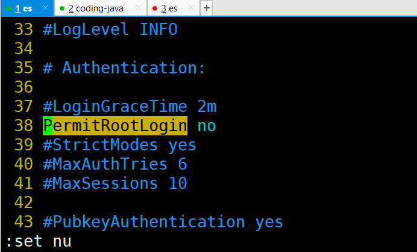

重启sshd服务

# Centos7下Rinetd安装与应用


两台虚拟机


```shell
192.168.62.131

192.168.62.231
放火墙均处于开启状态，selinux可以关闭
```


### 在192.168.62.131操作：


1. rpm安装


```shell
# wget  http://li.nux.ro/download/nux/misc/el7/x86_64//rinetd-0.62-9.el7.nux.x86_64.rpm
# yum -y install rinetd-0.62-9.el7.nux.x86_64.rpm
```


2.使用配置文件的用法

rpm安装的配置文件默认路径是/etc/rinetd.conf

```shell
# vim /etc/rinetd.conf
0.0.0.0     10022       192.168.62.231      1022
0.0.0.0     20022       192.168.62.232      1022
```


3.启动rinetd

```shell
# systemctl start rinetd
```


4.开放端口10022

```shell
# firewall-cmd --zone=public --add-port=10022/tcp --permanent
```


### 在192.168.62.231操作：


1.配置防火墙规则


指定源地址开放端口


```shell
# firewall-cmd --permanent --add-rich-rule="rule family="ipv4" source address="192.168.62.131" port protocol="tcp" port="1022" accept"
```


在Xshelll上测试


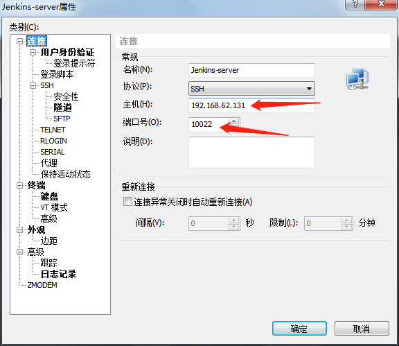


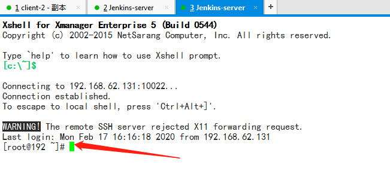


登录成功！！