# Logstash基本应用

### logstash概述

LogStash是开源的服务器端数据处理管道，能够同时从多个来源采集数据、转换数据，然后将数据发送到喜欢的"存储库"


Logstash管道有两个必需的元素，输入和输出，以及一个可选元素filter。输入插件使用来自源的数据，过滤器插件根据您的指定修改数据，输出插件将数据写入目标。

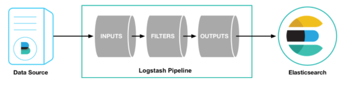

#### 输入

采集各种样式、大小和来源的数据，数据往往以各种各样的形式，或分散或几种地存在于很多系统中。


logstash支持各种输入选择，可以在同一时间从众多常用来源捕捉事件，能够以连续的流式传输方式，轻松地从日志、指标、web应用、数据存储等采集数据


#### 过滤

实时解析和转换数据


数据从源传输到es的过程中，logstash过滤器能够解析各个事件，识别已命名的字段已构建结构，并将它们转换成通用格式，以便更轻松、快速地分析和实现商业价值


#### 输出

logstash提供众多输出选择，可以将数据发送到要指定的地方

### 案例

#### 举例1：使用Logstash展示标准输入、输出

```shell
[root@jenkins-server logstash-6.5.4]# ./bin/logstash -e 'input { stdin { } } output { stdout {} }'
```

输入 

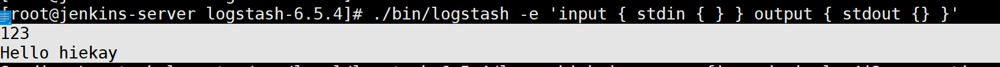

输出

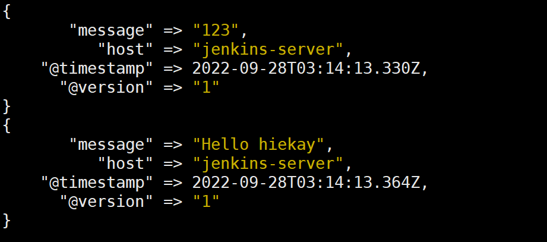

#### 举例2：使用Logstash收集日志文件并输出到ES

```shell
[root@jenkins-server logstash-6.5.4]# cat etc/conf.d/input.conf 
input {
	stdin {}
}
output {
	stdout {
		codec => rubydebug
	}
	elasticsearch {
      hosts => ["10.8.166.239:9200"]
      index => 'logstash-debug-%{+YYYY-MM-dd}'
    }
}
[root@jenkins-server logstash-6.5.4]# ./bin/logstash -f etc/conf.d/input.conf
```

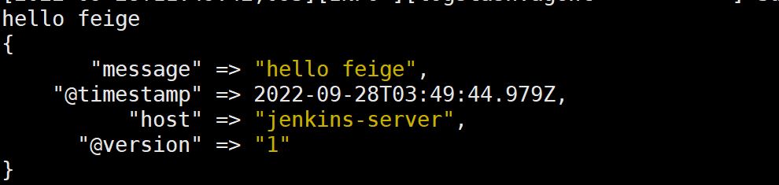

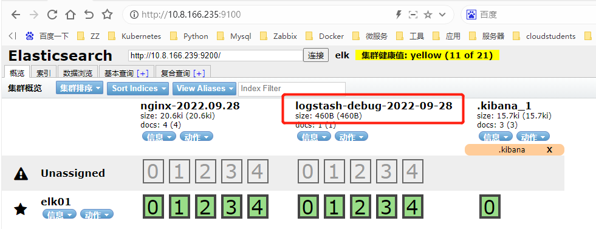

#### 举例2：使用Logstash收集日志文件并输出到终端

```shell
[root@jenkins-server logstash-6.5.4]# cat /var/log/nginx/a.log 
a.log中内容为：2020-09-25 15:40:21|INFO|读取数据|参数：id=1003

[root@jenkins-server logstash-6.5.4]# cat etc/conf.d/input.conf 
input {
        file {
                path => "/var/log/nginx/a.log"
                start_position => "beginning" #监听文件的起始位置，默认是end
        }
}
filter {
   mutate {
     split => {"message"=>"|"}
  }
}
output {
        stdout { codec => rubydebug }
}
```


配置文件的意思是 读取a.log文件，并按照[分隔符](https://so.csdn.net/so/search?q=分隔符&spm=1001.2101.3001.7020)|进行分隔，最后输出到控制台

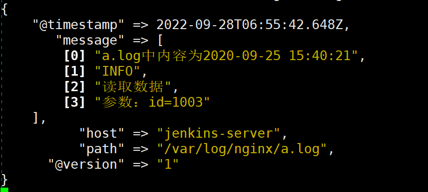


### Grok实战

grok内置字段模式类型：

```shell
USERNAME [a-zA-Z0-9._-]+
USER %{USERNAME}
EMAILLOCALPART [a-zA-Z][a-zA-Z0-9_.+-=:]+
EMAILADDRESS %{EMAILLOCALPART}@%{HOSTNAME}
INT (?:[+-]?(?:[0-9]+))
BASE10NUM (?<![0-9.+-])(?>[+-]?(?:(?:[0-9]+(?:\.[0-9]+)?)|(?:\.[0-9]+)))
NUMBER (?:%{BASE10NUM})
BASE16NUM (?<![0-9A-Fa-f])(?:[+-]?(?:0x)?(?:[0-9A-Fa-f]+))
BASE16FLOAT \b(?<![0-9A-Fa-f.])(?:[+-]?(?:0x)?(?:(?:[0-9A-Fa-f]+(?:\.[0-9A-Fa-f]*)?)|(?:\.[0-9A-Fa-f]+)))\b
 
POSINT \b(?:[1-9][0-9]*)\b
NONNEGINT \b(?:[0-9]+)\b
WORD \b\w+\b
NOTSPACE \S+
SPACE \s*
DATA .*?
GREEDYDATA .*
QUOTEDSTRING (?>(?<!\\)(?>"(?>\\.|[^\\"]+)+"|""|(?>'(?>\\.|[^\\']+)+')|''|(?>`(?>\\.|[^\\`]+)+`)|``))
UUID [A-Fa-f0-9]{8}-(?:[A-Fa-f0-9]{4}-){3}[A-Fa-f0-9]{12}
# URN, allowing use of RFC 2141 section 2.3 reserved characters
URN urn:[0-9A-Za-z][0-9A-Za-z-]{0,31}:(?:%[0-9a-fA-F]{2}|[0-9A-Za-z()+,.:=@;$_!*'/?#-])+
# Networking
MAC (?:%{CISCOMAC}|%{WINDOWSMAC}|%{COMMONMAC})
CISCOMAC (?:(?:[A-Fa-f0-9]{4}\.){2}[A-Fa-f0-9]{4})
WINDOWSMAC (?:(?:[A-Fa-f0-9]{2}-){5}[A-Fa-f0-9]{2})
COMMONMAC (?:(?:[A-Fa-f0-9]{2}:){5}[A-Fa-f0-9]{2})
IPV6 ((([0-9A-Fa-f]{1,4}:){7}([0-9A-Fa-f]{1,4}|:))|(([0-9A-Fa-f]{1,4}:){6}(:[0-9A-Fa-f]{1,4}|((25[0-5]|2[0-4]\d|1\d\d|[1-9]?\d)(\.(25[0-5]|2[0-4]\d|1\d\d|[1-9]?\d)){3})|:))|(([0-9A-Fa-f]{1,4}:){5}(((:[0-9A-Fa-f]{1,4}){1,2})|:((25[0-5]|2[0-4]\d|1\d\d|[1-9]?\d)(\.(25[0-5]|2[0-4]\d|1\d\d|[1-9]?\d)){3})|:))|(([0-9A-Fa-f]{1,4}:){4}(((:[0-9A-Fa-f]{1,4}){1,3})|((:[0-9A-Fa-f]{1,4})?:((25[0-5]|2[0-4]\d|1\d\d|[1-9]?\d)(\.(25[0-5]|2[0-4]\d|1\d\d|[1-9]?\d)){3}))|:))|(([0-9A-Fa-f]{1,4}:){3}(((:[0-9A-Fa-f]{1,4}){1,4})|((:[0-9A-Fa-f]{1,4}){0,2}:((25[0-5]|2[0-4]\d|1\d\d|[1-9]?\d)(\.(25[0-5]|2[0-4]\d|1\d\d|[1-9]?\d)){3}))|:))|(([0-9A-Fa-f]{1,4}:){2}(((:[0-9A-Fa-f]{1,4}){1,5})|((:[0-9A-Fa-f]{1,4}){0,3}:((25[0-5]|2[0-4]\d|1\d\d|[1-9]?\d)(\.(25[0-5]|2[0-4]\d|1\d\d|[1-9]?\d)){3}))|:))|(([0-9A-Fa-f]{1,4}:){1}(((:[0-9A-Fa-f]{1,4}){1,6})|((:[0-9A-Fa-f]{1,4}){0,4}:((25[0-5]|2[0-4]\d|1\d\d|[1-9]?\d)(\.(25[0-5]|2[0-4]\d|1\d\d|[1-9]?\d)){3}))|:))|(:(((:[0-9A-Fa-f]{1,4}){1,7})|((:[0-9A-Fa-f]{1,4}){0,5}:((25[0-5]|2[0-4]\d|1\d\d|[1-9]?\d)(\.(25[0-5]|2[0-4]\d|1\d\d|[1-9]?\d)){3}))|:)))(%.+)?
IPV4 (?<![0-9])(?:(?:[0-1]?[0-9]{1,2}|2[0-4][0-9]|25[0-5])[.](?:[0-1]?[0-9]{1,2}|2[0-4][0-9]|25[0-5])[.](?:[0-1]?[0-9]{1,2}|2[0-4][0-9]|25[0-5])[.](?:[0-1]?[0-9]{1,2}|2[0-4][0-9]|25[0-5]))(?![0-9])
IP (?:%{IPV6}|%{IPV4})
HOSTNAME \b(?:[0-9A-Za-z][0-9A-Za-z-]{0,62})(?:\.(?:[0-9A-Za-z][0-9A-Za-z-]{0,62}))*(\.?|\b)
IPORHOST (?:%{IP}|%{HOSTNAME})
HOSTPORT %{IPORHOST}:%{POSINT}
# paths
PATH (?:%{UNIXPATH}|%{WINPATH})
UNIXPATH (/([\w_%!$@:.,+~-]+|\\.)*)+
TTY (?:/dev/(pts|tty([pq])?)(\w+)?/?(?:[0-9]+))
WINPATH (?>[A-Za-z]+:|\\)(?:\\[^\\?*]*)+
URIPROTO [A-Za-z]([A-Za-z0-9+\-.]+)+
URIHOST %{IPORHOST}(?::%{POSINT:port})?
# uripath comes loosely from RFC1738, but mostly from what Firefox
# doesn't turn into %XX
URIPATH (?:/[A-Za-z0-9$.+!*'(){},~:;=@#%&_\-]*)+
#URIPARAM \?(?:[A-Za-z0-9]+(?:=(?:[^&]*))?(?:&(?:[A-Za-z0-9]+(?:=(?:[^&]*))?)?)*)?
URIPARAM \?[A-Za-z0-9$.+!*'|(){},~@#%&/=:;_?\-\[\]<>]*
URIPATHPARAM %{URIPATH}(?:%{URIPARAM})?
URI %{URIPROTO}://(?:%{USER}(?::[^@]*)?@)?(?:%{URIHOST})?(?:%{URIPATHPARAM})?
# Months: January, Feb, 3, 03, 12, December
MONTH \b(?:[Jj]an(?:uary|uar)?|[Ff]eb(?:ruary|ruar)?|[Mm](?:a|ä)?r(?:ch|z)?|[Aa]pr(?:il)?|[Mm]a(?:y|i)?|[Jj]un(?:e|i)?|[Jj]ul(?:y)?|[Aa]ug(?:ust)?|[Ss]ep(?:tember)?|[Oo](?:c|k)?t(?:ober)?|[Nn]ov(?:ember)?|[Dd]e(?:c|z)(?:ember)?)\b
MONTHNUM (?:0?[1-9]|1[0-2])
MONTHNUM2 (?:0[1-9]|1[0-2])
MONTHDAY (?:(?:0[1-9])|(?:[12][0-9])|(?:3[01])|[1-9])
# Days: Monday, Tue, Thu, etc...
DAY (?:Mon(?:day)?|Tue(?:sday)?|Wed(?:nesday)?|Thu(?:rsday)?|Fri(?:day)?|Sat(?:urday)?|Sun(?:day)?)
# Years?
YEAR (?>\d\d){1,2}
HOUR (?:2[0123]|[01]?[0-9])
MINUTE (?:[0-5][0-9])
# '60' is a leap second in most time standards and thus is valid.
SECOND (?:(?:[0-5]?[0-9]|60)(?:[:.,][0-9]+)?)
TIME (?!<[0-9])%{HOUR}:%{MINUTE}(?::%{SECOND})(?![0-9])
# datestamp is YYYY/MM/DD-HH:MM:SS.UUUU (or something like it)
DATE_US %{MONTHNUM}[/-]%{MONTHDAY}[/-]%{YEAR}
DATE_EU %{MONTHDAY}[./-]%{MONTHNUM}[./-]%{YEAR}
ISO8601_TIMEZONE (?:Z|[+-]%{HOUR}(?::?%{MINUTE}))
ISO8601_SECOND (?:%{SECOND}|60)
TIMESTAMP_ISO8601 %{YEAR}-%{MONTHNUM}-%{MONTHDAY}[T ]%{HOUR}:?%{MINUTE}(?::?%{SECOND})?%{ISO8601_TIMEZONE}?
DATE %{DATE_US}|%{DATE_EU}
DATESTAMP %{DATE}[- ]%{TIME}
TZ (?:[APMCE][SD]T|UTC)
DATESTAMP_RFC822 %{DAY} %{MONTH} %{MONTHDAY} %{YEAR} %{TIME} %{TZ}
DATESTAMP_RFC2822 %{DAY}, %{MONTHDAY} %{MONTH} %{YEAR} %{TIME} %{ISO8601_TIMEZONE}
DATESTAMP_OTHER %{DAY} %{MONTH} %{MONTHDAY} %{TIME} %{TZ} %{YEAR}
DATESTAMP_EVENTLOG %{YEAR}%{MONTHNUM2}%{MONTHDAY}%{HOUR}%{MINUTE}%{SECOND}
# Syslog Dates: Month Day HH:MM:SS
SYSLOGTIMESTAMP %{MONTH} +%{MONTHDAY} %{TIME}
PROG [\x21-\x5a\x5c\x5e-\x7e]+
SYSLOGPROG %{PROG:program}(?:\[%{POSINT:pid}\])?
SYSLOGHOST %{IPORHOST}
SYSLOGFACILITY <%{NONNEGINT:facility}.%{NONNEGINT:priority}>
HTTPDATE %{MONTHDAY}/%{MONTH}/%{YEAR}:%{TIME} %{INT}
# Shortcuts
QS %{QUOTEDSTRING}
# Log formats
SYSLOGBASE %{SYSLOGTIMESTAMP:timestamp} (?:%{SYSLOGFACILITY} )?%{SYSLOGHOST:logsource} %{SYSLOGPROG}:
# Log Levels
LOGLEVEL ([Aa]lert|ALERT|[Tt]race|TRACE|[Dd]ebug|DEBUG|[Nn]otice|NOTICE|[Ii]nfo|INFO|[Ww]arn?(?:ing)?|WARN?(?:ING)?|[Ee]rr?(?:or)?|ERR?(?:OR)?|[Cc]rit?(?:ical)?|CRIT?(?:ICAL)?|[Ff]atal|FATAL|[Ss]evere|SEVERE|EMERG(?:ENCY)?|[Ee]merg(?:ency)?)
```

#### 过滤IP

```shell
[root@jenkins-server logstash-6.5.4]# cat etc/conf.d/input.conf 
input {
    stdin {
    }
}
filter{
    grok{
        match => {"message" => "%{IPV4:ip}"}
    }
}
output {
    stdout {
    }
}

[root@jenkins-server logstash-6.5.4]# ./bin/logstash -f etc/conf.d/input.conf
```

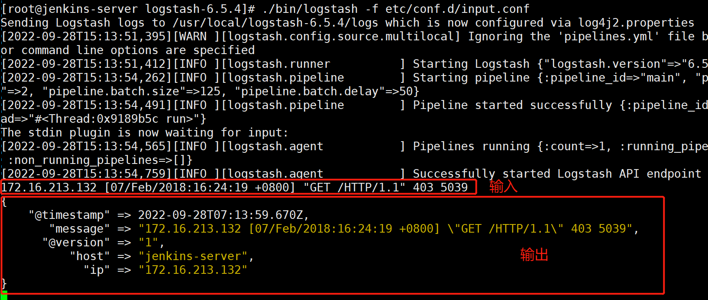

#### 过滤时间戳

```shell
[root@jenkins-server logstash-6.5.4]# cat etc/conf.d/input.conf 
input {
    stdin {
    }
}
filter{
    grok{
        match => {"message" => "%{IPV4:ip}\ \[%{HTTPDATE:timestamp}\]"}
    }
}
output {
    stdout {
    }
}

[root@jenkins-server logstash-6.5.4]# ./bin/logstash -f etc/conf.d/input.conf
```

注意：

日志中的空格、双引号、单引号、中括号等，需要用 \ 进行转义

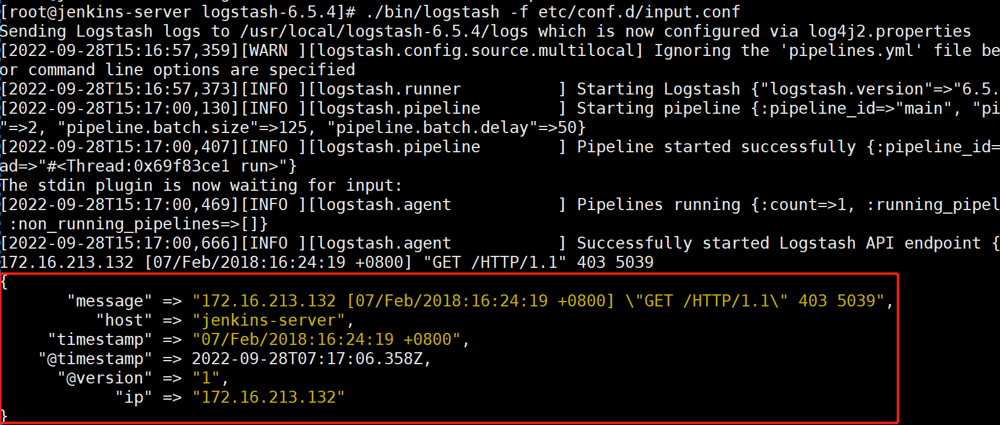

#### 过滤报文头信息

```shell
[root@jenkins-server logstash-6.5.4]# cat etc/conf.d/input.conf 
input {
    stdin {
    }
}
filter{
    grok{
        match => {"message" => "\ %{QS:referrer}\ "}
    }
}
output {
    stdout {
    }
}
[root@jenkins-server logstash-6.5.4]# ./bin/logstash -f etc/conf.d/input.conf
```

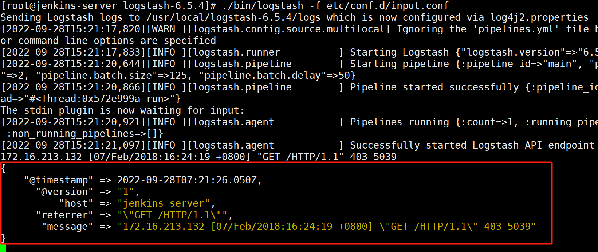

### date 插件

date过滤器用于解析字段中的日期，然后使用该日期或时间戳作为事件的logstash时间戳。


例如，syslog事件通常有这样的时间戳：

"Apr 17 09:32:01"


应该使用 MMM dd HH:mm:ss 的日期格式来解析这个。

日期过滤器对于事件的排序和对旧数据的回填特别重要，如果在你的事件中没有得到正确的日期，那么以后搜索它们可能会出现顺序不对。


如果没有这个过滤器，logstash将根据第一次得到事件（在输入时）的时间（如果时间戳还没有在事件中设置）选择一个时间戳，例如，对于文件输入，时间戳被设置为每次读取的时间。


日期格式说明

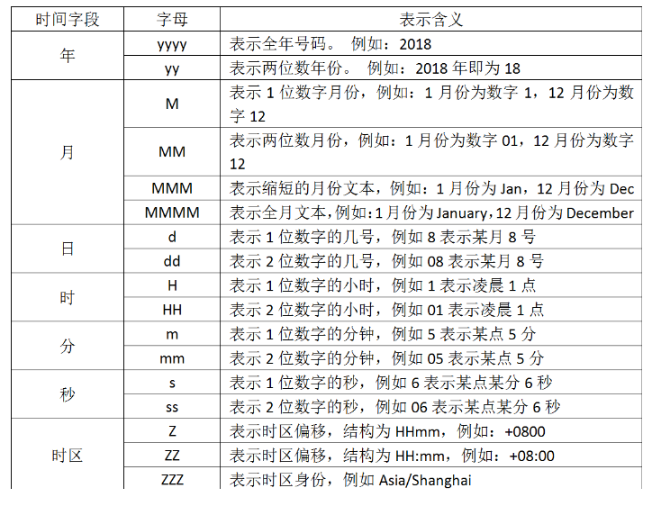


date 过滤器配置选项

| 设置           | 输入类型 | 要求 |
| -------------- | -------- | ---- |
| locale         | string   | No   |
| match          | array    | No   |
| tag_on_failure | array    | No   |
| target         | string   | No   |
| timezone       | string   | No   |

​	

四、date 实战

在上面我们有个例子是讲解timestamp字段，表示取出日志中的时间。但是在显示的时候除了显示你指定的timestamp外，还有一行是@timestamp信息，这两个时间是不一样的，@timestamp表示系统当前时间。两个时间并不是一回事，在ELK的日志处理系统中，@timestamp字段会被elasticsearch用到，用来标注日志的生产时间，如此一来，日志生成时间就会发生混乱，要解决这个问题，需要用到另一个插件，即date插件，这个时间插件用来转换日志记录中的时间字符串，变成Logstash::Timestamp对象，然后转存到@timestamp字段里面。


```shell
[root@jenkins-server logstash-6.5.4]# cat etc/conf.d/input.conf
input {
    stdin {
    }
}
filter{
     grok{
          match => {"message" => "\ \[%{HTTPDATE:timestamp}\]"}
     }
     date{
          match => ["timestamp","dd/MMM/yyyy:HH:mm:ss Z"]
     }
}
output {
    stdout {
    }
}
输入内容:
172.16.213.132 [07/Feb/2018:16:24:19 +0800] "GET /HTTP/1.1" 403 5039
```

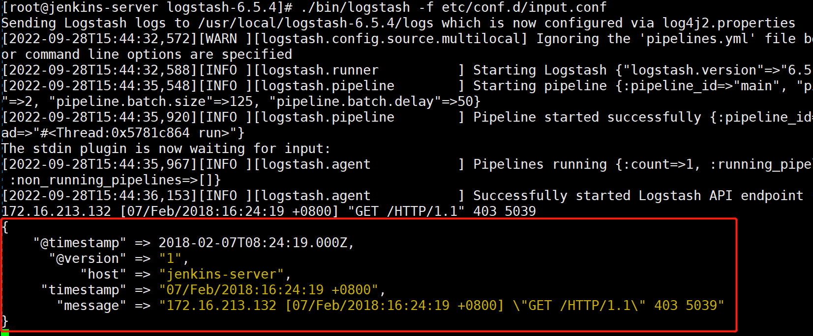


##### ISO8601形式1

```shell
[root@jenkins-server logstash-6.5.4]# cat etc/conf.d/input.conf
input {
    stdin {
    }
}
filter{
     grok{
#          match => {"message" => "\ \[%{HTTPDATE:timestamp}\]"}
           match => { "message" => "%{TIMESTAMP_ISO8601:log_create_time}" }
     }
     date{
#          match => ["timestamp","dd/MMM/yyyy:HH:mm:ss Z"]
           match => [ "log_create_time", "yyyy-MM-dd HH:mm:ss.SSS" ]
     }
}
output {
    stdout {
    }
}
输入内容：2019-03-19 13:08:07.782
```

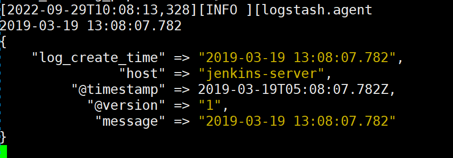


### 数据修改 mutate 插件

mutate插件是logstash另一个非常重要的插件，它提供了丰富的基础类型数据处理能力，包括重命名、删除、替换、修改日志事件中的字段。我们这里举几个常用的mutate插件：字段类型转换功能covert、正则表达式替换字段功能gsub、分隔符分隔字符串为数值功能split、重命名字段功能rename、删除字段功能remove_field 等

add_field 增加字段

remove_field 删除字段

rename_field 重命名字段

replace 修改字段的值(可以调用其他字段)

update 修改字段的值(不可以调用其他字段)

convert 字段类型转换

copy 复制一个字段

lowercase 值转小写

uppercase 值转大写

split 字段分割

strip 去掉末尾空格

gsub 正则替换，只对字符串类型有效

### geoip 实战

geoip是常见的免费的IP地址归类查询库，geoip可以根据IP地址提供对应的地域信息，包括国别，省市，经纬度等等，此插件对于可视化地图和区域统计非常有用。

```shell
[root@jenkins-server logstash-6.5.4]# cat etc/conf.d/input.conf 
input {
    stdin {
    }
}

filter{
    grok {
        match => ["message","%{IP:ip}"]
        remove_field => ["message"]
    }
    geoip {
        source => ["ip"]
    }
}

output {
    stdout {
    }
}
```

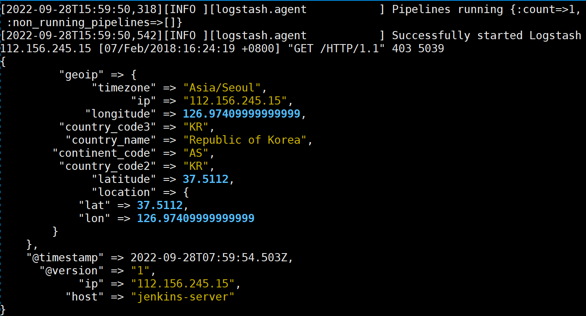

上面的结果输出了很多信息，我们对结果进行选择性的输出

```shell
[root@jenkins-server logstash-6.5.4]# cat etc/conf.d/input.conf 
input {
    stdin {
    }
}
filter{
    grok {
        match => ["message","%{IP:ip}"]
        remove_field => ["message"]
    }
    geoip {
        source => ["ip"]
    }
}
output {
    stdout {
    }
}
```

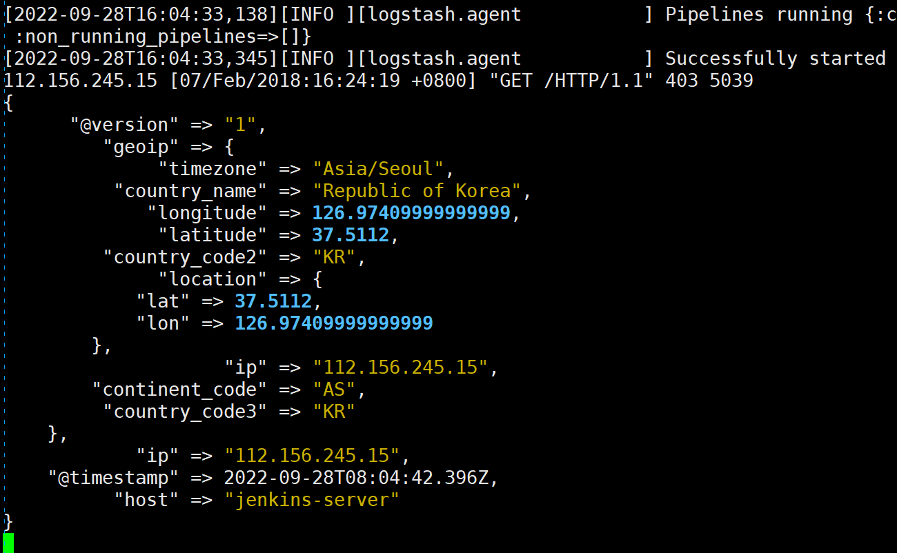