# OpenVPN构建应用

OpenVPN是一个开源的应用程序，它允许您通过公共互联网创建一个安全的专用网络。OpenVPN实现一个虚拟专用网（VPN）来创建一个安全连接。OpenVPN使用OpenSSL库提供加密，它提供了几种身份验证机制，如基于证书的、预共享密钥和用户名/密码身份验证。


在本教程中，我们将向您展示如何在CentOS 7.4服务器上逐步安装和配置OpenVPN。


实现基于用户名和密码的OpenVPN认证


## OpenVpn服务端构建


**关闭se**[**linux**](https://www.linuxprobe.com/)


```shell
[root@openvpn ~]# sed -i '/^SELINUX/s/enforcing/disabled/g' /etc/selinux/config && setenforce 0
```


### 安装epel仓库和openvpn, Easy-RSA工具


```shell
[root@openvpn ~]# yum -y install epel-release && yum -y install openvpn easy-rsa
```


**配置EASY-RSA 3.0**


在/etc/openvpn文件夹下面创建easy-rsa文件夹，并把相关文件复制进去


```shell
[root@openvpn ~]# mkdir -p /etc/openvpn/easy-rsa/
[root@openvpn ~]# cp -r /usr/share/easy-rsa/3/* /etc/openvpn/easy-rsa/
[root@openvpn ~]# cp -p /usr/share/doc/easy-rsa-3.0.8/vars.example /etc/openvpn/easy-rsa/vars
```


### 创建OpenVPN相关的密钥


我们将创建CA密钥，server端、client端密钥，DH和CRL PEM, TLS认证钥匙ta.key。


```shell
[root@openvpn easy-rsa]# cd /etc/openvpn/easy-rsa/
```


### 初始化并建立CA证书


创建服务端和客户端密钥之前，需要初始化PKI目录


```shell
[root@openvpn easy-rsa]# ./easyrsa init-pki
```


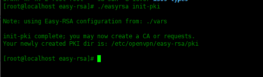


```shell
[root@openvpn easy-rsa]# ./easyrsa build-ca nopass
```


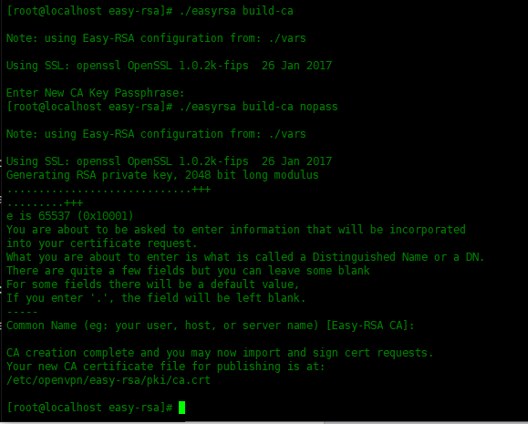


### 创建服务器密钥


创建服务器密钥名称为 server1.key


```shell
[root@openvpn easy-rsa]# ./easyrsa gen-req server1 nopass
```


添加nopass 选项，是指不需要为密钥添加密码。
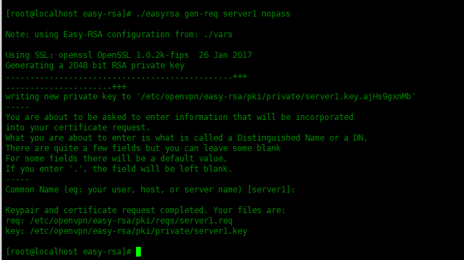


用CA证书签署server1密钥


```shell
[root@openvpn easy-rsa]# ./easyrsa sign-req server server1
记得输入yes
```


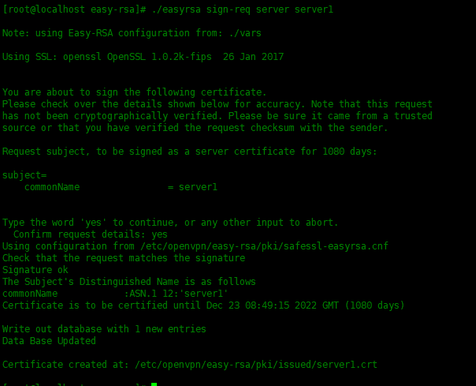


### 创建客户端密钥


创建客户端密钥名称为 client1.key


```shell
[root@openvpn easy-rsa]# ./easyrsa gen-req client1 nopass
```


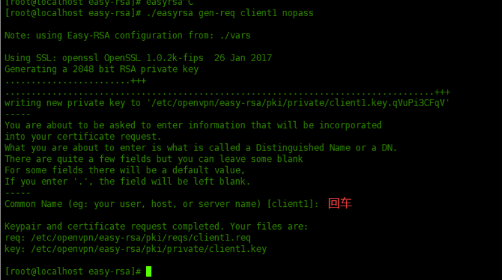


### 用CA证书签署client1密钥


```shell
[root@openvpn easy-rsa]# ./easyrsa sign-req client client1
```


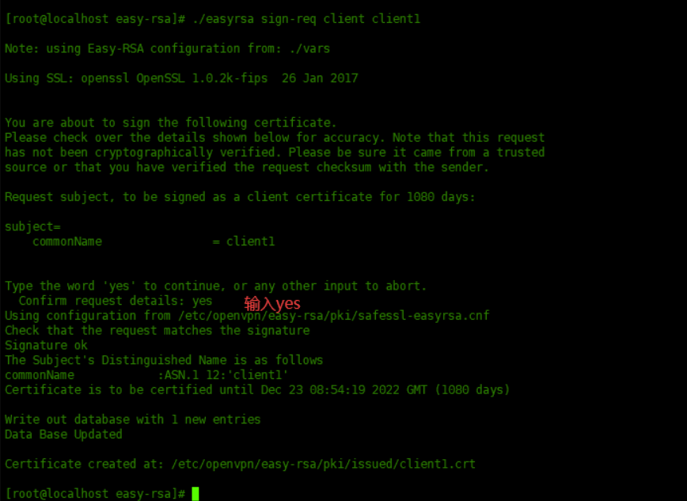


### 创建DH密钥


根据在顶部创建的vars配置文件生成2048位的密钥


```plain
[root@openvpn easy-rsa]# ./easyrsa gen-dh
```


### 创建TLS认证密钥


```shell
[root@openvpn easy-rsa]# openvpn --genkey --secret /etc/openvpn/easy-rsa/ta.key
```


### 生成 证书撤销列表(CRL)密钥


CRL(证书撤销列表)密钥用于撤销客户端密钥。如果服务器上有多个客户端证书，希望删除某个密钥，那么只需使用./easyrsa revoke NAME这个[命令](https://www.linuxcool.com/)撤销即可。


生成CRL密钥：


```plain
[root@openvpn easy-rsa]# ./easyrsa  gen-crl
```


### 复制证书文件


复制ca证书，ta.key和server端证书及密钥到/etc/openvpn/server文件夹里


```shell
[root@openvpn easy-rsa]# cp -p pki/ca.crt /etc/openvpn/server/ 
[root@openvpn easy-rsa]# cp -p pki/issued/server1.crt /etc/openvpn/server/ 
[root@openvpn easy-rsa]# cp -p pki/private/server1.key /etc/openvpn/server/ 
[root@openvpn easy-rsa]# cp -p ta.key /etc/openvpn/server/
```


复制ca证书，ta.key和client端证书及密钥到/etc/openvpn/client文件夹里


```shell
[root@openvpn easy-rsa]# cp -p pki/ca.crt /etc/openvpn/client/  
[root@openvpn easy-rsa]# cp -p ta.key /etc/openvpn/client/
[root@openvpn easy-rsa]# cp -p pki/issued/client1.crt /etc/openvpn/client/
[root@openvpn easy-rsa]# cp -p pki/private/client1.key /etc/openvpn/client/
```


复制dh.pem , crl.pem到/etc/openvpn/server文件夹里


```shell
[root@openvpn easy-rsa]# cp pki/dh.pem /etc/openvpn/server/ 
[root@openvpn easy-rsa]# cp pki/crl.pem /etc/openvpn/server/
```


### 修改OpenVPN配置文件


复制模板到主配置文件夹里面


```shell
[root@openvpn easy-rsa]# cp -p /usr/share/doc/openvpn-2.4.10/sample/sample-config-files/server.conf /etc/openvpn/server/
# 修改后的内容如下
[root@openvpn server]# cd /etc/openvpn/server/
[root@openvpn server]# cat server.conf |grep '^[^#|^;]'
port 1194
proto udp
dev tun
ca ca.crt
cert server1.crt #需要改
key server1.key  # #需要改This file should be kept secret
dh dh.pem #需要改
crl-verify crl.pem #需要加
server 10.8.0.0 255.255.255.0
ifconfig-pool-persist ipp.txt
push "redirect-gateway def1 bypass-dhcp" #需要删除注释
push "dhcp-option DNS 114.114.114.114" #需要改
duplicate-cn 
keepalive 10 120
tls-auth ta.key 0 # This file is secret
cipher AES-256-CBC
compress lz4-v2
push "compress lz4-v2" 
max-clients 100 
user nobody
group nobody
persist-key
persist-tun
status openvpn-status.log
log-append  openvpn.log
verb 3
explicit-exit-notify 1
#下面是配置用户名密码登录需要添加
script-security 3
auth-user-pass-verify /etc/openvpn/checkpsw.sh via-env    #指定用户认证脚本
username-as-common-name
verify-client-cert none
```


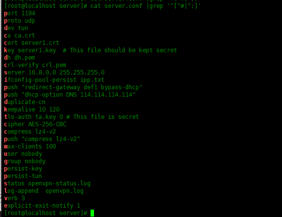


注释：修改过后，本人已用sz进行下载

/


## OpenVPN 设置账号密码登录(可多用户)


首先我们需要编写一个用户认证的脚本


```shell
vim /etc/openvpn/checkpsw.sh 
#!/bin/sh
###########################################################
# checkpsw.sh (C) 2004 Mathias Sundman 
#
# This script will authenticate OpenVPN users against
# a plain text file. The passfile should simply contain
# one row per user with the username first followed by
# one or more space(s) or tab(s) and then the password.
 
PASSFILE="/etc/openvpn/psw-file"
LOG_FILE="/etc/openvpn/openvpn-password.log"
TIME_STAMP=`date "+%Y-%m-%d %T"`
 
###########################################################
 
if [ ! -r "${PASSFILE}" ]; then
  echo "${TIME_STAMP}: Could not open password file \"${PASSFILE}\" for reading." >> ${LOG_FILE}
  exit 1
fi
 
CORRECT_PASSWORD=`awk '!/^;/&&!/^#/&&$1=="'${username}'"{print $2;exit}' ${PASSFILE}`
 
if [ "${CORRECT_PASSWORD}" = "" ]; then 
  echo "${TIME_STAMP}: User does not exist: username=\"${username}\", password=\"${password}\"." >> ${LOG_FILE}
  exit 1
fi
 
if [ "${password}" = "${CORRECT_PASSWORD}" ]; then 
  echo "${TIME_STAMP}: Successful authentication: username=\"${username}\"." >> ${LOG_FILE}
  exit 0
fi
 
echo "${TIME_STAMP}: Incorrect password: username=\"${username}\", password=\"${password}\"." >> ${LOG_FILE}
exit 1
```


接下来给脚本执行权限


```
chmod 755 /etc/openvpn/checkpsw.sh
```


现在我们配置用户密码文件


```shell
cat /etc/openvpn/psw-file 
test test
test1 test1
youngfit youngfit
#前面为用户名，后面为密码。 中间使用空格分开
```


### 开启转发


修改内核模块


```shell
[root@openvpn server]# echo 'net.ipv4.ip_forward = 1' >> /etc/sysctl.conf && sysctl -p
回显net.ipv4.ip_forward = 1
```


修改防火墙


```shell
[root@openvpn server]# firewall-cmd --permanent --add-service=openvpn
[root@openvpn server]# firewall-cmd --permanent --add-interface=tun0
[root@openvpn server]# firewall-cmd --permanent --add-masquerade
[root@openvpn server]# firewall-cmd --permanent --direct --passthrough ipv4 -t nat -A POSTROUTING -s  10.8.0.0/24 -o ens33 -j MASQUERADE  
[root@openvpn server]# firewall-cmd --zone=public --add-port=1194/udp --permanent
[root@openvpn server]# firewall-cmd --reload
切记一定保持firewalld防火墙为开启的状态，设置的转发策略才会生效。
```


**启动服务并开机启动**


```shell
[root@openvpn server]# systemctl enable openvpn-server@server 
[root@openvpn server]# systemctl start openvpn-server@server
```


检查一下服务是否启动


```shell
[root@openvpn server]# netstat -tlunp
[root@openvpn server]# systemctl status openvpn-server@server
```


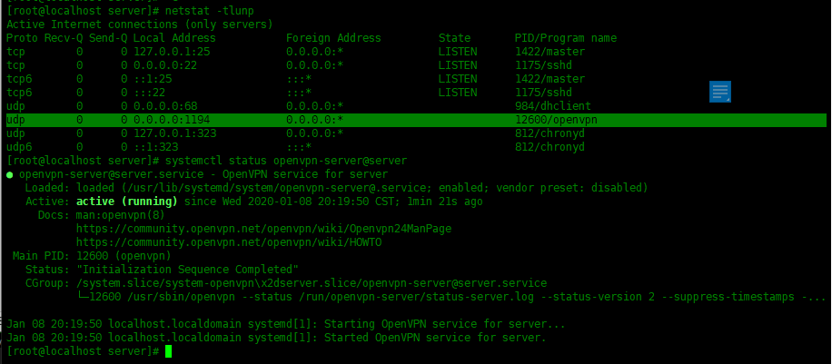


## OpenVPN 客户端安装


在openvpn服务器端操作，复制一个client.conf模板到/etc/openvpn/client文件夹下面。然后编辑该文件/etc/openvpn/client/client.conf


```shell
[root@openvpn server]# cp -p /usr/share/doc/openvpn-2.4.10/sample/sample-config-files/client.conf /etc/openvpn/client/
# 修改后的内容如下
[root@localhost client]# cat client.conf |grep '^[^#|^;]'
client
dev tun
proto udp
remote 192.168.43.138 1194 #要改为Openvpn服务器的IP地址,如果是路由器做端口映射，应该写路由器的ip地址 以及对应的端口号
resolv-retry infinite
nobind
persist-key
persist-tun
ca ca.crt
;cert client.crt #注释
;key client.key #注释
remote-cert-tls server
tls-auth ta.key 1
cipher AES-256-CBC
verb 3
auth-user-pass              #使用用户名密码登录openvpn服务器
```


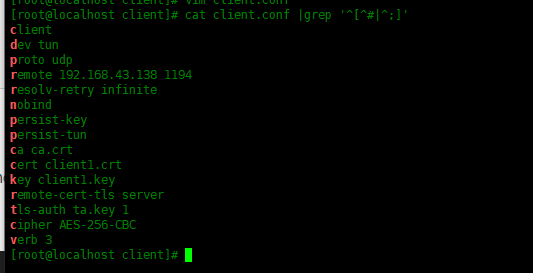


更改client.conf文件名为client.ovpn，然后把/etc/openvpn/client文件夹打包压缩：


```shell
# 更改client.conf文件名为client.ovpn
[root@openvpn ~]# cd /etc/openvpn/client
[root@openvpn client]# mv client.conf client.ovpn
[root@openvpn client]# ll
总用量 24
-rw-------. 1 root root 1172 4月  21 11:22 ca.crt
-rw-------. 1 root root 4433 4月  21 14:31 client1.crt
-rw-------. 1 root root 1704 4月  21 14:31 client1.key
-rw-r--r--. 1 root root 3631 4月  21 14:39 client.ovpn
-rw-------. 1 root root  636 4月  21 11:23 ta.key
# 安装lrzsz工具，通过sz命令把 client.tar.gz传到客户机上面
[root@openvpn client]# yum -y install lrzsz
# 打包client文件夹
[root@openvpn client]# cd ..
[root@openvpn openvpn]# tar -zcvf client.tar.gz client/
```


```shell
# 使用sz命令，把client.tar.gz传到客户机上面
[root@localhost openvpn]# sz client.tar.gz
```


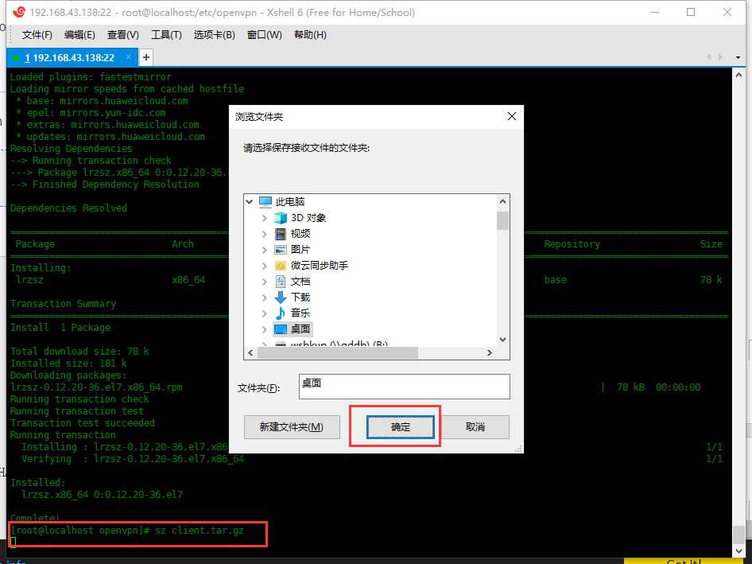


## 在windows 10客户机连接测试


链接：https://pan.baidu.com/s/1njCNnf80v7g_pmSF-qhFEQ 

提取码：7777 


客户机安装openvpn-install-2.4.8-I602-Win10该软件包（百度搜索文件名可找到下载），安装完成之后解压刚才的client.tar.gz压缩包，把里面的文件复制到C:\Program Files\OpenVPN\config（这里的路径是默认安装位置，可自行调整）


我这里的路径为：D:\OpenVPN\config


调整路径方法：如下


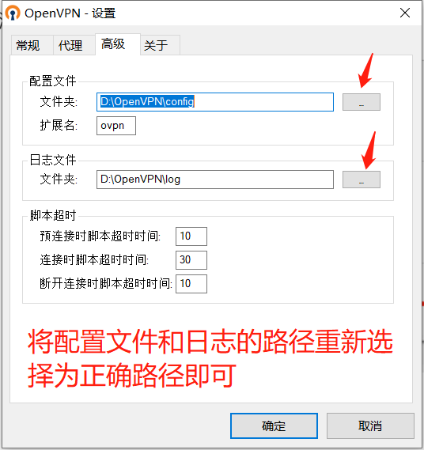


需要把client.conf的名字改成client.ovpn，然后点击桌面上的OpenVPN GUI运行


电脑右下角有一个小电脑


右键点击连接，输入用户名密码，连接成功之后小电脑变成绿色。


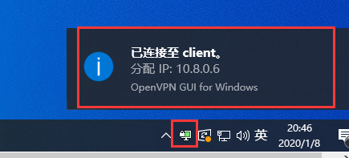


**注意事项**


做实验时在测试环境做的。如果在真实环境操作，请在出口防火墙添加端口映射，开放openvpn的端口1194 tcp和udp协议的。


**参考资料：**


https://www.linuxprobe.com/centos7-config-openvpn-one.html Centos7.7 配置OpenVPN （一）
https://www.linuxprobe.com/centos7-config-openvpn-two.html Centos7.7 配置OpenVPN （二）


https://i4t.com/4485.html OpenVPN 设置账号密码登录s