# Typora+picGo+阿里云oss

1.安装typora 略

2.安装picGo  https://github.com/Molunerfinn/PicGo/releases/tag/v2.3.0

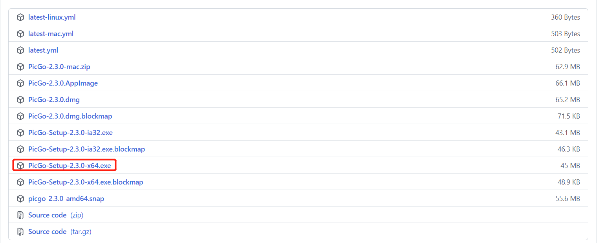

3.阿里云购买oss

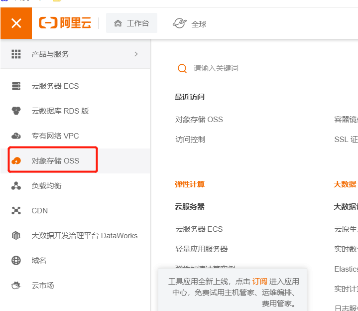

我这里直接是购买过后的，亮一下配置。

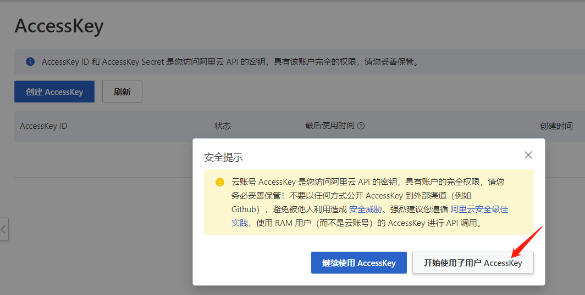

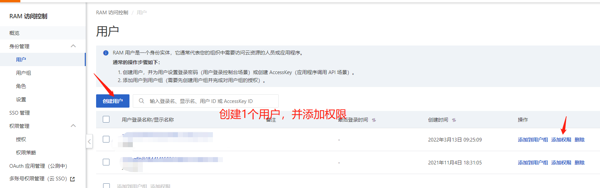

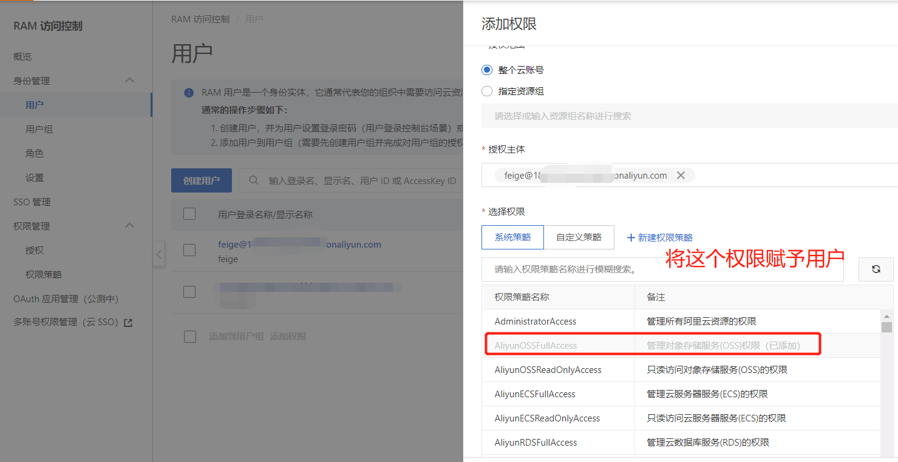

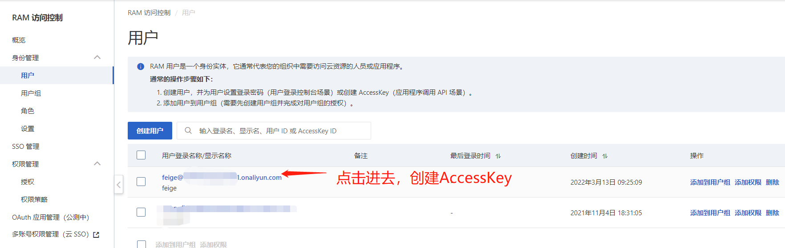

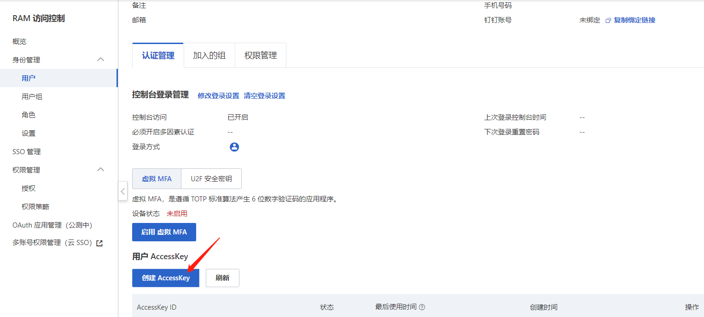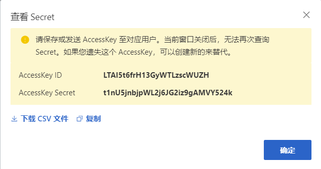

AccseeKey Secret只出现一次，最好记录下来。

文本内容：

LTAI5t6frH13GyWTLzscWUZH

t1nU5jnbjpWL2j6JG2iz9gAMVY524k

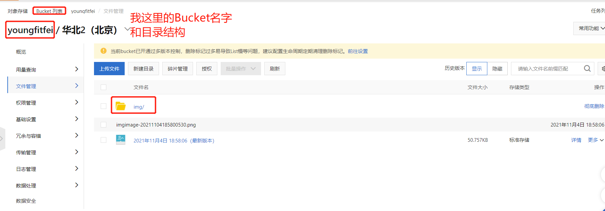

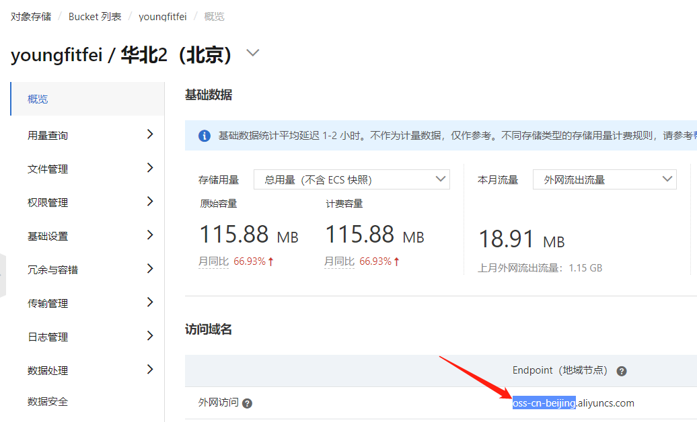

配置PicGo

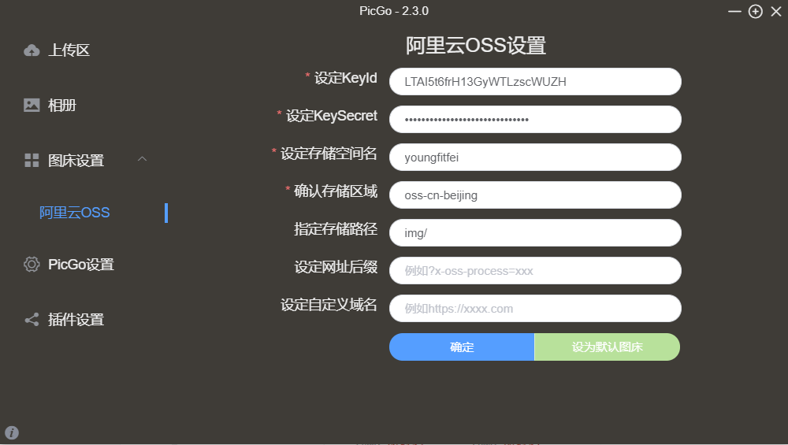

配置Typora

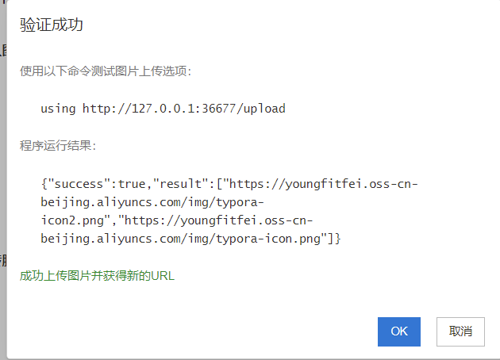