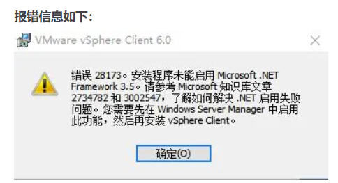
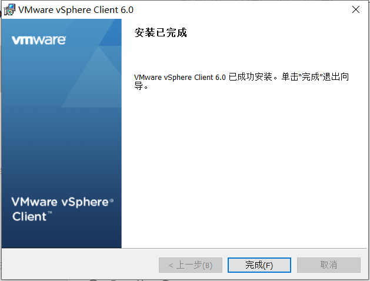
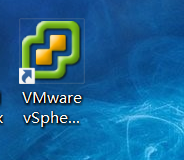
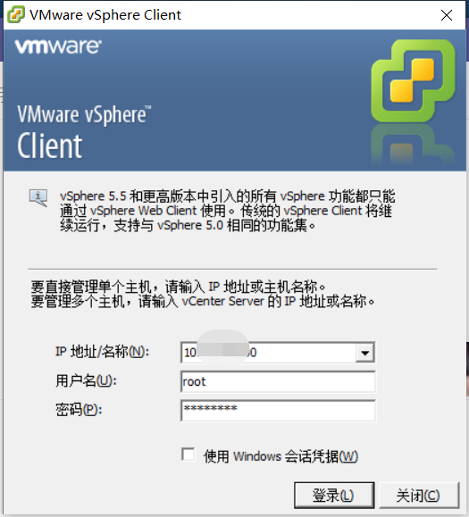
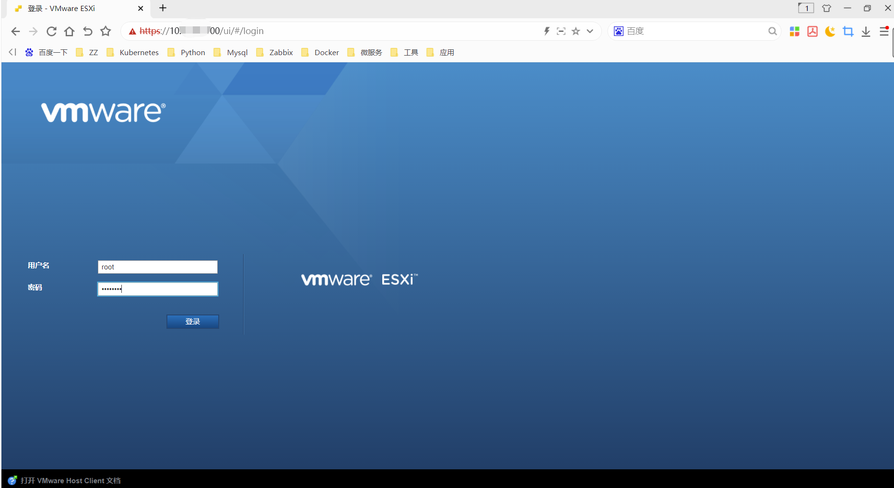

# VMware sphere client安装教程

## VMware sphere client安装地址：

链接：https://pan.baidu.com/s/1BI1ngZUlA6ASpfMMWe61gg 

提取码：7777 

## 安装报错信息

window10 操作系统。打开安装包

点击确定，它会自动提示安装，记得要重启电脑；

重启电脑之后，再次安装

有了

## 登录

