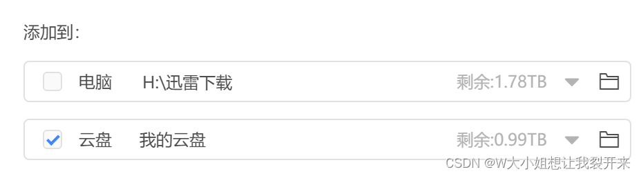
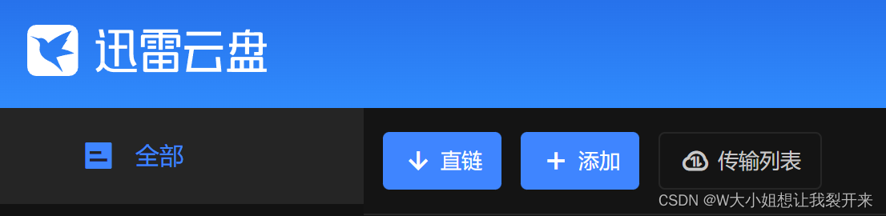
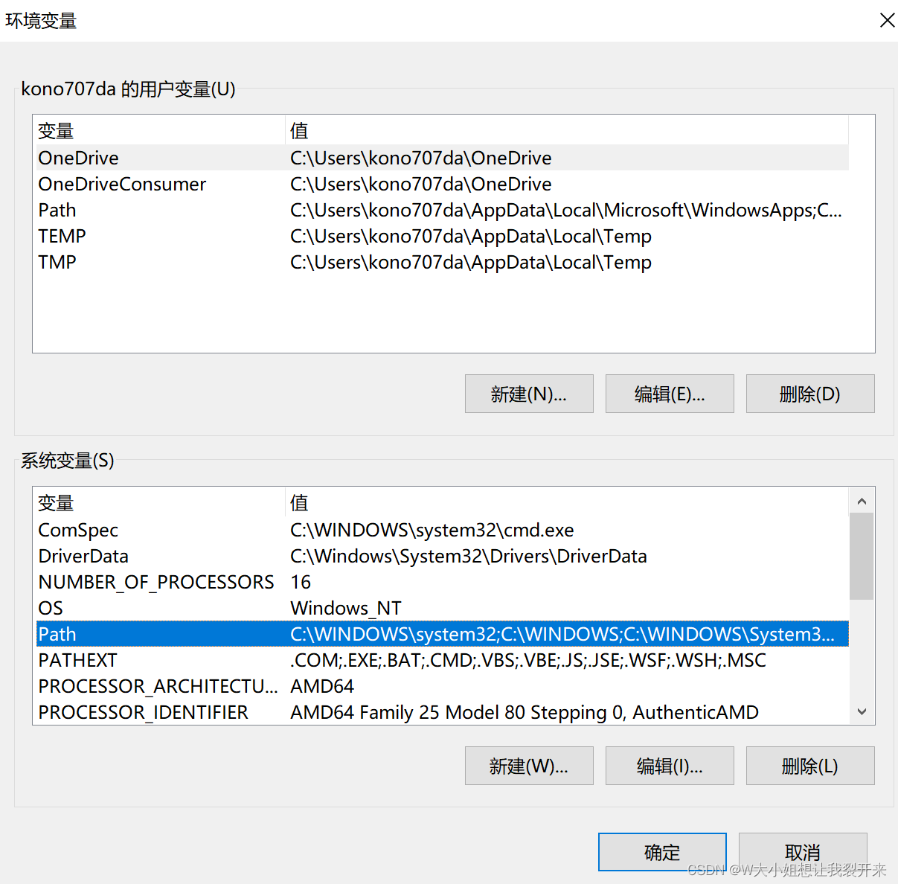
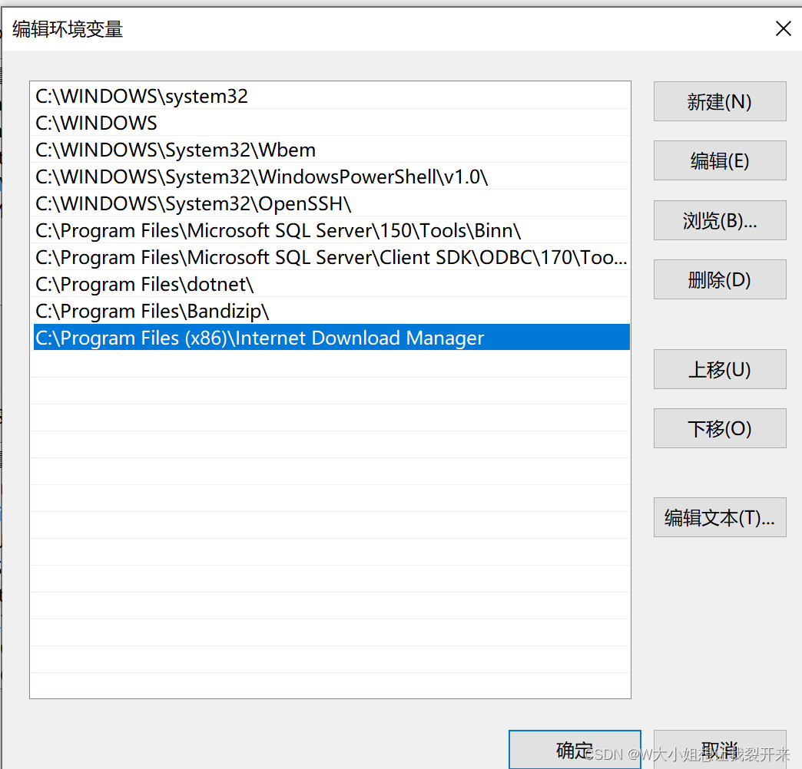
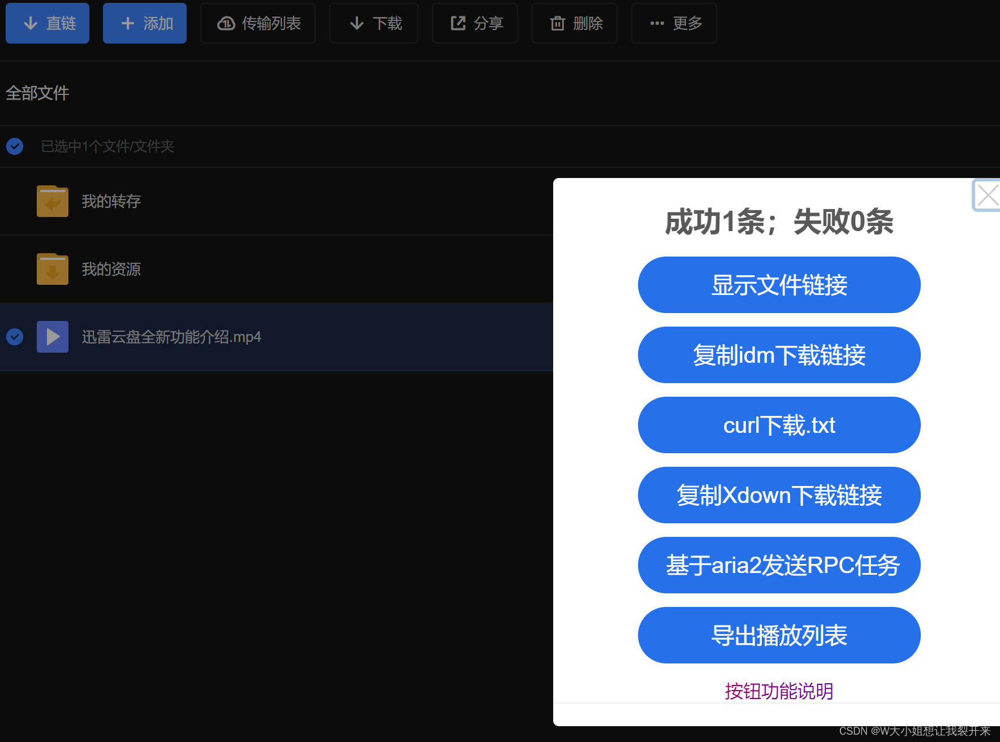
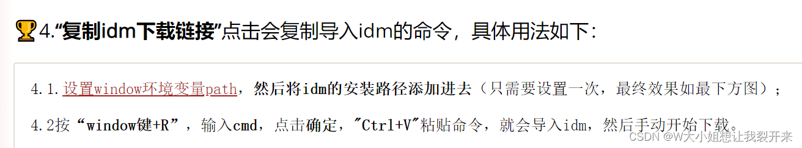
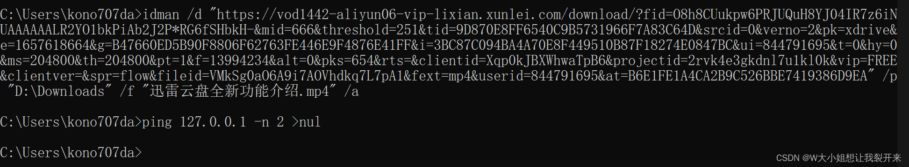

# 使用[IDM](https://so.csdn.net/so/search?q=IDM&spm=1001.2101.3001.7020)下载磁力链或迅雷文件

1. 下载IDM

   [IDM官网下载地址](http://www.internetdownloadmanager.com/download.html)

2. 激活IDM

   此步骤请自行获得IDM正版授权码（35一年，105永久）或自行寻找破解版

3. 安装[迅雷](https://so.csdn.net/so/search?q=迅雷&spm=1001.2101.3001.7020)并登录账号

4. 获得[磁力](https://so.csdn.net/so/search?q=磁力&spm=1001.2101.3001.7020)链

5. 将资源导入迅雷云盘

1. 安装油猴脚本

   [Tampermonkey • 首页](https://www.tampermonkey.net/)

2. 安装迅雷直链助手（百度云盘同理）

   [迅雷云盘直链脚本 (greasyfork.org)](https://greasyfork.org/zh-CN/scripts/431256-迅雷云盘)

3. 打开[迅雷云盘](https://pan.xunlei.com/)并登录

   登陆后可以看见“添加”按钮旁多了一个“直链”

1. 添加IDM环境变量

   假设安装路径为C:\Program Files (x86)\Internet Download Manager，此路径为IDMan.exe文件所在目录，将其添加到环境变量中

   添加环境变量方法：设置→关于→相关设置-高级系统设置→高级-环境变量

双击图中选中的Path，将此路径添加进去

> **千万记得每个窗口都要点击“确认”而不是"x"，不然可能会添加失败。**

1. 打开迅雷云盘网页，选择要下载的文件后点击”直链“

1. 点击”复制idm下载链接“，在此脚本说明中可以得知这个连接的使用方法

此时打开idm，会发现队列里增加了该文件，右键点击”继续下载“即可
