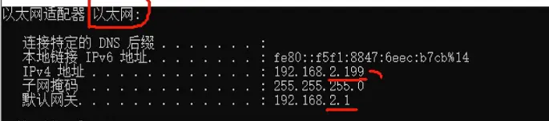
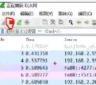
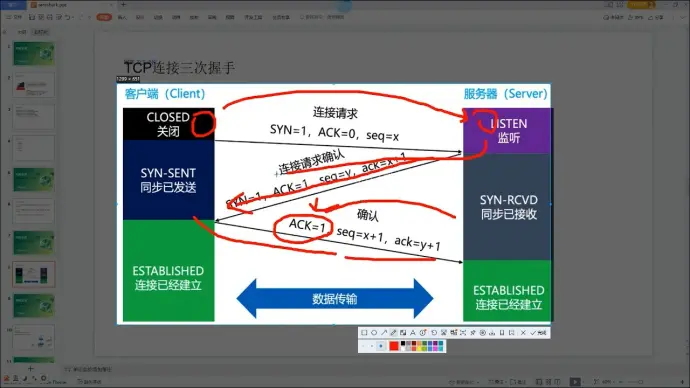
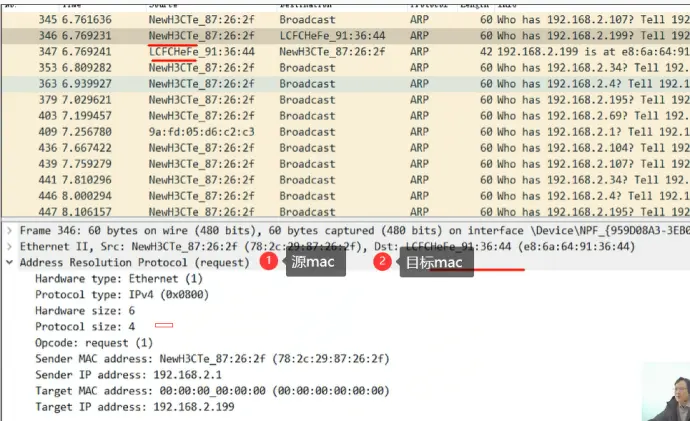
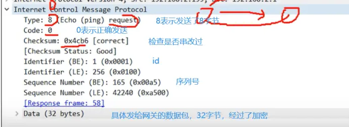
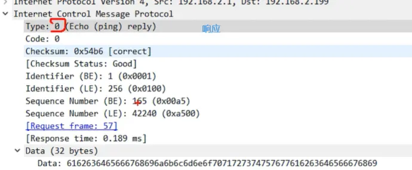
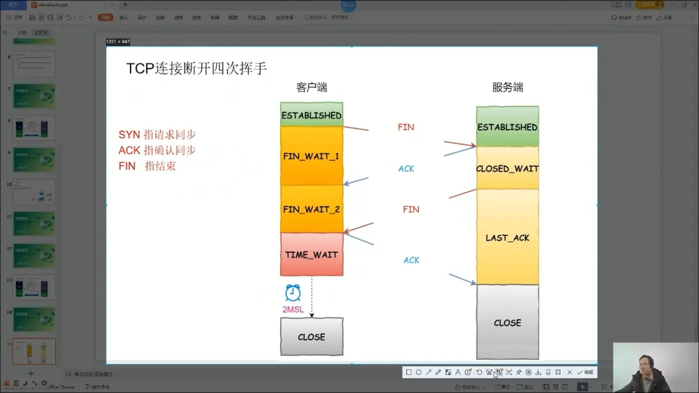
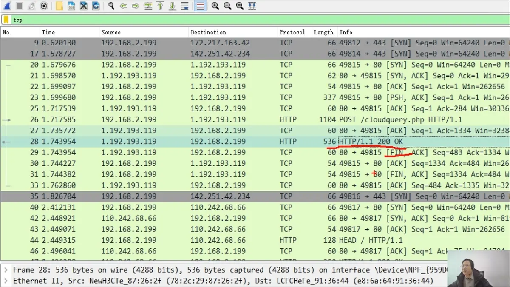

# 2.WireShark抓包入门操作 P2 - 00:30



点开wireshark

win+r cmd ipconfig 

找到上述图片内容

回到wireshark,双击上述图片找到的内容（视频中是以太网）

上图，左上角红色按钮，表示开始抓包

菜单栏点击捕获

点击选项

打勾，在所有接口上使用混杂模式。开启混杂模式（所有数据包都抓）

不打勾，普通模式（直接收发送到本机正确的数据包）

我们选择打勾

点击开始

点击不保存，清空之前抓到的包

## 3.WireShark过滤器使用 P3 - 00:00



点击左上角，蓝色鲨鱼角，开始抓包

红色停止

红色下边的输入栏中输入： tcp,筛选tcp包

输入tcp.flags.ack==0 and tcp.flags.syn==1筛选同时满足这两个条件的数据包

tcp.flags.fin == 1 表示发完数据包的包

arp

udp

SYN：连接请求

ACK：确认

其他筛选条件：

http

dns

ip.src_host == 本机ip 表示筛选发送ip为，，，的数据包

ip.dst_host==对方ip 表示筛选接收ip为，，，的数据包

or 表示或

ip.addr ==某个ip,表示只要ip为某个ip就展示出来（无论是src还是dst)

win+r cmd ping 目标ip地址

## 4.WireShark之ARP协议分析 P4 - 00:08



arp:address resolution protocol 地址解析协议

过滤：arp 

## 5.WireShark之ICMP协议 P5 - 00:04



ping 一下

过滤icmp

选中一条点击一下 

## 6.TCP连接的3次握手协议 P6 - 00:00

ip.addr == 167.179.97.156

菜单栏，统计，流量图

流累型 TCP

右键缩小放大

## 7.TCP连接断开的4次挥手协议 P7 - 00:02

 

SYN：请求同步

ACK：确认同步

FIN：指结束

这里有些问题，本机应该会先发一次ack

一样可以通过流量图观察

## 8.WireShark抓HTTP协议 P8 - 00:01



win r cmd

curl -I baidu.com

抓包工具抓包 

点击百度返回给我们的数据包，右键，追踪流，http流

## 9.黑客利用WireShark获取用户密码实战 P9 - 00:01



嗯就是简单实践了一下。咱们也没服务器，就先不搞了，先做作业吧

 