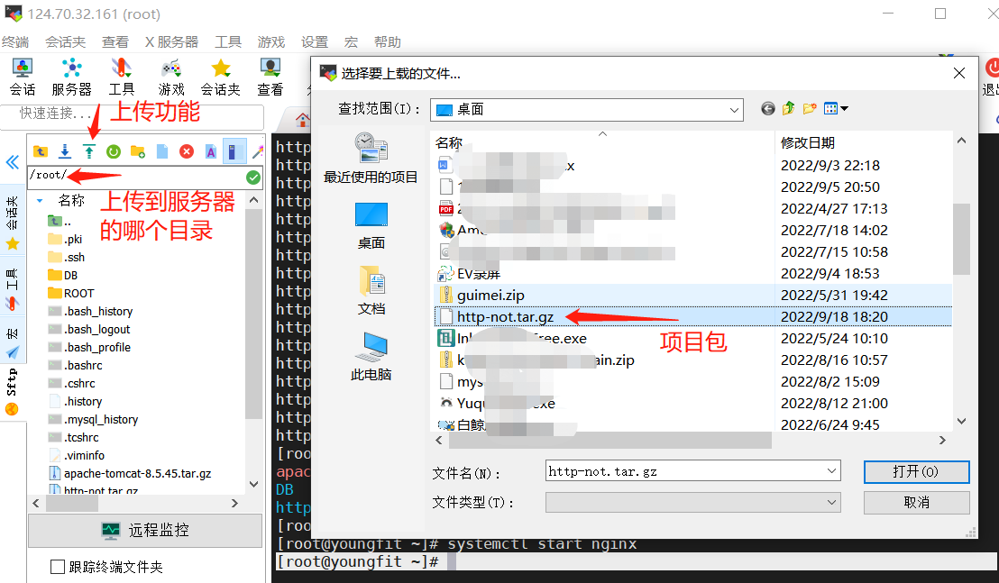
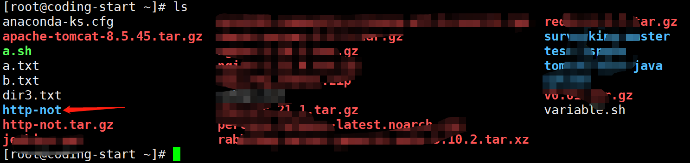
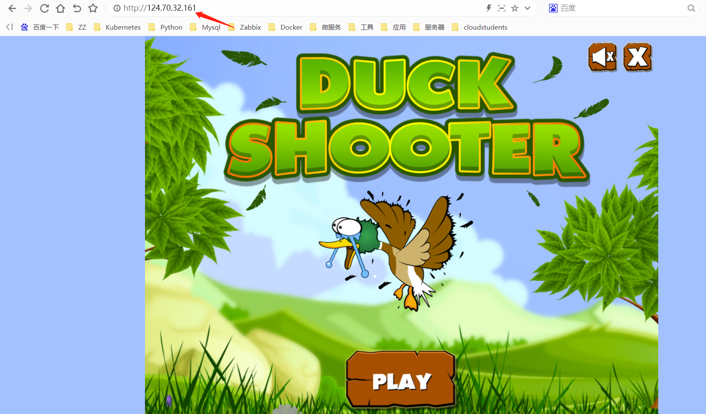
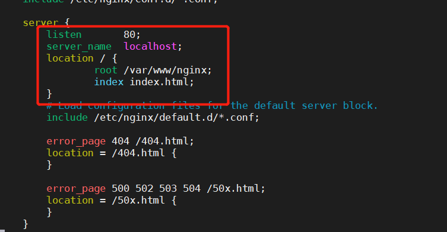
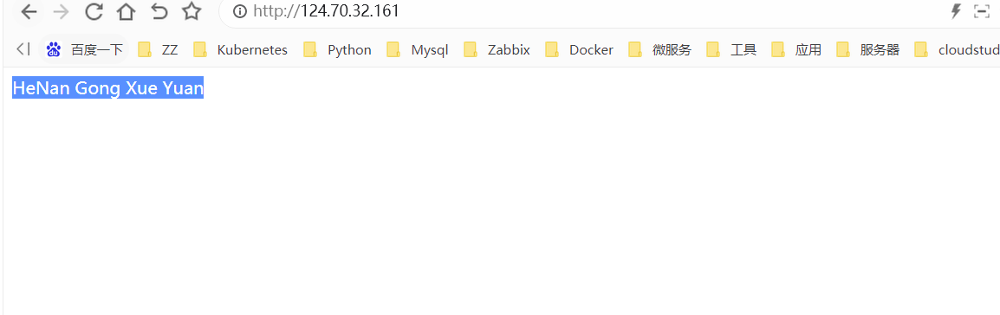
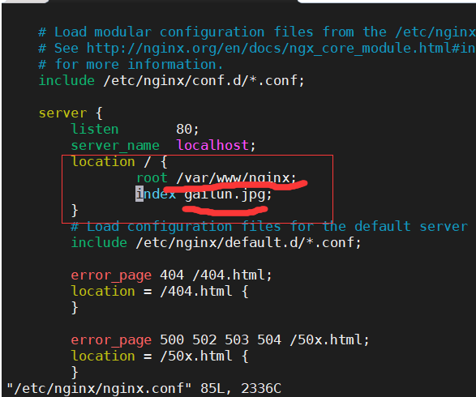
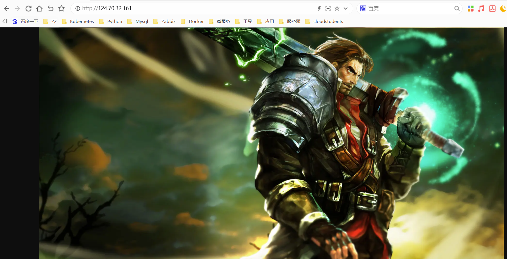

# 云游戏-DUCK SHOOTER

## 下载nginx服务

nginx能将页面出来，渲染显示

```shell
[root@youngfit ~]# yum -y install nginx
[root@youngfit ~]# rm -rf /usr/share/nginx/html/*  #删除默认的页面，以便于放后续的项目页面
```

## 上传项目包



```shell
[root@youngfit ~]# tar -xvzf http-not.tar.gz
```



```shell
[root@youngfit ~]# mv http-not/* /usr/share/nginx/html/
```

## 启动nginx服务

```shell
[root@youngfit ~]# systemctl start nginx
```

## 访问测试




## 自定义配置访问页面

Nginx的主配置文件

/etc/nginx/nginx.conf


学会配置默认发布目录，默认访问的页面

```shell
[root@jspgou ~]# vim /etc/nginx/nginx.conf
```



注释：

root   指定的是默认发布目录

index 指定的是默认访问的文件


创建对应的默认目录和默认访问的文件

```shell
[root@jspgou ~]# mkdir -p /var/www/nginx
[root@jspgou ~]# vim /var/www/nginx/index.html
HeNan Gong Xue Yuan
保存并退出
```

重新启动nginx服务

```shell
[root@jspgou ~]# systemctl restart nginx
```

再次访问，多刷新几次




## 自定义显示图片

准备自己的照片，上传到服务器上，显示出来；

上传图片到/root目录


定义nginx的默认发布目录，和默认显示文件



将图片移动到默认发布目录下

```shell
[root@jspgou ~]# mv /root/gailun.jpg /var/www/nginx/
```

重新启动nginx

```shell
[root@jspgou ~]# systemctl restart nginx
```

再次访问测试，多刷新几次

