# 宝塔游戏与企业虚拟化KVM

笔记本：千锋教育Linux云计算实训项目

Author： Youngfit

Email：ashiyufei[@youngfit.com ]() 

QQ：908367919

微信：yxlmqq1028

更新时间：2022/9/19

## 安装宝塔

```shell
# yum install -y wget && wget -O install.sh http://download.bt.cn/install/install_6.0.sh && sh install.sh
```

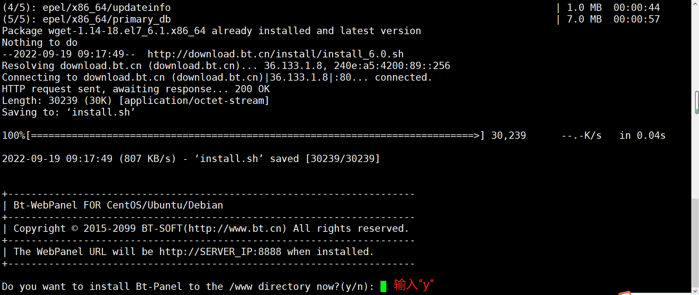

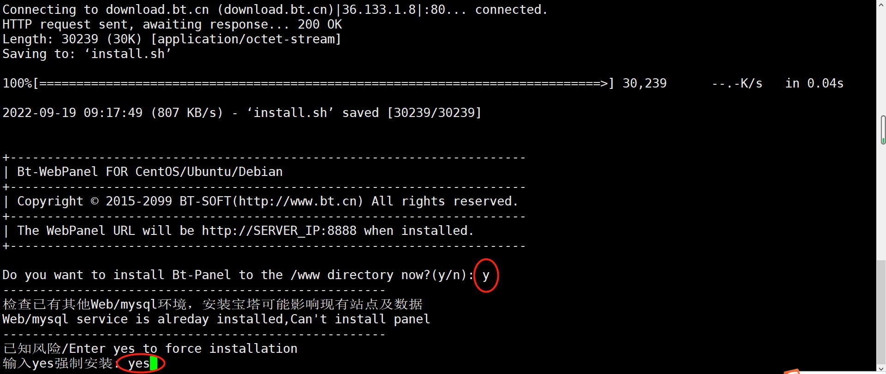


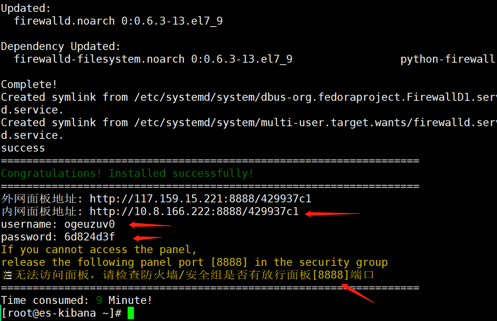


## 企业虚拟化KVM实战


##### **什么是虚拟化**


```shell
虚拟化（Virtualization）技术最早出现在 20 世纪 60 年代的 IBM 大型机系统，在70年代的 System 370 系列中逐渐流行起来，这些机器通过一种叫虚拟机监控器（Virtual Machine Monitor，VMM）的程序在物理硬件之上生成许多可以运行独立操作系统软件的虚拟机（Virtual Machine）实例。随着近年多核系统、集群、网格甚至云计算的广泛部署，虚拟化技术在商业应用上的优势日益体现，不仅降低了 IT 成本，而且还增强了系统安全性和可靠性。
```


**常用的虚拟化产品有哪些**

```shell
1.Kvm（redhat）企业级
2.Vmware:
Vmware-workstation(windows和linux)桌面级
Vmware-fusion(mac)
Vmware-esxi(企业级别)本身就是一个操作系统。
3.hyper-v(微软）
4.Ovm（oracle公司--Windows linux） virtulbox
5.Xen（rhel6之前所有版本默认用的虚拟化产品）
```


**虚拟化技术的分类:**

```shell
平台虚拟化（Platform Virtualization），针对计算机和操作系统的虚拟化//针对计算机操作系统。
资源虚拟化（Resource Virtualization），针对特定的系统资源的虚拟化，比如内存、存储、网络资源等。
应用程序虚拟化（Application Virtualization），包括仿真、模拟、解释技术等。把硬件的东西变成了一个应用
```


​    我们通常所说的虚拟化主要是指平台虚拟化技术，通过使用控制程序（Control Program，也被称为 Virtual Machine Monitor(虚拟监控器VMM) 或**Hypervisor**，隐藏特定计算平台的实际物理特性，为用户提供抽象的、统一的、模拟的计算环境（称为虚拟机）。


##### **平台虚拟化类型**


```shell
操作系统虚拟化:有一个非常常见的操作系统叫openvz。特点是所有的虚拟机共享宿主机的内核。
```


**全虚拟化（Full Virtualization):**


```shell
全虚拟化是指虚拟机模拟了完整的底层硬件，包括处理器、物理内存、时钟、外设等，使得为原始硬件设计的操作系统或其它系统软件完全不做任何修改就可以在虚拟机中运行。

现在的kvm与vmware都支持全虚拟化

全虚拟化的运行速度要快于硬件模拟，但是性能方面不如裸机，因为Hypervisor需要占用一些资源
```


**半虚拟化（Para Virtualization）:**


```shell
半虚拟化（也叫超虚拟化）是另一种类似于全虚拟化的技术，它使用Hypervisor分享存取底层的硬件，但是它的guest操作系统集成了虚拟化方面的代码。因为操作系统自身能够与虚拟进程进行很好的协作。

半虚拟化需要guest操作系统做一些修改，使guest操作系统意识到自己是处于虚拟化环境的，但是半虚拟化提供了与原操作系统相近的性能。
```


**硬件辅助虚拟化**


```shell
硬件辅助虚拟化是指借助硬件（主要是主机处理器）的支持来实现高效的全虚拟化。
```


**部分虚拟化**


**企业级虚拟化与桌面级虚拟化的区别**


```shell
桌面级虚拟化：
App  ---在安装APP，通过App实现各种功能
guestos  ---客户机也叫客户操作系统
vmware-workstation（hypervisor（虚拟机管理程序）+图形管理工具）
os操作系统
硬件


企业级虚拟化
App（图形管理工具）
guestos  ---客户机也叫客户操作系统
os+hypervisor在操作系统级别加上了虚拟机管理程序
硬件
```


## KVM虚拟化技术简介


```shell
KVM 针对运行在 x86 硬件上的、驻留在内核中的虚拟化基础结构。KVM 是第一个成为原生 Linux 内核（2.6.20）的一部分的 hypervisor，它是由 Avi Kivity 开发和维护的，现在归 Red Hat 所有。
KVM 是作为内核模块实现的
```


## KVM安装


#### KVM虚拟化技术简介


##### kvm架构图


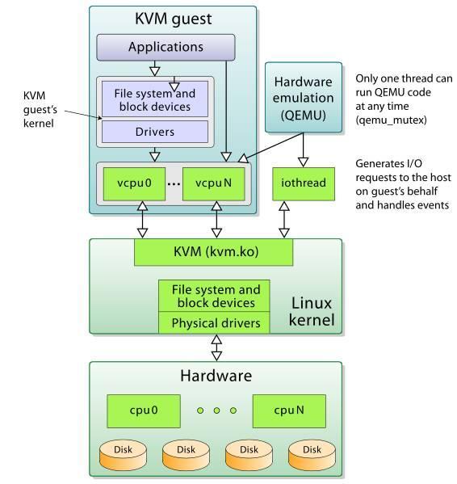


```plain
    从rhel6开始使用 直接把kvm的模块做成了内核的一部分
    xen用在rhel6之前的企业版中 默认内核不支持，需要重新安装带xen功能的内核
    KVM 针对运行在 x86 硬件上的、驻留在内核中的虚拟化基础结构。KVM 是第一个成为原生 Linux 内核（2.6.20）的一部分的 hypervisor，它是由 Avi Kivity 开发和维护的，现在归 Red Hat 所有。
    这个 hypervisor 提供 x86 虚拟化，同时拥有到 PowerPC® 和 IA64 的通道。另外，KVM 最近还添加了对对称多处理（SMP）主机（和来宾）的支持，并且支持企业级特性，比如活动迁移（允许来宾操作系统在物理服务器之间迁移）。
    KVM 是作为内核模块实现的，因此 Linux 只要加载该模块就会成为一个hypervisor。KVM 为支持 hypervisor  指令的硬件平台提供完整的虚拟化（比如 Intel® Virtualization Technology [Intel VT] 或 AMD  Virtualization [AMD-V] 产品）。KVM 还支持准虚拟化来宾操作系统，包括 Linux 和 Windows®。
    这种技术由两个组件实现。第一个是可加载的 KVM 模块，当在 Linux 内核安装该模块之后，它就可以管理虚拟化硬件，并通过 /proc  文件系统公开其功能。第二个组件用于 PC 平台模拟，它是由修改版 QEMU 提供的。QEMU  作为用户空间进程执行，并且在来宾操作系统请求方面与内核协调。 

    当新的操作系统在 KVM 上启动时（通过一个称为 kvm 的实用程序），它就成为宿主操作系统的一个进程，因此就可以像其他进程一样调度它。但与传统的 Linux 进程不一样，来宾操作系统被 hypervisor 标识为处于 "来宾" 模式（独立于内核和用户模式）。
    每个来宾操作系统都是通过 /dev/kvm 设备映射的，它们拥有自己的虚拟地址空间，该空间映射到主机内核的物理地址空间。如前所述，KVM 使用底层硬件的虚拟化支持来提供完整的（原生）虚拟化。I/O 请求通过主机内核映射到在主机上（hypervisor）执行的 QEMU 进程。
    KVM 在 Linux 环境中以主机的方式运行，不过只要底层硬件虚拟化支持，它就能够支持大量的来宾操作系统.
```


### Day1


#### KVM安装


```plain
kvm虚拟化平台软件一般装在操作系统为Centos图形化操作系统上面
```


```plain
大家不想把电脑装为Centos的操作系统，可以用VMware workstations装一台配置较高的虚拟机（cpu、内存、磁盘）给的尽可能最大，然后需要在开启之前做如下操作
```


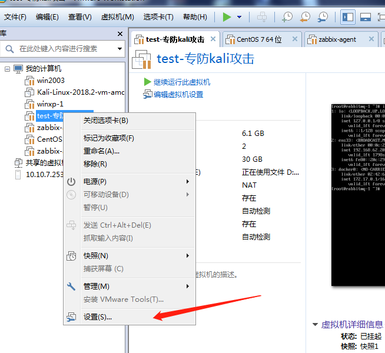


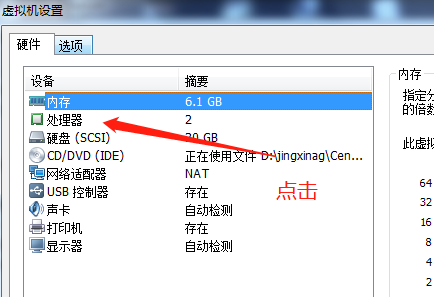


然后打开虚拟机，安装kvm即可


```shell
一般企业如果使用kvm虚拟机平台，都会把物理服务器装成Centos的操作系统，然后装上kvm，创建虚拟机

需求内核(rhel6以上):   
[root@youngfit ~]# uname  -r
    2.6.32-358.el6.x86_64 
   
升级系统：(在安装虚拟机出错的情况下，一般是操作系统的版本问题)
[root@youngfit ~]# yum upgrade

安装软件:
[root@youngfit ~]# yum install *qemu*  *virt*  librbd1-devel -y #记不住软件包名的情况下这样输入

其实下载的是下面几款软件
[root@youngfit ~]# yum install qemu-kvm libvirt virt-manager  librbd1-devel -y   
qemu-kvm libvirt virt-manager 
在所谓的kvm技术中，应用到的其实有2个东西：qemu+kvm
kvm负责cpu虚拟化+内存虚拟化，实现了cpu和内存的虚拟化，但kvm不能模拟其他设备；
qemu是模拟IO设备（网卡，磁盘），kvm加上qemu之后就能实现真正意义上服务器虚拟化。
因为用到了上面两个东西，所以一般都称之为qemu-kvm。
libvirt则是调用kvm虚拟化技术的接口用于管理的，用libvirt管理方便，直接用qemu-kvm的接口太繁琐。

启动服务:    
centos7:
[root@youngfit ~]# systemctl start libvirtd
[root@youngfit ~]# systemctl enable libvirtd

查看kvm模块加载:
[root@youngfit ~]# lsmod | grep kvm
        kvm_intel              53484  3 
        kvm                   316506  1 kvm_intel
如果看到有这两行，说明支持kvm模块
```


#### 1.KVM gustos图形方式部署安装虚拟机


```shell
图形模式安装虚拟机(guest os)
[root@youngfit ~]#  virt-manager
====================
下面就是点点点

安装完成一台虚拟机之后，网络模式也是有桥接和NAT的
想让kvm的NAT模式的虚拟机连通外网
需要在宿主机打开路由转发功能，然后重启libvirtd即可
```


#### 2.完全文本方式安装虚拟机

-  按照顺序操作，否则报错，系统安装报错 
-  宿主机网卡先设置为NAT模式 

```shell
[root@youngfit ~]# yum -y install vsftpd
上传镜像到虚拟机
[root@youngfit ~]# mkdir /var/ftp/centos7u4
[root@youngfit ~]# mount 镜像 /var/ftp/centos7u4
[root@youngfit ~]# systemctl start vsftpd
[root@youngfit ~]# systemctl stop firewalld && setenforce 0 #否则无法读取ftp服务的介质
[root@youngfit ~]# virt-install --connect qemu:///system -n vm10 -r 2050 --disk path=/var/lib/libvirt/images/vm10.qcow2,size=5  --os-type=linux --os-variant=centos7.0 --vcpus=1  --location=ftp://192.168.14.60/centos7u4 -x console=ttyS0 --nographics

[root@youngfit ~]# virt-install --connect qemu:///system -n test1 -r 2050 --disk path=/var/lib/libvirt/images/test1.qcow2,size=3  --os-type=linux --os-variant=centos7.0 --vcpus=1  --location=ftp://192.168.153.13/centos7u4 -x console=ttyS0 --nographics

qemu:///system  系统如果在裸露的金属内核上运行为根（需要KVM安装）
-n name
-r  以M为单位指定分配给虚拟机的内存大小
--disk 指定作为客户机存储的媒介 size以G为单位的存储
--os-type   针对一类操作系统优化虚拟机配置
--os-variant 针对特定操作系统变体进一步优化虚拟机配置
--vcpus 指定核数
--location  客户虚拟机kernel+initrd 安装源，必须为镜像挂载在ftp目录下
-x console=ttyS0 执行终端
--nographics 无图形，文本模式

缺点：纯文本安装的输入时大小写莫名的变换，远程ssh没问题
     内存必须大于2048

排错:
    安装过程中：
        手动配置IP地址
        到url位置找不到路径，要返回去手动选择url，重新配置url为ftp://192.168.14.60/rhel6u4,这里的ip不要写127.0.0.1
```


注意：命令敲下去，不要误操作退出安装


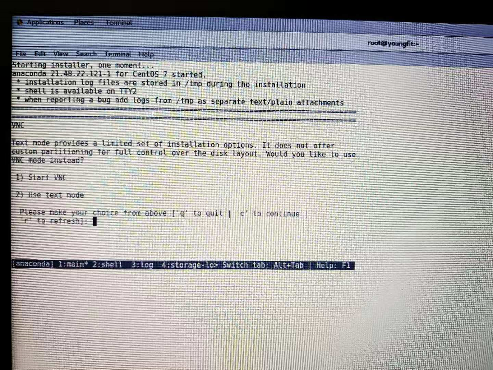


输入2，回车，进入文本模式安装


显示！的选项，都未设置，不要漏设置


下面的按照提示安装即可


如果安装出来的kvm虚拟机不能ping通百度，需要把宿主机的防火墙开启，因为需要nat地址转换才行，nat转发规则在宿主机的firewalld防火墙配置规则中。


#### 3.模板镜像+配置文件 方式安装虚拟机

```shell
define方式创建好，不会启动
create方式创建好，会启动
记住两个目录：
/etc/libvirt/qemu   	   虚拟机配置文件存放目录
/var/lib/libvirt/images/   虚拟机磁盘镜像（磁盘文件）存放目录

1.拷贝模板镜像和配置文件
[root@youngfit ~]# cp /var/lib/libvirt/images/test1.qcow2 /var/lib/libvirt/images/test2.qcow2
[root@youngfit ~]# cp /etc/libvirt/qemu/test1.xml /etc/libvirt/qemu/test2.xml

2.修改配置文件
# vim /etc/libvirt/qemu/test2.xml
<domain type='kvm'>
  <name>test2</name>     #此处应修改，名字不能相同
  <uuid>a2f62549-c6b7-4b8f-a8e2-c14edda35a78</uuid>   #uuid不能相同
  <memory unit='KiB'>2099200</memory>     #内存，可选
  <currentMemory unit='KiB'>2099200</currentMemory>  #内存，可选
  <vcpu placement='static'>2</vcpu>       #cpu核数可选
  <os>
    <type arch='x86_64' machine='pc-i440fx-rhel7.0.0'>hvm</type>
    <boot dev='hd'/>
  </os>
  <features>
    <acpi/>
    <apic/>
  </features>
  <cpu mode='custom' match='exact' check='partial'>
    <model fallback='allow'>Haswell-noTSX</model>
  </cpu>
  <clock offset='utc'>
    <timer name='rtc' tickpolicy='catchup'/>
    <timer name='pit' tickpolicy='delay'/>
    <timer name='hpet' present='no'/>
  </clock>
  <on_poweroff>destroy</on_poweroff>
  <on_reboot>restart</on_reboot>
  <on_crash>destroy</on_crash>
  <pm>
    <suspend-to-mem enabled='no'/>
    <suspend-to-disk enabled='no'/>
  </pm>
  <devices>
    <emulator>/usr/libexec/qemu-kvm</emulator>
    <disk type='file' device='disk'>
      <driver name='qemu' type='qcow2'/>
      <source file='/var/lib/libvirt/images/test2.qcow2'/>  #磁盘名称
      <target dev='vda' bus='virtio'/>
      <address type='pci' domain='0x0000' bus='0x00' slot='0x06' function='0x0'/>
    </disk>
    <controller type='usb' index='0' model='ich9-ehci1'>
      <address type='pci' domain='0x0000' bus='0x00' slot='0x04' function='0x7'/>
    </controller>
    <controller type='usb' index='0' model='ich9-uhci1'>
      <master startport='0'/>
      <address type='pci' domain='0x0000' bus='0x00' slot='0x04' function='0x0' multifunction='on'/>
    </controller>
    <controller type='usb' index='0' model='ich9-uhci2'>
      <master startport='2'/>
      <address type='pci' domain='0x0000' bus='0x00' slot='0x04' function='0x1'/>
    </controller>
    <controller type='usb' index='0' model='ich9-uhci3'>
      <master startport='4'/>
      <address type='pci' domain='0x0000' bus='0x00' slot='0x04' function='0x2'/>
    </controller>
    <controller type='pci' index='0' model='pci-root'/>
    <controller type='virtio-serial' index='0'>
      <address type='pci' domain='0x0000' bus='0x00' slot='0x05' function='0x0'/>
    </controller>
    <interface type='network'>
      <mac address='52:54:00:f2:28:6f'/>   #mac地址不能相同
      <source network='default'/>
      <model type='virtio'/>
      <address type='pci' domain='0x0000' bus='0x00' slot='0x03' function='0x0'/>
    </interface>
    <serial type='pty'>
      <target type='isa-serial' port='0'>
        <model name='isa-serial'/>
      </target>
    </serial>
    <console type='pty'>
      <target type='serial' port='0'/>
    </console>
    <channel type='unix'>
      <target type='virtio' name='org.qemu.guest_agent.0'/>
      <address type='virtio-serial' controller='0' bus='0' port='1'/>
    </channel>
    <input type='mouse' bus='ps2'/>
    <input type='keyboard' bus='ps2'/>
    <memballoon model='virtio'>
      <address type='pci' domain='0x0000' bus='0x00' slot='0x07' function='0x0'/>
    </memballoon>
  </devices>
</domain>
必须修改name，uuid,mac地址，其余可选

用vim修改完之后需要define一下配置文件
[root@youngfit ~]# virsh define /etc/libvirt/qemu/test2.xml
```


### Day2

#### KVM虚拟机管理

```shell
=================================================================
虚拟机的组成部分
1.虚拟机配置文件
[root@localhost qemu]# ls /etc/libvirt/qemu
networks  vm1.xml
2.储存虚拟机的介质
[root@localhost qemu]# ls /var/lib/libvirt/images/
vm1.img
========================================================
虚拟机的基本管理命令：
查看
启动
关闭
重启
重置 

查看:
查看虚拟机:
[root@youngfit ~]# virsh list 		  #只包括开机状态的虚拟机
     Id    Name                           State
    ----------------------------------------------------
     2     vm1                            running

[root@youngfit ~]# virsh list --all   #包括非开机状态的虚拟机
     Id    Name                           State
    ----------------------------------------------------
     2     vm1                            running

查看kvm虚拟机配置文件：
[root@youngfit ~]# virsh dumpxml name  # name为虚拟机名称

将node4虚拟机的配置文件保存至node6.xml
[root@youngfit ~]# virsh dumpxml node4 > /etc/libvirt/qemu/node6.xml

修改node6的配置文件：
[root@youngfit ~]# virsh edit node6      
如果直接用vim编辑器修改配置文件的话，需要重启libvirtd服务或者重新define配置文件，用edit修改则不需要。

启动:
[root@youngfit ~]# virsh start vm1
Domain vm1 started

暂停（挂起）虚拟机： 
[root@youngfit ~]# virsh suspend vm_name  

恢复虚拟机：
[root@youngfit ~]# virsh resume vm_name    
  
关闭：
方法1：
[root@youngfit ~]# virsh shutdown vm1   //正常关闭
Domain vm1 is being shutdown

方法2：
[root@youngfit ~]# virsh destroy vm1	//强制关闭
Domain vm1 destroyed

重启：
[root@youngfit ~]# virsh reboot vm1
Domain vm1 is being reboote

重置:
[root@youngfit ~]# virsh reset vm1
Domain vm1 was reset

删除虚拟机:
[root@youngfit ~]# virsh undefine vm2	#s首先要先关闭
Domain vm2 has been undefined

注意:虚拟机在开启的情况下undefine是无法删除的，但是如果再destroy会直接被删除掉
======================

虚拟机开机自动启动:
#如果虚拟机开机自启，里面的服务应该设置的有开机自启，不然没有意义
[root@youngfit ~]# virsh autostart vm1  
域 vm1标记为自动开始

[root@youngfit ~]# ls /etc/libvirt/qemu/autostart/     //此目录默认不存在，在有开机启动的虚拟机时自动创建
vm1.xml

[root@youngfit ~]# virsh autostart --disable vm1
域 vm1取消标记为自动开始
[root@youngfit ~]# ls /etc/libvirt/qemu/autostart/

如何查看已启动的虚拟机ip地址
假如vm2虚拟机已启动
方法1：
[root@youngfit ~]# virsh dumpxml vm2|grep mac
    <partition>/machine</partition>
    <type arch='x86_64' machine='pc-i440fx-rhel7.0.0'>hvm</type>
      <mac address='52:54:00:cc:3e:79'/>
      
[root@youngfit ~]# arp -a |grep "52:54:00:cc:3e:79"
? (192.168.122.227) at 52:54:00:cc:3e:79 [ether] on virbr0

方法2：
[root@youngfit ~]# virsh domifaddr vm2
 Name       MAC address          Protocol     Address
-------------------------------------------------------------------------------
 vnet1      52:54:00:d3:37:16    ipv4         192.168.122.178/24
```


#### 虚拟机添加设备


```shell
1.图形方式:
    首先，关闭要添加硬件的虚拟机
    双击虚拟机，在打开的对话框点击上方的View，点击Details，点击Add Hardware可以选择要添加的虚拟硬件
```


```shell
2.修改配置文件方式:

我们给虚拟机vm9添加磁盘为例：

首先需要创建出要添加的磁盘
```


```shell
[root@youngfit qemu]# qemu-img create -f qcow2 /var/lib/libvirt/images/vm9-1.qcow2 5G
创建空的磁盘文件：这里我们创建一个5G的磁盘，不过创建出来，通过ll -h查看大小，看不出它是5G，添加上之后才能看到
```


```shell
[root@youngfit qemu]# virsh edit vm9
如果用vim进去。记得重新define
```


```shell
加好之后，启动虚拟机
[root@youngfit qemu]# virsh start vm9

远程连接到vm9虚拟机
[root@vm9 ~]# lsblk 
NAME            MAJ:MIN RM  SIZE RO TYPE MOUNTPOINT
vda             252:0    0    5G  0 disk 
├─vda1          252:1    0    1G  0 part /boot
└─vda2          252:2    0    4G  0 part 
  ├─centos-root 253:0    0  3.5G  0 lvm  /
  └─centos-swap 253:1    0  512M  0 lvm  [SWAP]
vdb             252:16   0    5G  0 disk 

可以看到我们新添加的磁盘vdb
然后可以正常分区，制作文件系统，进行挂载
作业，自己做
```


```shell
网卡：    和添加磁盘相同 
    <interface type='network'>
      <mac address='52:54:00:fc:c6:0b'/>
      <source network='default'/>
      <model type='virtio'/>
      <address type='pci' domain='0x0000' bus='0x00' slot='0x03' function='0x0'/>
    </interface>
```


```plain
可选部分：
注意：添加磁盘是这种方式，对于加大内存和增多cpu核心数，直接在配置文件里面修改即可！
内存：
<memory unit='KiB'>2048000</memory>
  <currentMemory unit='KiB'>2048000</currentMemory>

cpu个数:
  <vcpu placement='static'>2</vcpu>
```


```shell
1.使用配置文件方式生成一个新虚机
2.修改配置文件给新生成的虚机添加一块硬盘，添加一块网卡
3.使修改的配置文件生效
    方法1：重启libvirtd
    方法2：# virsh define 配置文件
```


#### 虚拟机克隆

```shell
1.图形界面：Applications （左上角）-----> System Tools ------>Virtual Machine Manager
   关闭要克隆的虚拟机，右键点击虚拟机选择Clone
```


```shell
2.字符终端，命令克隆
[root@youngfit ~]# virt-clone -o vm1 --auto-clone
WARNING  设置图形设备端口为自动端口，以避免相互冲突。
正在分配 'vm1-clone.qcow2'            | 6.0 GB  00:00:05     
成功克隆 'vm1-clone'。
    -o       origin    

[root@youngfit ~]# virt-clone -o vm1 -n vm2 --auto-clone
WARNING  设置图形设备端口为自动端口，以避免相互冲突。
正在分配 'vm2.qcow2'                                                | 6.0 GB  00:00:06     
成功克隆 'vm2'。

[root@youngfit ~]# virt-clone -o vm1 -n vm2 -f /var/lib/libvirt/images/vm2.img
正在克隆
vm1.img              | 8.0 GB     01:03
Clone 'vm2' created successfully.
这条命令在克隆的同时，可以指定镜像文件的位置和名称。
```


#### kvm高级命令

```shell
建立虚拟机磁盘镜像文件：
磁盘镜像文件格式:
    raw     原始格式，性能最好 直接占用你一开始给多少 系统就占多少 不支持快照
    qcow  先去网上了解一下cow(写时拷贝copy on write) ，性能远不能和raw相比，所以很快夭折了，所以出现了qcow2（性能低下 早就被抛弃）
    qcow2 性能上还是不如raw，但是raw不支持快照，qcow2支持快照。

现在默认安装好的用的是qcow2格式

什么叫写时拷贝？
raw立刻分配空间，不管你有没有用到那么多空间
qcow2只是承诺给你分配空间，但是只有当你需要用空间的时候，才会给你空间。最多只给你承诺空间的大小，避免空间浪费

工作当中用哪个？看你用不用快照。
工作当中虚拟机如果有多个备份，一个坏了，再起一个就行了，所有没必要用快照。当然也不一定。
数据绝对不会存储到本地。

qemu-kvm  qemu是早先的一个模拟器，kvm是基于qemu发展出来的。

建立qcow2格式磁盘文件:
[root@youngfit ~]# qemu-img create -f qcow2 test.qcow2 20G

建立raw格式磁盘文件:
[root@youngfit ~]# qemu-img create -f raw test.raw 20G

查看已经创建的虚拟磁盘文件:
[root@youngfit ~]# qemu-img info test.qcow2
```


##### 磁盘镜像raw格式转换为qcow2

```shell
建立raw格式磁盘文件:
[root@youngfit ~]# qemu-img create -f raw /var/lib/libvirt/images/qf.raw 4G

[root@youngfit ~]# qemu-img info /var/lib/libvirt/images/qf.raw
image: qf.raw
file format: raw		//格式为raw格式
virtual size: 5.0G (5368709120 bytes)
disk size: 0

将qf.raw磁盘添加到某台虚拟机上(这里的虚拟机名称为"test3")
[root@youngfit ~]# virsh edit test3
```


```shell
[root@youngfit ~]# virsh define /etc/libvirt/qemu/test3.xml
```


点击进入test3虚拟机的操作界面，发现


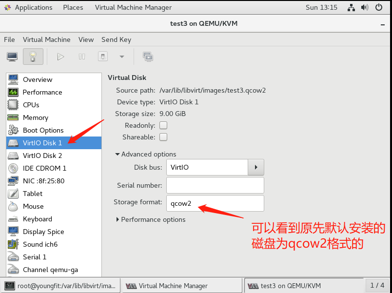


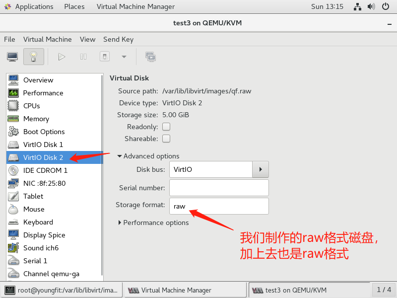


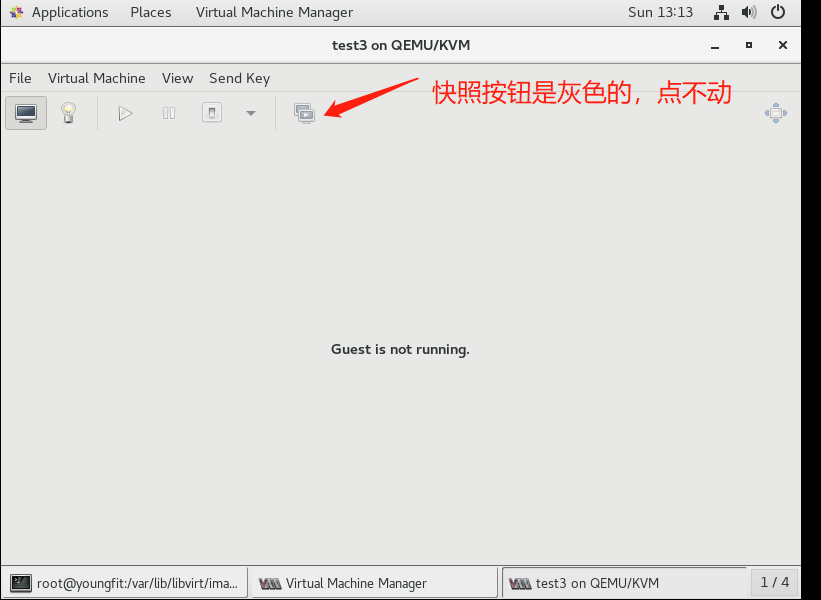


磁盘格式的转换：

```shell
[root@youngfit images]# qemu-img convert -f raw -O qcow2 /var/lib/libvirt/images/qf.raw /var/lib/libvirt/images/qf.qcow2

转换之后会发现生成了我们指定的文件qf.qcow2
[root@youngfit images]# ll -h
total 11G
-rw-r--r--  1 root root 193K Jul 12 10:31 centos7.0-1.qcow2
-rw-------. 1 root root 9.1G Jul 12 11:48 centos7.0.qcow2
-rw-r--r--  1 root root 193K Jul 12 13:23 qf.qcow2
-rw-r--r--  1 root root 5.0G Jul 12 12:09 qf.raw
-rw-------  1 root root 1.3G Jul 12 13:08 test3.qcow2

查看磁盘镜像格式，发现已转换为qcow2格式
[root@youngfit images]# qemu-img info qf.qcow2 
image: qf.qcow2
file format: qcow2
virtual size: 5.0G (5368709120 bytes)
disk size: 196K
cluster_size: 65536
Format specific information:
    compat: 1.1
    lazy refcounts: false
    
重新添加上去
[root@youngfit images]# virsh edit test3
```


```shell
[root@youngfit images]# virsh define /etc/libvirt/qemu/test3.xml 
Domain test3 defined from /etc/libvirt/qemu/test3.xml
```


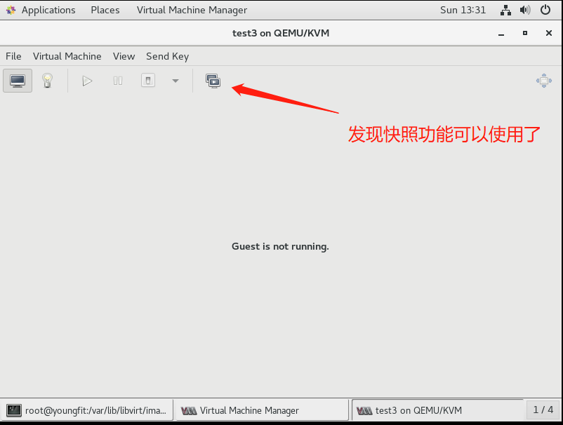


```shell
挂载磁盘

将vm2虚拟机先关闭
查看vm2的磁盘镜像分区信息:
[root@kvm-server images]# virt-df -h -d vm2
文件系统                                  大小      已用空间    可用空间     使用百分比%
vm2:/dev/sda1                            1014M        92M       922M         10%
vm2:/dev/centos/root                      3.5G       863M       2.6G         25%

1.创建一个挂载目录
[root@kvm-server images]# mkdir /test
2.挂载虚拟机的跟分区到test目录
[root@kvm-server images]# guestmount -d vm2 -m /dev/centos/root --rw /test/
[root@kvm-server images]# cd /test/
[root@kvm-server test]# ls
bin   dev  home  lib64  mnt  proc  run   srv  tmp  var
boot  etc  lib   media  opt  root  sbin  sys  usr
[root@kvm-server test]# cat etc/passwd
root:x:0:0:root:/root:/bin/bash
bin:x:1:1:bin:/bin:/sbin/nologin
daemon:x:2:2:daemon:/sbin:/sbin/nologin
adm:x:3:4:adm:/var/adm:/sbin/nologin
lp:x:4:7:lp:/var/spool/lpd:/sbin/nologin
sync:x:5:0:sync:/sbin:/bin/sync
shutdown:x:6:0:shutdown:/sbin:/sbin/shutdown
halt:x:7:0:halt:/sbin:/sbin/halt
mail:x:8:12:mail:/var/spool/mail:/sbin/nologin
operator:x:11:0:operator:/root:/sbin/nologin
games:x:12:100:games:/usr/games:/sbin/nologin
ftp:x:14:50:FTP User:/var/ftp:/sbin/nologin
nobody:x:99:99:Nobody:/:/sbin/nologin
systemd-network:x:192:192:systemd Network Management:/:/sbin/nologin
dbus:x:81:81:System message bus:/:/sbin/nologin
polkitd:x:999:997:User for polkitd:/:/sbin/nologin
postfix:x:89:89::/var/spool/postfix:/sbin/nologin
sshd:x:74:74:Privilege-separated SSH:/var/empty/sshd:/sbin/nologin

取消挂载
[root@kvm-server ~]# guestunmount /test
```


### Day-3

#### KVM网络配置


桥接网络


NAT网络


###### 隔离网络


```shell
可以通过查看mac地址是否一致来确定是不是一根线上的两个接口
[root@youngfit ~]# brctl show
bridge name	bridge id		                STP enabled	 interfaces
virbr0		        8000.5254003c2ba7	yes		         virbr0-nic
							                             vnet2
							                             vnet3
注意：这里vnet网卡，是每台启动的虚拟机正在使用的网卡设备，每台虚拟机使用的不同						         					                             
从交换机上把vnet网卡删除(相当于拔网线的操作)：
[root@youngfit ~]# brctl delif  virbr0 vnet0

来到vm9的虚拟机，ping百度不通，ping宿主机也不通
[root@vm9 ~]# ping www.baidu.com
[root@vm9 ~]# ping 192.168.153.132

添加vnet网卡添加到交换机上：
[root@youngfit ~]# brctl addif  virbr0 vnet0

来到vm9的虚拟机，恢复正常
[root@vm9 ~]# ping www.baidu.com
[root@vm9 ~]# ping 192.168.153.132
```


配置文件方式创建isolated网络


```shell
配置文件方式创建isolated网络(host-only)：host-only模式我从来没用过，我们不再操作，有兴趣可以操作一下 [root@youngfit networks]# cp default.xml isolated200.xml
[root@youngfit networks]# vim isolated200.xml
<network>
  <name>isolated200</name>
  <uuid>6341d3a6-7330-4e45-a8fe-164a6a68929a</uuid>
  <bridge name='virbr2' stp='on' delay='0'/>
  <mac address='52:54:00:6b:39:0c'/>
  <domain name='isolate1'/>
  <ip address='192.168.101.1' netmask='255.255.255.0'>
    <dhcp>
      <range start='192.168.101.128' end='192.168.101.254'/>
    </dhcp>
  </ip>
</network>  

[root@youngfit networks]# systemctl restart libvirtd
```


添加网卡，查看是否生效


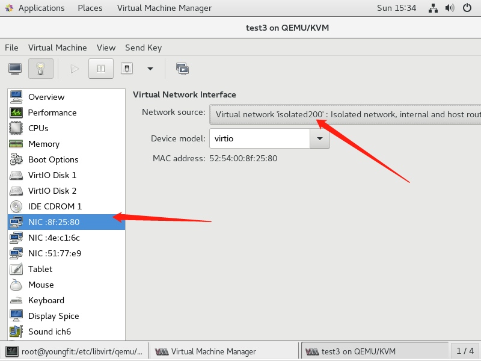


```shell
查看所有的网络：
# virsh net-list

启动网络：
# virsh net-start isolated200

开机自启动:
# virsh net-autostart  isolated200
```


###### 桥接网络


配置文件方式配置桥接：在宿主机上


```shell
配置文件方式配置桥接：在宿主机上
[root@youngfit test]# ip a   #先找出宿主机用的哪个网卡设备，我的是enp0s25
[root@youngfit test]# cd /etc/sysconfig/network-scripts/
1.修改配置文件
[root@youngfit network-scripts]# vim ifcfg-br0  #没有此文件就新建
[root@youngfit network-scripts]# cat ifcfg-br0
TYPE=Bridge
NAME=br0
DEVICE=br0
ONBOOT="yes"
BOOTPROTO=static
IPADDR=192.168.14.60     #宿主机ip地址
GATEWAY=192.168.14.1	 #宿主机的网关
NETMASK=255.255.255.0
DNS1=114.114.114.114
DNS2=8.8.8.8

然后看清楚宿主机正在使用的网卡，修改配置文件
[root@youngfit network-scripts]# cp ifcfg-enp0s25 ifcfg-enp0s25.bak
[root@youngfit network-scripts]# vim ifcfg-enp0s25
[root@youngfit network-scripts]# cat ifcfg-enp0s25
TYPE="Ethernet"
NAME="enp0s25"		#定义网卡设备名称
DEVICE="enp0s25"	#宿主机正在使用的网卡设备
ONBOOT="yes"
BRIDGE=br0			#和ifcfg-br0文件里面的设备对应
 
2.重启libvirtd服务
[root@youngfit network-scripts]# systemctl restart libvirtd
3.重启network服务 
[root@youngfit network-scripts]# systemctl restart network
```


然后去查看有没有新设备生成


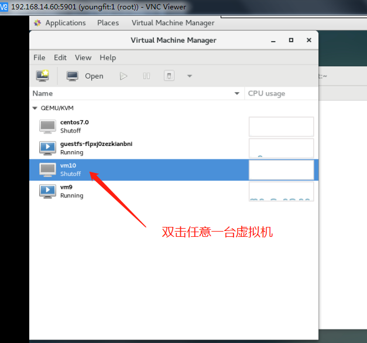


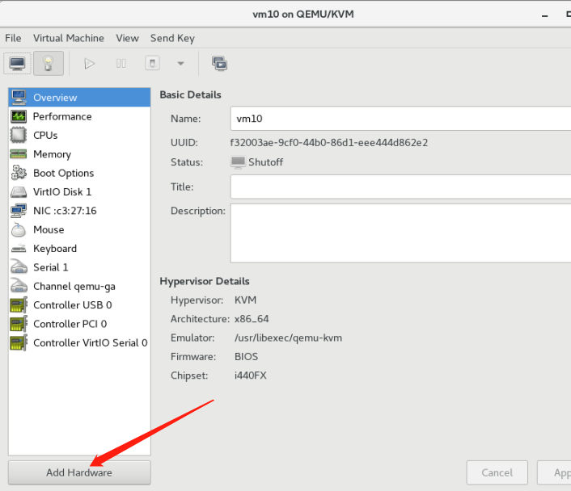


添加上之后，启动


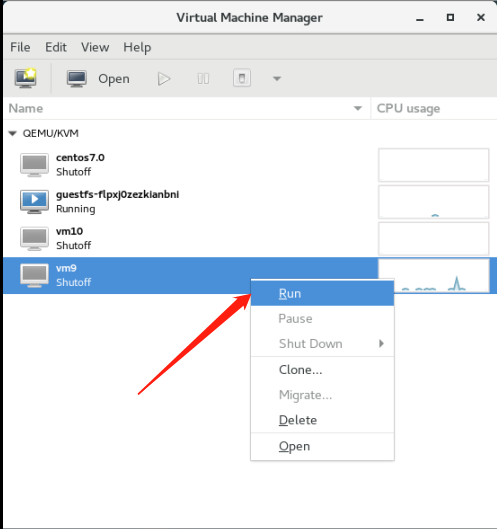


可以看到，我们先添加的网卡设备


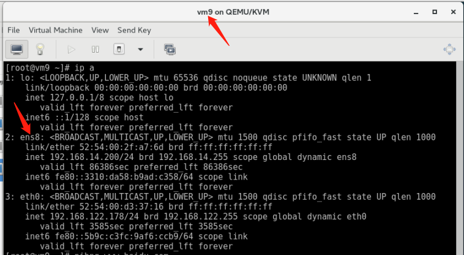


测试网络是否可用


```shell
宿主机测试
[root@youngfit network-scripts]# ping www.baidu.com

如果ping不同，请打开/etc/resolv.conf重新设置DNS为114.114.114.114
```


```shell
kvm虚拟机guestos测试
[root@localhost ~]# ping www.baidu.com
如果ping不同，请打开/etc/resolv.conf重新设置DNS为192.168.91.2(也就是你的网关地址)
宿主机要开启路由转发
[youngfit network-scripts]# tail -1 /etc/sysctl.conf 
net.ipv4.ip_forward=1
[youngfit network-scripts]# sysctl -p
```


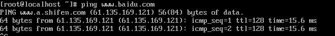


移除操作


将kvm虚拟机先关闭


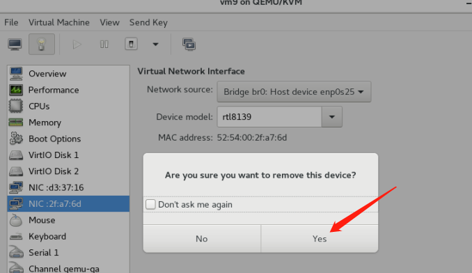


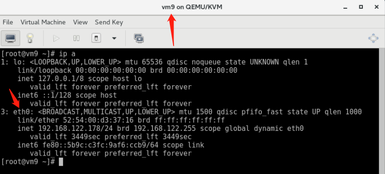


```shell
删除桥接网卡步骤：
1.删除br0的配置文件
2.修改正常网卡的配置文件
3.重启系统

[root@youngfit network-scripts]# mv ifcfg-br0 ifcfg-br0.bak2
[root@youngfit network-scripts]# mv ifcfg-enp0s25 ifcfg-enp0s25.bak2
[root@youngfit network-scripts]# mv ifcfg-enp0s25.bak ifcfg-enp0s25
[root@youngfit network-scripts]# systemctl restart libvirtd
[root@youngfit network-scripts]# systemctl restart network
[root@youngfit network-scripts]# ping www.baidu.com
PING www.a.shifen.com (39.156.66.14) 56(84) bytes of data.
64 bytes from 39.156.66.14 (39.156.66.14): icmp_seq=1 ttl=52 time=13.3 ms
```


###### nat网络

配置文件方式创建nat网络

```shell
配置文件方式创建nat网络：
[root@youngfit networks]# cd /etc/libvirt/qemu/networks
[root@youngfit networks]# cp default.xml nat1.xml
[root@youngfit networks]# vim nat1.xml
```


```shell
重启服务：
# systemctl  restart libvirtd
```


在某个（比如vm9）虚拟机去添加此设备测试


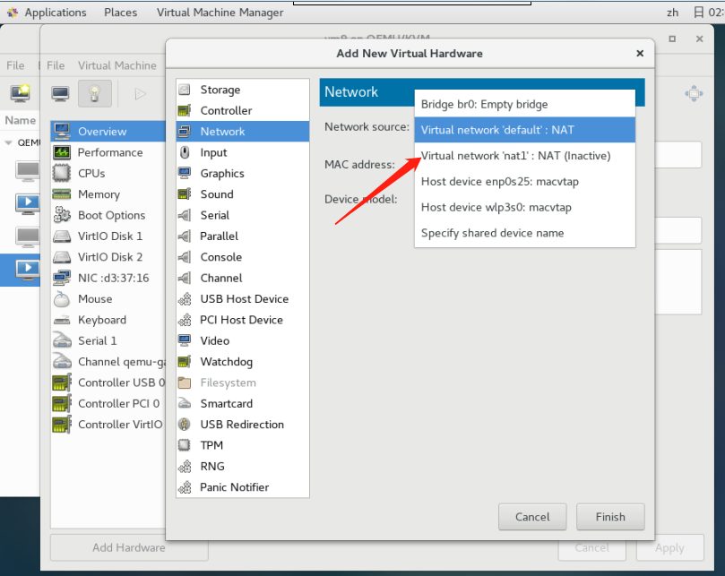


测试网络是否可用


```shell
[root@localhost ~]# ping www.baidu.com
```


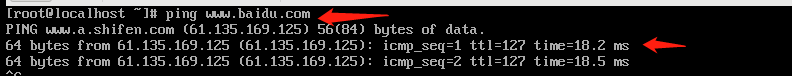


删除，要先取消激活状态；


#### KVM存储配置


```shell
存储池
概念：
    kvm必须要配置一个目录当作他存储磁盘镜像(存储卷)的目录，我们称这个目录为存储池

kvm默认存储池的位置：
    /var/lib/libvirt/images/
    
1.创建基于文件夹的存储池（目录，可自定义）
[root@youngfit ~]# mkdir -p /data/vmfs

2.定义存储池
[root@youngfit ~]# virsh pool-define-as vmdisk --type dir --target /data/vmfs
Pool vmdisk defined
解释：vmdisk是新建的存储池的名称。可自定义

3.创建已定义的存储池
(1)创建已定义的存储池
[root@youngfit ~]# virsh pool-build vmdisk
Pool vmdisk built

(2)查看已定义的存储池，存储池不激活无法使用。
[root@youngfit ~]# virsh pool-list --all
Name                 State      Autostart 
-------------------------------------------
 default              active     yes       
 root                 active     yes       
 vmdisk               inactive   no     

4.激活并自动启动已定义的存储池
[root@youngfit ~]# virsh pool-start vmdisk
Pool vmdisk started
[root@youngfit ~]# virsh pool-autostart vmdisk
Pool vmdisk marked as autostarted

[root@youngfit ~]# virsh pool-list --all
 Name                 State      Autostart 
-------------------------------------------
 default              active     yes       
 root                 active     yes       
 vmdisk               active     yes   
这里vmdisk存储池就已经创建好了，可以直接在这个存储池中创建虚拟磁盘文件了。

5.在存储池中创建虚拟机存储卷
[root@youngfit ~]# cd /data/vmfs/
[root@youngfit network]# virsh vol-create-as vmdisk vm99.qcow2 5G --format qcow2
Vol vm99.qcow2 created

[root@youngfit ~]# ll /data/vmfs/ -h
total 196K
-rw------- 1 root root 193K Oct 20 02:32 vm99.qcow2

注1:KVM存储池主要是体现一种管理方式，可以通过挂载存储目录，lvm逻辑卷的方式创建存储池，虚拟机存储卷创建完成后，剩下的操作与无存储卷的方式无任何区别了。
注2:KVM存储池也要用于虚拟机迁移任务。

6.存储池相关管理命令
(1)在存储池中删除虚拟机存储卷
[root@youngfit ~]# virsh vol-delete --pool vmdisk vm99.qcow2
Vol vm99.qcow2 deleted

(2)取消激活存储池
[root@youngfit ~]# virsh pool-destroy vmdisk
Pool vmdisk destroyed

(3)删除存储池定义的目录/data/vmfs
[root@youngfit ~]# virsh pool-delete vmdisk
Pool vmdisk deleted

(4)取消定义存储池
[root@youngfit ~]# virsh pool-undefine vmdisk
Pool vmdisk has been undefined

到此kvm存储池配置与管理操作完毕.
```


图形操作方式


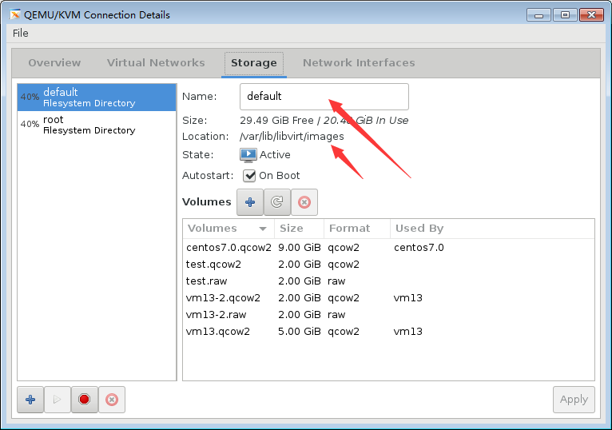


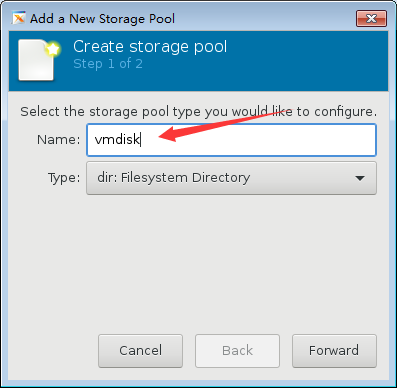


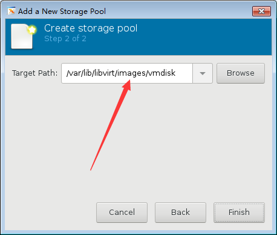


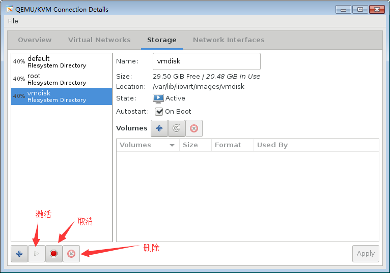


如想删除，必须先停用，再删除


#### kvm快照


```shell
为虚拟机rhel5u8-1创建一个快照（磁盘格式必须为qcow2）
# virsh snapshot-create-as vm9 vm9.snap1
error: unsupported configuration: internal snapshot for disk vda unsupported for storage type raw

raw
使用文件来模拟实际的硬盘(当然也可以使用一块真实的硬盘或一个分区)。由于原生的裸格式，不支持snapshot也是很正常的。但如果你使用LVM的裸设备，那就另当别论。说到LVM还是十分的犀利的目前来LVM的snapshot、性能、可扩展性方面都还是有相当的效果的。目前来看的话，备份的话也问题不大。就是在虚拟机迁移方面还是有很大的限制。但目前虚拟化的现状来看，真正需要热迁移的情况目前需求还不是是否的强烈。虽然使用LVM做虚拟机镜像的相关公开资料比较少，但目前来看牺牲一点灵活性，换取性能和便于管理还是不错的选择。

qcow2
现在比较主流的一种虚拟化镜像格式，经过一代的优化，目前qcow2的性能上接近raw裸格式的性能，这个也算是redhat的官方渠道了
对于qcow2的格式，几点还是比较突出的，qcow2的snapshot，可以在镜像上做N多个快照：
	•更小的存储空间
	•Copy-on-write support
	•支持多个snapshot，对历史snapshot进行管理
	•支持zlib的磁盘压缩
	•支持AES的加密
```


```shell
我做之前vm9虚拟机是关闭的状态，因为开启的状态，文本模式加磁盘总失败（没搞清楚原因，不过可以图形添加）

查看磁盘文件格式
[root@youngfit ~]# qemu-img info /var/lib/libvirt/images/vm9.qcow2 
image: /var/lib/libvirt/images/vm9.qcow2
file format: qcow2
virtual size: 5.0G (5368709120 bytes)
disk size: 1.5G
cluster_size: 65536
Format specific information:
    compat: 1.1
    lazy refcounts: true


[root@youngfit ~]# virsh snapshot-list  vm9		#查看某台虚拟机设备的快照
 Name                 Creation Time             State
------------------------------------------------------------

创建一块磁盘
[root@youngfit ~]# qemu-img create -f raw /var/lib/libvirt/images/vm9-2.raw 5G
Formatting '/var/lib/libvirt/images/vm9-2.raw', fmt=raw size=5368709120 

[root@youngfit ~]# ll -h /var/lib/libvirt/images/vm9-2.raw
-rw-r--r-- 1 root root 5.0G Oct 20 03:19 /var/lib/libvirt/images/vm9-2.raw

将其添加到vm9虚拟机上面
[root@youngfit ~]# virsh edit vm9
```


```shell
[root@youngfit images]# qemu-img info /var/lib/libvirt/images/vm9-2.raw 
image: /var/lib/libvirt/images/vm9-2.raw
file format: raw
virtual size: 5.0G (5368709120 bytes)
disk size: 0

磁盘格式的转换
由于raw的磁盘格式，不支持快照功能，我们需要将其转换为qcow2的格式
[root@youngfit images]# qemu-img convert -O qcow2 /var/lib/libvirt/images/vm9-2.raw  /var/lib/libvirt/images/vm9-2.qcow2
[root@youngfit images]# ll -h
total 14G
-rw-r--r--  1 root root 193K Oct 20 03:40 vm9-2.qcow2
-rw-r--r--  1 root root 5.0G Oct 20 03:19 vm9-2.raw
-rw-------. 1 root root 5.1G Oct 20 03:34 vm9.qcow2

[root@youngfit images]# qemu-img info /var/lib/libvirt/images/vm9-2.qcow2 
image: /var/lib/libvirt/images/vm9-2.qcow2
file format: qcow2
virtual size: 5.0G (5368709120 bytes)
disk size: 196K
cluster_size: 65536
Format specific information:
    compat: 1.1
    lazy refcounts: false

然后去修改vm9虚拟机的磁盘格式和名称
[root@youngfit images]#  virsh edit vm9
```


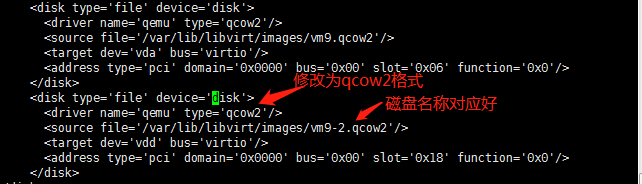


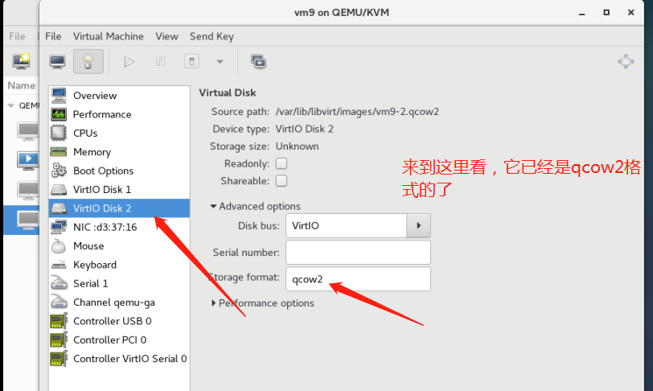


然后我们开始做快照，图形化方式不再介绍


```shell
[root@youngfit images]# virsh snapshot-create-as vm9 vm9.snap1
Domain snapshot vm9.snap1 created

[root@youngfit images]# virsh snapshot-list vm9
 Name                 Creation Time             State
------------------------------------------------------------
 vm9.snap1            2019-10-20 03:48:21 +0800 shutoff

[root@localhost ~]# mkdir /opt/snap
[root@youngfit images]# virsh snapshot-create-as vm9 vm9.snap2
Domain snapshot vm9.snap2 created

[root@localhost ~]# touch /opt/snap/qf.txt
[root@youngfit images]# virsh snapshot-create-as vm9 vm9.snap3
Domain snapshot vm9.snap3 created
[root@youngfit images]# virsh snapshot-list vm9
 Name                 Creation Time             State
------------------------------------------------------------
 vm9.snap1            2019-10-20 03:48:21 +0800 shutoff
 vm9.snap2            2019-10-20 03:50:45 +0800 shutoff
 vm9.snap3            2019-10-20 03:51:02 +0800 shutoff

然后将vm9关闭，恢复到快照vm9.snap1
[root@youngfit images]# virsh shutdown vm9
[root@youngfit images]# virsh snapshot-revert vm9 vm9.snap1  #恢复快照到vm9.snap1
[root@youngfit images]# virsh start vm9
Domain vm9 started

在vm9虚拟机上查看
[root@vm9 ~]# ls /opt/
[root@vm9 ~]# 
可以再恢复到vm9.snap2测试一下

删除虚拟机快照操作：
[root@youngfit images]# virsh snapshot-list vm9
 Name                 Creation Time             State
------------------------------------------------------------
 vm9.snap1            2019-10-20 03:48:21 +0800 shutoff
 vm9.snap2            2019-10-20 03:50:45 +0800 shutoff
 vm9.snap3            2019-10-20 03:51:02 +0800 shutoff

[root@youngfit images]# virsh snapshot-delete --snapshotname vm9.snap2 vm9
Domain snapshot vm9.snap2 deleted

[root@youngfit images]# virsh snapshot-list vm9
 Name                 Creation Time             State
------------------------------------------------------------
 vm9.snap1            2019-10-20 03:48:21 +0800 shutoff
 vm9.snap3            2019-10-20 03:51:02 +0800 shutoff
```


#### kvm迁移


```plain
最简单的方法：
拷贝配置文件，磁盘
```


```shell
10.18.42.202 
10.18.42.46
热迁移

			  192.168.1.1/24	            192.168.1.2/24
				++++++++++++            	++++++++++++
				+			+			    +		    +		
				+    KVM-A  +  =======>     +	KVM-B 	+
				+	    	+			    +	        +	
				++++++++++++				++++++++++++
			       images                      images
		  /var/lib/libvirt/images	       /var/lib/libvirt/images                   
				
				                                         nfs

系统环境:rhel6.4 x86_64 iptables and selinux off

注意：
  1.两台机器要做互相解析
	2.同一个大版本的系统，从高版本系统上不可以往低版本系统上迁移，反过来可以比如从6.5不能迁移到6.4，但是从6.4可以迁移到6.5
	3.两台机器的selinux全部开机关闭

将 KVM-A 上的虚拟机镜像文件所在的目录共享出来
[root@localhost1 ~]# getenforce
Permissive
[root@localhost1 ~]# iptables -F
[root@localhost1 ~]# cat /etc/hosts
192.168.1.1	fw-01
192.168.1.2	fw-02

[root@localhost1 ~]# yum -y install nfs-tools rpcbind
[root@localhost1 ~]# vim /etc/exports 
/var/lib/libvirt/images 192.168.1.2(rw,sync,no_root_squash)

[root@localhost1 ~]# service nfs start

KVM-B将KVM-A上共享出来的目录挂载在到KVM-B的/var/lib/libvirt/images
[root@localhost2 ~]# mount -t nfs 192.168.1.1:/var/lib/libvirt/images  /var/lib/libvirt/images
								
在KVM-B配置/etc/libvirt/qemu.conf
[root@localhost2 ~]# vim /etc/libvirt/qemu.conf          #取消下面选项的注释
user = "root"		第198行
group = "root"	第202行

[root@localhost2 ~]# serivice libvirtd restart
```


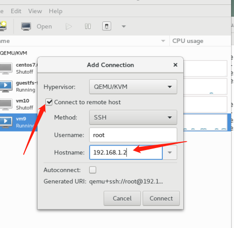


#### 自动化脚本管理kvm（留时间给大家写）


```shell
#!/bin/bash
#kvm batch create vm tool
#version:0.1
#author:name
#需要事先准备模板镜像和配置文件模板
echo "1.创建自定义配置单个虚拟机
2.批量创建自定义配置虚拟机
3.批量创建默认配置虚拟机
4.删除虚拟机"

read -p "选取你的操作(1/2/3):" op

batch_self_define() {

        kvmname=`openssl rand -hex 5`

        sourceimage=/var/lib/libvirt/images/vmmodel.img
        sourcexml=/etc/libvirt/qemu/vmmodel.xml

        newimg=/var/lib/libvirt/images/${kvmname}.img
        newxml=/etc/libvirt/qemu/${kvmname}.xml

        cp $sourceimage  $newimg
        cp $sourcexml $newxml

        kvmuuid=`uuidgen`
        kvmmem=${1}000000
        kvmcpu=$2
        kvmimg=$newimg
        kvmmac=`openssl rand -hex 3 | sed -r 's/..\B/&:/g'`

        sed -i "s@kvmname@$kvmname@;s@kvmuuid@$kvmuuid@;s@kvmmem@$kvmmem@;s@kvmcpu@$kvmcpu@;s@kvmimg@$kvmimg@;s@kvmmac@$kvmmac@" $newxml
        virsh define $newxml
        virsh list --all
}
self_define() {
        read -p "请输入新虚机名称:" newname
        read -p "请输入新虚机内存大小(G):" newmem
        read -p "请输入新虚机cpu个数:" newcpu

        sourceimage=/var/lib/libvirt/images/vmmodel.img
        sourcexml=/etc/libvirt/qemu/vmmodel.xml

        newimg=/var/lib/libvirt/images/${newname}.img
        newxml=/etc/libvirt/qemu/${newname}.xml

        cp $sourceimage  $newimg
        cp $sourcexml $newxml

        kvmname=$newname
        kvmuuid=`uuidgen`
        kvmmem=${newmem}000000
        kvmcpu=$newcpu
        kvmimg=$newimg
        kvmmac=`openssl rand -hex 3 | sed -r 's/..\B/&:/g'`

        sed -i "s@kvmname@$kvmname@;s@kvmuuid@$kvmuuid@;s@kvmmem@$kvmmem@;s@kvmcpu@$kvmcpu@;s@kvmimg@$kvmimg@;s@kvmmac@$kvmmac@" $newxml
        virsh define $newxml
        virsh list --all
}

case $op in
1)self_define;;
2)
        read -p "请输入要创建的虚拟机的个数:" num
        read -p "请输入新虚机内存大小(G):" newmem
        read -p "请输入新虚机cpu个数:" newcpu

        for((i=1;i<=$num;i++))
        do
                batch_self_define $newmem $newcpu
        done;;

3)
        read -p "请输入要创建的虚拟机的个数:" num

        for((i=1;i<=$num;i++))
        do
                batch_self_define 1 1
        done;;

*)echo "输入错误，请重新执行脚本"
  exit;;
esac
```

------

#### Centos设置输入法


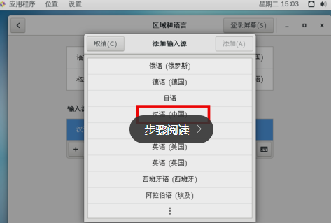


