### NFS实现原理

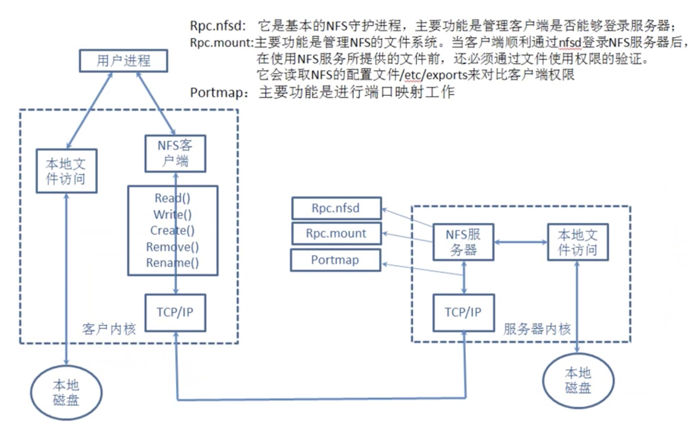

### nginx负载均衡

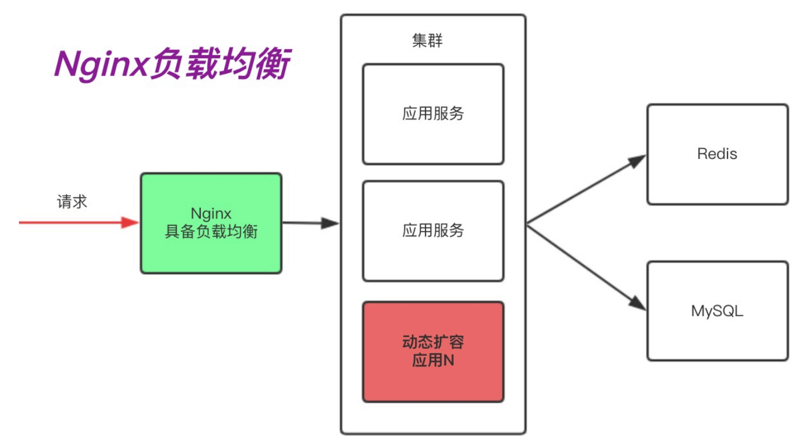

### nginx代理缓存

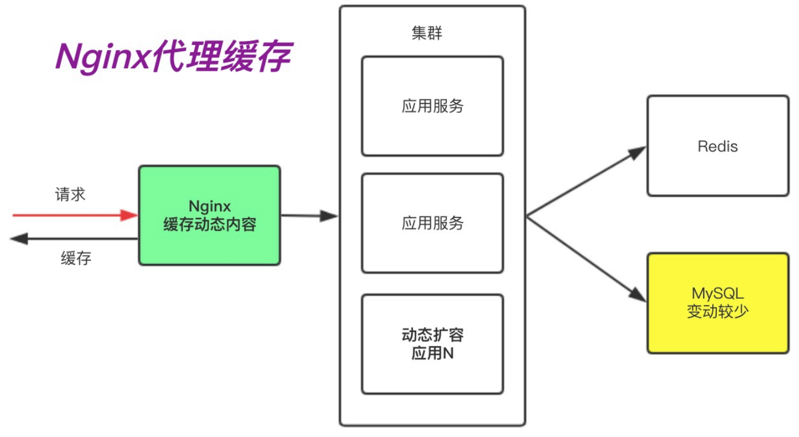

### nginx静态服务

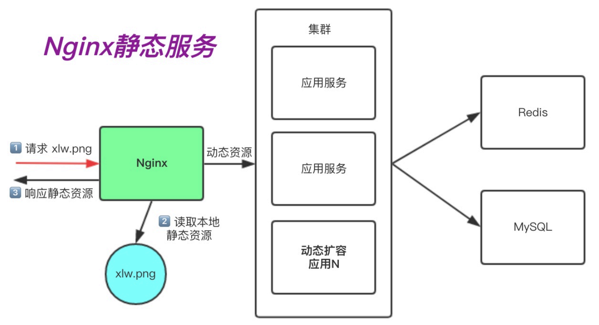

### nginx安全服务


### LNMP原理

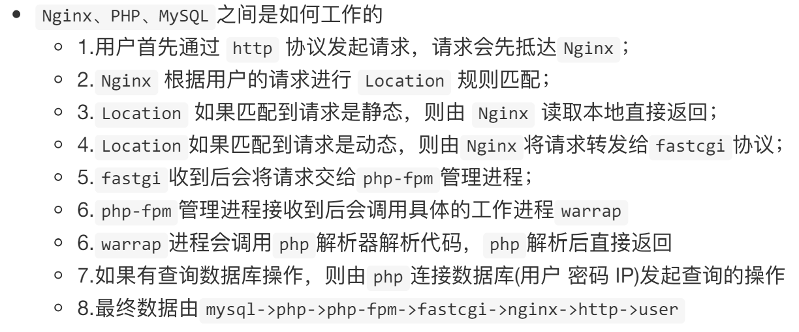

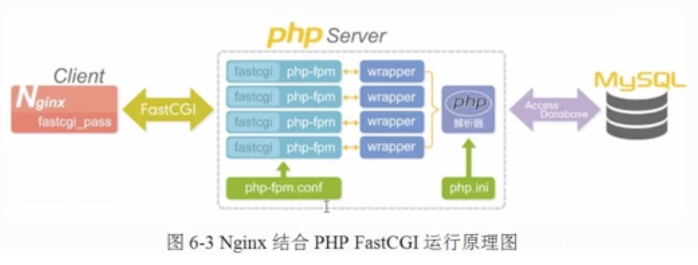

```
1、Client:
客户端发起请求，通常是通过浏览器访问某个网址。

2、Nginx:
Nginx 服务器接收到客户端的请求。Nginx 是一个高性能的 HTTP 服务器和反向代理服务器。
Nginx 通过配置文件 nginx.conf，将需要处理 PHP 脚本的请求通过 fastcgi_pass 传递给PHP-FPM（FastCGI 进程管理器）。

3、FastCGI:
FastCGI 是一种协议，用于将请求从 Web 服务器（如 Nginx）传递给应用服务器（如 PHP-FPM）。请求通过 FastCGI 协议传递给 PHP-FPM 进程。

4、PHP-FPM:
PHP-FPM（FastCGI Process Manager）是 PHP 的一个替代实现方式，用于管理 PHP 的进程池。
PHP-FPM 根据 php-fpm.conf 配置文件启动和管理多个 PHP 进程来处理请求。
PHP 进程接收到请求后，通过 wrapper（程序）将请求交给 PHP 解析器。

5、PHP 解析器:
PHP 解析器读取 php.ini 配置文件，根据配置解析和执行 PHP 脚本。
解析和执行 PHP 脚本时，如果需要访问数据库，则会通过数据库驱动与 MySQL 数据库交互。

6、MySQL:
MySQL 数据库接收来自 PHP 脚本的查询请求，执行相应的 SQL 查询，并返回结果。
PHP 脚本接收到查询结果后，生成相应的 HTML 内容。

生成的 HTML 内容通过 PHP-FPM 传递回 Nginx。
Nginx 将生成的 HTML 响应返回给客户端。
总的来说，这个架构通过 Nginx 处理客户端请求，并使用 FastCGI 将请求传递给 PHP-FPM 来处理 PHP 脚本，最后通过 MySQL 数据库完成数据存取操作，整个过程高效地完成了动态网页内容的生成和响应。
```

### 数据库拆分架构演变

拆分数据库能解决什么问题？

1.缓解web网站的压力

2.增强数据库读写性能

3.提高用户访问速度

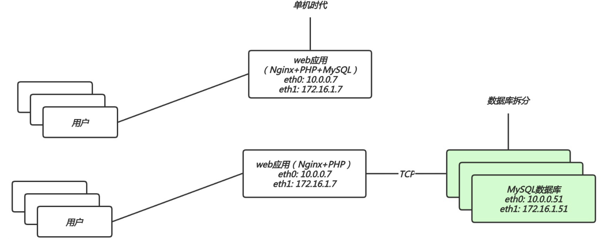

### 扩展多web节点架构演变

扩展多台节点解决什么问题？

1.单台web节点如果有故障，会导致业务down机

2.多台web节点能保证业务的持续稳定，扩展性高

3.多台web节点能有效的提升用户访问网站的速度

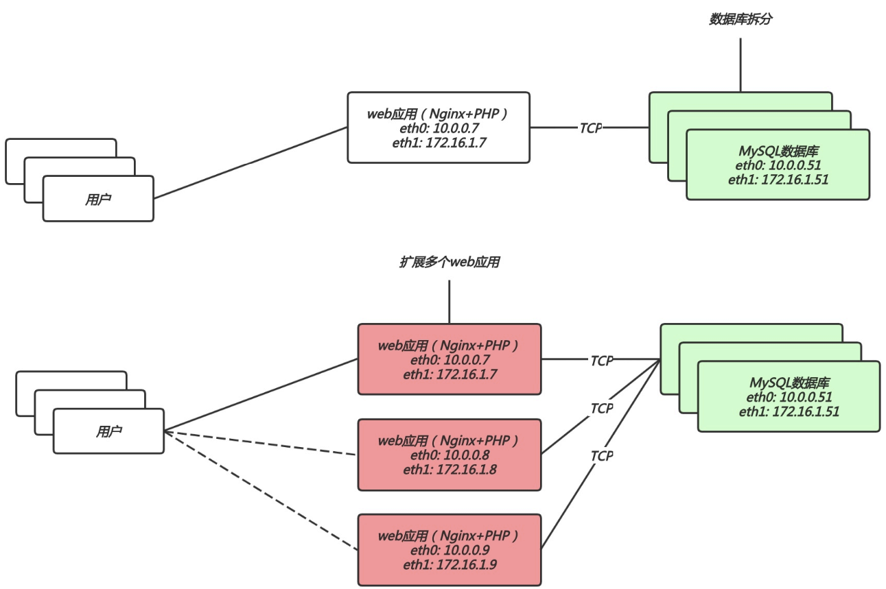

### 拆分静态资源架构演变

增加一台共享存储能解决什么问题？

1.保证多台web节点静态资源一致

2.有效节省多台web节点的储存空间

3.统一管理静态资源，便于后期推送至CDN进行静态资源加速

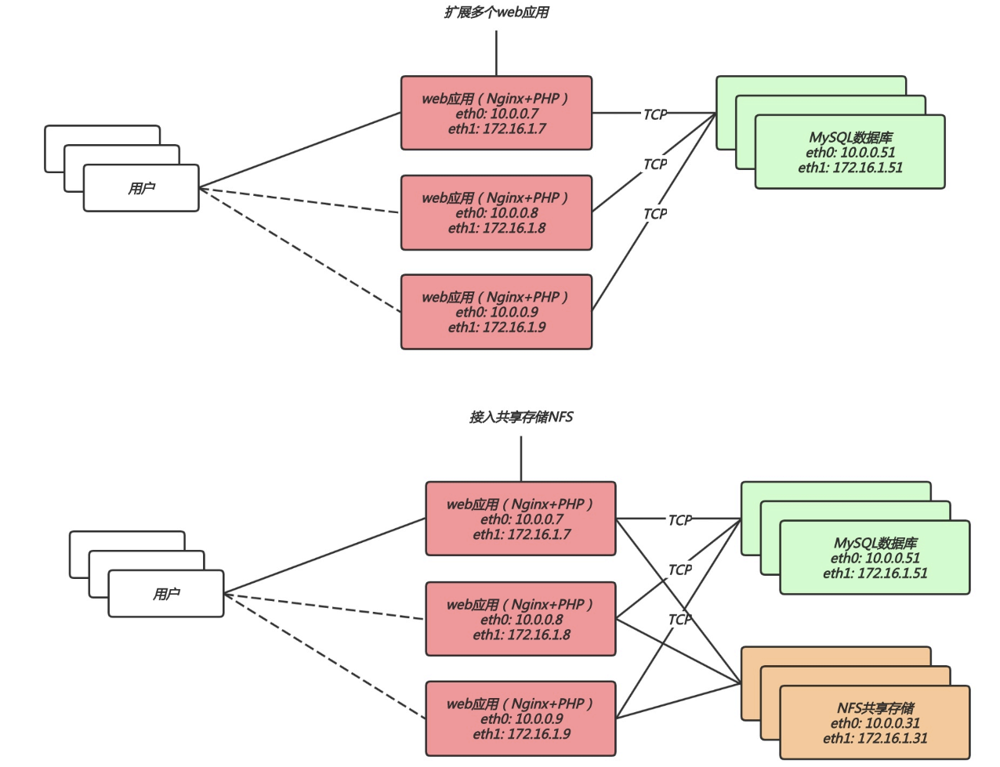

### 负载均衡

1.所有web节点不需要有公网ip，能节省成本，保证安全性

2.能够对后端的web节点进行健康检查机制

3.负载均衡有多种调度算法来满足企业不用的需求

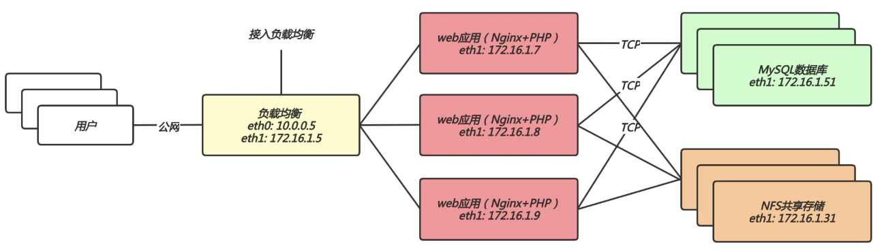

### 反向代理(路由功能)

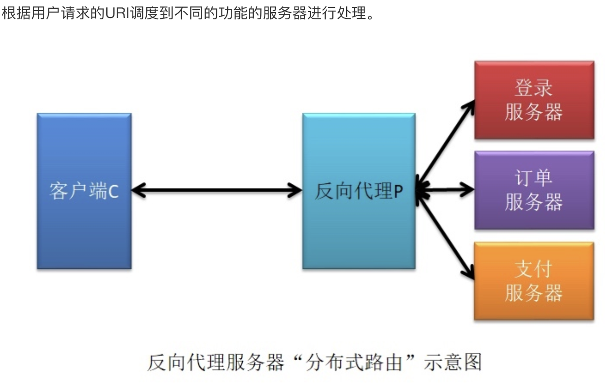

### 反向代理(负载均衡)

将用户发送的请求，通过负载均衡调度算法挑选一台合适的节点进行请求处理

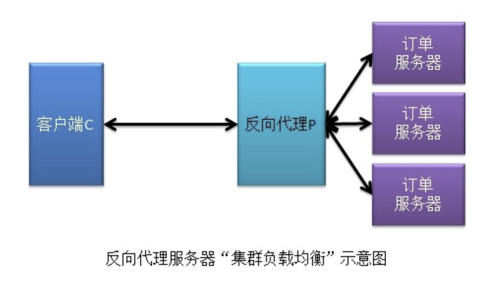

### 反向代理(动静分离)

根据用户请求的URI进行区分，将动态资源调度至应用服务器处理，将静态资源调度至静态资源服务器处理。

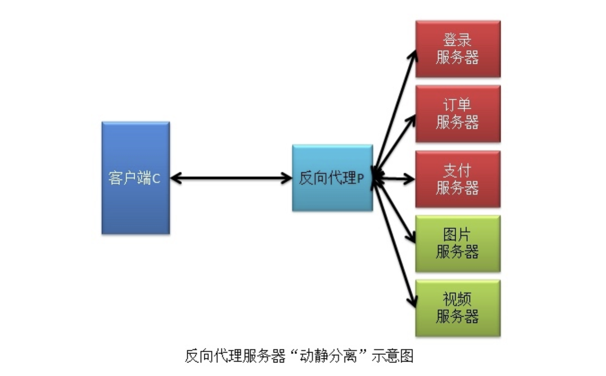

### nginx方向代理常用代理协议

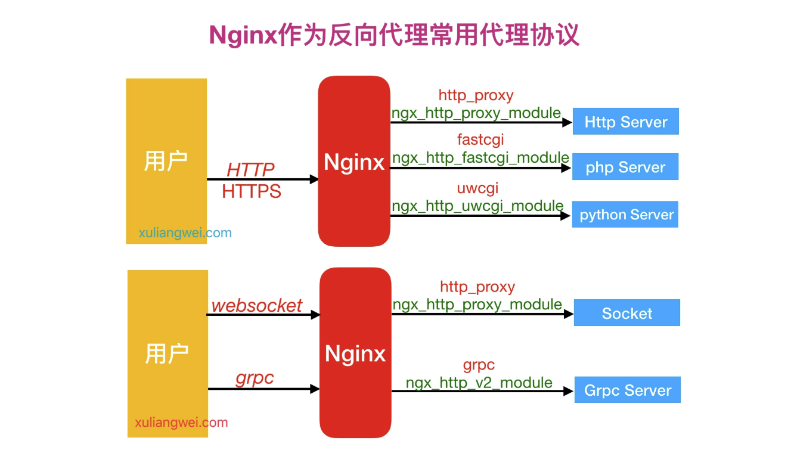
