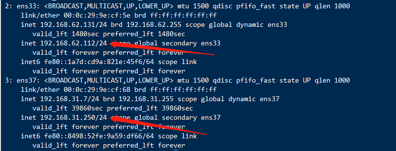
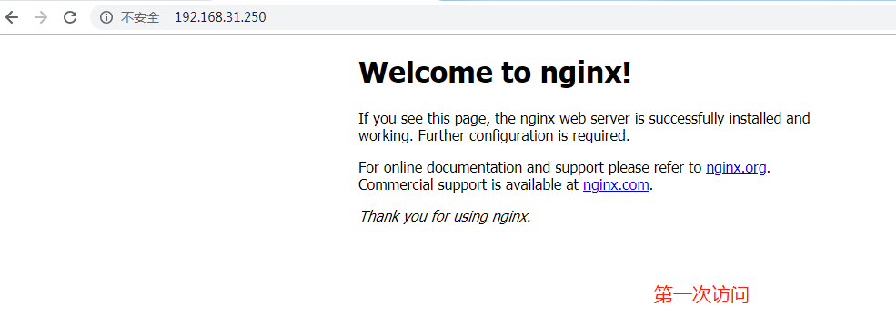
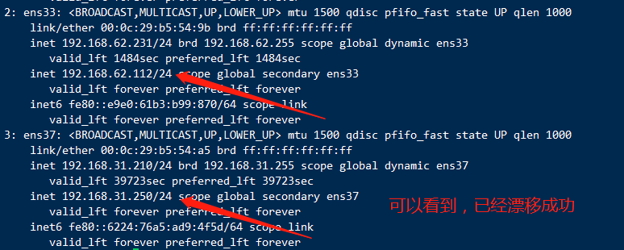

# LVS-Nat模式+Keepalived

四台机器（网络模式都设置为NAT模式）：

两台做lvs-nat模式的keepalived集群

两台做RS(Nginx提供静态页面即可)

## 两台lvs操作

都添加一块桥接的网卡

```shell
lvs的master节点配置文件
[root@lvs-master ~]# yum -y install ipvsadm keepalived
[root@lvs-master ~]# cat /etc/keepalived/keepalived.conf
! Configuration File for keepalived
global_defs {
    router_id lvs-keepalived-master
}

vrrp_instance VI_1 {
    state MASTER
    interface ens37		#桥接网卡名称、自己添加的虚拟ip
    virtual_router_id 80
    priority 100
    advert_int 1
    authentication {
        auth_type PASS
        auth_pass 1111
    }
    virtual_ipaddress {
      192.168.31.250/24		#注意自己的网段
    }
}

virtual_server 192.168.31.250 80 {
    delay_loop 3
    lb_algo rr
    lb_kind NAT
    nat_mask 255.255.255.0
    protocol TCP
real_server 192.168.62.168 80 {
    weight 1
    inhibit_on_failure
    TCP_CHECK {
        connect_port 80
        connect_timeout 3
    }
}
real_server 192.168.62.166 80 {
    weight 1
    inhibit_on_failure
    TCP_CHECK {
    connect_timeout 3
    connect_port 80
    }
    }
}
vrrp_instance VI_2 {
    state MASTER
    interface ens33		#NAT模式网卡名称
    virtual_router_id 100
    priority 100
    advert_int 1
    authentication {
        auth_type PASS
        auth_pass 2222
        }
    virtual_ipaddress {
        192.168.62.112/24  #自己设的
    }
}

[root@lvs-slave ~]# yum -y install ipvsadm keepalived
[root@lvs-slave ~]# cat /etc/keepalived/keepalived.conf
! Configuration File for keepalived
global_defs {
    router_id lvs-keepalived-slave
}

vrrp_instance VI_1 {
    state BACKUP
    interface ens37
    nopreempt
    virtual_router_id 80
    priority 50
    advert_int 1
    authentication {
        auth_type PASS
        auth_pass 1111
    }
    virtual_ipaddress {
    192.168.31.250/24
    }
    }

virtual_server 192.168.31.250 80 {
    delay_loop 3
    lb_algo rr
    lb_kind NAT
    nat_mask 255.255.255.0
    protocol TCP
real_server 192.168.62.168 80 {
    weight 1
    inhibit_on_failure
    TCP_CHECK {
        connect_port 80
        connect_timeout 3
    }
}
real_server 192.168.62.166 80 {
    weight 1
    inhibit_on_failure
    TCP_CHECK {
    connect_timeout 3
    connect_port 80
    }
    }
}
vrrp_instance VI_2 {
    state BACKUP
    interface ens33
    nopreempt
    virtual_router_id 100
    priority 50
    advert_int 1
    authentication {
        auth_type PASS
        auth_pass 2222
        }
    virtual_ipaddress {
        192.168.62.112/24
    }
}
注意开启路由转发
[root@lvs-master ~]# vim /etc/sysctl.conf
net.ipv4.ip_forward = 1
[root@lvs-master ~]# sysctl -p

[root@lvs-slave ~]# vim /etc/sysctl.conf
net.ipv4.ip_forward = 1
[root@lvs-slave ~]# sysctl -p
====================================================================================
启动Keepalived服务
[root@lvs-master ~]# systemctl start keepalived
[root@lvs-slave ~]# systemctl start keepalived
```

## 两台RS(Nginx服务器)操作

```shell
安装nginx服务器，配置不同的静态页面过程：略

[root@test-nginx1 ~]# route add default gw 192.168.62.112  dev ens33
[root@test-nginx2 ~]# route add default gw 192.168.62.112  dev ens33
提示：由于临时添加的方式，网关有可能会消失，消失就添加即可。
```

## 访问测试

当两个vip在master节点上时，访问浏览器

```shell
[root@lvs-master ~]# ip a
```






把master节点的keepalived服务停止，两个vip会漂移到backup节点，再次用浏览器访问

```
[root@lvs-slave ~]# ip a
```




总结：如果ip漂移之后，访问不到，

1.查看backup节点是否开启了路由转发

2.查看RS上面的网关有没有消失

