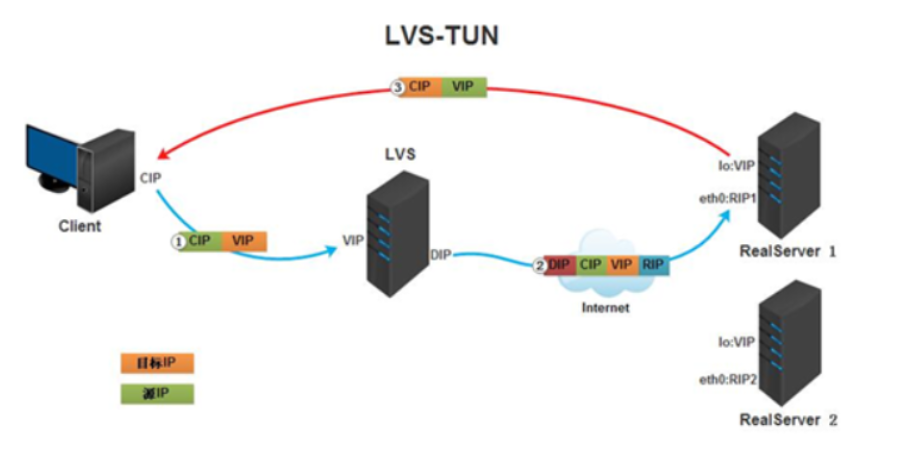
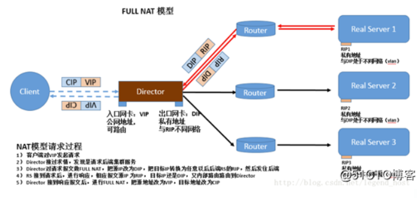
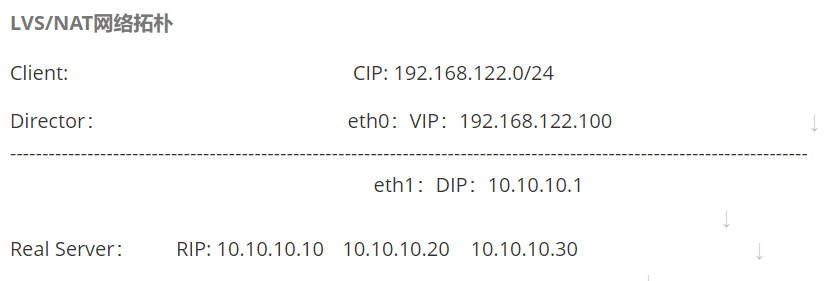

###  负载均衡集群

### 1、集群是什么？

1 集群（cluster）技术是一种较新的技术，通过集群技术，可以在付出较低成本的情况下获得在性能、可靠性、灵活性方面的相对较高的收益，其任务调度则是集群系统中的核心技术。

2 群集组成后，可以利用多个计算机和组合进行海量请求处理（**负载均衡**），从而获得很高的处理效率，也可以用多个计算机做备份（高可用HA），使得任何一个机器坏了整个系统还是能正常运行。

### 2、负载均衡集群技术

① 负载均衡（Load Balance）：负载均衡集群为企业需求提供了可解决容量问题的有效方案。负载均衡集群使负载可以在计算机集群中尽可能平均地分摊处理。

② 负载通常包括应用程序处理负载和网络流量负载,每个节点都可以承担一定的处理负载，并且可以实现处理负载在节点之间的动态分配，以实现负载均衡。

### 3、负载均衡集群技术的实现

负载均衡（Load Balance）

负载均衡技术类型：基于 4 层负载均衡技术和基于 7 层负载均衡技术

负载均衡实现方式：硬件负载均衡设备或者软件负载均衡

硬件负载均衡产品：F5 、深信服 、Radware

软件负载均衡产品： **LVS**（Linux Virtual Server）、 Haproxy、Nginx

### 4、实现效果如图


### 5、负载均衡分类

负载均衡根据所采用的设备对象（**软/硬件负载均衡**），应用的OSI网络层次（**网络层次上的负载均衡**），及应用的地理结构（**本地/全局负载均衡**）等来分类。下面着重介绍的是根据应用的 OSI 网络层次来分类的负载均衡类型。

**负载均衡可以大概分为以下几类：**

- **二层负载均衡（mac）**

  数据链路层    mac地址

  一般是用虚拟mac地址方式，外部对虚拟MAC地址请求，负载均衡接收后分配后端实际的MAC地址响应。

- **三层负载均衡（ip）**

  网络层    ip地址

  一般采用虚拟IP地址方式，外部对虚拟的ip地址请求，负载均衡接收后分配后端实际的IP地址响应。

- **四层负载均衡（tcp）**

  传输层  port   

  在三层负载均衡的基础上，用ip+port接收请求，再转发到对应的机器。

- **七层负载均衡（http）**

  应用层 url   ip+port

  根据虚拟的url或IP，主机名接收请求，再转向相应的处理服务器。

在实际应用中，比较常见的就是四层负载及七层负载。这里也重点说下这两种负载。

### 6、四层负载均衡（基于IP+端口的负载均衡）

所谓四层负载均衡，也就是主要通过报文中的目标ip地址和端口，再加上负载均衡设备设置的服务器选择方式(分发策略，轮询)，决定最终选择的内部服务器。

layer4

1.在三层负载均衡的基础上，通过发布三层的IP地址（VIP），然后加四层的端口号，来决定哪些流量需要做负载均衡，对需要处理的流量进行NAT处理，转发至后台服务器，并记录下这个TCP或者UDP的流量是由哪台服务器处理的，后续这个连接的所有流量都同样转发到同一台服务器处理。

2.以常见的TCP为例，负载均衡设备在接收到第一个来自客户端的SYN 请求时，即通过上述方式选择一个最佳的服务器，并对报文中目标IP地址进行修改(改为后端服务器IP），直接转发给该服务器。TCP的连接建立，即三次握手是客户端和服务器直接建立的，负载均衡设备只是起到一个转发动作。在某些部署情况下，为保证服务器回包可以正确返回给负载均衡设备，在转发报文的同时可能还会对报文原来的源地址进行修改。

3.实现四层负载均衡的有：

- F5：硬件负载均衡器，功能很好，但是成本很高；
- LVS：重量级的四层负载均衡软件；
- haproxy、Nginx：模拟四层、七层转发，较灵活；

### 7、七层的负载均衡（基于虚拟的URL或主机IP的负载均衡)

1. 所谓七层负载均衡，也称为“内容交换”，也就是主要通过报文中的真正有意义的应用层内容，再加上负载均衡设备设置的服务器选择方式，决定最终选择的内部服务器。

   layer7

   1. 在四层负载均衡的基础上（没有四层是绝对不可能有七层的），再考虑应用层的特征，比如同一个Web服务器的负载均衡，除了根据IP加80端口辨别是否需要处理的流量，还可根据七层的URL、浏览器类别、语言来决定是否要进行负载均衡。
   2. 负载均衡设备如果要根据真正的应用层内容再选择服务器，只能先代理最终的服务器和客户端建立连接(三次握手)后，才可能接受到客户端发送的真正应用层内容的报文，然后再根据该报文中的特定字段，再加上负载均衡设备设置的服务器选择方式，决定最终选择的内部服务器。负载均衡设备在这种情况下，更类似于一个**代理服务器**。负载均衡和前端的客户端以及后端的服务器会分别建立TCP连接。所以从这个技术原理上来看，七层负载均衡明显的对负载均衡设备的要求更高，处理七层的能力也必然会低于四层模式的部署方式。
   3. 对应的负载均衡器除了支持四层负载均衡以外，还有分析应用层的信息，如HTTP协议URI等信息，实现七层负载均衡。此种负载均衡器能理解应用协议。
   4. 实现七层负载均衡的软件有：
      - haproxy：天生负载均衡技能，全面支持四层，七层代理，会话保持，标记，路径转移；
      - nginx：只在http协议和mail协议上功能比较好，性能与haproxy差不多；
      - apache：功能较差
      - Mysql proxy：功能尚可。

   


### 8、四层负载与七层负载的区别

```shell
|          | 四层负载均衡              | 七层负载均衡                               |
+----------+-------------------------+----------------------------------------------+
| 基于      | 基于IP+Port的           | 基于URL或主机IP等。                        |
+----------+-------------------------+----------------------------------------------+
| 类似于    | 路由器                   | 代理服务器                                     |
+----------+-------------------------+----------------------------------------------+
| 复杂度    | 低                      | 高                                           |
+----------+-------------------------+----------------------------------------------+
| 性能     | 高；无需解析内容           | 中；需要算法识别 URL和 HTTP head 等信息 |
+----------+-------------------------+----------------------------------------------+
| 安全性   | 低，                      | 高，                                        |
+----------+-------------------------+----------------------------------------------+
| 额外功能  | 无                       | 会话保持，图片压缩，防盗链、地址重写、流量限制等                     |
```

**总结：从上面的对比看来四层负载与七层负载最大的区别就是效率与功能的区别。四层负载架构设计比较简单，无需解析具体的消息内容，在网络吞吐量及处理能力上会相对比较高，而七层负载均衡的优势则体现在功能多，控制灵活强大。在具体业务架构设计时，使用七层负载或者四层负载还得根据具体的情况综合考虑。**

### 9、LVS 实现四层负载均衡项目实战

#### 1、LVS 介绍

（1）LVS 是` Linux Virtual Server`的简称，也就是 Linux 虚拟服务器, 是一个由章文嵩博士发起的自由软件项目，它的官方站点是**www.linuxvirtualserver.org。**现在LVS已经是Linux标准内核的一部分，因此性能较高。

（2）LVS软件作用：通过LVS提供的负载均衡技术实现一个高性能、高可用的服务器群集，它具有良好可靠性、可扩展性和可操作性。从而以低廉的成本实现最优的服务性能。

#### 2、LVS 优势与不足

##### 1、优势

**高并发连接**：LVS基于内核工作，有超强的承载能力和并发处理能力。单台LVS负载均衡器，可支持上万并发连接。

**稳定性强：**是工作在网络4层之上仅作分发之用，这个特点也决定了它在负载均衡软件里的性能最强，稳定性最好，对内存和cpu资源消耗极低。

**成本低廉：**硬件负载均衡器少则十几万，多则几十万上百万，LVS只需一台服务器和就能免费部署使用，性价比极高。

**配置简单：**LVS配置非常简单，仅需几行命令即可完成配置，也可写成脚本进行管理。

**支持多种算法：**支持多种论调算法，可根据业务场景灵活调配进行使用。

**支持多种工作模式：**可根据业务场景，使用不同的工作模式来解决生产环境请求处理问题。

应用范围广：因为LVS工作在4层，所以它几乎可以对所有应用做负载均衡，包括http、数据库、DNS、ftp服务等等

##### 2、不足

工作在4层，不支持7层规则修改，机制过于庞大，不适合小规模应用。

#### 3、LVS 核心组件和专业术语

##### 1、核心组件

LVS的管理工具和内核模块 ipvsadm/ipvs

ipvsadm：用户空间的命令行工具，用于管理集群服务及集群服务上的RS等；

ipvs：工作于内核上的程序，可根据用户定义的集群实现请求转发；

##### 2、专业术语

**VS**：Virtual Server            #虚拟服务

**Director, Balancer**          #负载均衡器、分发器

**RS**：Real Server                #后端请求处理服务器 

**CIP**: Client IP                      #客户端IP

**VIP**：Director Virtual IP   #负载均衡器虚拟IP

**DIP**：Director IP               #负载均衡器真实IP

**RIP**：Real Server IP         #后端请求处理服务器IP

##### 3、具体图解


#### LVS工作内核模型及工作模式

① 当客户端的请求到达负载均衡器的内核空间时，首先会到达 PREROUTING 链。

② 当内核发现请求数据包的目的地址是本机时，将数据包送往 INPUT 链。

③ LVS由用户空间的ipvsadm和内核空间的IPVS组成，ipvsadm用来定义规则，IPVS利用ipvsadm定义的规则工作，IPVS工作在INPUT链上,当数据包到达INPUT链时，首先会被IPVS检查，如果数据包里面的目的地址及端口没有在规则里面，那么这条数据包将被放行至用户空间。

④ 如果数据包里面的目的地址及端口在规则里面，那么这条数据报文将被修改目的地址为事先定义好的后端服务器，并送往POSTROUTING链。

⑤ 最后经由POSTROUTING链发往后端服务器。

4、**LVS负载均衡四种工作模式**

```shell
LVS/NAT：网络地址转换模式，进站/出站的数据流量经过分发器/负载均衡器(IP负载均衡，他修改的是IP地址)  --利用三层功能
LVS/DR：直接路由模式，只有进站的数据流量经过分发器/负载均衡器(数据链路层负载均衡，因为他修改的是目的mac地址)--利用二层功能mac地址
LVS/TUN： 隧道模式，只有进站的数据流量经过分发器/负载均衡器
LVS/full-nat:双向转换，通过请求报文的源地址为DIP，目标为RIP来实现转发：对于响应报文而言，修改源地址为VIP，目标地址为CIP来实现转发
```


##### 5、LVS 四种工作模式原理、以及优缺点比较

1、NAT模式（LVS-NAT）
    原理：就是把客户端发来的数据包的IP头的目的地址，在负载均衡器上换成其中一台RS的IP地址，转发至此RS来处理,RS处理完成后把数据交给经过负载均衡器,负载均衡器再把数据包的源IP地址改为自己的VIP，将目的地址改为客户端IP地址即可｡期间,无论是进来的流量,还是出去的流量,都必须经过负载均衡器｡
    优点：集群中的物理服务器可以使用任何支持TCP/IP操作系统，只有负载均衡器需要一个合法的IP地址。
    缺点：扩展性有限。当服务器节点（普通PC服务器）增长过多时,负载均衡器将成为整个系统的瓶颈，因为所有的请求包和应答包的流向都经过负载均衡器。当服务器节点过多时，大量的数据包都交汇在负载均衡器那，速度就会变慢！


 2、直接路由(Direct Routing)模式（LVS-DR）
    原理：负载均衡器和RS都使用同一个IP对外服务｡但只有DB对ARP请求进行响应,所有RS对本身这个IP的ARP请求保持静默｡也就是说,网关会把对这个服务IP的请求全部定向给DB,而DB收到数据包后根据调度算法,找出对应的RS,把目的MAC地址改为RS的MAC（因为IP一致）并将请求分发给这台RS｡这时RS收到这个数据包,处理完成之后，由于IP一致，可以直接将数据返给客户，则等于直接从客户端收到这个数据包无异,处理后直接返回给客户端｡
    优点：和TUN（隧道模式）一样，负载均衡器也只是分发请求，应答包通过单独的路由方法返回给客户端。与LVS-TUN相比，LVS-DR这种实现方式不需要隧道结构，因此可以使用大多数操作系统做为物理服务器。
    缺点：（不能说缺点，只能说是不足）要求负载均衡器的网卡必须与物理网卡在一个物理段上。


  3、IP隧道(Tunnel)模式（LVS-TUN）  

​    原理：互联网上的大多Internet服务的请求包很短小，而应答包通常很大。那么隧道模式就是，把客户端发来的数据包，封装一个新的IP头标记(仅目的IP)发给RS,RS收到后,先把数据包的头解开,还原数据包,处理后,直接返回给客户端,不需要再经过负载均衡器｡注意,由于RS需要对负载均衡器发过来的数据包进行还原,所以说必须支持IPTUNNEL协议｡所以,在RS的内核中,必须编译支持IPTUNNEL这个选项
​    优点：负载均衡器只负责将请求包分发给后端节点服务器，而RS将应答包直接发给用户。所以，减少了负载均衡器的大量数据流动，负载均衡器不再是系统的瓶颈，就能处理海量的请求量，这种方式，一台负载均衡器能够为很多RS进行分发。而且跑在公网上就能进行不同地域的分发。
​    缺点：隧道模式的RS节点需要合法IP，这种方式需要所有的服务器支持”IP Tunneling”(IP Encapsulation)协议，服务器可能只局限在部分Linux系统上。



 4、FULL-NAT模式（双向转换模式）

原理:客户端对VIP发起请求，Director接过请求发现是请求后端服务。Direcrot对请求报文做full-nat，把源ip改为Dip，把目标ip转换为任意后端RS的rip，然后发往后端，rs接到请求后，进行响应，相应源ip为Rip目标ip还是DIP，又内部路由路由到Director,Director接到响应报文，进行full-nat。将源地址为VIP，目标地址改为CIP

请求使用DNAT，响应使用SNAT

lvs-fullnat（双向转换）

通过请求报文的源地址为DIP，目标为RIP来实现转发：对于响应报文而言，修改源地址为VIP，目标地址为CIP来实现转发：



##### **5、四者的区别**

lvs-nat与lvs-fullnat：请求和响应报文都经由Director

   　　lvs-nat：RIP的网关要指向DIP

  　　 lvs-fullnat：双向转换

lvs-dr与lvs-tun：请求报文要经由Director，但响应报文由RS直接发往Client

  　　 lvs-dr：通过封装新的MAC首部实现，通过MAC网络转发

  　　 lvs-tun：通过在原IP报文外封装新IP头实现转发，支持远距离通信

#### 6、LVS ipvsadm 命令的使用

##### 1、LVS-server安装lvs管理软件

```shell
yum -y install ipvsadm
```

程序包：ipvsadm（LVS管理工具）

主程序：/usr/sbin/ipvsadm

规则保存工具：/usr/sbin/ipvsadm-save  > /path/to/file

配置文件：/etc/sysconfig/ipvsadm-config

##### 2、命令选项

```shell
-A --add-service #在服务器列表中新添加一条新的虚拟服务器记录
-t #表示为tcp服务
-u #表示为udp服务
-s --scheduler #使用的调度算法， rr | wrr | lc | wlc | lblb | lblcr | dh | sh | sed | nq 默认调度算法是 wlc
例：ipvsadm -A -t 192.168.1.2:80 -s wrr

-a --add-server  #在服务器表中添加一条新的真实主机记录
-t --tcp-service #说明虚拟服务器提供tcp服务
-u --udp-service #说明虚拟服务器提供udp服务
-r --real-server #真实服务器地址
-m --masquerading #指定LVS工作模式为NAT模式
-w --weight #真实服务器的权值
-g --gatewaying #指定LVS工作模式为直接路由器模式（也是LVS默认的模式）
-i --ip #指定LVS的工作模式为隧道模式
-p #会话保持时间，定义流量呗转到同一个realserver的会话存留时间
例：ipvsadm -a -t 192.168.1.2:80 -r 192.168.2.10:80 -m -w 1

-E -edit-service #编辑内核虚拟服务器表中的一条虚拟服务器记录。
-D -delete-service #删除内核虚拟服务器表中的一条虚拟服务器记录。
-C -clear #清除内核虚拟服务器表中的所有记录。
-R -restore #恢复虚拟服务器规则
-S -save #保存虚拟服务器规则到标准输出，输出为-R 选项可读的格式
-e -edit-server #编辑一条虚拟服务器记录中的某条真实服务器记录
-d -delete-server #删除一条虚拟服务器记录中的某条真实服务器记录
-L|-l –list #显示内核虚拟服务器表

--numeric, -n：#以数字形式输出地址和端口号
--exact： #扩展信息，精确值 
--connection，-c： #当前IPVS连接输出
--stats： #统计信息
--rate ： #输出速率信息

参数也可以从/proc/net/ip_vs*映射文件中查看
-Z –zero #虚拟服务表计数器清零（清空当前的连接数量等）
```

#### 7、LVS 负载均衡集群企业级应用实战

##### 2、环境准备

###### 1、准备虚拟机

 准备 3 台纯净的虚拟机，两台 web 服务器

###### 2、LVS-server 安装lvs管理软件

```shell
[root@lvs-server ~]# yum -y install ipvsadm
```

程序包：ipvsadm（LVS管理工具）

主程序：/usr/sbin/ipvsadm

规则保存工具：/usr/sbin/ipvsadm-save > /path/to/file

配置文件：/etc/sysconfig/ipvsadm-config

##### 3、LVS/DR 模式

实验说明：
1.虚拟机网络使用NAT模式
2.DR模式要求Director DIP 和 所有RealServer RIP必须在同一个网段及广播域
3.所有节点网关均指定真实网关

						 

###### 2、LVS/DR模式实施(部署)

1、准备工作（集群中所有主机）关闭防火墙和selinux

```shell
[root@lvs-server ~]# cat /etc/hosts
127.0.0.1   localhost localhost.localdomain localhost4 localhost4.localdomain4
::1         localhost localhost.localdomain localhost6 localhost6.localdomain6
192.168.246.166 lvs-server
192.168.246.161 real-server1
192.168.246.162 real-server2
```

2、Director分发器配置

配置VIP

```shell
[root@lvs-server ~]# ip addr add dev ens33 192.168.246.160/32 #设置VIP
[root@lvs-server ~]# yum install -y ipvsadm   #RHEL确保LoadBalancer仓库可用
[root@lvs-server ~]# service ipvsadm start  #启动
注意:启动如果报错: /bin/bash: /etc/sysconfig/ipvsadm: 没有那个文件或目录
需要手动生成文件
[root@lvs-server ~]# ipvsadm --save > /etc/sysconfig/ipvsadm
```

定义LVS分发策略

```shell
-A：添加VIP
-t：用的是tcp协议
-a：添加的是lo的vip地址
-r：转发到realserverip
-s：算法
-L|-l –list #显示内核虚拟服务器表
--numeric, -n：#以数字形式输出地址和端口号
-g --gatewaying #指定LVS工作模式为直接路由器模式DR（也是LVS默认的模式）
-S -save #保存虚拟服务器规则到标准输出，输出为-R 选项可读的格式
rr：轮循
如果添加ip错了，删除命令如下:
# ip addr del 192.168.246.193 dev ens33
```

```shell
[root@lvs-server ~]# ipvsadm -C  #清除内核虚拟服务器表中的所有记录。
[root@lvs-server ~]# ipvsadm -A -t 192.168.246.160:80 -s rr 
[root@lvs-server ~]# ipvsadm -a -t 192.168.246.160:80 -r 192.168.246.161 -g 
[root@lvs-server ~]# ipvsadm -a -t 192.168.246.160:80 -r 192.168.246.162 -g  
[root@lvs-server ~]# service ipvsadm save #保存方式一，使用下面的保存方式，版本7已经不支持了
[root@lvs-server ~]# ipvsadm -S > /etc/sysconfig/ipvsadm  #保存方式二，保存到一个文件中
[root@lvs-server ~]# ipvsadm -ln
IP Virtual Server version 1.2.1 (size=4096)
Prot LocalAddress:Port Scheduler Flags
  -> RemoteAddress:Port           Forward Weight ActiveConn InActConn
TCP  192.168.246.160:80 rr
  -> 192.168.246.161:80           Route   1      0          0         
  -> 192.168.246.162:80           Route   1      0          0         
[root@lvs-server ~]# ipvsadm -L -n       
[root@lvs-server ~]# ipvsadm -L -n --stats    #显示统计信息
1. Conns    (connections scheduled)  已经转发过的连接数
2. InPkts   (incoming packets)       入包个数
3. OutPkts  (outgoing packets)       出包个数
4. InBytes  (incoming bytes)         入流量（字节）  
5. OutBytes (outgoing bytes)         出流量（字节）
[root@lvs-server ~]# ipvsadm -L -n --rate	#看速率
1. CPS      (current connection rate)   每秒连接数
2. InPPS    (current in packet rate)    每秒的入包个数
3. OutPPS   (current out packet rate)   每秒的出包个数
4. InBPS    (current in byte rate)      每秒入流量（字节）
5. OutBPS   (current out byte rate)      每秒出流量（字节）
```

3、所有RS配置

配置好网站服务器，测试所有RS	#为了测试效果，提供不同的页面（以下两台real-server都操作）

```shell
[root@real-server1 ~]# yum install -y nginx
[root@real-server1 ~]# echo "real-server1" >> /usr/share/nginx/html/index.html
两台机器都安装，按顺序添加不同的主机名以示区分
[root@real-server1 ~]# ip addr add dev lo 192.168.246.160/32   #在lo接口上绑定VIP
[root@real-server1 ~]# echo 1 > /proc/sys/net/ipv4/conf/all/arp_ignore  #忽略arp广播
[root@real-server1 ~]# echo 2 > /proc/sys/net/ipv4/conf/all/arp_announce #匹配精确ip地址回包
[root@real-server1 ~]# systemctl start nginx 
[root@real-server1 ~]# systemctl enable  nginx
=========================================================================================
因为：realServer的vip有了，接着就是同一个网段中拥有两个vip, 客户端在网关发送arp广播需找vip时需要让realServer不接受响应.
解决：
echo 1 >/proc/sys/net/ipv4/conf/eth0/arp_ignore
arp_ignore 设置为1，意味着当别人的arp请求过来的时候，如果接收的设备没有这个ip，就不做出响应(这个ip在lo上，lo不是接收设备的进口)
echo 2 >/proc/sys/net/ipv4/conf/eth0/arp_announce
使用最好的ip来回应，什么是最好的ip？同一个网段内子网掩码最长的
```

###### 4、测试（修改后端nginx服务器的长连接）

```
[root@client ~]# elinks -dump http://192.168.246.160
```

#### 8、LVS-NAT模式:

**查看linux已加载的内核模块**

```shell
[root@sql-review ~]# lsmod
```

加载与卸载内核模块

```shell
[root@sql-review ~]# modprobe ip_vs      #动态加载ip_vs 模块，这个命令只是临时生效，需要添加到开机启动项目里面
[root@sql-review ~]# lsmod | grep ip_vs     #过滤模块是否加载成功！
[root@sql-review ~]# modprobe -r ip_vs      #动态卸载ip_vs模块
```

```shell
设置开机启动项
[root@sql-review ~]# echo "modprobe ip_vs" >> /etc/rc.local
[root@sql-review ~]# chmod +x /etc/rc.local     切记添加执行权限
添加到开机启动项里面如果不需要这个模块的时候只需要将etc/rc.local里面对应的命令删除掉。但是这样需要重新启动服务器。 可以通过下面的命令立即生效。
```

=======================================================================================

LVS-NAT模式：

                                
                                                                                                                          
建议：先在Real Server安装如nginx（两台机器real-server)

```shell
[root@real-server1 ~]# yum install -y nginx
[root@real-server1 ~]# echo "real-server1" >> /usr/share/nginx/html/index.html
两台机器都安装，按顺序添加不同的主机名以示区分

所有机器
systemctl stop firewalld && setenforce 0
```

###### 2、LVS/NAT模式配置

1、准备工作（集群中所有主机）［可选］每台机器都需要做

```shell
[root@lvs-server ~]# cat /etc/hosts
192.168.246.166 lvs-server
192.168.246.161 real-server1
192.168.246.162 real-server2
```

2、RS配置

real-server所有服务器---默认网关均指向Directory的DIP

```shell
[root@real-server1 ~]# route add default gw 192.168.246.166  dev ens33
```

```shell
[root@real-server1 ~]# echo 1 > /proc/sys/net/ipv4/conf/all/arp_ignore  #忽略arp广播
[root@real-server1 ~]# echo 2 > /proc/sys/net/ipv4/conf/all/arp_announce #匹配精确ip地址回
```

3、Director分发器配置

先给LVS服务器新添加一块网卡网络模式设置为桥接模式。会自动生成一个ip，作为VIP。

```shell
[root@lvs-server ~]# ip addr add dev ens37 192.168.50.128/24   #设置VIP
```

```
上一步不用做，直接路由转发
[root@lvs-server ~]# vim /etc/sysctl.conf #开启路由转发
net.ipv4.ip_forward = 1
[root@lvs-server ~]# sysctl -p #开启转发功能
```

定义LVS的分发策略

```shell
[root@lvs-server ~]# yum install -y ipvsadm  #RHEL确保LoadBalancer仓库可用
[root@lvs-server ~]# ipvsadm -S > /etc/sysconfig/ipvsadm
[root@lvs-server ~]# service ipvsadm start  #启动
[root@lvs-server ~]# ipvsadm -A -t 192.168.50.128:80 -s rr 
[root@lvs-server ~]# ipvsadm -a -t 192.168.50.128:80 -r 192.168.246.161 -m  
[root@lvs-server ~]# ipvsadm -a -t 192.168.50.128:80 -r 192.168.246.162 -m  
[root@lvs-server ~]# ipvsadm -S > /etc/sysconfig/ipvsadm  #保存方式一
[root@lvs-server ~]# service ipvsadm save #保存方式二，使用上面你的保存方式
[root@lvs-server ~]# ipvsadm -Ln
IP Virtual Server version 1.2.1 (size=4096)
Prot LocalAddress:Port Scheduler Flags
  -> RemoteAddress:Port           Forward Weight ActiveConn InActConn
TCP  192.168.50.128:80 rr
  -> 192.168.246.161:80           Masq    1      1          3         
  -> 192.168.246.162:80           Masq    1      1          3         
[root@lvs-server ~]# ipvsadm -L -n --stats			      // 显示统计信息
[root@lvs-server ~]# ipvsadm -L -n --rate				//看速率
```

4、测试

```shell
[root@client ~]# elinks -dump http://192.168.50.128/
```

