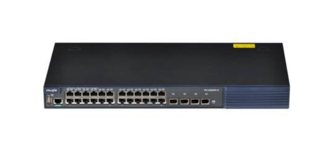
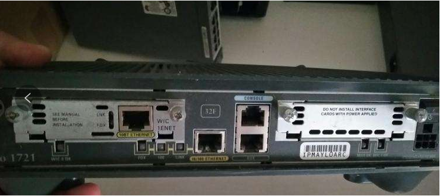
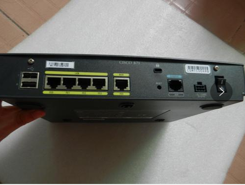
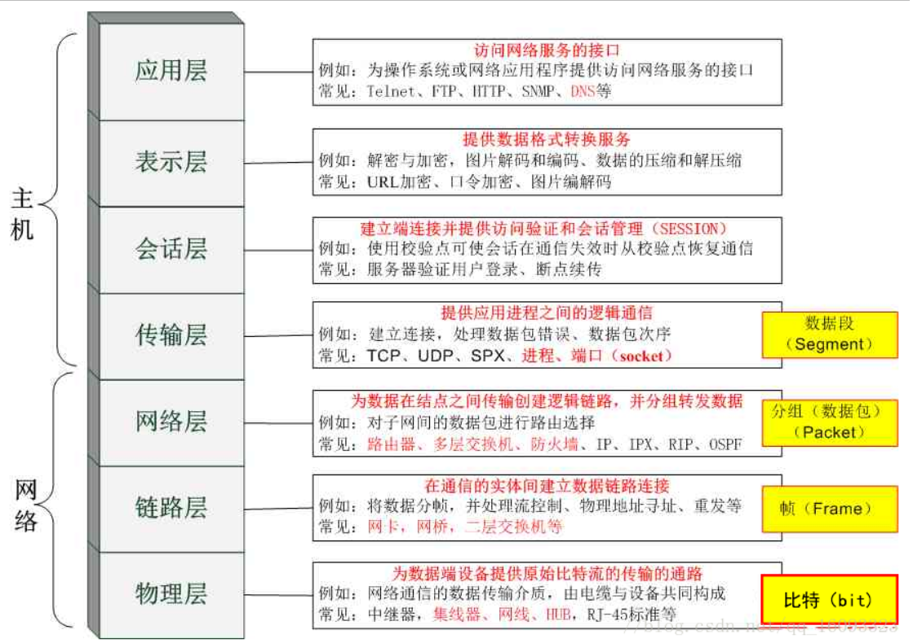
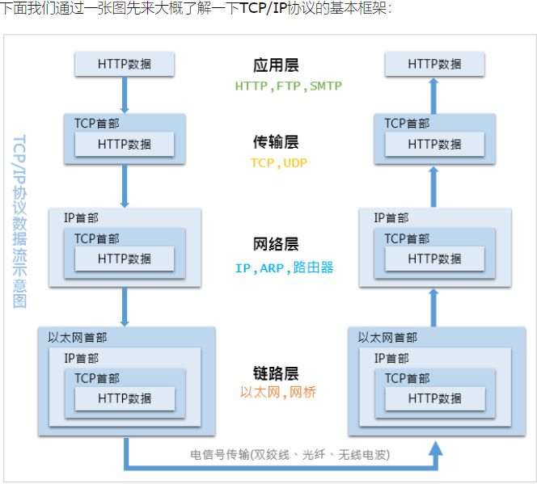

# 走进网络

## 1、认识计算机

```shell
1.计算机网络是由计算机和通讯构成的，网络研究的是“通信”。 ------1946 世界上第一台计算机
2.终端：只有输入和输出功能，没有计算和处理功能。
```

```shell
3.数据：一串数字（二进制数），通常指文字、语音等。
4.通信：将源所产生的数据传递到目的的过程。
5.网络：由两台或者两台以上计算机组成，能够进行信息共享的环境。
6.网络的构成：（计算机、手机、pad、服务器……）、传输介质（网线、光纤、数据线……）、网络设备（交换机、路由器、防火墙）
```

## 2、传输介质

```shell
传输介质包括电缆、双绞线和光纤等。

1.双绞线：有效传输长度100M
线序:
标准568A：绿白绿，橙白蓝，蓝白橙，棕白棕。
标准568B：橙白橙，绿白蓝，蓝白绿，棕白棕。

2.光纤
```

```shell
3.单位换算
带宽：带宽是以比特为单位的 而我们常看到的下载速度显示的几KB是以字节为单位
KB--千字节
B---拜特--byte（字节）
b---比特--bit （位）---> 1比特=1位
1字节(byte)=8比特(bit)
1KB=1024字节(byte)
```

## 3、客户端与服务器端的概念

```shell
客户端: 即表示可以介入互联网的个人终端设备, 比如个人PC机、个人Mac电脑, 操作系统为Windows.
服务端: 即代表在互联网中提供给用户服务的设备, 比如淘宝网、京东网、阿里云等网站或平台.
```

```shell
名词介绍
设备:
二层--数据链路层: 交换机(也有三层交换机)
三层--网络层: 路由器
```

```shell
交换机：
简单的说，交换机就是用来组建一个局域网使用的。交换机的作用是放到路由器后端，来扩展路由器接口不够用而使用的。比如说，有20台电脑需要用网络，而路由器最多的只有8个口，只能接7台电脑，怎么办呢，这就需要交换机来扩展网络接口实现了。
#交换机基本都是24口起步，企业的都是48口起步
```



```shell
路由器：
路由器的工作原理是怎么样的呢？路由器有个路由表，会自己学习、生成、维护路由表。
1，主机A准备发数据给主机B。
2，A将B的IP地址连同数据一起，以数据包形式发送给路由器R1。
3，路由器R1收到数据包后，先从数据中读取到B的IP地址，然后根据路径表计算发往B的最优路径。
4，比如路径为：R1->R2->R5->B；并将数据包发往路由器R2。
5，路由器2重复路由器1的工作，并将数据包转发给路由器5。
6，路由器5同样取出目的地址，发现目的地址就在自己的网段上，于是将该数据包直接交给主机B。
7，主机B收到主机A的信息，一次完整的通信宣告结束。
```





```shell
网关：网络的出口（路由器的ip地址）
```

```shell
*DNS：域名服务器
端口号：1-65535 http---80 https--443 telnet--23 ftp--21、20 ssh--22 mysql--3306 php--9000 tomcat---8080
```

## 4、OSI七层模型

```shell
1981年 IOS (国际化标准组织）提出了--->OSI 七层模型
OSI七层: 物理层、数据链路层、网络层、传输层、会话层、表示层、应用层
```

**特点: 下层只和上层有来往关系, 不可跨层传输**



```shell
应用层：针对应用约定的标准 HTTP（超文本传输协议） Telnet（远程协议）
表示层：约束数据格式，负责格式转化，加密。解密。
会话层：建立、维护、管理（解除）会话。数据的传输通道。
传输层：约定数据采用何种方式进行传递
TCP协议：传输控制协议，实现数据的可靠传输
UDP协议：用户数据报协议，实现数据的快递传输，不可靠
网络层：提供逻辑地址（IP地址，用于在网络中标识每一台设备，作用于网络间的通信，提供路由和选路）
数据链路层：提供MAC（物理）地址，每个MAC地址写在网卡上
物理层：约定接口类型，传输速度
```

## 5、数据包的传输过程

```shell
OSI七层: 物理层、数据链路层、网络层、传输层、会话层、表示层、应用层
```


```shell
ARP协议： 如何获取mac地址：先发送一个ARP请求，发送给每一个主机，这成为广播，给予ARP层回应以单播的形式返回
案例：
小明：我是小明，谁是小红，我的mac地址是sdfsdfs213
arp发送广播：每个人开始拆包，其他人：是找小红的，不是找我的，不管它
小红：拆开一看，是找我的，回复：小明，我是小红，我的mac地址是dfgert213
进行数据传输
```

## 6、TCP/IP:传输控制协议

```shell
TCP\IP模型
应用层：将OSI上三层融合，用于产生需要传递的数据
传输层
网络层
链路层(网络接口层)：将OSI下两层融合
```



```shell
当通过http发起一个请求时，应用层、传输层、网络层和链路层的相关协议依次对该请求进行包装并携带对应的首部，最终在链路层生成以太网数据包，以太网数据包通过物理介质传输给对方主机，对方接收到数据包以后，然后再一层一层采用对应的协议进行拆包，最后把应用层数据交给应用程序处理。

网络通信就好比送快递，商品外面的一层层包裹就是各种协议，协议包含了商品信息、收货地址、收件人、联系方式等，然后还需要配送车、配送站、快递员，商品才能最终到达用户手中。

一般情况下，快递是不能直达的，需要先转发到对应的配送站，然后由配送站再进行派件。

配送车就是物理介质，配送站就是网关， 快递员就是路由器，收货地址就是IP地址，联系方式就是MAC地址。 

快递员负责把包裹转发到各个配送站，配送站根据收获地址里的省市区，确认是否需要继续转发到其他配送站，当包裹到达了目标配送站以后，配送站再根据联系方式找到收件人进行送件。
```

##  7、HTTP协议简介

```shell
超文本传输协议 (HTTP-Hypertext transfer protocol) 是一种详细规定了浏览器和万维网服务器之间互相通 信的规则，通过因特网传送万维网文档的数据传送协议，于1990年提出. 
• 是一个基于TCP/IP通信协议来传递数据，（HTML文件，图片等） 
HTTP是一个属于应用层的协议
```

### 7.1、HTTP协议的主要特点

```shell
1.支持客户/服务器模式 （浏览器/服务器模式） 及c/s模式
2.简单快速：
客户向服务器请求服务时，只需传送请求和路径。通信速度很快。
3.灵活：HTTP允许传输任意类型的数据对象。（文件，视频，会议）
4.无连接：无连接的含义是限制每次连接只处理一个请求。服务器处理完客户的请求，并收到客户的应答后，即断开连接。采用这种方式可以节省传输时间。
```

### 7.2、常见状态代码

```shell
200 OK #客户端请求成功
403 Forbidden #服务器收到请求，但是拒绝提供服务,没有权限
404 Not Found #请求资源不存在，输入了错误的URL，没有找到，路径不对
比如：HTTP/1.1 200 OK
```

### 7.3、UDP协议介绍

```shell
UDP协议简介
UDP是一个无连接的简单的面向数据报的传输层协议。

UDP的特性:
1.面向无连接：不用先与对方建立连接，不握手。因此传输速度很快。
2.不可靠的：没有确认机制，它只是把应用程序传给IP层的数据报发送出去，但是并不能保证它们能到达目的地。
3.UDP传输数据时有大小限制，每个被传输的数据报必须限定在64KB之内
因为它不属于连接型协议，因而具有资源消耗小，处理速度快的优点，所以通常音频、视频和普通数据在传送时使用UDP较多，因为它们即使偶尔丢失一两个数据包，也不会对接收结果产生太大影响。
 
udp一般用于
1. 即时通信:qq聊天 对数据准确性和丢包要求比较低，但速度必须快
2. 在线视频:速度一定要快，保证视频连续，但是偶尔花了一个图像帧，人们还是能接受的
3. 网络语音电话:语音数据包一般比较小，需要高速发送，偶尔断音或串音也没问题
```

**物理地址：mac地址，全球唯一，mac由6段16进制数组成，每段有2个16进制数**

**ARP** 

**arp协议作用** (地址解析协议)  

> ARP地址解析协议用于将网络地址（IP地址32位）转化为物理地址（MAC地址48位）。ARP协议是属于"数据链路层 or 网络层"的协议，在以太网中的数据帧从一个主机到达网内的另一台主机是根据48位的以太网地址（硬件地址）来确定接口的，而不是根据32位的IP地址。内核（如驱动）必须知道目的端的硬件地址才能发送数据

**ICMP**

> ICMP是（Internet Control Message Protocol）Internet控制报文协议。它是TCP/IP协议族的一个子协议，用于在IP主机、路由器之间传递控制消息。控制消息是指网络通不通、主机是否可达、路由是否可用等网络本身的消息。
