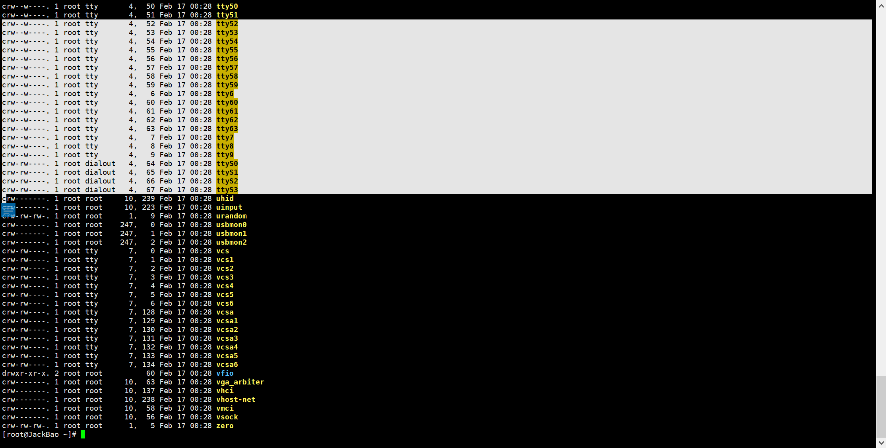

# 一、linux文件管理

## 1、快捷键

> ```
> 编辑命令：
> Ctrl + a  ：移到命令行首
> Ctrl + e  ：移到命令行尾
> Ctrl + u  ：从光标处删除至命令行首
> Ctrl + k  ：从光标处删除至命令行尾
> Ctrl + w ：从光标处删除至字首
> 
> 
> 重新执行命令：
> 
> ESC + .：打印之前执行过的命令的最后一部分  以空格为分隔符
> 
> 控制命令：
> Ctrl + l：清屏
> Ctrl + c：终止命令
> 
> Tab键: 自动补全
> ```

## 2、Linux目录结构

`在linux系统中一切皆文件`

不同目录下的数据可以跨越不同的磁盘分区或不同的磁盘设备，设备可以任意挂载到任意目录上使用。Linux目录和设备是分离的，我们希望那个目录和哪个建立联系。

### 2.1、WINDOWS/LINUX 对比

Windows: 以多根的方式组织文件 C:\ D:\ E:\

Linux: 以单根的方式组织文件"/"

### 2.2、简介

```shell
/目录结构：
FSH (Filesystem Hierarchy Standard):标准的目录结构
[root@linux-server ~]# ls /
bin   dev  home  lib64  mnt  proc  run   srv  tmp  var
boot  etc  lib   media  opt  root  sbin  sys  usr
```

###  2.3、图示


### 2.4、目录功能

```shell
bin 普通用户使用的命令 /bin/ls, /bin/date
sbin 管理员使用的命令 /sbin/service 
案例：
[root@linux-server ~]# which ls
[root@linux-server ~]# which useradd
/usr/sbin/useradd

dev 设备文件 /dev/sda,/dev/sda1
[root@linux-server ~]# ll /dev/sd*
brw-rw----. 1 root disk 8, 0 Oct 31 14:16 /dev/sda
brw-rw----. 1 root disk 8, 1 Oct 31 14:16 /dev/sda1
brw-rw----. 1 root disk 8, 2 Oct 31 14:16 /dev/sda2
[root@linux-server ~]# tty
/dev/pts/0  #这是我们的终端。

/root  #root用户的家目录
/home  #存储普通用户家目录 
lost+found 这个目录平时是空的，存储系统非正常关机而留下“无家可归”
的文件
/usr         #系统文件，相当于C:\Windows
/usr/local   #软件安装的目录，相当于C:\Program
/usr/bin  	#普通用户使用的应用程序
/usr/sbin 	#管理员使用的应用程序
/usr/lib       库文件Glibc 32bit
/usr/lib64    库文件Glibc 64bit
/boot        存放的系统启动相关的文件，例如kernel
/etc         #配置文件（系统相关如网络/etc/sysconfig/network）
/tmp         临时文件(系统：程序产生的临时文件)
/opt		 空目录

/var  #存放的是一些变化文件，比如数据库，日志，邮件....
/proc  虚拟文件系统，系统程序文件所处目录 。虚拟文件系统：只要关机就会没有。
==设备（主要指存储设备）挂载目录==
/mnt   #系统提供这个目录是让用户临时挂载其他的文件系统
```

### 2.5、路径详解

```shell
所谓路径即目录组成结构
一个linux路径由"/"和目录(文件)名称两部分组成
比如：/etc/passwd
    如果"/"出现在路径开头,则其表示根目录，在路径中间出现"/"，其含义是某一个目录下，那么上面所示路径的意思就是"根目录下的etc目录下的passwd文件"
    如果路径最后出现"/",则表示这是一个目录
```

### 2.6、路径分类

```shell
绝对路径：从根开始的路径是绝对路径。案例：/home/alice/file1  /etc/grub.conf
相对路径：凡是非根开始的路径 比如：etc  var/ftp/pub ./test.sh

使用pwd命令查看当前所在的绝对路径：
比如:
[root@Asuka etc]# pwd
/etc
```

### 2.7、绝对路径实例

```shell
[root@linux-server ~]# touch /opt/file1
```

### 2.8、相对路径示例

```shell
[root@linux-server ~]# pwd
/root
[root@linux-server ~]# mkdir abc  #创建目录
[root@linux-server ~]# touch abc/file3
```

## 3、文件管理

###  3.1、文件类型（理解即可）

#### 3.1.1、文件类型


查看文件属性

```bash
[root@GeekyJack ~]# ls -li
```


Linux下面不根据扩展名确定类型，但是依然会有扩展名，为了给人看。一眼看清楚。
系统不识别扩展名，
那么系统怎么确定文件类型呢？

ls -li 第2列，首字符代表文件类型

-普通文件 .doc word文档 .mp4  .avi 视频.ppt .md .txt 
d 目录 directory
l 软链接文件 link
c 字符设备
b 块设备
s socket文件

-普通文件 
白色

d 目录 directory 
浅蓝色

l 软链接文件 link 快捷方式

```bash
[root@GeekyJack ~]# ls  -l /bin
lrwxrwxrwx. 1 root root 7 5月   7 09:21 /bin -> usr/bin
```

创建快捷方式


c 字符设备



b 块设备


s socket文件，进程通信才会用到


#### 3.1.2、查看文件类型file

```bash
[root@GeekyJack ~]# file /etc/hosts
/etc/hosts: ASCII text
[root@GeekyJack ~]# file /bin/ls
/bin/ls: ELF 64-bit LSB executable, x86-64, version 1 (SYSV), dynamically linked (uses shared libs), for GNU/Linux 2.6.32, BuildID[sha1]=aaf05615b6c91d3cbb076af81aeff531c5d7dfd9, stripped
[root@GeekyJack ~]# file /var/log/wtmp 
/var/log/wtmp: data
```

### 3.2、文件管理命令

#### 3.2.1、切换目录---cd

```shell
# .     表示当前目录
# cd .. 回到上一级目录等同于相对路径
# cd 或者 cd ~	直接回到家目录
# cd /home/alice  切换目录=绝对路径
# cd -  回到原来目录
```

#### 3.2.2、创建文件

```shell
[root@linux-server ~]# touch file1.txt  //无则创建，如果存在修改时间
[root@linux-server ~]# touch /home/file10.txt
[root@linux-server ~]# touch /home/{zhuzhu,gougou} //{}集合
[root@linux-server ~]# touch /home/file{1..20}  //批量创建
```

```shell
echo  加内容   >  加文件名    #覆盖:把之前的内容替换掉
# echo 123 > a.txt
GeekyJack  加内容  >> 加文件名     #追加:保留之前的内容,在后面添加新内容
# echo 345345 >> a.txt

当使用echo 123 >> a.txt 这个命令的时候在文件不存在的时候会创建该文件并将内容追加到改文件中
```

#### 3.2.3、创建目录

语法：mkdir    -v 详细 -p 递归 目录 

```shell
# mkdir dir1
创建两个目录：
# mkdir /home/dir2 /home/dir3
# mkdir /home/{dir4,dir5} 
# mkdir -v /home/{dir6,dir7}   #-v ：verbose 冗长的。显示创建时的详细信息
# mkdir -p /home/dir8/111/222  #-p 创建连级目录，一级一级的创建
```

##### 复制

==复制 cp -r 目录 -v 详细 -f 强制   -n  静默

Usage: cp [OPTION]... [-T] SOURCE DEST

```shell
# mkdir /home/dir{1,2}  #创建目录
# cp -v anaconda-ks.cfg /home/dir1/  #-v 显示详细信息
# cp anaconda-ks.cfg /home/dir1/test.txt  #复制并改文件名
# cp -r /etc /home/dir1             #-r 拷贝目录使用，连同目录里面的文件一块拷贝

语法: cp  -r  源文件1 源文件2 源文件N  目标目录    #将多个文件拷贝到同一个目录
# cp -r /etc/sysconfig/network-scripts/ifcfg-ens33 /etc/passwd /etc/hosts .
# cp -r /etc /tmp
```

##### 移动

1.创建一个新文件file1

```shell
[root@linux-server ~]# touch /root/file1
```

2.把file1文件移动到/tmp目录中。

```shell
[root@linux-server ~]# mv /root/file1 /tmp/
[root@linux-server ~]# ls /tmp/file1 
/tmp/file1
```

3.把file1文件更名为file2

```shell
[root@linux-server ~]# mv /tmp/file1 /tmp/file2
```

4.观察file1文件已经更名为file2

```shell
[root@linux-server ~]# cd /tmp/
[root@linux-server tmp]# ls
file2
```

##### 删除

==删除 rm   -r 递归删除目录 -f force强制 -v 详细过程     *通配符

实例1：删除/home/dir1 

```shell
# cd /home/
# rm -rf dir1/

-r 递归，删除目录时
-f force强制
-v 详细过程
```

示例

```shell
[root@linux-server ~]# mkdir /home/dir10
[root@linux-server ~]# touch /home/dir10/{file2,file3,.file4}
[root@linux-server ~]# rm -rf /home/dir10/*  //不包括隐藏文件
[root@linux-server ~]# ls /home/dir10/ -a 
.  ..  .file4
```

```shell
[root@linux-server ~]# touch {1..10}.txt
[root@linux-server ~]# touch file{1..20}.txt  #创建file1-10的txt文件
[root@linux-server ~]# rm -rf file1*
```

#### 3.2.4、查看文件内容

##### cat---查看一个文件的全部内容

```shell
[root@linux-server ~]# cat /etc/passwd
root:x:0:0:root:/root:/bin/bash
bin:x:1:1:bin:/bin:/sbin/nologin
daemon:x:2:2:daemon:/sbin:/sbin/nologin
adm:x:3:4:adm:/var/adm:/sbin/nologin
...

参数：
-n 显示行号
-A 包括控制字符（换行符/制表符）
```

##### head头部

```shell
#head 头 查看文件头部，默认头10行
-n数字 显示n行，缩写-数字
[root@linux-server ~]# head /etc/passwd  //默查看前十行
[root@linux-server ~]# head -2 /etc/passwd  //默认查看前两行
```

##### tail尾部

```shell
#tail 尾 查看文件尾部，默认10行
-n数字 显示n行，缩写-数字
[root@linux-server ~]# tail /etc/passwd //默认查看文件的后十行
[root@linux-server ~]# tail -1 /etc/passwd  //查看文件最后一行
[root@linux-server ~]# tail /var/log/messages
[root@linux-server ~]# tail -f /var/log/secure  //-f 动态查看文件的尾部
[root@linux-server ~]# tailf /var/log/secure  //功能同上
```

##### less --分页显示

```shell
[root@linux-server ~]# less /etc/makedumpfile.conf.sample
1.空格键是翻页  回车键是翻行
2.上下箭头可以来回翻
3. /关键字     #搜索 (n按关键字往下翻   N按关键字往上翻)
4.快捷键:q -quit 退出
```

##### more  --分页显示文件内容

```shell
[root@Asuka.com ~]# more  文件名       
空格键是翻页  回车键是翻行
```

#### 3.2.5、echo打印内容输出内容

```bash
-n 不换行
-e 支持转义字符
    \n 换行
	\t tab
```

-n实践：

```bash
[root@GeekyJack ~]# echo "GeekyJack";echo Asuka
GeekyJack
Asuka
[root@GeekyJack ~]# echo -n "GeekyJack";echo Asuka
GeekyJackAsuka
```

-e实践

```bash
[root@GeekyJack ~]# echo  "GeekyJack\nAsuka"
GeekyJack\nAsuka
[root@GeekyJack ~]# echo -e "GeekyJack\nAsuka"
GeekyJack
Asuka
[root@GeekyJack ~]# echo -e "GeekyJack\tAsuka"
GeekyJack	Asuka
```

#### 3.2.6、grep过滤关键字

`grep 针对文件内容进行过滤`

```bash
#过滤出不含有root字符串的行-v 取反
[root@JackBao ~]# grep -v root jack.txt 
```

```bash
#过滤出含有root字符串（含大写）的行-i 不区分大小写
[root@jack ~]# grep -i root jack.txt 
```

```bash
#同时过滤含有Asuka和root的行。-E 同时过滤多个字符串
[root@jack ~]# grep -E "Asuka|root" jack.txt 
```

```bash
#grep -E = egrep(功能是一样的)扩展的grep,egrep

#了解参数-o 只输出匹配的内容
[root@JackBao ~]# grep -o root jack.txt 
root
root
root
root
```

```bash
#-n 过滤出的内容，在文件中的行号
[root@JackBao ~]# grep -n root jack.txt 
1:root:x:0:0:root:/root:/bin/bash
10:operator:x:11:0:operator:/root:/sbin/nologin
[root@JackBao ~]# 
```

```bash
#-w 按单词过滤jack和jack123不是一个东西了，jack123不会被过滤出来。
[root@jack ~]# grep -w jack jack.txt 
jack:x:1000:1000:jack:/home/jack:/bin/bash
489 I am jack.I am 30
490 I am jack.I am 30
```

```shell
过滤文件中带有root的内容：
[root@linux-server ~]# grep 'root' /etc/passwd
过滤以root开头的行：^ --以什么开头
[root@linux-server ~]# grep '^root' /etc/passwd
过滤以bash结尾的行：$ --以什么结尾
[root@linux-server ~]# grep 'bash$' /etc/passwd
```

#### 3.2.7、seq输出数字序列

```bash
[root@GeekyJack ~]# seq 5
1
2
3
4
5
输出2-5
[root@GeekyJack ~]# seq 2 5
2
3
4
5
步长2，从2到10
[root@GeekyJack ~]# seq 2 2 10
2
4
6
8
10
```

-s 指定空格为分隔符

```bash
[root@GeekyJack ~]# seq -s " " 5
1 2 3 4 5
```

-w 补齐位数

```bash
[root@GeekyJack ~]# seq -w -s " " 10
01 02 03 04 05 06 07 08 09 10
```

#### 3.2.8、uniq去重

```bash
uniq test.txt    #相邻的相同行去重。
uniq -c test.txt #相邻的相同行去重并且计数。
```

#### 3.2.9、sort排序

```bash
[root@GeekyJack ~]# sort test.txt >u.txt  #按数字顺序排序。
[root@GeekyJack ~]# uniq -c u.txt #整个文件实现了去重并且计数。
```

```bash
sort参数：
-n  按数字排序
-t  指定分隔符
-k  指定列  
-r  倒序
```

```bash
[root@GeekyJack ~]# sort -n -t. -k4 test.txt 
10.0.0.1
10.0.0.1
10.0.0.1
10.0.0.2
10.0.0.2
10.0.0.8
10.0.0.11
10.0.0.16
10.0.0.16
10.0.0.16
10.0.0.16
10.0.0.16
10.0.0.16
10.0.0.17
10.0.0.20
10.0.0.35
10.0.0.35
10.0.0.35
10.0.0.35
```

```bash
[root@GeekyJack ~]# sort -rn -t. -k4 test.txt 
#-t. 以.为分隔符
#-k4 取第4列（需要排序的数字列）
#-nr 数字，倒序排列。
10.0.0.35
10.0.0.35
10.0.0.35
10.0.0.35
10.0.0.20
10.0.0.17
10.0.0.16
10.0.0.16
10.0.0.16
10.0.0.16
10.0.0.16
10.0.0.16
10.0.0.11
10.0.0.8
10.0.0.2
10.0.0.2
10.0.0.1
10.0.0.1
10.0.0.1
```

```bash
用管道处理上述ip排序问题
[root@GeekyJack ~]# sort test.txt|uniq -c|sort -rn
      6 10.0.0.16
      4 10.0.0.35
      3 10.0.0.1
      2 10.0.0.2
      1 10.0.0.8
      1 10.0.0.20
      1 10.0.0.17
      1 10.0.0.11
```

# 二、文件编辑器

## 1、打开文件

```shell
[root@Asuka.com ~]# vim   文件名
```

## 2、工作模式

### 2.1、vi与vim的三个模式


### 2.2、进入编辑模式

```shell
i    #在光标所在处进入编辑模式
a    #在当前光标后面进入编辑模式
A    #在行尾进入编辑模式
o    #在光标的下一行进入编辑模式
大O  #在光标的上一行进入编辑模式
 
# 从编辑模式进入命令模式:ESC
```

#### 2.2.1、命令模式

```shell
光标定位键盘：
hjkl		#上下左右
0 $	        #行首行尾
gg	        #页首--文本顶端
G(shift+g)  #页尾--文本底部
3G           #进入第三行
/string     #查找字符，n下一个，N上一个    (n N 可以循环的)
```

#### 2.2.2、文本编辑

```shell
 yy      #复制 
 3yy     #从光标开始复制3行。在最后粘贴
 ygg     #从当前光标复制到页首
 yG      #从光标开始复制到页尾
 dd      #删除一行
 3dd     #从光标开始删除3行
 dgg     #从光标开始删除到页首 
 dG      #从光标开始删除到页尾
 d^      #删除当前光标之前的内容
 p       #粘贴到本行的下一行
大P      #粘贴到本行的上一行
 x       #删除光标所在的字符
 D       #从光标处删除到行尾
 u       #undo撤销
 r       #可以用来修改一个字符
```

#### 2.2.3、扩展命令（尾行）模式

```shell
 shift+:    #进入尾行模式（扩展命令模式）
 :10    #进入第10行 
 :w     #保存 
 :q     #退出 
 :wq    #保存并退出 
 :q!    #不保存并退出 
 :wq! 强制保存退出
```

#### 2.2.4、进入其他模式

```shell
ctrl+v     #进入可视块模式
shift+v    #进入可视行模式
```

#### 2.2.5、查找替换

```shell
语法----> :范围 s/old/new/选项 
:s/world/nice/         #替换当前光标所在行
:3s/sbin/nice/         #替换指定行
:1,5 s/nologin/soso/   #从1－5行的nologin 替换为soso
:%s/bin/soso/          #替换所有行
:%s/sbin/nice/g        #替换行内所有关键字

注释：%表示替换所有行  g表示行内所有关键字

将文件另存(另存为)
语法----> :w 存储到当前文件
:w /tmp/aaa.txt    #另存为/tmp/aaa.txt 
:1,3 w /tmp/2.txt  #从1-3行的内容另存为/tmp/2.txt
```

#### 2.2.6、设置环境 

```shell
:set nu    #设置行号 
:set list  #显示控制字符
:set nonu  #取消设置行号 
```

# 三、文件基本信息 

## 1、时间类型

```shell
访问时间：atime，查看内容 
修改时间：mtime，修改内容
改变时间：ctime，文件属性，比如权限,mv改名
```

## 2、查询示例

```shell
[root@linux-server ~]# ls -l passwd 
-rw-r--r--. 1 root root 839 Oct 31 21:29 passwd

[root@linux-server ~]# stat passwd 
  File: ‘passwd’
  Size: 839       	Blocks: 8          IO Block: 4096   regular file
Device: fd00h/64768d	Inode: 33583688    Links: 1
Access: (0644/-rw-r--r--)  Uid: (    0/    root)   Gid: (    0/    root)
Context: unconfined_u:object_r:admin_home_t:s0
Access: 2019-10-31 21:29:40.750993492 +0800
Modify: 2019-10-31 21:29:36.449993550 +0800
Change: 2019-10-31 21:29:36.452993550 +0800
 Birth: -
```

ls -l 文件名 仅看的是文件的修改时间

# 四、Linux用户管理

## 1、理解用户和组的意义

> Linux的一大特性：
>
> ​	多用户、多任务。
>
> 所谓多用户多任务就是指可以在同一时间，有多个用户登录同一个系统执行不同的任务而互不影响。
>
>
> 假设现在有三个用户：root、lbb、mvv,三个用户同一时间登录了同一个系统，root去修改配置文件了，lbb去创建目录了，mvv去访问数据库了，每个用户互不干扰的独立执行自己的任务，并且每个用户不能够越线去访问其他用户正在操作的目录或执行其他用户下的任务，由此可见，不同的用户是拥有各自不同的权限的，Linux通过权限的划分和管理来实现多用户、多任务的运行机制。

## 2、Linux中的用户及其角色划分

```shell
账户为分三类：
超级用户（管理员）：享有最高权限，具备系统中的所有权限（一般为root），UID为0
系统用户 :别称“伪用户”，无法登录系统，其主要作用是支撑系统运行，方便系统管理。uid号码小于1000.
普通用户：有权限限制，只能对自己目录下的文件进行操作，可以登录系统。uid 大于1000，登陆shell是bin/bash。
任何一个账户在创建的同时都会在系统里面创建一个同名的组。
```

### 2.1、用户概览

##### 2.2.1、用户/组基本概念

Users and groups

系统上的每个进程（运行的程序）都是作为特定用户运行的

 Every file is owned by a particular user

每个文件是由一个特定的用户拥有

Access to files and directories are restricted by user

访问文件和目录受到用户的限制 

### 2.2、用户管理

##### 2.2.1、用户组

```shell
创建组
[root@linux-server ~]# groupadd hr   //创建一个用户组叫hr
[root@linux-server ~]# groupadd market  //创建一个用户组叫market
[root@linux-server ~]# groupadd net01 -g 2000  //创建组叫net01，并指定gid为2000
[root@linux-server ~]# grep 'net01' /etc/group  //查看/etc/group中组net01信息
net01:x:2000:

修改组
[root@linux-server ~]#groupmod 参数 组名
-g：修改组的gid
-n：修改组名
[root@linux-server ~]#groupmod -g 2000 grp1
[root@linux-server ~]#groupmod -n 新组名 grp1
删除组
[root@linux-server ~]# groupdel net01  #删除组net01
注意：用户的主属组不能删除
```

```shell
/etc/group  ----->查看组的文件
```

##### 2.2.2、/etc/group文件详解

```shell
查看组
[root@linux-server ~]#cat /etc/group
组名:代表组密码:gid:组员
```

### 2.3、用户

```shell
[root@linux-server ~]# useradd user01   //创建用户
```

```shell
/etc/passwd  ---->查看账户是否存在的文件
/home/  ---->用户的家目录，每创建一个用户会在/home目录下面创建对应的家目录
/etc/shadow   --->用户的密码文件
```

/etc/passwd文件详解--案例

此文件里面除了密码字段能删除不能直接修改之外，其他字段全部都能直接修改

```shell
[root@linux-server ~]# cat /etc/passwd
root:x:0:0:root:/root:/bin/bash
bin:x:1:1:bin:/bin:/sbin/nologin
分隔符：:
第一列：用户名
第二列：密码
第三列：用户标识号--->（uid）是一个整数，系统内部用它来标识用户。通常用户标识号的取值范围是0～65535。0是超级用户root的标识号
第四列：gid
第五列：描述信息。
第六列：家目录
第七列：是用户登陆到界面的第一个命令，开启一个shell。登陆shell
```

```shell
1.判断用户是否存在：
[root@linux-server ~]# id user01   //查看用户的uid、gid、和所在组
uid=1001(user01) gid=1003(user01) groups=1003(user01)
                    主属组                    附属组
uid 系统用来识别账户的user identify
gid 系统用来识别组的group identify

2.查看现在所使用的的账户：
[root@linux-server ~]# whoami 查看我现在所使用的账户
```

##### 2.3.1、创建用户（带有选项）

```shell
[root@linux-server ~]# useradd user02 -u 503   //指定uid为503
[root@linux-server ~]# useradd user05 -s /sbin/nologin  //创建用户并指定shell
[root@linux-server ~]# useradd user07 -G it,fd  //创建用户，指定附加组
[root@linux-server ~]# useradd -g 1003 user8 #指定用户的主属组为1003组。   
[root@linux-server ~]# useradd user10 -u 4000 -s /sbin/nologin
```

##### 2.3.2、删除用户

```shell
[root@linux-server ~]# userdel -r user02  //删除用户user2，同时删除用户家目录
```

##### 2.3.3、用户密码

```shell
[root@linux-server ~]# passwd alice  #root用户可以给任何用户设置密码
[root@linux-server ~]# passwd   #root用户给自己设置密码
[root@linux-server ~]# su - alice
[alice@linux-server ~]$ passwd  #普通用户只能给自己修改密码，而且必须提供原密码
```

##### 2.3.4、用户操作

```shell
1.修改用户名：
-l
[root@linux-server ~]# usermod -l NEW_name user8
[root@linux-server ~]# id user8
id: user8：无此用户
2.修改GID：
-g
[root@linux-server ~]# id user10
uid=1000(user10) gid=1000(tom) groups=1000(tom)
[root@linux-server ~]# usermod user10 -g new_gid    #gid需要提前存在
3.修改UID
-u
[root@linux-server ~]# usermod -u new_id jack
[root@linux-server ~]# id jack
uid=1005(jack) gid=1004(jack) groups=1004(jack)
4.修改用户的登录shell
-s
[root@linux-server ~]# usermod -s /sbin/nologin user07   #修改用户的登录shell
```

### 2.4、组成员管理

注意：只针对已存在的用户

```shell
1.给组添加账户
-a
[root@linux-server ~]# gpasswd -a user10 grp2
Adding user user10 to group grp2
2.同时添加多个用户到组
-M:members成员的缩写
[root@linux-server ~]# gpasswd -M tom,alice it
3.从组删除用户
-d
[root@linux-server ~]# gpasswd -d user07 hr
Removing user user07 from group hr
```
