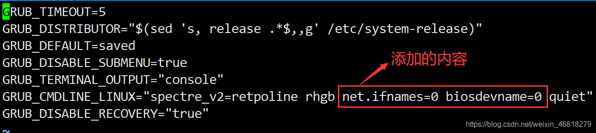

### 前言

- 为什么要修改网卡名称那？？？ 以往的CentOS7以前的系统网卡命名虽然简单方便，但也会带来一些问题，例如，当eth0接口对应的网卡出问题以后，更换掉新网卡后新网卡的名字就可能不是eth0了。而CentOS7使用了新的网卡命名模式，接口名称被自动基于固件，拓扑结构和位置信息来确定。即使添加或移除网络设备，接口名称仍然保持固定，而无需重新枚举，和坏掉的硬件可以无缝替换。
- 虽然新的命名有好处，但是新的接口名称命名方案比传统的eth0相比起来更难使用，出于习惯，把网卡名改为eth0。
   
   

### 1. 修改网卡名称

先切换到network-script： `cd /etc/sysconfig/network-scripts/`
然后将目录中的文件名ifcfg-ens33修改为ifcfg-eth0： `mv ifcfg-ens33 ifcfg-eth0`

### 2. 修改网卡的配置信息

修改ifcfg-eth0文件的内容，`NAME="eth0"`、`NAME="eth0"`，下图所示是修改完之后的内容：

 
 

### 3. 修改并生成grub配置

- 修改grub配置文件： `vim /etc/sysconfig/grub`
  在文件中添加： `net.ifnames=0 biosdevname=0`,具体添加的位置入下图所示：
  
- 生成grub启动菜单
  执行命令： `grub2-mkconfig -o /boot/grub2/grub.cfg`
   
   

### 4. 重启系统

执行重启系统命令： `reboot`
 
 

### 5. 检验是否修改成功

执行命令： `ifconfig`
查看一下自己的网卡名已经改为eth0
