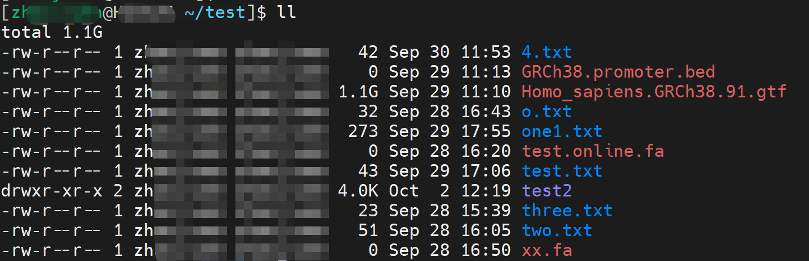
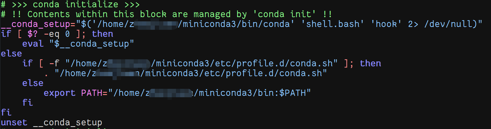
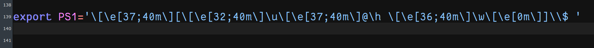
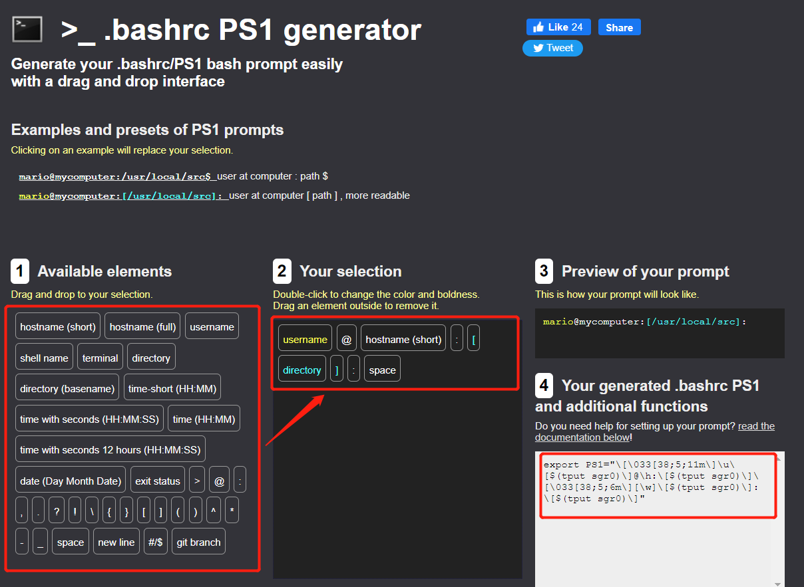

> **内容摘要**：今天偶然出现服务器SSH连接后不显示用户名主机名和目录信息的情况，查询得PS1变量设置有误，根据一篇博客的内容，解决了这个问题，顺便分享一下**个性化设置**的学习笔记。

### **Linux个性化设置**

在Linux用户目录下有一个`.bashrc`的文件，它主要记录 个人用户信息，每次启动时都会自动运行这个程序，个性化设置也随即生效。

#### **.bashrc的用途**

- 设置快捷指令

比如将`alias ll = "ls -lh"`写入bashrc，之后每次输入`ll`时，会自动把该命令等价于`ls -lh`,起到快速查看文件的操作。

- 设置环境变量

`PATH`环境变量的添加与修改可以保存在`.bashrc`中。

- 设置命令提示符

利用`PS1`变量，能够对命令提示符进行设置，比如显示的颜色、顺序、内容等，实现个性化的效果。上图是我目前的设置，显示效果如下：

### **具体操作方法**

`https://bashrcgenerator.com/`
上面这个网站可以定制自己想要的风格，最左侧的标签能拖拽到中间，自定义顺序和内容，右侧为预览和输出，复制输出的内容，添加到自己`.bashrc`的最后一行。

添加完成并保存后，运行下面的代码，即可完成设置。

```
source .bashrc
1
```

每次打开终端后，就会显示自定义的提示符，设置完成。今天分享的内容到此结束，明天见~

> 参考资料
> https://baike.baidu.com/item/.bashrc/14239389?fr=aladdin https://www.cnblogs.com/fengxiaoqiang/p/14089126.html https://blog.csdn.net/Heyyellman/article/details/111565781