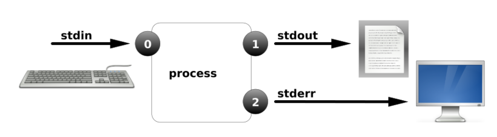
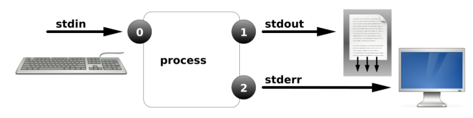
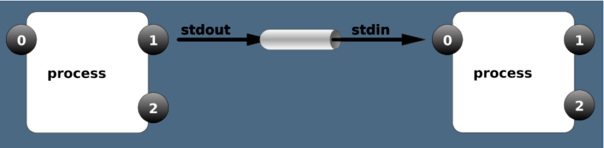

# 管道与重定向

### 1、重定向

```shell
标准输入、标准正确输出、标准错误输出
```

​          

```shell
进程在运行的过程中根据需要会打开多个文件，每打开一个文件会有一个数字标识。这个标识叫文件描述符。
进程使用文件描述符来管理打开的文件（FD----file descriptors）.
文件描述符：每打开一个程序都会有文件描述
```

```shell
0，标准输入(键盘)
1,标准输出
2,标准错误，
3+,进程在执行过程中打开的其他文件。  
&:表示正确错误混合输出
```

### **2、输出重定向 (覆盖，追加)**

```shell
>   ----覆盖
>>  ----追加
正确输出： 1> 1>> 等价于 > >>
错误输出： 2> 2>>
```

#### 2.1、案例1：输出重定向（覆盖）

```shell
[root@Asuka.com ~]# date 1> date.txt  #正确输出--覆盖
# 注意：如果 > 前面什么都不加默认为1，标准正确输出。
```



#### 2.2、案例2：输出重定向（追加）

```shell
[root@Asuka.com ~]# date >> date.txt #正确输出--追加
```



#### 2.3、案例3：错误输出重定向

```shell
[root@Asuka.com ~]# ls /home/  /aaaaaaaaa >list.txt
ls: cannot access /aaaaaaaaa: No such file or directory
[root@Asuka.com ~]# ls /home/  /aaaaaaaaa >list.txt 2>error.txt #重定向到不同的位置
[root@Asuka.com ~]# cat error.txt 
ls: cannot access /aaaaaaaaa: No such file or directory
```

#### 2.4、正确和错误都输入到相同位置

```shell
[root@Asuka.com ~]# ls /home/  /aaaaaaaaa &>list.txt  #混合输出到相同文件
```

#### 2.5、重定向到空设备/dev/null

```shell
[root@Asuka.com ~]# ls /home/  /aaaaaaaaa >list.txt 2>/dev/null #空设备，将错误的输出丢掉
[root@Asuka.com ~]# ls /home/  /aaaaaaaaa &>/dev/null #空设备，将正确与错误的输出丢掉
```

```shell
echo会将输入的内容送往标准输出（打印）
echo 内容 >> 文件名或脚本里面
```

### 3、输入重定向 <

```shell
标准输入： <   等价 0<
```

#### 3.1、案例

```shell
默认情况下，cat 命令会接受标准输入设备（键盘）的输入，并显示到控制台，但如果用文件代替键盘作为输入设备，那么该命令会以指定的文件作为输入设备，并将文件中的内容读取并显示到控制台。

[root@Asuka.com ~]# cat /etc/passwd
root:x:0:0:root:/root:/bin/bash
bin:x:1:1:bin:/bin:/sbin/nologin
...
[root@Asuka.com ~]# cat < /etc/passwd  #输入重定向
root:x:0:0:root:/root:/bin/bash
bin:x:1:1:bin:/bin:/sbin/nologin
...
虽然执行结果相同，但第一行代表是以键盘作为输入设备，而第二行代码是以 /etc/passwd 文件作为输入设备
注意：将/etc/passwd作为cat的输入，读出/etc/passwd的内容
```

#### 3.2、通过输入重定向创建文件

```shell
（cat > file << EOF ）是用来创建文件或者在脚本中使用，并向文件中输入信息输入的任何东西会被写入文件中，EOF命令结束。

语法：cat >> file5 <<EOF  #可以写到脚本或者文件里面
EOF:开始和结束的标记。
成对使用
结尾的另一个必须定格写。
```

**实战案例一：**

```shell
[root@Asuka.com ~]# cat >file4 <<EOF
> 111
> 222
> 333
> 444
> EOF
[root@Asuka.com ~]# cat file4 
111
222
333
444
```

**实战案例二**

利用重定向建立多行的文件  脚本创建多行文件

```shell
[root@Asuka.com ~]# vim create_file.sh
#!/bin/bash
cat >file200.txt <<EOF
111
222
333
yyy
ccc
EOF
[root@Asuka.com ~]# chmod +x create_file.sh 
[root@Asuka.com ~]# ./create_file.sh 
[root@Asuka.com ~]# cat file200.txt 
111
222
333
yyy
ccc
```

### 4、管道 |

```shell
用法：command1 | command2 |command3 |...
```



**实战案例一**

```shell
[root@Asuka.com ~]# ls /etc  |grep 'sys'  #查询目录内符合要求的文件

```

**实战案例二**

将/etc/passwd中的用户按UID大小排序

```shell
[root@Asuka.com ~]# sort -t":" -k3 -n /etc/passwd  #以: 分隔，将第三列按字数升序
[root@Asuka.com ~]# sort -t":" -k3 -n /etc/passwd -r #以: 分隔，将第三列按字数降序
[root@Asuka.com ~]# sort -t":" -k3 -n /etc/passwd |head #以: 分隔，将第三列按字数升序看前十行
[root@Asuka.com ~]# sort -t":" -k3 -n /etc/passwd |tail #以: 分隔，将第三列按字数升序看后十行
参数详解：
sort 排序，默认升序
-t 指定分隔符
-k 指定列
-n 按数值
-r 降序
head 默认输出前十行
tail 默认输出后十行
```

### 5、参数传递：xargs

```shell
对：ls cp rm  管道不能执行。所以通过xargs。
```

```shell
 语法:
 cat a.txt | xargs  -i cp {} /目录  
 {}:前面传过来的内容
 -i ：为了让大括号生效
 目录时  -r
 解释：前面传过来的东西交给大括号
 
 cat file.txt |xargs ls -l          
 前面是目录或者目录的路径。  ls - l  后面可以不加大括号，直接执行。
```

**实战案例一**

```shell
[root@Asuka.com ~]# touch /home/file{1..5}
[root@Asuka.com ~]# vim files.txt
/home/file1
/home/file2
/home/file3 
/home/file4
/home/file5
[root@Asuka.com ~]# cat files.txt |ls -l #不加xargs传参，看输出结果
[root@Asuka.com ~]# cat files.txt |rm -rvf  #不加xargs传参，看输出结果
```

```shell
[root@Asuka.com ~]# cat files.txt |xargs ls -l
-rw-r--rwx. 1 root root 12 Nov  7 21:57 /home/file1
-rw-r--r--. 1 root root  0 Nov  7 21:57 /home/file2
-rw-r--r--. 1 root root  0 Nov  7 21:57 /home/file3
-rw-r--r--. 1 root root  0 Nov  7 21:57 /home/file4
-rw-r--r--. 1 root root  0 Nov  7 21:57 /home/file5
```

```shell
[root@Asuka.com ~]# cat files.txt |xargs rm -rvf
removed ‘/home/file1’
removed ‘/home/file2’
removed ‘/home/file3’
removed ‘/home/file4’
removed ‘/home/file5’
```

**实战案例二**

```shell
[root@Asuka.com ~]# touch /home/file{1..5}
[root@Asuka.com ~]# # cat files.txt | xargs -i cp -rvf {} /tmp/
‘/home/file1’ -> ‘/tmp/file1’
‘/home/file2’ -> ‘/tmp/file2’
‘/home/file3’ -> ‘/tmp/file3’
‘/home/file4’ -> ‘/tmp/file4’
‘/home/file5’ -> ‘/tmp/file5’
```

### 6、扩展

#### 6.1、什么是CC攻击？

```shell
攻击者借助代理服务器生成指向受害主机的合法请求，实现DDOS和伪装就叫：CC(ChallengeCollapsar)。
CC主要是用来攻击页面的。大家都有这样的经历，就是在访问论坛时，如果这个论坛比较大，访问的人比较多，打开页面的速度会比较慢，
访问的人越多，论坛的页面越多，数据库压力就越大，被访问的频率也越高，占用的系统资源也就相当可观。
```

#### 6.2如何防御CC攻击

```shell
1.开启防火墙，过滤掉访问次数多的IP地址
2.拒绝代理服务器访问你服务器
怎么拒绝代理服务器访问呢？
代理服务器有固定的IP地址，将这些IP地址都加到防火墙下，全部drop掉
```

#### 6.3CC攻击危害是什么？

```shell
大量的流量不断冲击你的服务器，会让你的服务器负载及压力越来越大，直到服务器崩溃宕机
```

#### 6.4、什么是DOS攻击

```shell
DoS是Denial of Service的简称，即拒绝服务，造成DoS的攻击行为被称为DoS攻击，其目的是使计算机或网络无法
提供正常的服务。最常见的DoS攻击有计算机网络带宽攻击和连通性攻击。
```

