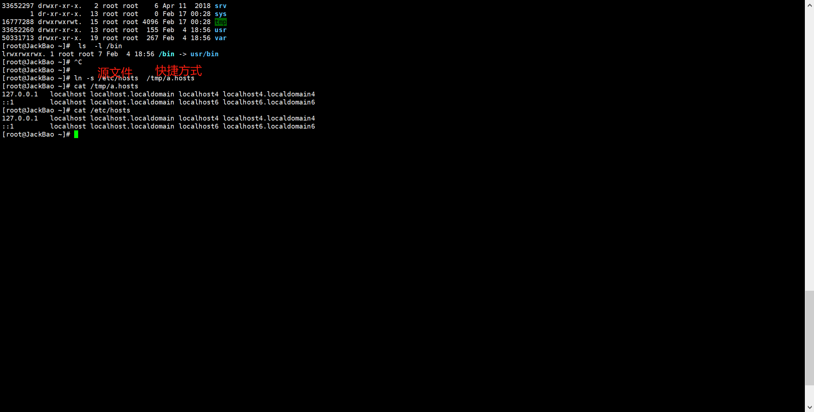
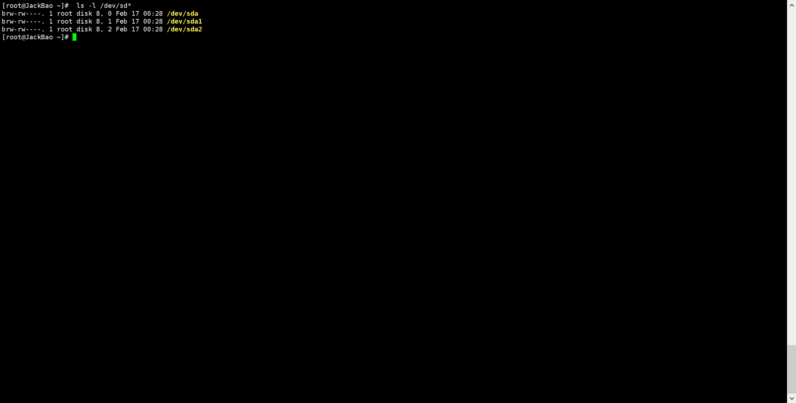

文件：大小、用户 组 权限 创建时间


查看文件属性：

```
[root@oldboy ~]# ls -li
```


Linux下面不根据扩展名确定类型，但是依然会有扩展名，为了给人看。一眼看清楚。
系统不识别扩展名，
那么系统怎么确定文件类型呢？

ls -li 第2列，首字符代表文件类型
一切皆文件。

-普通文件 .doc word文档 .mp4  .avi 视频.ppt .md .txt 
d 目录 directory
l 软链接文件 link
c 字符设备
b 块设备
s socket文件

-普通文件 
白色

d 目录 directory 
浅蓝色

l 软链接文件 link 快捷方式

```
[root@oldboy ~]# ls  -l /bin
lrwxrwxrwx. 1 root root 7 5月   7 09:21 /bin -> usr/bin
```

创建快捷方式



c 字符设备


b 块设备



s socket文件，进程通信才会用到


查看文件类型：file

```bash
[root@oldboy ~]# file /etc/hosts
/etc/hosts: ASCII text
[root@oldboy ~]# file /bin/ls
/bin/ls: ELF 64-bit LSB executable, x86-64, version 1 (SYSV), dynamically linked (uses shared libs), for GNU/Linux 2.6.32, BuildID[sha1]=aaf05615b6c91d3cbb076af81aeff531c5d7dfd9, stripped
[root@oldboy ~]# file /var/log/wtmp 
/var/log/wtmp: data
```

wc 查看行数，字符数等

-l查看行数
-L查看字符数
实践：
[root@oldboy ~]# wc -l /etc/hosts
5 /etc/hosts

[root@oldboy ~]# echo oldboy|wc -L
6

查找命令：
1）which 查看二进制命令所在路径（从PATH环境变量路径里查找）
[root@oldboy ~]# which ls
alias ls='ls --color=auto'
	/usr/bin/ls
[root@oldboy ~]# which cp
alias cp='cp -i'
	/usr/bin/cp

特殊注意：
[root@oldboy ~]# echo $PATH
/usr/local/sbin:/usr/local/bin:/usr/sbin:/usr/bin:/root/bin
1)分隔符为冒号：
2）路径都是命令。


2）whereis 查看文件及文件的帮助等的路径
-b  查看二进制命令所在路径 which
[root@oldboy ~]# whereis -b ls
ls: /usr/bin/ls
[root@oldboy ~]# whereis ls
ls: /usr/bin/ls /usr/share/man/man1/ls.1.gz

3）locate 查找文件及相关内容（内置数据库，通过updatedb）（不需要了解）
yum install mlocate -y 
locate

4）find 查找 *****
-name 按名字查找
find 路径  选项1 【参数1】 选项2 【参数2】 

（1）按名字查找：
[root@oldboy ~]# find / -name "hosts"
/etc/hosts
/tmp/hosts
/tmp/etc/hosts
/home/oldboy/hosts
/opt/etc/hosts

按名字模糊查找 *表示所有
[root@oldboy ~]# find / -name "ho*ts"

（2）按类型查找
-type 
f d l c b s
去哪看？ man find  搜/-type
-type c
  File is of type c:
  b      block (buffered) special
  c      character (unbuffered) special
  d      directory
  f      regular file
  l      symbolic link;
  s      socket

查找目录
[root@oldboy ~]# find /root -type d 
/root
/root/oldboy_dir
/root/oldboy_dir/abc
/root/oldboy_dir/abc/def

查找文件
[root@oldboy ~]# find /root -type f
/root/.bash_logout
/root/.bash_profile

组合查找：find 默认就是取交集（-a）and，并集（-o）or
找女朋友：【高点】 [身材好点] 该有的要有，同时满足：交集
找男朋友：高的，帅的，有钱的
          热爱运动，特长多，热爱生活，渴望爱情，追求精神层次，经济基础，
		  有菜花（写诗、乐器），这样的男生，有没有女生喜欢？

例：查文件类型为文件，并且名字为hosts
find / -name "hosts" -a -type f
[root@oldboy ~]# find / -name "hosts" -a -type f
/etc/hosts
/tmp/hosts
/tmp/etc/hosts
/home/oldboy/hosts
/opt/etc/hosts

[root@oldboy ~]# find / -name "hosts" -type f
/etc/hosts
/tmp/hosts
/tmp/etc/hosts
/home/oldboy/hosts

并集：查找名为hosts，或者类型为d
[root@oldboy ~]# find / -name "hosts" -o -type d -name "oldboy"
/etc/hosts
/tmp/hosts
/tmp/etc/hosts
/home/oldboy
/home/oldboy/hosts
/opt/etc/hosts

取反：!查找名字不是file1
[root@oldboy ~]# mkdir /data -p
[root@oldboy ~]# touch /data/file{1..3}
[root@oldboy ~]# find /data -name "file1"
/data/file1
[root@oldboy ~]# find /data ! -name "file1"
/data
/data/file2
/data/file3

（3）按大小查找
-size +1M #大于1M  
-size  1M #1M  
-size -1M #小于1M  
其他单位k G


