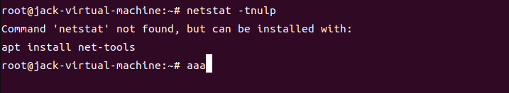

> 在Ubuntu系统中，如果尝试运行一个命令但系统提示该命令未找到，并给出了安装建议，你可以按照建议进行安装。在你提供的屏幕截图中，系统提示了`netstat`命令未找到，并建议使用以下命令安装所需的包：

```bash
bashCopy code
apt install net-tools
```

> 要解决这个问题，请打开你的终端，然后输入上面的命令并执行。你可能需要先运行`sudo`以获得必要的权限。完整的命令如下：

```bash
bashCopy code
sudo apt install net-tools
```

> 这将安装`net-tools`包，其中包含`netstat`命令。安装完成后，你应该能够使用`netstat -tunlp`命令来查看网络连接、监听端口等信息。如果你是root用户（如截图中所示），则不需要`sudo`。

> ubuntu如何开启ssh连接的22号端口

> 在Ubuntu系统上开启SSH连接的22号端口，你需要确保已经安装了`openssh-server`。以下是开启SSH服务并允许22号端口的步骤：

1. > **安装SSH Server**: 如果还没有安装SSH服务，你可以通过运行以下命令来安装它：

   ```bash
   bashCopy codesudo apt update
   sudo apt install openssh-server
   ```

2. > **检查SSH服务状态**: 安装完成后，你可以检查SSH服务的状态来确认它是否正在运行：

   ```bash
   bashCopy code
   sudo systemctl status ssh
   ```

   > 如果服务没有运行，你可以使用以下命令启动它：

   ```bash
   bashCopy code
   sudo systemctl start ssh
   ```

3. > **允许22号端口通过防火墙**: 如果你的系统使用UFW防火墙，确保允许22号端口。运行以下命令来允许SSH连接：

   ```bash
   bashCopy code
   sudo ufw allow ssh
   ```

   > 或者，直接指定端口：

   ```bash
   bashCopy code
   sudo ufw allow 22/tcp
   ```

   > 然后，启用或重新加载UFW防火墙：

   ```bash
   bashCopy codesudo ufw enable
   sudo ufw reload
   ```

4. > **配置SSH服务** (可选): 如果你需要更改SSH服务的默认设置（例如更改默认端口或配置其他安全选项），你可以编辑配置文件：

   ```bash
   bashCopy code
   sudo nano /etc/ssh/sshd_config
   ```

   > 在这个文件中，找到“Port 22”行，并确认它没有被注释掉。如果你想要更改端口，也可以在这里进行设置。完成编辑后，保存并关闭文件，然后重启SSH服务：

   ```bash
   bashCopy code
   sudo systemctl restart ssh
   ```

5. > **连接到SSH**: 一旦SSH服务运行并且防火墙规则已经设置，你可以从任何支持SSH的客户端使用以下命令连接到你的Ubuntu系统：

   ```bash
   bashCopy code
   ssh username@your-ubuntu-server-ip
   ```

   > 其中`username`是你Ubuntu系统上的用户账号，`your-ubuntu-server-ip`是你Ubuntu服务器的IP地址。

> 确保在进行这些操作时，你有相应的权限，如果是服务器环境，请遵循任何现有的安全策略和最佳实践。

### ubuntu如何安装rz、sz上传下载功能？

> 在Ubuntu系统中，`rz` 和 `sz` 命令通常由 `lrzsz` 软件包提供，这是一个用于 UNIX 系统的实现 zmodem/xmodem/ymodem 文件传输协议的程序。你可以通过以下步骤来安装它：

1. > 打开一个终端窗口。

2. > 更新你的包管理器的软件包列表，以确保你能够安装最新版本的软件包。可以通过以下命令做到这一点：

   ```bash
   bashCopy code
   sudo apt update
   ```

3. > 安装 `lrzsz` 包：

   ```bash
   bashCopy code
   sudo apt install lrzsz
   ```

> 这将会安装 `rz` 和 `sz` 命令。一旦安装成功，你可以使用 `rz` 命令来接收（下载）文件，使用 `sz` 命令来发送（上传）文件。

> 使用 `rz` 和 `sz` 命令通常需要一个支持 ZMODEM 协议的终端程序，如 SecureCRT、PuTTY 或者是 minicom。

> 例如，在使用 SecureCRT 或者 PuTTY 连接到你的 Ubuntu 服务器后，如果你想上传文件到服务器，你可以在终端中输入 `rz` 命令然后按 Enter，然后在弹出的文件选择对话框中选择要上传的文件。

> 如果你想从服务器下载文件到本地机器，你可以使用 `sz` 命令加上文件名，如 `sz filename`，然后在支持的终端程序中接收文件。