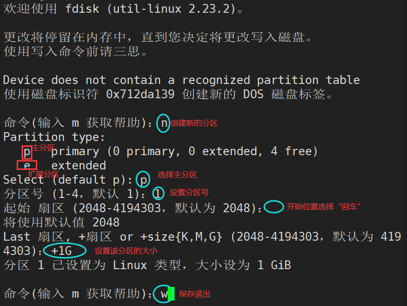
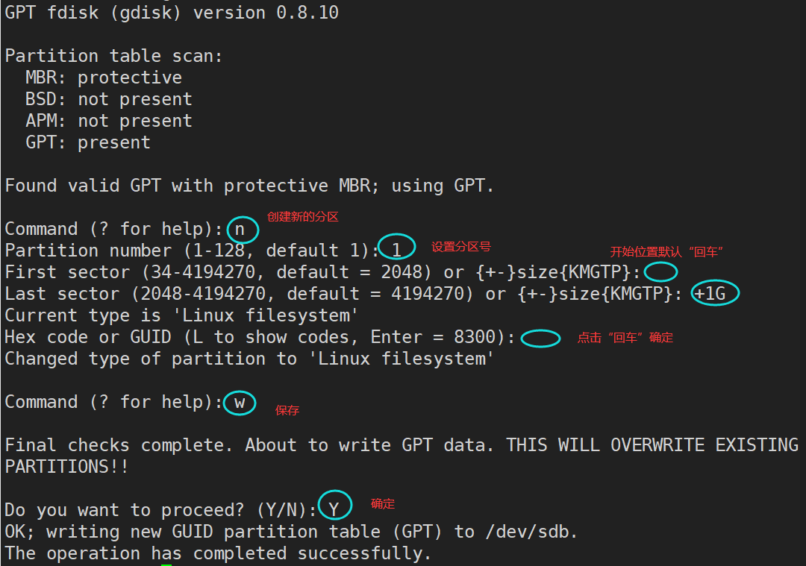
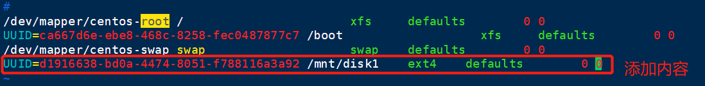

# 一、存储管理

`存储管理`

主要知识点:  基本分区、逻辑卷LVM、EXT3/4/XFS文件系统、RAID

## 1、初识硬盘

```shell
机械 HDD
固态 SSD
```

## 2、SSD的优势

```shell
SSD采用电子存储介质进行数据存储和读取的一种技术，突破了传统机械硬盘的性能瓶颈， 拥有极高的存储性能，被认为是存储技术发展的未来新星。
```

`与传统硬盘相比，SSD固态电子盘具有以下优点`

```shell
第一，SSD不需要机械结构，完全的半导体化，不存在数据查找时间、延迟时间和磁盘寻道时间，数据存取速度快。
第二，SSD全部采用闪存芯片，经久耐用，防震抗摔，即使发生与硬物碰撞，数据丢失的可能性也能够降到最小。　　
第三，得益于无机械部件及闪存芯片，SSD没有任何噪音，功耗低。　
第四，质量轻，比常规1.8英寸硬盘重量轻20-30克，使得便携设备搭载多块SSD成为可能。同时因其完全半导体化
无结构限制，可根据实际情况设计成各种不同接口、形状的特殊电子硬盘。
```

## 3、硬盘设备命名

```shell
物理硬盘：    /dev/sd[a-z]
KVM虚拟化:
/dev/vd[a-z]（半虚拟化驱动）
/dev/sd[a-z]（全虚拟化驱动）
```

## 4、HP服务器硬盘

```shell
/dev/cciss/c0d0p1	    //c0第一个控制器, d0第一块磁盘, p1分区1
/dev/cciss/c0d0p2	    //c0第一个控制器, d0第一块磁盘, p2分区2
```

## 5、从存储连接方式

```shell
本地存储 例如DellR730本地磁盘
外部存储 scsi线 sata线 sas线
网络存储 以太网络(iscsi, glusterFS,ceph) 分布式
```

## 6、从磁盘分区方式区分

```shell
MBR (MSDOS根据分区表来分区的，又叫做主引导扇区) <2TB 
分区工具：fdisk  
一共可以分14个分区（4个主分区，扩展分区，逻辑分区） 例如: 3主 + 1扩展（n逻辑）
MBR 小于2TB的可以。
一块硬盘最多分4个主分区。
1：主分区最多4个(这种前提下，不存在扩展分区，逻辑分区)
2：≤3个主分区时(剩余有空间)，才可以划分扩展分区

```

```shell
GPT >2TB和<2TB
分区工具：gdisk(parted---rhel6)
一共可以分128个主分区
GPT大于小于2TB都可以。
#注意：从MBR转到GPT，或从GPT转换到MBR会导致数据全部丢失！
```

# 二、基本分区

`首先需要先给虚拟机添加磁盘`            

 步骤：分区。格式化。挂载。

```shell
[root@Asuka.com ~]# ll /dev/sd*
brw-rw----. 1 root disk 8,  0 Nov  7 23:15 /dev/sda
brw-rw----. 1 root disk 8,  1 Nov  7 23:15 /dev/sda1
brw-rw----. 1 root disk 8,  2 Nov  7 23:15 /dev/sda2
brw-rw----. 1 root disk 8, 16 Nov  7 23:15 /dev/sdb
brw-rw----. 1 root disk 8, 32 Nov  7 23:15 /dev/sdc
[root@Asuka.com ~]# lsblk  #查看磁盘设备
NAME            MAJ:MIN RM  SIZE RO TYPE MOUNTPOINT
sda               8:0    0   20G  0 disk 
├─sda1            8:1    0    1G  0 part /boot
└─sda2            8:2    0   19G  0 part 
  ├─centos-root 253:0    0   17G  0 lvm  /
  └─centos-swap 253:1    0    2G  0 lvm  [SWAP]
sdb               8:16   0   10G  0 disk 
sdc               8:32   0    8G  0 disk 
```

## 1、fdisk

MBR   14个分区（4个主分区，扩展分区，逻辑分区）

```shell
[root@Asuka.com ~]# fdisk -l /dev/sdb #查看磁盘分区信息

```

```shell
[root@Asuka.com ~]# fdisk /dev/sdb
```



```shell
# lsblk 查看分区结果
【如果分区后无法发现分区结果，请刷新分区表后再次查看】
# partprobe /dev/sdb
```

## 2、gdisk

GPT  128个主分区

### 2.1、创建分区

```shell
[root@Asuka.com ~]# yum -y install gdisk  #安装分区工具
[root@Asuka.com ~]# gdisk -l /dev/sdb
[root@Asuka.com ~]# gdisk /dev/sdb
```



### 2.2、创建文件系统（格式化）centos7默认使用xfs

```shell
[root@Asuka.com ~]# mkfs.ext4 /dev/sdb1   #格式化成ext4格式的文件系统
[root@Asuka.com ~]# mkfs.xfs /dev/sdc2   #格式化成xfs格式的文件系统
```

### 2.3、挂载mount使用

```shell
[root@Asuka.com ~]# mkdir /mnt/disk1   #创建挂载目录
[root@Asuka.com ~]# mkdir /mnt/disks   #创建挂载目录
[root@Asuka.com ~]# mount -o rw /dev/sdb1 /mnt/disk1/  #-o 指定读写权限（ro只读，rx读写）
mount参数:
-o 指定读写权限
-a 需要定义(/etc/fstab)执行-a才会自动挂载
[root@Asuka.com ~]# mount /dev/sdc2 /mnt/disks/
```

`查看磁盘挂载与磁盘使用空间`

```shell
[root@Asuka.com ~]# df -Th
Filesystem              Type      Size  Used Avail Use% Mounted on
/dev/mapper/centos-root xfs        17G  1.2G   16G   7% /
devtmpfs                devtmpfs  982M     0  982M   0% /dev
tmpfs                   tmpfs     993M     0  993M   0% /dev/shm
tmpfs                   tmpfs     993M  8.7M  984M   1% /run
tmpfs                   tmpfs     993M     0  993M   0% /sys/fs/cgroup
/dev/sda1               xfs      1014M  125M  890M  13% /boot
tmpfs                   tmpfs     199M     0  199M   0% /run/user/0
/dev/sdb1               ext4      283M  2.1M  262M   1% /mnt/disk1
/dev/sdc2               xfs       197M   11M  187M   6% /mnt/disks
参数解释：
-T  打印文件系统类型
-h 人性化显示，磁盘空间大小
```

`取消挂载`

```shell
[root@Asuka.com ~]# umount /mnt/disks/
[root@Asuka.com ~]# umount -l /mnt/disk1/ #强行卸载，即使目录有资源被进程占用，也可以卸载
```

### 2.4、fstab开机自动挂载

`/etc/fstab文件实现开机的时候自动挂载`

```shell
[root@Asuka.com ~]# blkid /dev/sdb1  #查看uuid和文件系统类型
/dev/sdb1: UUID="d1916638-bd0a-4474-8051-f788116a3a92" TYPE="ext4"
[root@Asuka.com ~]# vim /etc/fstab
参数解释：
第1列:挂载设备
(1)/dev/sda5  
(2)UUID=设备的uuid   rhel6/7的默认写法   同一台机器内唯一的一个设备标识
第2列:挂载点
第3列:文件系统类型
第4列:文件系统属性	
第5列:是否对文件系统进行磁带备份：0 不备份
第6列:是否检查文件系统：0 不检查
```



```shell
[root@Asuka.com ~]# mount -a #自动挂载
```

`案例`

```shell
[root@Asuka.com ~]# vim /etc/fstab
/dev/sdc2       /mnt/disks      xfs     defaults        0 0
[root@Asuka.com ~]# mount -a
```

`/etc/rc.d/rc.local开机自动挂载`

```shell
这个配置文件会在用户登陆之前读取，这个文件中写入了什么命令，在每次系统启动时都会执行一次。也就是说，如果有任何需要在系统启动时运行的工作，则只需写入 /etc/rc.d/rc.local 配置文件即可
```

```shell
[root@Asuka.com ~]# vim /etc/rc.d/rc.local #将挂载命令直接写到文件中
```


```shell
[root@Asuka.com ~]# chmod +x /etc/rc.d/rc.local #添加执行权限
[root@Asuka.com ~]# reboot
```

# 三、文件系统

`文件系统分类`

## 1、分类

```shell
分类：
本地文件系统，不能在网络上用。
ntfs  xfs  ext2，ext3，ext4
网络文件系统，也可以在本地用。
nfs   glusterfs   hdfs   ceph
```

## 2、概念

```shell
作用：
管理文件的一套系统。
文件的编辑，拷贝，粘贴，移动。
inode ：inoed块、i节点--索引节点。专门存储inode信息。里面是文件的属性-也叫元信息，文件名,权限，访问时间
```

## 3、理解inode

> 理解inode，要从文件储存说起。
>
> 文件储存在硬盘上，硬盘的最小存储单位叫做"扇区"（Sector）。每个扇区储存512字节（相当于0.5KB）。
>
> 操作系统读取硬盘的时候，不会一个个扇区地读取，这样效率太低，而是一次性连续读取多个扇区，即一次性读取一个"块"（block）。这种由多个扇区组成的"块"，是文件存取的最小单位。"块"的大小，最常见的是4KB，即连续八个 sector组成一个 block。
>
> 文件数据都储存在"块"中，那么很显然，我们还必须找到一个地方储存文件的元信息，比如文件的创建者、文件的创建日期、文件的大小等等。这种储存文件元信息的区域就叫做inode，中文译名为"索引节点"。索引节点编号；它是文件或目录在磁盘里的唯一标识，linux读取文件首先要读取到这个索引节点。
>
> 每一个文件都有对应的inode，里面包含了与该文件有关的一些信息。

`inode的内容`

> ```bash
> 文件的字节数
> 文件拥有者的User ID
> 文件的Group ID
> 文件的读、写、执行权限
> 文件的时间戳，共有三个：ctime指inode上一次变动的时间，mtime指文件内容上一次变动的时间，atime指文件上一次打开的时间。
> 链接数，即有多少文件名指向这个inode
> 文件数据block的位置
> ```

`查看inode信息`

```shell
[root@Asuka.com ~]# stat /etc/hosts
  File: ‘/etc/hosts’
  Size: 158             Blocks: 8          IO Block: 4096   regular file
Device: fd00h/64768d    Inode: 16778306    Links: 1
Access: (0644/-rw-r--r--)  Uid: (    0/    root)   Gid: (    0/    root)
Access: 2020-07-28 19:11:48.781000069 +0800
Modify: 2013-06-07 22:31:32.000000000 +0800
Change: 2020-07-18 15:37:52.353025437 +0800
 Birth: -
 
[root@Asuka.com ~]# ls -i /etc/hosts  #-i：查看inode号
16778306 /etc/hosts
```

### `EXT`

```shell
EXT 家族支持度最广：
但创建文件系统（格式化）慢！
修复慢！
文件系统存储容量有限！
```

### `XFS`

```shell
XFS 同样是一种日志式文件系統：
高容量，支持大存储
高性能，创建/修复文件系统快
格式化快
inode 与 block 都是系統需要用到時，才动态配置产生
```
