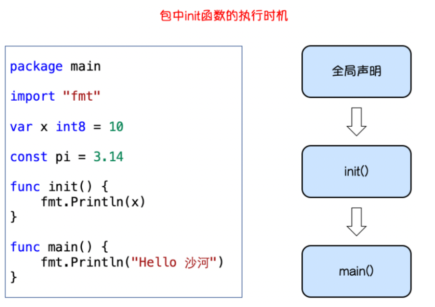

### 1、init函数

> go语言中 init 函数用于包 (package) 的初始化，该函数是go语言的一个重要特性。

> 有下面的特征：

> 1、init函数是用于程序执行前做包的初始化的函数，比如初始化包里的变量等 
>
> 2、每个包可以拥有多个init函数 
>
> 3、包的每个源文件也可以拥有多个init函数
>
> 4、同一个包中多个init函数的执行顺序go语言没有明确的定义(说明) 5、不同包的init函数按照包导入的依赖关系决定该初始化函数的执行顺序 
>
> 6、init函数不能被其他函数调用，而是在main函数执行之前，自动被调用

### 2、main函数

```go
// Go语言程序的默认入口函数(主函数)：func main()
// 函数体用｛｝一对括号包裹
func main(){
//函数体
}
```

### 3、init函数和main函数的异同

> 境不要使用

> 相同点：
>
> 两个函数在定义时不能有任何的参数和返回值，且Go程序自动调用。

> 不同点：
>
> init可以应用于任意包中，且可以重复定义多个。
>
> main函数只能用于main包中，且只能定义一个。

> 两个函数的执行顺序：
>
> 对同一个go文件的 init() 调用顺序是从上到下的。

> 对同一个package中不同文件是按文件名字符串比较“从小到大”顺序调用各文件中的 init() 函数。
>
> 对于不同的 package ，如果不相互依赖的话，按照main包中"先 import 的后调用"的顺序调 用其包中的 init()

> 如果 package 存在依赖，则先调用最早被依赖的 package 中的 init() ，最后调用 main 函数。
>
> 如果 init 函数中使用了 println() 或者 print() 你会发现在执行过程中这两个不会按照你 想象中的顺序执行。
>
> 这两个函数官方只推荐在测试环境中使用，对于正式环

### 4、init()函数介绍

> 在Go语言程序执行时导入包语句会自动触发包内部 init() 函数的调用。 需要注意的是： init() 函数没有参数也没有返回值。 init() 函数在程序运行时自动被调用执行，不能在代码中主动调用它。 包初始化执行的顺序如下图所示：



#### 3.5golang中关键字

> var和const ：变量和常量的声明 
>
> package and import : 导入 
>
> func ： 用于定义函数和方法 
>
> return ：用于从函数返回 
>
> defer someCode ：在函数退出之前执行 
>
> go : 用于并行 select 用于选择不同类型的通讯 
>
> interface 用于定义接口 
>
> struct 用于定义抽象数据类型 
>
> break、case、continue、for、fallthrough、else、if、switch、goto、default 流程控制 
>
> chan 用于channel通讯 
>
> type 用于声明自定义类型 
>
> map 用于声明map类型数据 
>
> range 用于读取slice、map、channel数据

### 3.6、命名规范

> Go是一门区分大小写的语言。命名规则涉及变量、常量、全局函数、结构、接口、方法等的命名。 Go 语言从语法层面进行了以下限定：任何需要对外暴露的名字必须以大写字母开头，不需要对外暴露的则 应该以小写字母开头。当命名（包括常量、变量、类型、函数名、结构字段等等）以一个大写字母开 头，如：Analysize，那么使用这种形式的标识符的对象就可以被外部包的代码所使用（客户端程序需要 先导入这个包），这被称为导出（像面向对象语言中的 public）；命名如果以小写字母开头，则对包外 是不可见的，但是他们在整个包的内部是可见并且可用的（像面向对象语言中的 private ）

> 包名称
>
> 保持package的名字和目录保持一致，尽量采取有意义的包名，简短，有意义，尽量和标准库 不要冲突。包名应该为小写单词，不要使用下划线或者混合大小写。
>
> package domain
>
> package main

> package main
>
> 尽量采取有意义的文件名，简短，有意义，应该为小写单词，使用下划线分隔各个单词。
>
> approve_service.go

> 结构体命名
>
> 采用驼峰命名法，首字母根据访问控制大写或者小写struct 申明和初始化格式采用多行，例如 下面：

```go
type MainConfig struct {
Port string `json:"port"`
Address string `json:"address"`
}
```

> 接口命名命名规则基本和上面的结构体类型单个函数的结构名以 “er” 作为后缀，例如 Reader , Writer 。
>
> 命名以“er”结尾，如：Writer，xxxHandler，Helper，Manager等
>
> 接口方法声明 = 方法名+方法签名如：methodA （param1, param2）outputTypeList

```go
type Reader interface {
Read(p []byte) (n int, err error)
}
```

> 变量命名 
>
> 和结构体类似，变量名称一般遵循驼峰法，首字母根据访问控制原则大写或者小写 
>
> 但遇到特有名词时，需要遵循以下规则：如果变量为私有，且特有名词为首个单词，则使用小 写 
>
> 如 appService若变量类型为 bool 类型，则名称应以 Has, Is, Can 或 Allow 开头

```go
var isExist bool
var hasConflict bool
var canManage bool
var allowGitHook bool
```

常量命名常量均需使用全部大写字母组成，并使用下划线分词

const APP_URL = "https://www.baidu.com"

如果是枚举类型的常量，需要先创建相应类型：

```go
type Scheme string const (
HTTP Scheme = "http"
HTTPS Scheme = "https"
)
```


