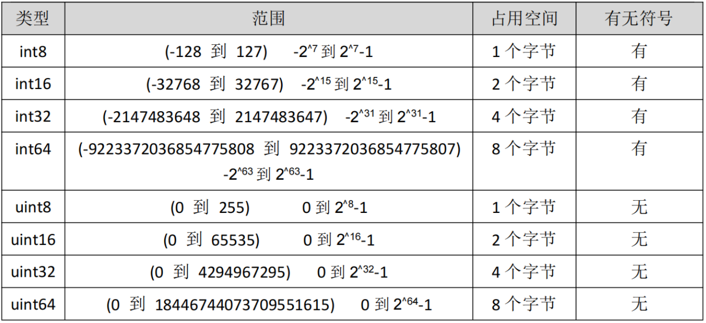

### 1、Golang数据类型介绍

> Go 语言中数据类型分为：基本数据类型和复合数据类型

> 基本数据类型有： 整型、浮点型、布尔型、字符串

> 复合数据类型有： 数组、切片、结构体、函数、map、通道（channel）、接口

### 2、整型分为两大类

> 有符号整形按长度分为：int8、int16、int32、int64 对应的无符号整型：uint8、uint16、uint32、uint64

> 关于字节：
>
> 字节也叫 Byte，是计算机数据的基本存储单位。8bit(位)=1Byte(字节) 1024Byte(字节)=1KB 1024KB=1MB 1024MB=1GB 1024GB=1TB 。在电脑里一个中文字是占两个字节的。

