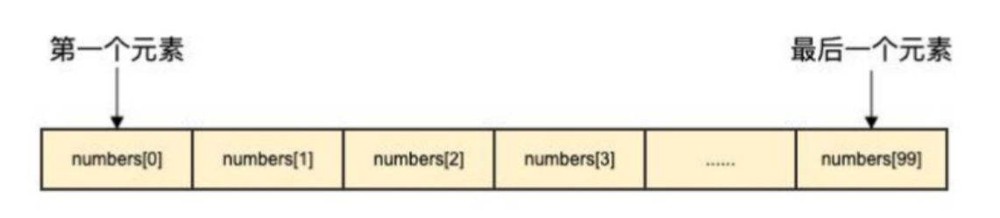

### 1、Arry介绍

> 数组是指一系列 同一类型数据的集合 。

> 数组中包含的每个数据被称为数组元素(element)，这种类型可以是任意的原始类型，比如 int、 string 等

> 一个数组包含的元素个数被称为数组的长度。

> 在 Golang 中数组是一个长度固定的数据类型，数组的长度是类型的一部分，也就是说 [5]int 和 [10]int 是两个不同的类型 。

> Golang中数组的另一个特点是占用内存的连续性，也就是说数组中的元素是被分配到连续的内存地 址中的，因而索引数组元素的速度非常快。

> 和数组对应的类型是 Slice（切片），Slice 是可以增长和收缩的动态序列，功能也更灵活

> 但是想要理解 slice 工作原理的话需要先理解数组，所以本节主要为大家讲解数组的使用。



### 2、数组定义

```go
var 数组变量名 [元素数量]T
```

> 比如：var a [5]int， 数组的长度必须是常量，并且长度是数组类型的一部分

> 一旦定义，长度不能变。 [5]int 和[4]int 是不同的类型。

```go
package main
import "fmt"
func main() {
// 定义一个长度为 3 元素类型为 int 的数组 a
var a [5]int
// 定义一个长度为 3 元素类型为 int 的数组 b 并赋值
var b [3]int
b[0] = 80
b[1] = 100
b[2] = 96
fmt.Println(a) // [0 0 0 0 0]
fmt.Print(b) // [80 100 96]
}
```
