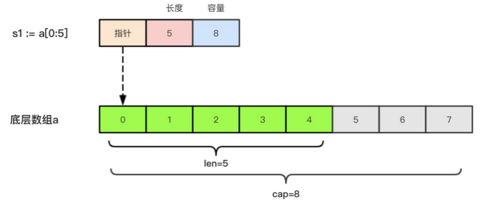
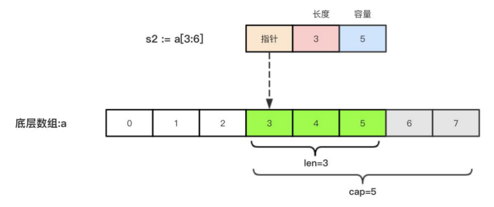

### 1、切片的定义

> 切片（Slice）是一个拥有相同类型元素的可变长度的序列。

> 它是基于数组类型做的一层封装。

> 它非常灵活，支持自动扩容。

> 切片是一个引用类型，它的内部结构包含地址、长度和容量。

> 声明切片类型的基本语法如下：

```go
// var name []T
// 1、name:表示变量名
// 2、T:表示切片中的元素类型
```

```go
package main
import "fmt"
func main() {
// 切片是引用类型，不支持直接比较，只能和 nil 比较
var a []string //声明一个字符串切片
fmt.Println(a) //[]
fmt.Println(a == nil) //true
var b = []int{} //声明一个整型切片并初始化
fmt.Println(b) //[]
fmt.Println(b == nil) //false
var c = []bool{false, true} //声明一个布尔切片并初始化
fmt.Println(c) //[false true]
fmt.Println(c == nil) //false
}
```

> 切片之间是不能比较的，我们不能使用==操作符来判断两个切片是否含有全部相等元素。

> 切片唯一合法的比较操作是和 nil 比较。 一个 nil 值的切片并没有底层数组，一个 nil 值的切片的长 度和容量都是 0。

> 但是我们不能说一个长度和容量都是 0 的切片一定是 nil

### 2、切片的本质

> 切片的本质就是对底层数组的封装，它包含了三个信息：底层数组的指针、切片的长度（len）和切 片的容量（cap）。

> 举个例子，现在有一个数组 a := [8]int{0, 1, 2, 3, 4, 5, 6, 7}，切片 s1 := a[:5]，相应示意图如下。



> 切片 s2 := a[3:6]，相应示意图如下



### 3、切片的长度和容量

> 切片拥有自己的长度和容量，我们可以通过使用内置的 len()函数求长度，使用内置的 cap()函数求 切片的容量。

> 切片的长度就是它所包含的元素个数。

> 切片的容量是从它的第一个元素开始数，到其底层数组元素末尾的个数。

> 切片 s 的长度和容量可通过表达式 len(s) 和 cap(s) 来获取。

```go
import "fmt"
func main() {
s := []int{2, 3, 5, 7, 11, 13}
fmt.Printf("长度:%v 容量 %v\n", len(s), cap(s)) // 长度:6 容量 6
}
```

