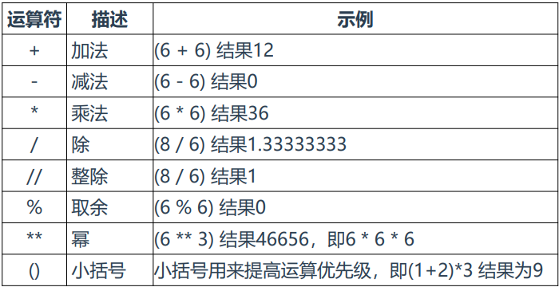
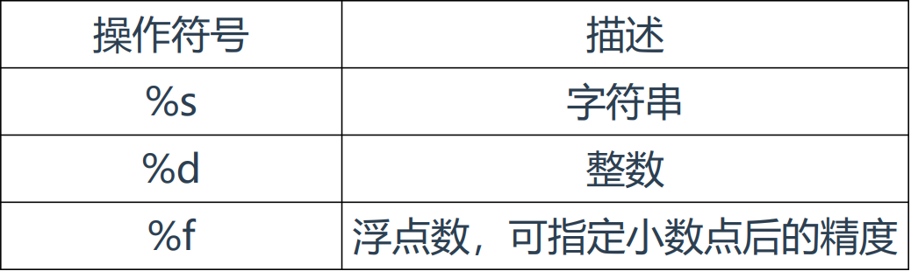
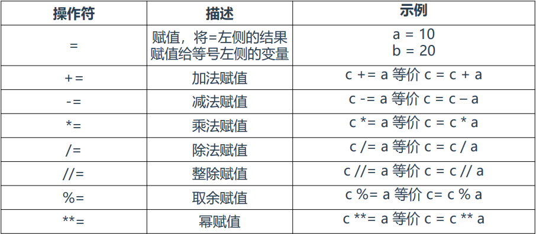
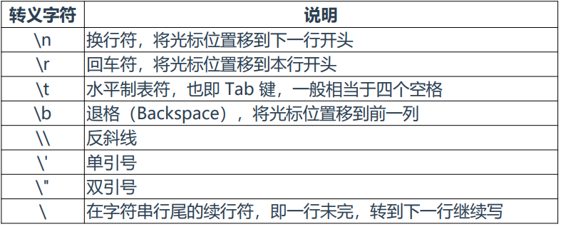

### Python安装

```bash
wget https://www.python.org/ftp/python/3.8.6/Python-3.8.6.tgz
yum install zlib-devel -y
tar zxvf Python-3.8.6.tgz
cd Python-3.8.6
./configure
make && make install
```

### Python解释器

```bash
[root@JackBao Python-3.8.6]# python3
Python 3.8.6 (default, Mar  4 2024, 15:21:55) 
[GCC 4.8.5 20150623 (Red Hat 4.8.5-44)] on linux
Type "help", "copyright", "credits" or "license" for more information.
>>> 
```

### 运行第一个程序

```bash
vim hello.py
#!/usr/bin/python3.8
print("Hello World!")

python3.8 hello.py
Hello World!
```

### 基本数据类型

> Python的基本数据类型：
>
> 整型(int)：例如6
>
> 浮点型(float)：例如6.6
>
> 字符串(str)：例如"6"，"python"
>
> 布尔值(bool)：例如True、False
>
> 注：使用type（）内建函数查看对象类型

```python
print(type("6"))
```

### 算数运算符

什么是运算符?
举个简单的例子 6+6=12，其中两个6被称为操作数，+称为运算符。



### 变量

> 变量:编程语言中能储存结果或能表示值的抽象概念。
> 用途:给一段数据赋予一个简短、易于记忆的名字，方便重用。

> 变量赋值:
>
> 变量名=变量值
>
> 例如:

```python
name = "liang"
print(name)
```

> 多重赋值：
>
> 例如：

```python
name1, name2 = "liang" , "liuhui"
print(name1,name2)
```

> 变量应用：
>
> print(变量名)



> 格化字符串：
>
> 例如：

```python
name = "LiuHui"
print("hello %s" %name)
```

> 保留2位小数点：
>
> 例如

```python
calc = 100/88

print('计算结果: %.2f' %calc)
#.2：保留两位小数
```

### 赋值操作符



### 转义字符



> 示例：

```python
name = "LiuHui"
age = 18
print("姓名: %s, \\n年龄: %d" %(name, age))
```

```python
print("hello \nworld!") #换行
print("hello \tworld!") #tab键
print("hello \rworld!") #删除前面的hello 
print("hello \world!")  #
print("hello \ #在字符串行尾的续航符，即一行未完，转到下一行继续写
      world")
```

### 获取用户输入

> input()内建函数:用于与用户交互，接收一个参数，即要向用户显示的提示或者说明，让用户知道该怎么做。
>
> 示例:

```python
name =input("请输入你的姓名：")
print(name)
```

```python
age = input("小朋友，今年多大啦？请输入你的年龄：")
print("呦，都%s岁了！可以谈恋爱了。" %age)
```

### 注释

> 一个#号表示单行注释
>
> \# print(name)
>
> 三个单引号或者三个双引号表示多行注释
>
> '''
>
> 多行注释
>
> '''

### 综合案例：实现简单的计算器

```python
choice = input("请输入编号：")
n1 = int(input("请输入第一个数字："))
n2 = int(input("请输入第二个数字："))
if choice == '1':
    print(n1+n2)
elif choice == '2':
    print(n1-n2)
elif choice == '3':
    print(n1*n2)
elif choice == '4':
    print(n1/n2)
else:
    print("输入的编号不对！")
```
