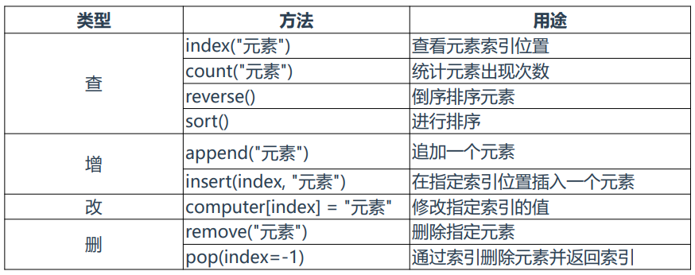
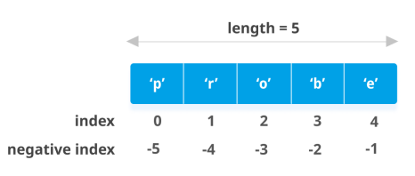
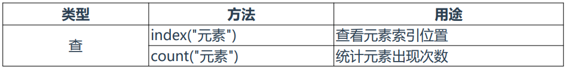
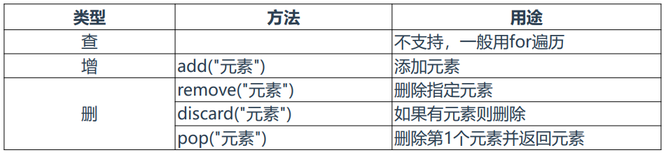
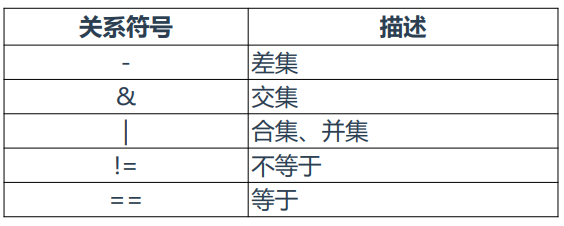
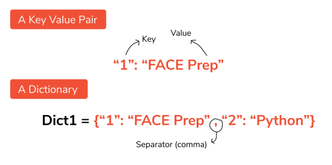

### 1、数据类型

> 在Python中，组合数据类型有：列表（list）、元组（tuple）、字典（dict）、集合（set）。

> 组合数据类型：为了方便处理数据，把一些同类数据放到一起，是一组数据的集合。

### 2、列表

> 列表（List）：是一个序列的数据结构。

> 什么是序列？ 

> 是指它成员都是有序排列，并且可以通过索引访问一个或多个成员。

> 格式：名称 = [“元素1”，“元素2”，...]

**列表基本操作**

> 定义列表：computer = ["主机","显示器","鼠标","键盘"]

**切片**

> 与字符串切片使用方法一样。 
>
> 语法格式：list[start:end:step]

> 示例： 
>
> 截取第1个元素：computer[0] 
>
> 截取第1个字符到第5个元素：computer[0:5] 
>
> 截取第1个到倒数第2个元素：computer[0:-1] 
>
> 截取最后1个元素：computer[-1]

**清空列表**

> 重新初始化列表
>
> computer = []

> del语句删除列表
>
> del computer

### 3、元组

> 元组（Tuple）：与列表类似，也是一个序列数据结构。主要区别在于元组中的元素不能修改。

> 格式：名称 = （“元素1”，“元素2”，...）

**基本操作**

> 定义元组：computer = ("主机","显示器","鼠标","键盘")

> 同样支持切片，与列表使用方法一样。

### 4、集合

> 集合（Set）：是一个无序、不重复元素的序列，主要用于元素去重和关系测试。

> 关系测试支持：

> 联合
>
> 交集
>
> 差集
>
> 对称差集

> 定义方法：set()函数或者大括号来创建集合

> 注意：想要创建空集合，必须使用set()而不是{}。后者用于创建空字典。

**基本操作**

> 定义空数组：computer = set()

> 定义元组：
>
> computer = {"主机","显示器","鼠标","键盘"}
>
> 或者
>
> computer = set(["主机","显示器","鼠标","键盘","主机"])

> 列表去重：
>
> computer = ["主机","显示器","鼠标","键盘","显示器","鼠标"]
>
> s = set(computer)
>
> print(s)

**关系测试**

> 对两个列表进行关系测试：
>
> a = set([1, 2, 3, 4, 5, 6]) 
>
> b = set([4, 5, 6, 7, 8, 9]) 

> 返回a集合中元素在b集合没有的 print(a - b) 
>
> 返回b集合中元素在a集合中没有的 print(b - a)
>
> 返回交集，即两个集合中一样的元素 print(a & b) 返回合集，即合并去重 print(a | b) 
>
> 判断是否不相等 print(a != b)
>
> 判断是否相等 print(a == b)

### 5、字典

> 字典（Dict）：是一个具有映射关系的数据结构。用于存储有一定关系的元素。

> 格式：d = {'key1':value1, 'key2':value2, 'key3':value3}

> 注意：字典通过key来访问value，因此字典中的key不允许重复。

**基本操作**

> 定义字典：computer = {"主机":5000,"显示器":1000,"鼠标":60,"键盘":150}

**嵌套**

> 字典里的值不但是可以写整数、字符串，也可以是其他数据类型，例如列表、元组、集 合、字典，这样可满足一个键还包含其他属性。

> computer = {"主机":{"CPU":1300,"内存":400,"硬盘":200},"显示器":1000,"鼠标":60,"键 盘":["机械键盘","薄膜键盘"]}

> 操作key中字典：
>
> computer["主机"]["硬盘"]
>
> computer["主机"]["硬盘"] = "300“
>
> 操作key中列表：
>
> computer["键盘"]
>
> computer["键盘"].append("其他")

### 6、常用数据类型转换

