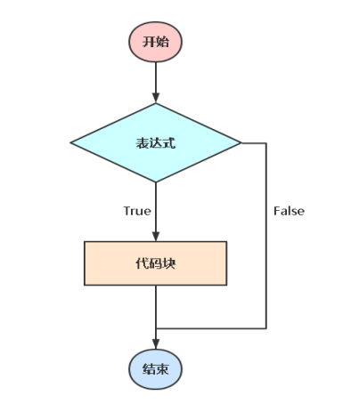
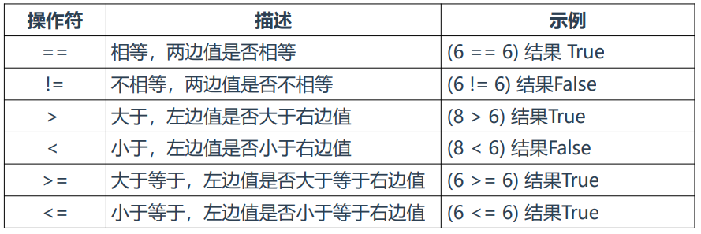
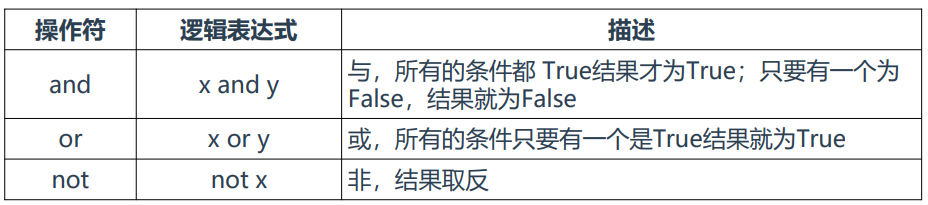
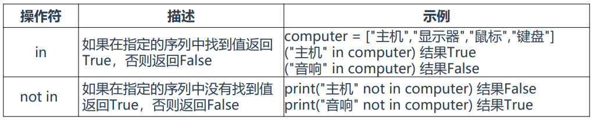
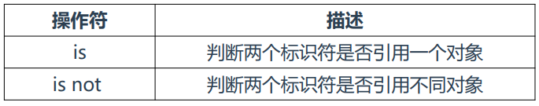

**操作符有什么用？**

> 操作符：一个特定的符号，用它与其他数据类型连接起来组成一个

> 表达式。常用于条件判断，根据表达式返回True/False采取动作。

### 1、比较操作符

> 比较操作符：比较两边值

### 2、逻辑操作符

> 逻辑操作符：判断条件逻辑

### 3、成员操作符

> 成员操作符：判断某个元素是否在数据类型里

### 4、身份操作符

> 身份操作符：判断两个对象是否相等

