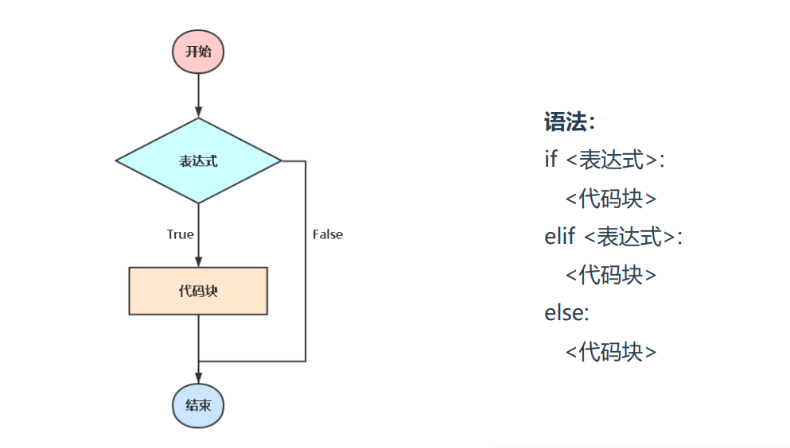
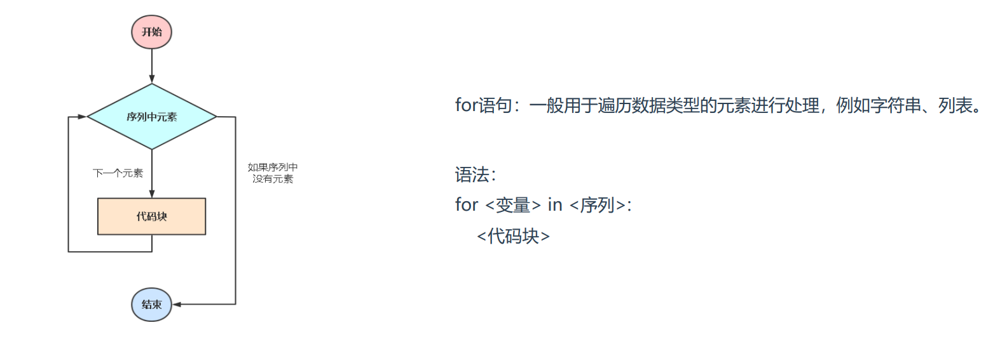
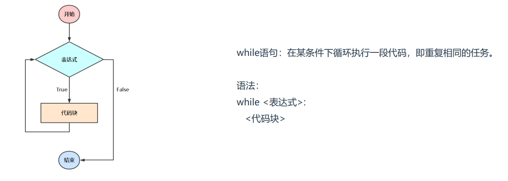

### 1、条件判断



**单分支**

```python
示例：判断是否成年
age = int(input("请输入你的年龄: "))
if age > 18:
print("恭喜，你已经成年！")
else:
print("抱歉，你还未成年！")
```

> 简写，也成三目表达式： "恭喜，你已经成年！" if age > 18 else "抱歉，你还未成年！"

**多分支**

```python
示例：根据人的年龄段划分
age = int(input("请输入你的年龄: "))
if age < 7 :
print("儿童")
elif age >= 7 and age < 17:
print("少年")
elif age >= 18 and age < 40:
print("青年")
elif age >= 41 and age < 48:
print("壮年")
else:
print("老年")
```

### 2、循环语句

> 循环的作用在于将一段代码重复执行多次。

> Python中实现循环常用有两个语句：for、while

**for循环**



```python
示例1：遍历字符串
s = "123456"
for i in s:
print(i)
```

```python
示例2：遍历列表
computer = ["主机","显示器","鼠标","键盘"]
for i in computer:
print(i,len(i)) 
```

```python
示例3：遍历字典
computer = {"主机":5000,"显示器":1000,"鼠标":60,"键盘":150}
for i in computer.items():
print(i)
print("名称: %s\t价格: %s" % (i[0],i[1]))
```

```python
示例4：嵌套循环
s1 = "123456"
s2 = "456789"
for i in s1:
for x in s2:
if i == x:
print(i)
```

> range()内建函数：动态生成数字序列，例如range(1,6)，结果类似列表[1,2,3,4,5,6]

```python
示例：生成0-4序列
for i in range(5):
print(i)
```

**while语句**



```python
示例1：当条件满足时停止循环
count = 0
while count < 5:
print(count)
count += 1
```

```python
示例2：死循环
count = 0
while True:
print(count)
count += 1
```

**continue与break语句**

> continue 当满足条件时，跳出本次循环

> break 当满足条件时，跳出所有循环 

> 注：只有在for、while循环语句中才有效。

```python
示例1：continue
for n in range(1,6):
if n == 3:
continue
else:
print(n)
```

```python
示例2：break
for n in range(1,6):
if n == 3:
break
else:
print(n)
```

**综合案例：用户登录，三次错误机会**

```python
示例：
count = 0
while 1:
if count < 3:
name = input("请输入你的用户名: ").strip() # .strip()去除首尾空格
if len(name) == 0:
print("输入不能为空!")
continue
elif name == "aliang":
print("登录成功.")
break
else:
print("用户名错误，请重新输入!")
count += 1
else:
print("超出错误次数, 退出!")
break
```

### 3、pass语句