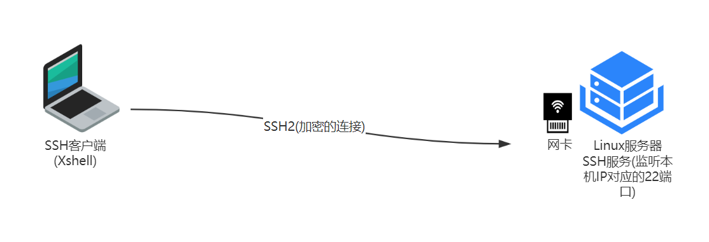

连接服务器Linux需要SSH客户端，常用的SSH客户端：Xshell

客户端远程连接Linux服务器原理示意图：

> 1.ip地址，类似于门牌号码，任何计算机上网都需要一个ip地址
>
> 2.端口，计算机用来跑程序的，比如QQ，在第1台计算机上的1端运行，在第2台计算机上的2端口运行，即同一个程序在不同计算机上运行，可用端口实现，端口范围0-65535
>
> 3.ssh协议相当于沟通语言 (汉语、英语等等)客户端和服务器端沟通需要协议，远程连接是ssh协议，ssh2是ssh1的升级版，更加稳定点，ssh2是加密的连接协议。

**SSH 念解释**

> SSH的英文全称是 Secure Shell。传统的网络服务程序，如: tcp 和 telnet 在本质上都是不安全的，因为它们在网络上用明文传送口令和数据，别有用心的人非常容易就可以截获这些口令和数据。而通过使用 SSH 客户端与服务器端通讯时，用户名及口令均进行了加密有效防止了对口令的窃听。同时通过 SSH 的数据传输是经过压缩的，所以可以提高数据的传输速度。SSH是由客户端和服务端的软件组成的，其中客户端软件就是 SecureCRT，有两个不兼容的版本分别是: 1. x和 2.x。