## 源码编译安装LNMP

| 字段 | 解释                                                         |
| :--: | :----------------------------------------------------------- |
|  L   | Linux 提供操作系统运行环境平台                               |
|  A   | apache 提供前端web服务应用，用于网页交互                     |
|  N   | ngnix几乎没有处理动态页面的能力，所以需要把用户访问动态页面的请求转发给php-fpm(9000)等动态页面处理进程 |
|  M   | masql 提供后端数据库服务，用于读写相关业务数据               |
|  P   | php，python，perl 动态页面编程语言，用于解释相关代码写的动态网页，作为中间连接前端web和后端数据库协调共同完成工作（用户在网页中对数据的读写） |

### 安装 Nginx 服务

##### 前提关闭防火墙

```bash
systemctl stop firewalld
systemctl disable firewalld
setenforce 0
1.2.3.
```


##### 1、安装依赖包

```bash
yum -y install pcre-devel zlib-devel gcc gcc-c++ make
1.
```


##### 2、创建运行用户

```bash
useradd -M -s /sbin/nologin nginx
1.
```


##### 3、编译安装

```bash
cd /opt
tar zxvf nginx-1.12.0.tar.gz -C /opt/

cd nginx-1.12.0/
./configure \
--prefix=/usr/local/nginx \
--user=nginx \
--group=nginx \
--with-http_stub_status_module

make && make install
1.2.3.4.5.6.7.8.9.10.11.
```

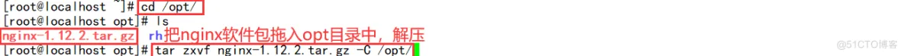


##### 4、优化路径

```bash
ln -s /usr/local/nginx/sbin/nginx /usr/local/sbin/
1.
```


##### 5、添加 Nginx 系统服务

```bash
vim /lib/systemd/system/nginx.service
[Unit]
Description=nginx
After=network.target
[Service]
Type=forking
PIDFile=/usr/local/nginx/logs/nginx.pid
ExecStart=/usr/local/nginx/sbin/nginx
ExecReload=/bin/kill -s HUP $MAINPID
ExecStop=/bin/kill -s QUIT $MAINPID
PrivateTmp=true
[Install]
WantedBy=multi-user.target

chmod 754 /lib/systemd/system/nginx.service
systemctl start nginx.service
systemctl enable nginx.service
1.2.3.4.5.6.7.8.9.10.11.12.13.14.15.16.17.
```

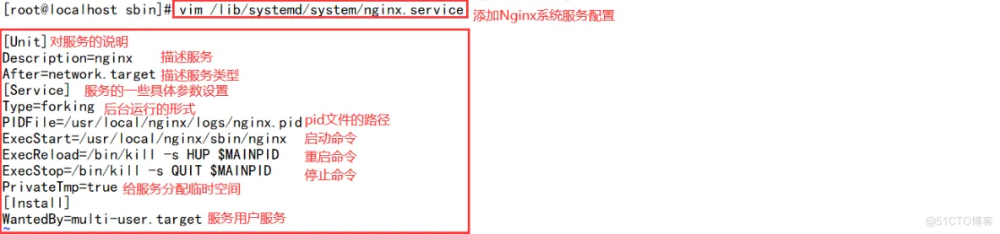


------

### 安装 MySQL 服务

##### 1、安装Mysql环境依赖包

```bash
yum -y install \
ncurses \
ncurses-devel \
bison \
cmake
1.2.3.4.5.
```


##### 2、创建运行用户

```bash
useradd -M -s /sbin/nologin  mysql
1.
```

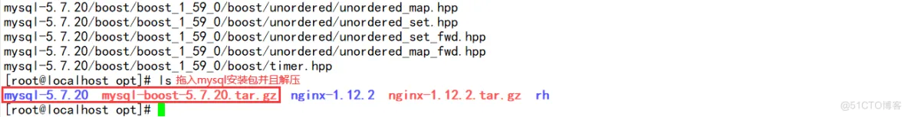

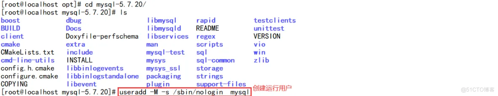

##### 3、编译安装

```bash
cd /opt
tar zxvf mysql-boost-5.7.20.tar.gz

cd /opt/mysql-5.7.20/
cmake \
-DCMAKE_INSTALL_PREFIX=/usr/local/mysql \
-DMYSQL_UNIX_ADDR=/usr/local/mysql/mysql.sock \
-DSYSCONFDIR=/etc \
-DSYSTEMD_PID_DIR=/usr/local/mysql \
-DDEFAULT_CHARSET=utf8  \
-DDEFAULT_COLLATION=utf8_general_ci \
-DWITH_EXTRA_CHARSETS=all \
-DWITH_INNOBASE_STORAGE_ENGINE=1 \
-DWITH_ARCHIVE_STORAGE_ENGINE=1 \
-DWITH_BLACKHOLE_STORAGE_ENGINE=1 \
-DWITH_PERFSCHEMA_STORAGE_ENGINE=1 \
-DMYSQL_DATADIR=/usr/local/mysql/data \
-DWITH_BOOST=boost \
-DWITH_SYSTEMD=1

make && make install
1.2.3.4.5.6.7.8.9.10.11.12.13.14.15.16.17.18.19.20.21.
```

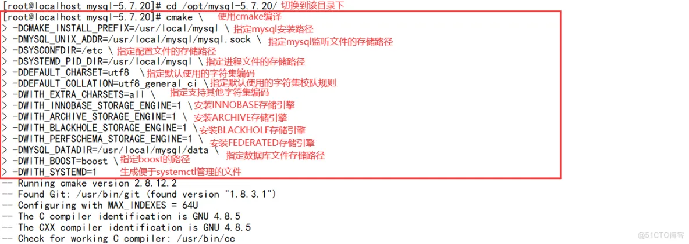

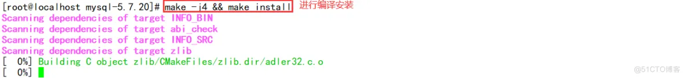

##### 4、修改mysql 配置文件

```bash
vim /etc/my.cnf
[client]
port = 3306
socket=/usr/local/mysql/mysql.sock

[mysqld]
user = mysql
basedir=/usr/local/mysql
datadir=/usr/local/mysql/data
port = 3306
character-set-server=utf8
pid-file = /usr/local/mysql/mysqld.pid
socket=/usr/local/mysql/mysql.sock
bind-address = 0.0.0.0
skip-name-resolve
max_connections=2048
default-storage-engine=INNODB
max_allowed_packet=16M
server-id = 1

sql_mode=NO_ENGINE_SUBSTITUTION,STRICT_TRANS_TABLES,NO_AUTO_CREATE_USER,NO_AUTO_VALUE_ON_ZERO,NO_ZERO_IN_DATE,NO_ZERO_DATE,ERROR_FOR_DIVISION_BY_ZERO,PIPES_AS_CONCAT,ANSI_QUOTES
1.2.3.4.5.6.7.8.9.10.11.12.13.14.15.16.17.18.19.20.21.
```

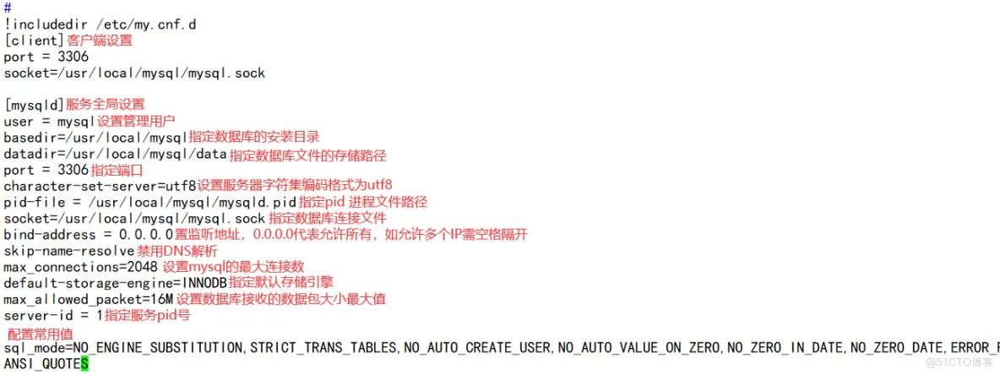

##### 5、更改mysql安装目录和配置文件的属主属组

```bash
chown -R mysql:mysql /usr/local/mysql/
chown mysql:mysql /etc/my.cnf
1.2.
```


##### 6、设置路径环境变量

```bash
echo 'export PATH=/usr/local/mysql/bin:/usr/local/mysql/lib:$PATH' >> /etc/profile	
source /etc/profile
1.2.
```


##### 7、初始化数据库

```bash
cd /usr/local/mysql/bin/
./mysqld \
--initialize-insecure \
--user=mysql \
--basedir=/usr/local/mysql \
--datadir=/usr/local/mysql/data
1.2.3.4.5.6.
```

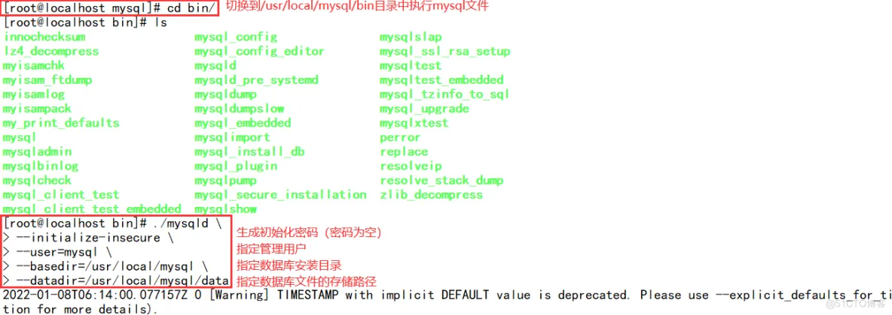

##### 8、添加mysqld系统服务

```bash
cp /usr/local/mysql/usr/lib/systemd/system/mysqld.service /usr/lib/systemd/system/
systemctl daemon-reload
systemctl start mysqld.service
systemctl enable mysqld
1.2.3.4.
```


##### 9、修改mysql 的登录码

```bash
mysqladmin -u root -p password "abc123"
1.
```


##### 10、授权远程登录

```bash
mysql -u root -p
1.
```


------

### 安装配置 PHP 解析环境

##### 1、安装环境依赖包

```bash
yum -y install gd \
libjpeg libjpeg-devel \
libpng libpng-devel \
freetype freetype-devel \
libxml2 libxml2-devel \
zlib zlib-devel \
curl curl-devel \
openssl openssl-devel
1.2.3.4.5.6.7.8.
```


##### 2、编译安装

```bash
cd /opt
tar jxvf php-7.1.10.tar.bz2

cd php-7.1.10
./configure \
--prefix=/usr/local/php \
--with-mysql-sock=/usr/local/mysql/mysql.sock \
--with-mysqli \
--with-zlib \
--with-curl \
--with-gd \
--with-jpeg-dir \
--with-png-dir \
--with-freetype-dir \
--with-openssl \
--enable-fpm \
--enable-mbstring \
--enable-xml \
--enable-session \
--enable-ftp \
--enable-pdo \
--enable-tokenizer \
--enable-zip

make && make install
1.2.3.4.5.6.7.8.9.10.11.12.13.14.15.16.17.18.19.20.21.22.23.24.25.
```

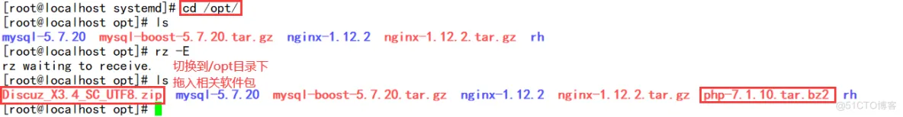

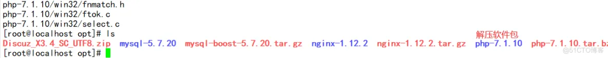


##### 3、路径优化

```bash
ln -s /usr/local/php/bin/* /usr/local/bin/
ln -s /usr/local/php/sbin/* /usr/local/sbin/
1.2.
```


##### 4、调整PHP配置文件

###### php有三个配置文件：

- 主配置文件 -----php.ini
- 进程服务配置文件-----php-fpm.conf
- 扩展配置文件-----www.conf

```bash
#调整主配置文件：
cp /opt/php-7.1.10/php.ini-development /usr/local/php/lib/php.ini	
vim /usr/local/php/lib/php.ini
--1170行--修改
mysqli.default_socket = /usr/local/mysql/mysql.sock
--939行--取消注释，修改
date.timezone = Asia/Shanghai

php -m 					#验证安装的模块
1.2.3.4.5.6.7.8.9.
```

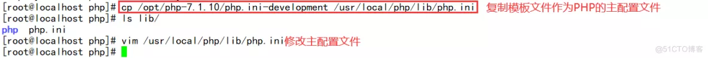

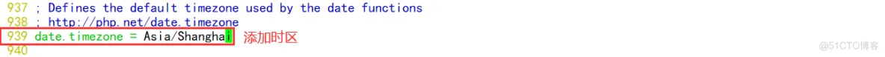


```bash
#调整进程服务配置文件：
cd /usr/local/php/etc/
cp  php-fpm.conf.default php-fpm.conf
vim php-fpm.conf
--17行--去掉";"注释
pid = run/php-fpm.pid
1.2.3.4.5.6.
```

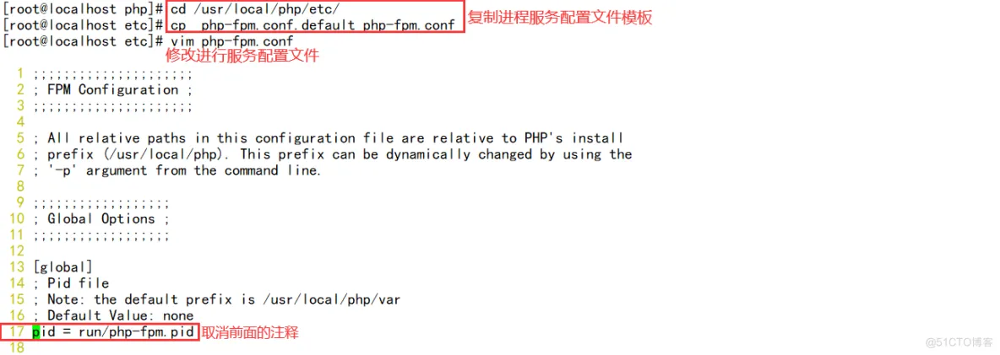

```bash
#调整扩展配置文件：
cd /usr/local/php/etc/php-fpm.d/
cp www.conf.default www.conf
1.2.3.
```

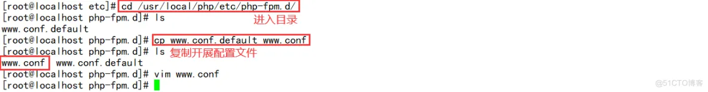

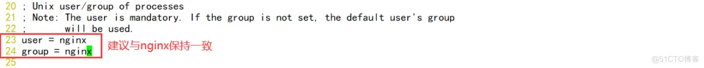

##### 5、启动php-fpm

```bash
/usr/local/php/sbin/php-fpm -c /usr/local/php/lib/php.ini
netstat -anpt | grep 9000

#PHP-FPM（FastCGI Process Manager：FastCGI 进程管理器）是一个PHPFastCGI管理器，由于Nginx服务器不能处理动态页面，需要由 Nginx 把动态请求交给 php-fpm 进程进行解析。

cd /opt/php-7.1.10/sapi/fpm
cp php-fpm.service /usr/lib/systemd/system/php-fpm.service
systemctl restart php-fpm.service
1.2.3.4.5.6.7.8.
```


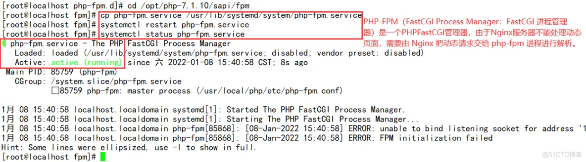

##### 6、配置 Nginx 支持 PHP 解析

```bash
vim /usr/local/nginx/conf/nginx.conf
--65行--取消注释，修改
location ~ \.php$ {
	root           html;
	fastcgi_pass   127.0.0.1:9000;
	fastcgi_index  index.php;
	fastcgi_param  SCRIPT_FILENAME  /usr/local/nginx/html$fastcgi_script_name;	#将 /scripts 修改为nginx的工作目录
   #fastcgi_param  SCRIPT_FILENAME $document_root$fastcgi_script_name;  #$document_root 代表当前请求在root指令中指定的值
	include        fastcgi_params;
}

systemctl restart nginx.service
1.2.3.4.5.6.7.8.9.10.11.12.
```


##### 7、验证PHP 测试页

```bash
vim /usr/local/nginx/html/index.php
<?php
phpinfo();
?>

浏览器访问
http://192.168.80.30/index.php
1.2.3.4.5.6.7.
```


##### 8、验证数据库工作是否正常

```bash
mysql -u root -p
CREATE DATABASE bbs;
GRANT all ON bbs.* TO 'bbsuser'@'%' IDENTIFIED BY 'admin123';
GRANT all ON bbs.* TO 'bbsuser'@'localhost' IDENTIFIED BY 'admin123';
flush privileges;

vim /usr/local/nginx/html/index.php      		#替换原来的测试页内容
<?php
$link=mysqli_connect('192.168.80.30','bbsuser','admin123');
if($link) echo "Success!!";
else echo "Fail!!";
?>

浏览器访问
http://192.168.80.30/index.php
1.2.3.4.5.6.7.8.9.10.11.12.13.14.15.
```

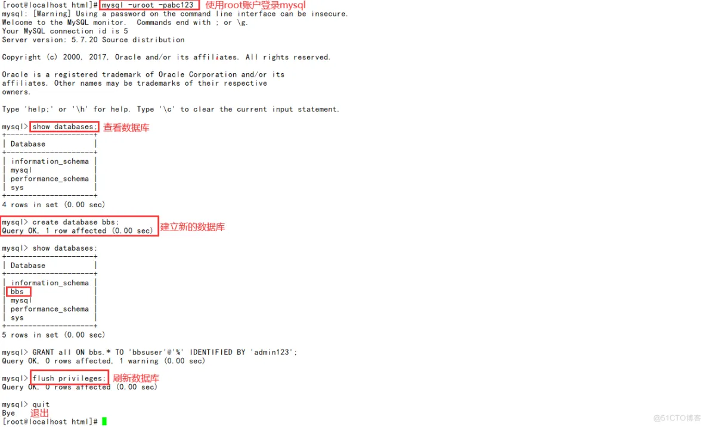


------

### 部署 Discuz！社区论坛Web应用

##### 1、解压论坛压缩包

```bash
cd /opt
unzip Discuz_X3.4_SC_UTF8.zip  -d /opt/dis
cd /opt/dis/dir_SC_UTF8/
cp -r upload/ /usr/local/nginx/html/bbs/
1.2.3.4.
```


##### 2、调整论坛目录的权限

```bash
把配置文件中加入nginx.php否则打开会返回404状态码
cd /usr/local/nginx/html/bbs/install
vim /usr/local/nginx/conf/nginx.conf
--45行--末尾添加nginx.php
systemctl reload nginx.service#重载服务

调整论坛目录的权限
cd /usr/local/nginx/html/bbs/
chown -R nginx ./config/
chown -R nginx ./data/
chown -R nginx ./uc_client/
chown -R nginx ./uc_server/
或
chmod -R 777 ./config/
chmod -R 777 ./data/
chmod -R 777 ./uc_client/
chmod -R 777 ./uc_server/
1.2.3.4.5.6.7.8.9.10.11.12.13.14.15.16.17.
```


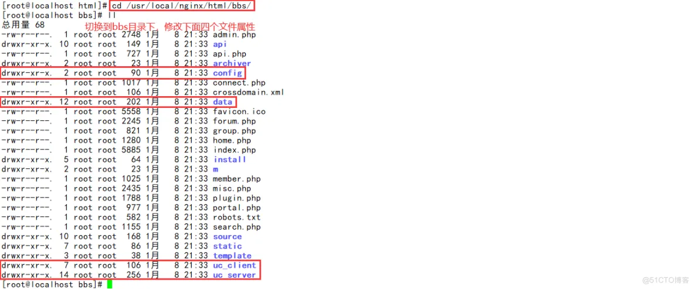


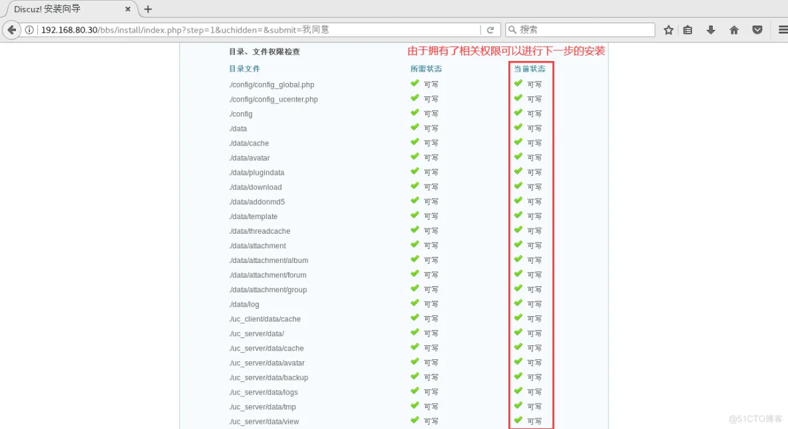

##### 3、浏览器访问验证

```bash
论坛页面访问
http://192.168.80.30/bbs/install/index.php
------------------------------
数据库服务器：localhost     ###本地架设就用localhost，如何不是在在本机上就要填写IP地址和端口号
数据库名字：bbs
数据库用户名：bbsuser
数据库登录码：admin123
管理员账号:admin
管理员登录码:admin123
------------------------------
访问论坛页面：
http://192.168.80.30/bbs/index.php
http://192.168.80.30/bbs/admin.php
1.2.3.4.5.6.7.8.9.10.11.12.13.
```

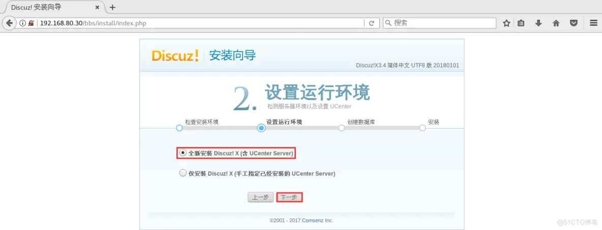


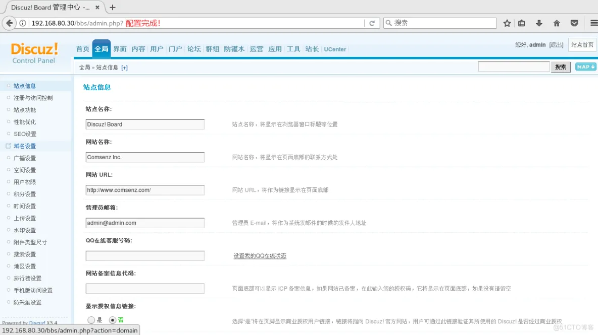

------

#### fpm参数优化

```bash
vim /usr/local/php/etc/php-fpm.conf 
pid = run/php-fpm.pid       #保证已打开

vim /usr/local/php/etc/php-fpm.d/www.conf
--96行--
pm = dynamic				#fpm进程启动方式，动态的
--107行--
pm.max_children=20			#fpm进程启动的最大进程数
--112行--
pm.start_servers = 5		#动态方式下启动时默认开启的进程数，在最小和最大之间
--117行--
pm.min_spare_servers = 2	#动态方式下最小空闲进程数
--122行--
pm.max_spare_servers = 8	#动态方式下最大空闲进程数

kill -USR2 `cat /usr/local/php/var/run/php-fpm.pid`			#重启php-fpm
netstat -anpt | grep 9000
ps -elf | grep php-fpm
1.2.3.4.5.6.7.8.9.10.11.12.13.14.15.16.17.18.
```


