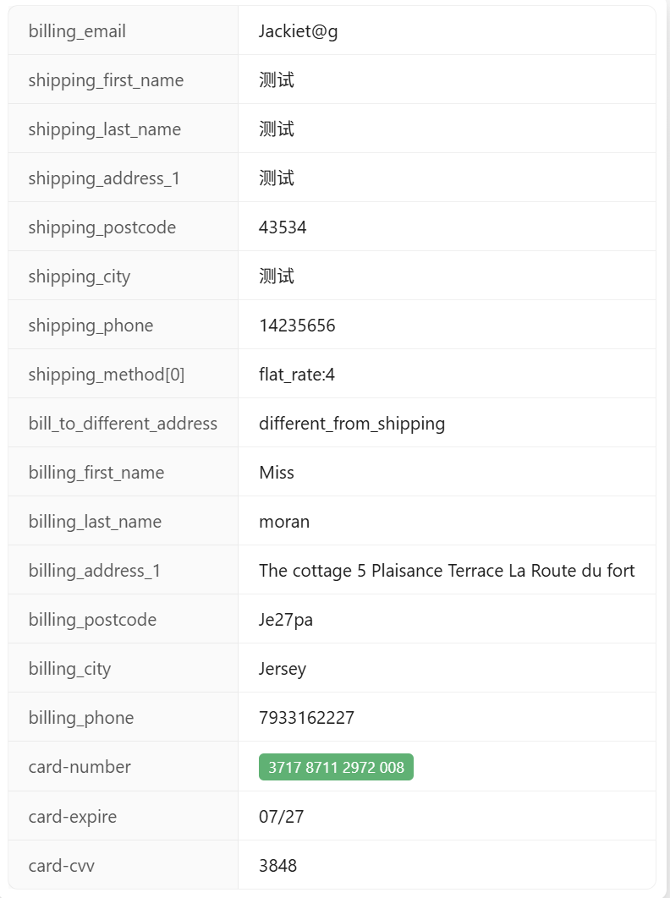

### 测试

```
371787112972008|07/27|3848|Miss l moran|The cottage 5 Plaisance Terrace La Route du fort|St saviour |Jersey |Je27pa|7933162227|UK
```

### 使用不同的账单地址



```
billing_email
shipping_first_name
shipping_last_name
shipping_address_1
shipping_postcode
shipping_city
shipping_phone
shipping_method[0]
bill_to_different_address
billing_first_name
billing_last_name
billing_address_1
billing_postcode
billing_city
billing_phone
card-number
card-expire
card-cvv
```

### 使用相同的账单地址


```
billing_email
shipping_first_name
shipping_last_name
shipping_address_1
shipping_postcode
shipping_city
shipping_phone
shipping_method[0]
card-number
card-expire
card-cvv
```

### 卡头

```
visa 4539080196684686
万事达 5591722726381323
discover 6494769004220604732
银联 626651238281465120
日本JCB 3530 1113 3330 0000
美国运通 374823810817950
Diners Club 3809221186794540
Elo
```

### 信用卡识别

| 品牌             | 开头范围/规则                                                | 卡号长度 | 正则表达式                  |
| ---------------- | ------------------------------------------------------------ | -------- | --------------------------- |
| Visa             | 4                                                            | 13或16位 | `^4[0-9]{12}(?:[0-9]{3})?$` |
| Mastercard       | 51–55 或 2221–2720                                           | 16位     | `^(5[1-5][0-9]{14}          |
| Discover         | 6011、622126–622925、644–649、65                             | 16位     | `^6(?:011                   |
| 银联（UnionPay） | 62                                                           | 16–19位  | `^62[0-9]{14,17}$`          |
| JCB              | 3528–3589                                                    | 16位     | `^35(2[89]                  |
| American Express | 34、37                                                       | 15位     | `^3[47][0-9]{13}$`          |
| Diners Club      | 300–305、36、38–39                                           | 14或16位 | `^3(?:0[0-5]                |
| Elo              | 4011、4312、4389、4514、4576、5041、5066、5090、6277、6362、6363 | 16位     | `^(4011                     |

### 重要内容

```
个人练习生:
@wc-online-tracker 这个项目中的elementor-online-counter.html我是直接复制粘贴到wordpress服务器elementor自定义代码。现在请你改造使用SystemJS加载外部资源 + Redis缓存优化，精简这个elementor自定义代码。

个人练习生:
对于生产环境，建议使用工具（如 Rollup 或 Webpack）将 ES 模块转换为 System.register 格式，以获得更好的性能和兼容性。

个人练习生:
SystemJS Babel 扩展是一个开发环境的解决方案，不建议在生产环境中使用

```


