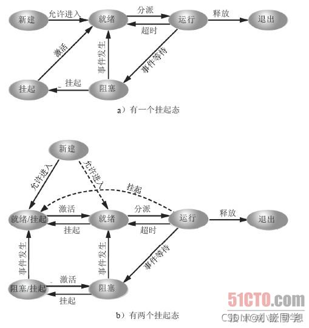

# 一、再论进程

## 1、进程的[挂起](https://so.csdn.net/so/search?q=挂起&spm=1001.2101.3001.7020)、阻塞和睡眠的区别：

详解：https://www.cnblogs.com/ck1020/p/6669661.html

（1）阻塞是一种被动的方式，由于获取资源获取不到而引起的等待。

（2）睡眠就是一种主动的方式，当一个进程获取资源比如获取最普通的锁而失败后，可以有两种处理方式，1、自己睡眠，触发调度；2、忙等待，使用完自己的时间。所以从这里看，睡眠的确是一种主动的方式，且仅仅作为一种处理手段。当然睡眠不仅仅用于阻塞，更多的，我们可以在适当的时候设置让进程睡眠一定的时间，那么在这里，就可以发现，睡眠之前，我们已经预先规定了，你只能睡多长时间，这段时间过后，比必须返回来工作。

  睡眠都是由用户控制的，睡眠恢复则是自动完成的，睡眠时间到了则恢复到就绪态，睡眠时线程不会释放对象锁。

（3）挂起是由用户控制的，挂起恢复需要用户主动控制，挂起时线程不会释放对象锁。

（4）举个例子，形象解释一下三者的关系（引用自：https://blog.csdn.net/qq784515681/article/details/79142127）
  挂起线程的意思就是你对主动对雇工说：“你睡觉去吧，用着你的时候我主动去叫你，然后接着干活”。

  使线程睡眠的意思就是你主动对雇工说：“你睡觉去吧，某时某刻过来报到，然后接着干活”。

  线程阻塞的意思就是，你突然发现，你的雇工不知道在什么时候没经过你允许，自己睡觉呢，但是你不能怪雇工，肯定你这个雇主没注意，本来你让雇工扫地，结果扫帚被偷了或被邻居家借去了，你又没让雇工继续干别的活，他就只好睡觉了。至于扫帚回来后，雇工会不会知道，会不会继续干活，你不用担心，雇工一旦发现扫帚回来了，他就会自己去干活的。因为雇工受过良好的培训。这个培训机构就是操作系统。

## 2、多进程实现同时读取键盘和鼠标

https://blog.csdn.net/u011508527/article/details/46878205
https://blog.csdn.net/jobbofhe/article/details/82192092

思路：创建子进程，然后父子进程分别进行读键盘和鼠标的工作

```c
#include <stdio.h>
#include <stdlib.h>
#include <unistd.h>
#include <string.h>
#include <sys/types.h>
#include <sys/stat.h>
#include <fcntl.h>


int main(int argc, char *argv)
{
	//先创建子进程，然后父子进程中分别进行读键盘和鼠标的工作
	int ret = -1;
	int fd = -1;
	char buf[200] = {0};
	
	ret = fork();
	if (ret < 0)
	{
		printf("fork error.\n");
		exit(-1);
	}
	else if (ret == 0)
	{
		//子进程
		fd = open("/dev/input/mouse0", O_RDONLY);
		if (fd < 0)
		{
			perror("open");
			return -1;
		}
		while(1)
		{
			memset(buf, 0, sizeof(buf));
			printf("before read mouse0\n");
			read(fd, buf, 50);
			printf("读取的鼠标的内容是:[%s].\n", buf);
		}
	}
	else if (ret > 0)
	{
		//父进程
		while(1)
		{
			memset(buf, 0, sizeof(buf));
			printf("before read keyboard.\n");
			read(0, buf, 50);
			printf("读出的键盘内容是:[%s]\n", buf);
		}
		
	}
	
	return 0;
}
123456789101112131415161718192021222324252627282930313233343536373839404142434445464748495051525354
```

  并发：在操作系统中，是指一个时间段中有几个程序都处于已启动运行到运行完毕之间，且这几个程序都是在同一个处理机上运行，但任一个时刻点上只有一个程序在处理机上运行。

操作系统并发程序执行的特点，并发环境下，由于程序的封闭性被打破，出现了新的特点：
①程序与计算不再一一对应，一个程序副本可以有多个计算
②并发程序之间有相互制约关系，直接制约体现为一个程序需要另一个程序的计算结果，间接制约体现为多个程序竞争某一资源，如处理机、缓冲区等。
③并发程序在执行中是走走停停，断续推进的。

3、使用进程技术的优势
(1)CPU时分复用，单核心CPU可以实现宏观上的并行

(2)实现多任务系统需求（多任务的需求是客观的）

4、进程技术的劣势
(1)**进程间切换开销大，进程的切换包含了进程断点的保存与恢复，有些类似于中断及中断返回**

(2)**进程间通信麻烦而且效率低**

5、解决方案就是线程技术
(1)线程技术**保留了进程技术实现多任务的特性。**
(2)线程的改进就是**在线程间切换和线程间通信上提升了效率。**
(3)**多线程在多核心CPU上面更有优势。**

# 二、线程的引入

详解：https://www.cnblogs.com/yuanchenqi/articles/6755717.html

## 1、线程进程的区别体现在几个方面

  因为**进程拥有独立的堆栈空间和数据段，所以每当启动一个新的进程必须分配给它独立的地址空间**，建立众多的数据表来维护它的代码段、堆栈段和数据段，这对于多进程来说十分“奢侈”，系统开销比较大。

  而线程不一样，**线程拥有独立的堆栈空间，但是共享数据段，它们彼此之间使用相同的地址空间，共享大部分数据**，比进程更节俭，开销比较小，**切换速度也比进程快，效率高，但是正由于进程之间独立的特点，使得进程安全性比较高，也因为进程有独立的地址空间，一个进程崩溃后，在保护模式下不会对其它进程产生影响，而线程只是一个进程中的不同执行路径。一个线程死掉就等于整个进程死掉。**（这句话可能有点问题，应该在某种条件下是对的,比如单线程的进程）

  当一个线程死了（非正常退出、死循环等）就会导致线程该占有的资源永远无法释放，从而影响其他线程的正常工作

（1）体现在通信机制上面，正因为进程之间互不干扰，相互独立，进程的通信机制相对很复杂，譬如管道，信号，消息队列，共享内存，套接字等通信机制，而线程由于共享数据段所以通信机制很方便。

（2）**属于同一个进程的所有线程共享该进程的所有资源，包括文件描述符。而不同的进程相互独立。**

（3）**线程又称为轻量级进程，进程有进程控制块，线程有线程控制块;**

（4）线程必定也只能属于一个进程，而进程可以拥有多个线程而且至少拥有一个线程;

（5）体现在程序结构上，举一个简明易懂的列子：当我们使用进程的时候，我们不自主的使用if else嵌套来判断pid，使得程序结构繁琐，但是当我们使用线程的时候，基本上可以甩掉它，当然程序内部执行功能单元需要使用的时候还是要使用，所以线程对程序结构的改善有很大帮助。

## 2、进程与线程的选择取决以下几点

（1）**需要频繁创建销毁的优先使用线程;因为对进程来说创建和销毁一个进程代价是很大的。**

（2）线程的切换速度快，所以在需要大量计算，切换频繁时用线程，还有耗时的操作使用线程可提高应用程序的响应

（3）**因为对CPU系统的效率使用上线程更占优，所以可能要发展到多机分布的用进程，多核分布用线程;**

（4）并行操作时使用线程，如C/S 的服务器端并发线程响应用户的请求;

（5）**需要更稳定安全时，适合选择进程;需要速度时，选择线程更好**。

## 3、使用线程技术同时读取键盘和鼠标

```c
#include <pthread.h>
int pthread_create(
                 pthread_t *restrict tidp,   //新创建的线程ID指向的内存单元。
                 const pthread_attr_t *restrict attr,  //线程属性，默认为NULL
                 void *(*start_rtn)(void *), //新创建的线程从start_rtn函数的地址开始运行
                 void *restrict arg //默认为NULL。若上述函数需要参数，将参数放入结构体中并将地址作为arg传入。
                  );

restrict，C语言中的一种类型限定符，用于告诉编译器，对象已经被指针所引用，不能通过除该指针外所有其他直接或间接的方式修改该对象的内容。

pthread_create是（Unix、Linux、Mac OS X）等操作系统的创建线程的函数。它的功能是创建线程（实际上就是确定调用该线程函数的入口点），在线程创建以后，就开始运行相关的线程函数。

pthread_create的返回值表示成功，返回0；表示出错，返回表示-1。

编译时需加上 -lpthread选项，使其能找到相应的动态链接库。
123456789101112131415
#include <stdio.h>
#include <stdlib.h>
#include <unistd.h>
#include <string.h>
#include <sys/types.h>
#include <sys/stat.h>
#include <fcntl.h>
#include <pthread.h>

char buf[200] = {0};

void *func(void *arg)
{
	while(1)
	{
		memset(buf, 0, sizeof(buf));
		printf("before read keyboard.\n");
		read(0, buf, 50);
		printf("读取的键盘的内容是:[%s].\n", buf);
		
	}
	
}

int main(int argc, char *argv[])
{
	int ret = -1;
	int fd = -1;
	
	pthread_t th = -1;
	
	ret = pthread_create(&th, NULL, func, NULL);
	if (ret != 0)
	{
		printf("pthread_create error.\n");
		return -1;
	}
	
	fd = open("/dev/input/mouse0", O_RDONLY);
	if (fd < 0)
	{
		perror("open error");
		exit(-1);
	}
	
	while(1)
	{
		memset(buf, 0, sizeof(buf));
		printf("before read mouse0.\n");
		read(fd, buf, 50);
		printf("读取的鼠标的内容是:[%s].\n", buf);
		
	}
	
	return 0;
}
1234567891011121314151617181920212223242526272829303132333435363738394041424344454647484950515253545556
```

4、linux中的线程简介

(1)**一种轻量级进程**

(2)**线程是参与内核调度的最小单元，操作系统工作时调度的单位**

(3)一个进程中可以有多个线程，线程依附于进程而存在。**进程一死，线程就全都结束了。一个进程中多个线程，某个线程死了，其他线程仍可存活。**

5、线程技术的优势
https://www.cnblogs.com/valjeanshaw/p/11469514.html
(1)像进程一样可被OS调度

(2)同一进程的多个线程之间很容易高效率通信，**进程中的线程类似于一个程序中的不同函数，进程类似于两个程序。**

(3)在多核心CPU（对称多处理器架构SMP）架构下效率最大化

  **操作系统的实现方法无法保证多个进程在多个CPU核心上运行，而多线程却可以，可以保证，例如两个线程在两个核心上运行，当线程数超过CPU核心数则又会出现分时复用。**

  核心数多的电脑不一定比核心数少的电脑运行的快，如果分别为4/8核电脑，而线程只有四个，则二者速度相同，若是8个线程，则8核心电脑的运行速度快。

6、并行处理是计算机系统中能同时执行两个或更多个处理的一种计算方法。并行处理可同时工作于同一程序的不同方面。并行处理的主要目的是节省大型和复杂问题的解决时间。

  并发处理：指一个时间段中有几个程序都处于已启动运行到运行完毕之间，且这几个程序都是在同一个处理机(CPU)上运行，但任一个时刻点上只有一个程序在处理机(CPU)上运行。

  并发的关键是你有处理多个任务的能力，不一定要同时。并行的关键是你有同时处理多个任务的能力。所以说，并行是并发的子集.

# 三、线程常见函数

Linux下的多线程遵从POSIX线程接口，简称pthread，在pthread库中提供

## 1、线程创建与回收

(1)pthread_create 主线程用来创造子线程的

```c
#include <pthread.h>
int pthread_create(pthread_t *thread, const pthread_attr_t *attr,
                          void *(*start_routine) (void *), void *arg);
123
```

(2)pthread_join 主线程用来等待（阻塞）回收子线程

```c
#include <pthread.h>
int pthread_join(pthread_t thread, void **retval);
12
```

  pthread_join()函数会一直阻塞调用线程，直到指定的线程终止。当pthread_join()返回之后，应用程序可回收与已终止线程关联的任何数据存储空间。但是，同时需要注意，一定要和上面创建的某一线程配套使用，这样还可以起到互斥的作用。否则多线程可能抢占CPU资源，导致运行结果不确定。

(3)pthread_detach 主线程用来分离子线程，分离后主线程不必再去回收子线程，子线程返回系统时自动回收。

  在默认情况下通过pthread_create函数创建的线程是非分离属性的，由pthread_create函数的第二个参数决定，在非分离的情况下，当一个线程结束的时候，它所占用的系统资源并没有完全真正的释放，也没有真正终止。

  **只有在pthread_join函数返回时，该线程才会释放自己的资源。或者是设置在分离属性的情况下，一个线程结束会立即释放它所占用的资源。**

  如果要保证创建线程之后，确保无内存泄漏，必须采用如下方法来规范pthread_create的使用:设置线程是detached（分离属性的）。

```c
void pthread_exit( void * value_ptr );
线程的终止可以是调用了pthread_exit或者该线程的例程结束。也就是说，一个线程可以隐式的退出，也可以显式的调用pthread_exit函数来退出。
pthread_exit函数唯一的参数value_ptr是函数的返回代码，只要pthread_join中的第二个参数value_ptr不是NULL，这个值将被传递给value_ptr。
函数原型如下：
int pthread_join( pthread_t  thread, void * * value_ptr );
函数pthread_join的作用是，等待一个线程终止。
调用pthread_join的线程将被挂起直到参数thread所代表的线程终止时为止。pthread_join是一个线程阻塞函数，调用它的函数将一直等到被等待的线程结束为止。
如果value_ptr不为NULL，那么线程thread的返回值存储在该指针指向的位置。该返回值可以是由pthread_exit给出的值，或者该线程被取消而返回PTHREAD_CANCELED。
12345678
```

## 2、线程取消

详解：https://blog.csdn.net/qq_40399012/article/details/84255522

(1)pthread_cancel 一般都是主线程调用该函数去取消（让它赶紧死）子线程

```c
#include <pthread.h>
int pthread_cancel(pthread_t thread);
12
```

  函数只是给线程发送了一个请求该请求是希望可以将该线程终止。所以对于该请求的话，只是对于线程的一个建议。线程也可能就不会立即终止，会继续运行，直到运行到取消点的时候该线程才会退出

(2)pthread_setcancelstate 子线程设置自己是否允许被取消

```c
#include <pthread.h>
int pthread_setcancelstate(int state, int *oldstate);

参数：
    state：将当前状态改为state
    oldstate：将该线程原先的状态放到oldtype所指向的空间里面

返回值：
    成功返回0，失败返回错误码
123456789
```

  这两步是一个原子操作。

  对于pthread_cancel函数默认的是PTHREAD_CANCEL_ENABLE可取消状态。当状态设为PTHREAD_CANCEL_DISABLE时，对于pthread_cancel的调用并不会杀死线程。相反，该取消请求对于这个线程还处于挂起状态（也就是未决），直到线程的取消状态变为PTHREAD_CANCEL_ENABLE时，线程将在下一个取消点（取消点是线程检查他是否被取消的一个位置）上对所有的挂起请求进行处理。

(3)pthread_setcanceltype 设置退出的类型，只有（2）设置为允许，（3）才有效

```c
#include <pthread.h>
int pthread_setcanceltype(int type, int *oldtype);

参数：
    type：将取消的类型设置为type
    oldtype：将该线程的取消类型放到oldtype所指向的空间里面
返回值：
    成功返回0，失败返回错误码
12345678
```

  我们默认的取消类型是推迟取消。也就是会运行到取消点再取消。对于可以设置的取消类型有PTHREAD_CANCEL_DEFERRED（推迟取消），也就是默认的取消类型。PTHRAED_CANCEL_ASYNCHRONOUS（异步取消），采用异步取消之后，线程可以在任意时间取消，不是非得到取消点才可以取消。

## 3、线程函数退出相关

详解：https://blog.csdn.net/longbei9029/article/details/72871714

(1)pthread_exit与return退出，普通情况一样。某些情况下不同，不可使用exit()函数退出，该函数会结束进程。导致其他线程也收到影响。

(2)pthread_cleanup_push

(3)pthread_cleanup_pop

```c
#include <pthread.h>
void pthread_cleanup_push(void (*routine)(void *),void *arg);//把用来清理的函数压栈
void pthread_cleanup_pop(int execute);//把用来清理的函数弹栈
123
```

  线程可以安排他退出时需要调用的函数，这与进程可以用atexit函数安排进程退出时需要调用的函数是类似的。这样的函数称为线程清理处理程序，线程可以建立多个清理处理程序。处理程序记录在栈中，也就是说他们的执行顺序与他们注册的顺序相反。

 (2)、(3)与线程同步有关，主线程与子线程或者两三个线程同步有关。线程同步时需要用到锁。

```c
int cnt = 0;//0表示锁打开

if (cnt == 0) 
{
	cnt++;//锁关闭了 
	pthread_cleanup_push(func, arg);
	pthread_cleanup_push(func1, arg);
	//子线程操作
	
	//子线程有可能在这里被主线程取消，但未来的及把锁打开，导致其他线程无法进入
	//所以要想办法在子线程死后，锁不会继续锁住
	
	pthread_cleanup_pop(0);//0将压栈的函数取出不执行，1表示取出并执行
	pthread_cleanup_pop(0);//压栈几个就要调用函数几次取出
	cnt--;//锁打开
}

void func(void *arg)
{
	cnt--;
}
123456789101112131415161718192021
```

## 4、获取线程id

```c
#include <pthread.h>
pthread_t pthread_self(void);

描述:
函数的作用是:返回调用线程的ID。这是相同的值

返回值:
这个函数总是成功的，返回调用线程的ID。
12345678
```

summary：这些函数开头的P表示一个标准：可移植操作系统接口（英语：Portable Operating System Interface，缩写为POSIX），而定义API的一系列互相关联的标准的总称，其正式称呼为IEEE Std 1003，而是IEEE为要在各种UNIX操作系统上运行软件国际标准名称为ISO/IEC 9945。

# 四、线程同步之信号量

1、任务：用户从终端输入任意字符然后统计个数显示，输入end则结束

  使用多线程实现：主线程获取用户输入并判断是否退出，子线程计数

(1)为什么需要多线程实现

(2)问题和困难点是？

(3)理解什么是线程同步

详解：https://blog.csdn.net/qq_22847457/article/details/89430008
   https://www.cnblogs.com/yinbiao/p/11190336.html

2、同步概念
  所谓同步，即同时起步，协调一致。不同的对象，对“同步”的理解方式略有不同。如，设备同步，是指在两个设备之间规定一个共同的时间参考；数据库同步，是指让两个或多个数据库内容保持一致，或者按需要部分保持一致；文件同步，是指让两个或多个文件夹里的文件保持一致。而编程中、通信中所说的同步与生活中大家印象中的同步概念略有差异。“同”字应是指协同、协助、互相配合。主旨在协同步调，按预定的先后次序运行。

3、线程同步
  同步即协同步调，按预定的先后次序运行。

  线程同步，**指一个线程发出某一功能调用时，在没有得到结果之前，该调用不返回。同时其它线程为保证数据一致性，不能调用该功能。**

举例1： 银行存款 5000。柜台，折：取3000；提款机，卡：取 3000。剩余：2000

举例2：内存中100字节，线程T1欲填入全1，线程T2欲填入全0。但如果T1执行了50个字节失去cpu，T2执行，会将T1写过的内容覆盖。当T1再次获得cpu继续从失去cpu的位置向后写入1，当执行结束，内存中的100字节，既不是全1，也不是全0。

例1、2产生的现象叫做“与时间有关的错误”。为了避免这种数据混乱，线程需要同步。“同步”的目的，是为了避免数据混乱，解决与时间有关的错误。**实际上，不仅线程间需要同步，进程间、信号间等等都需要同步机制。因此，所有“多个控制流，共同操作一个共享资源”的情况，都需要同步。**

4、数据混乱原因
1)资源共享（独享资源则不会）
2)调度随机（意味着数据访问会出现竞争）
3)线程间缺乏必要的同步机制。

  以上3点中，前两点不能改变，欲提高效率，传递数据，资源必须共享。只要共享资源，就一定会出现竞争。只要存在竞争关系，数据就很容易出现混乱。所以只能从第三点着手解决。使多个线程在访问共享资源的时候，出现互斥。

5、信号量的介绍和使用
(1)信号：（signal）是一种处理异步事件的方式。信号是比较复杂的通信方式，用于通知接受进程有某种事件发生，除了用于进程外，还可以发送信号给进程本身。

(2)信号量：（Semaphore）进程间通信处理同步互斥的机制。是在多线程环境下使用的一种设施,它负责协调各个线程, 以保证它们能够正确、合理的使用公共资源。

  **信号量是一个特殊类型的变量，它可以被增加或减少，但对其的关键访问被保证是原子操作，即使在一个多线程程序中也是如此。这意味着如果一个程序中有两个（或更多）的线程试图改变一个信号量的值，系统将保证所有的操作都将依次进行。但如果是普通变量，来自同一程序中不同线程的冲突操作所导致的结果将是不确定的。**

  **最简单的信号量是二进制信号量，它只有0和1两种取值。还有更通用的信号量——计数信号量，它可以有更大的取值范围。信号量一般常用来保护一段代码，使其每次只能被一个执行线程运行，要完成这个工作，就要使用二进制信号量。有时，我们希望可以允许有限数目的线程执行一段指定的代码，这就需要计数信号量。**

(3)信号量和信号的区别
  简单地说，**信号就是一种异步通信**，通知进程某种事件的发生；信**号量是进程/线程同步与互斥**的一种机制，**保证进程/线程间之间的有序执行或对公共资源的有序访问。**

# 五、信号量相关函数

详解：https://blog.csdn.net/yishizuofei/article/details/78213108

   更多详情请参考man手册

  信号量函数的名字都以sem_开头，信号量类型是sem_t,线程中使用的基本信号量函数有4个。分别是：一个创建，两个控制，一个清理

1、信号量创建函数

```c
#include <semaphore.h>
int sem_init(sem_t *sem,int pshared,usigned int value);

参数：
	sem_init()。value参数指定信号量的初始值.pshared参数指明信号量是由进程内
线程共享，还是由进程之间共享。如果pshared的值初始化一个定位在sem的匿名信号量为0，
那么信号量将被进程内的线程共享，并且应该放置在所有线程都可见的地址上(如全局变量，
或者堆上动态分配的变量)。

　　如果pshared是非零值，那么信号量将在进程之间共享，并且应该定位共享内存区域
(见 shm_open(3)、mmap(2) 和 shmget(2)).(因为通过fork(2)创建的孩子继承其父亲的
内存映射，因此它也可以见到这个信号量。)所有可以访问共享内存区域的进程都可以使用sem_post(3)、sem_wait(3) 等等操作信号量。初始化一个已经初始的信号量其结果未定义。

返回值：
　　sem_init() 成功时返回 0；错误时，返回 -1，并把 errno 设置为合适的值。

错误：
　　EINVAL
　　value 超过 SEM_VALUE_MAX。
　　ENOSYS
　　pshared 非零，但系统还没有支持进程共享的信号量。

int sem_trywait(sem_t *sem);//sem_wait的非阻塞版本
 sem_trywait函数是sem_wait的非阻塞版本，sem_trywait()函数仅在信号量当前没有锁定
的情况下（也就是说，如果信号量值是正的），锁定由sem所引用的信号量;否则，它就不能锁定
信号量。如果调用进程成功地执行了由sem指定的信号量锁操作，那么sem_trywait()和
sem_wait()函数将返回零。如果调用不成功，信号量的状态将保持不变，函数将返回-1的值，
并设置errno来指示错误。
12345678910111213141516171819202122232425262728
```

2、信号量控制函数

```c
#include <semaphore.h>
int sem_wait(sem_t *sem);

参数：
	sem_wait函数也是一个原子操作，它的作用是从信号量的值减去一个“1”，但它永远会先
等待该信号量为一个非零值才开始做减法。也就是说，如果你对一个值为2的信号量调
用sem_wait(),线程将会继续执行，这信号量的值将减到1。如果对一个值为0的信号量调用
sem_wait()，这个函数就会地等待直到有其它线程增加了这个值使它不再是0为止。如果有两
个线程都在sem_wait()中等待同一个信号量变成非零值，那么当它被第三个线程增加一个
“1”时，等待线程中只有一个能够对信号量做减法并继续执行，另一个还将处于等待状态。

返回值：
　　所有这些函数在成功时都返回 0；错误保持信号量值没有更改，-1 被返回，并设置 errno 来指明错误。

错误：
　　EINTR
　　这个调用被信号处理器中断，
　　EINVAL
　　sem 不是一个有效的信号量。

int sem_post(sem_t *sem);

参数：
	sem_post函数的作用是给信号量的值加上一个“1”，它是一个“原子操作”－－－即同时对
同一个信号量做加“1”操作的.

两个线程是不会冲突的；而同时对同一个文件进行读、加和写操作的两个程序就有可能会引起
冲突。信号量的值永远会正确地加一个“2”－－因为有两个线程试图改变它。

函数sem_post()用来增加信号量的值。当有线程阻塞在这个信号量上时，调用这个函数会使其
中的一个线程不在阻塞，选择机制同样是由线程的调度策略决定的。函数sem_wait()被用来阻
塞当前线程直到信号量sem的值大于0，解除阻塞后将sem的值减一

返回值：
　　sem_post() 成功时返回 0；错误时，信号量的值没有更改，-1 被返回，并设置 errno 
来指明错误。

错误：
　　EINVAL
　　sem 不是一个有效的信号量。
　　EOVERFLOW
　　信号量允许的最大值将要被超过。
123456789101112131415161718192021222324252627282930313233343536373839404142
```

3、信号量清理函数

```cpp
#include <semaphore.h>
int sem_destroy(sem_t *sem);

与前几个函数一样，这个函数也以一个信号量指针为参数，并清理该信号量拥有的所有资源。
如果企图清理的信号量正在被一些线程等待，就会收到一个错误。函数在成功时会返回0。
12345
#include <stdio.h>
#include <stdio.h>
#include <string.h>
#include <stdlib.h>
#include <pthread.h>
#include <semaphore.h>

char buf[200] = {0};
sem_t sem;
unsigned int flag = 0;

//子线程程序，作用统计buf中的字符个数并打印
void *func(void *arg)
{
	//子线程首先应该有个循环
	//循环中阻塞在等待主线程激活的时候，子线程被激活后就去获取buf中的字符
	//长度，然后打印，完成后再次被阻塞
	
	sem_wait(&sem);//等待信号量，如果信号量的值大于0,将信号量的值减1,
				   //立即返回。如果信号量的值为0,则线程阻塞。相当于
				   //P操作。成功返回0,失败返回-1。
	
	while(flag == 0)
	{
		printf("本次输入了%ld个字符.\n", strlen(buf));
		memset(buf, 0, sizeof(buf));
		sem_wait(&sem);		
	}
	
	pthread_exit(NULL);
}


int main(int argc, char *argv[])
{
	int ret = -1;
	pthread_t th= -1; 

	sem_init(&sem, 0, 0);
	ret = pthread_create(&th, NULL, func, NULL);
	if (ret != 0)
	{
		printf("pthread_create error.\n");
		exit(-1);
	}
	
	printf("输入一个字符串，以回车键结束.\n");
	while(scanf("%s", buf))
	{
		//判断输入的是不是end，若为end结束程序
		if (!strcmp(buf, "end"))
		{
			printf("输入的是end，程序结束.\n");
			flag = 1;
			sem_post(&sem);
			exit(-1);
			
		}
		
		//主线程在收到用户输入的字符串，并且确认不是end后
		//就去发信号激活子线程来计数
		//子线程被阻塞，主线程可以激活，这就是线程同步问题
		//信号量就可以用来实现这个线程同步
		sem_post(&sem);				
	}
	
	//回收子线程
	printf("等待回收子线程.\n");
	ret = pthread_join(th, NULL);
	if (ret != 0)
	{
		printf("pthread_join error.\n");
		exit(-1);
	}
	printf("子线程回收成功.\n");
	
	sem_destroy(&sem);
	
	return 0;
}

12345678910111213141516171819202122232425262728293031323334353637383940414243444546474849505152535455565758596061626364656667686970717273747576777879808182
```

# 六、线程同步之互斥锁

1、什么是互斥锁
(1)互斥锁又叫互斥量（mutex）
  **Linux中提供一把互斥锁mutex（也称之为互斥量）。每个线程在对资源操作前都尝试先加锁，成功加锁才能操作，操作结束解锁。**

  资源还是共享的，线程间也还是竞争的，但通过“锁”就将资源的访问变成互斥操作，而后与时间有关的错误也不会再产生了。但应注意：同一时刻，只能有一个线程持有该锁。

  当A线程对某个全局变量加锁访问，B在访问前尝试加锁，拿不到锁，B阻塞。C线程不去加锁，而直接访问该全局变量，依然能够访问，但会出现数据混乱。互斥锁实质上是操作系统提供的一把“建议锁”（又称“协同锁”），建议程序中有多线程访问共享资源的时候使用该机制。但并没有强制限定。

  因此，即使有了mutex，如果有线程不按规则来访问数据，依然会造成数据混乱.

(2)何谓自旋锁？
  它是为实现保护共享资源而提出一种锁机制。其实，自旋锁与互斥锁比较类似，它们都是为了解决对某项资源的互斥使用。

  无论是互斥锁，还是自旋锁，在任何时刻，最多只能有一个保持者，也就说，在任何时刻最多只能有一个执行单元获得锁。但是两者在调度机制上略有不同。

  对于互斥锁，如果资源已经被占用，资源申请者只能进入睡眠状态。但是自旋锁不会引起调用者睡眠，如果自旋锁已经被别的执行单元保持，调用者就一直循环在那里看是否该自旋锁的保持者已经释放了锁，"自旋"一词就是因此而得名。

详解：https://blog.csdn.net/qq_20817327/article/details/108743635

(3)相关函数
详解：https://blog.csdn.net/qq_22847457/article/details/89430008

```c
#include <pthread.h>
int pthread_mutex_init(pthread_mutex_t *restrict mutex,
     const pthread_mutexattr_t *restrict attr);
int pthread_mutex_destroy(pthread_mutex_t *mutex);
int pthread_mutex_lock(pthread_mutex_t *mutex);
int pthread_mutex_trylock(pthread_mutex_t *mutex);
int pthread_mutex_unlock(pthread_mutex_t *mutex);
 
//以上5个函数的返回值都是：成功返回0， 失败返回错误号。
//pthread_mutex_t 类型，其本质是一个结构体。为简化理解，应用时可忽略其实现细节，简单当成整数看待。
//pthread_mutex_t mutex;变量mutex只有两种取值1、0。
1234567891011
```

(4)互斥锁和信号量的关系：**可以认为互斥锁是一种特殊的信号量,值只能是0和1的信号量**

(5)互斥锁主要用来实现关键段保护

2、用互斥锁来实现上小节的代码

注意：man 3 pthread_mutex_init时提示找不到函数，说明你没有安装pthread相关的man手册。

安装方法：1、虚拟机上网；2、sudo apt-get install manpages-posix-dev

```c
#include <stdio.h>
#include <string.h>
#include <stdlib.h>
#include <pthread.h>
#include <unistd.h>

char buf[200] = {0};
pthread_mutex_t mutex;
unsigned int flag = 0;

//子线程等待程序，作用是统计buf中的字符个数并打印
void *func(void *arg)
{
	//子线程首先应该有个循环
	//循环中阻塞在等待主线程激活的时候，子线程被激活后就去获取buf中的字符
	//长度，然后打印，完成后再次被阻塞
	
	sleep(1);
	while(flag == 0)
	{
		pthread_mutex_lock(&mutex);
		printf("本次输入了%ld个字符.\n", strlen(buf));
		memset(buf, 0, sizeof(buf));
		pthread_mutex_unlock(&mutex);
		sleep(1);
		
	}
	pthread_exit(NULL);
}

int main(int argc, char *argv[])
{
	int ret = -1;
	pthread_t th = -1;
	
	pthread_mutex_init(&mutex, NULL);
	
	ret = pthread_create(&th, NULL, func, NULL);
	if (ret != 0)
	{
		printf("pthread_create error.\n");
	}
	
	printf("输入一个字符串，以回车结束\n");
	while(1)
	{
		pthread_mutex_lock(&mutex);
		scanf("%s", buf);
		pthread_mutex_unlock(&mutex);
		
		//去比较用户输入的是不是end
		if (!strncmp(buf, "end", 3))
		{
			
			printf("程序结束.\n");
			flag = 1;
			break;
		}
		
		sleep(1);
	}
	
	//回收子线程
	printf("等待回收子线程.\n");
	ret = pthread_join(th, NULL);
	if (ret != 0)
	{
		printf("pthread_join error.\n");
		exit(-1);
	}
	
	printf("子线程回收成功.\n");
	
	pthread_mutex_destroy(&mutex);

	return 0;
}
1234567891011121314151617181920212223242526272829303132333435363738394041424344454647484950515253545556575859606162636465666768697071727374757677
```

# 七、线程同步之条件变量

详解：https://www.cnblogs.com/liangf27/p/9493722.html
    https://blog.csdn.net/weixin_33985507/article/details/86037200

1、什么是条件变量
  条件变量使我们可以睡眠等待某种条件出现。条件变量是**利用线程间共享的全局变量进行同步的一种机制**，主要包括两个动作：**一个线程等待"条件变量的条件成立"而挂起；另一个线程使"条件成立"（给出条件成立信号）。**

  **条件的检测是在互斥锁的保护下进行的**。如果一个条件为假，一个线程自动阻塞，并释放等待状态改变的互斥锁。**如果另一个线程改变了条件，它发信号给关联的条件变量，唤醒一个或多个等待它的线程，重新获得互斥锁，重新评价条件**。**如果两进程共享可读写的内存，条件变量可以被用来实现这两进程间的线程同步。**

  使用条件变量之前要先进行初始化。可以在单个语句中生成和初始化一个条件变量如：

```c
pthread_cond_t my_condition=PTHREAD_COND_INITIALIZER;
//（用于进程间线程的通信）。可以利用函数pthread_cond_init动态初始化。
12
```

  条件变量分为两部分: 条件和变量.。**条件本身是由互斥量保护的，线程在改变条件状态前先要锁住互斥量。它利用线程间共享的全局变量进行同步的一种机制。**

  互斥锁是用来给资源上锁的，而条件变量是用来等待而不是用来上锁的。条件变量用来自动阻塞一个线程，直到某特殊情况发生为止。**通常条件变量和互斥锁同时使用。**

2、相关函数

```
pthread_cond_init		pthread_cond_destroy
pthread_cond_wait		pthread_cond_signal/pthread_cond_broadcast
12
```

(1) 初始化:

   条件变量采用的数据类型是 pthread_cond_t, 在使用之前必须要进行初始化, 这包括两种方式:

静态: 可以把常量PTHREAD_COND_INITIALIZER给静态分配的条件变量.
动态: pthread_cond_init函数, 释放动态条件变量的内存空间之前, 要用pthread_cond_destroy对其进行清理.

```c
#include <pthread.h>

int pthread_cond_init(pthread_cond_t *restrict cond, pthread_condattr_t *restrict attr);
int pthread_cond_destroy(pthread_cond_t *cond);

成功则返回0, 出错则返回错误编号. 当pthread_cond_init的attr参数为NULL时, 会创建一个默认属性的条件变量; 非默认情况以后讨论.
123456
```

(2)等待条件:

```c
#include <pthread.h>

int pthread_cond_wait(pthread_cond_t *restrict cond, pthread_mutex_t *restric mutex);
int pthread_cond_timedwait(pthread_cond_t *restrict cond, pthread_mutex_t *restrict mutex, const struct timespec *restrict timeout);

	成功则返回0, 出错则返回错误编号.

    这两个函数分别是阻塞等待和超时等待.

等待条件函数等待条件变为真, 传递给pthread_cond_wait的互斥量对条件进行保护, 调用
者把锁住的互斥量传递给函数. 函数把调用线程放到等待条件的线程列表上, 然后对互斥量
解锁, 这两个操作是原子的. 这样便关闭了条件检查和线程进入休眠状态等待条件改变这两
个操作之间的时间通道, 这样线程就不会错过条件的任何变化.

    当pthread_cond_wait返回时, 互斥量再次被锁住.
123456789101112131415
```

(3)通知条件:

```c
#include <pthread.h>

int pthread_cond_signal(pthread_cond_t *cond);
int pthread_cond_broadcast(pthread_cond_t *cond);
	成功则返回0, 出错则返回错误编号.

    这两个函数用于通知线程条件已经满足. 调用这两个函数, 也称向线程或条件发送信号. 必须注意, 一定要在改变条件状态以后再给线程发送信号.
1234567
```

3、使用条件变量来实现上小节代码

```c
#include <stdio.h>
#include <string.h>
#include <stdlib.h>
#include <pthread.h>
#include <unistd.h>

char buf[200] = {0};
pthread_mutex_t mutex;
pthread_cond_t cond;
unsigned int flag = 0;

//子线程等待程序，作用是统计buf中的字符个数并打印
void *func(void *arg)
{
	//子线程首先应该有个循环
	//循环中阻塞在等待主线程激活的时候，子线程被激活后就去获取buf中的字符
	//长度，然后打印，完成后再次被阻塞
	
	while(flag == 0)
	{
		pthread_mutex_lock(&mutex);
		pthread_cond_wait(&cond, &mutex);
		printf("本次输入了%ld个字符.\n", strlen(buf));
		memset(buf, 0, sizeof(buf));
		pthread_mutex_unlock(&mutex);
		sleep(1);		
	}
	pthread_exit(NULL);
}

int main(int argc, char *argv[])
{
	int ret = -1;
	pthread_t th = -1;
	
	pthread_mutex_init(&mutex, NULL);
	pthread_cond_init(&cond, NULL);
	
	ret = pthread_create(&th, NULL, func, NULL);
	if (ret != 0)
	{
		printf("pthread_create error.\n");
	}
	
	printf("输入一个字符串，以回车结束\n");
	while(1)
	{
		scanf("%s", buf);
		pthread_cond_signal(&cond);
		
		//去比较用户输入的是不是end
		if (!strncmp(buf, "end", 3))
		{
			printf("程序结束.\n");
			flag = 1;
			break;
		}
		
		sleep(1);
	}
	
	//回收子线程
	printf("等待回收子线程.\n");
	ret = pthread_join(th, NULL);
	if (ret != 0)
	{
		printf("pthread_join error.\n");
		exit(-1);
	}
	
	printf("子线程回收成功.\n");
	
	pthread_mutex_destroy(&mutex);
	pthread_cond_destroy(&cond);

	return 0;
}
1234567891011121314151617181920212223242526272829303132333435363738394041424344454647484950515253545556575859606162636465666768697071727374757677
```

4、线程同步总结
（1）条件变量与互斥锁、信号量的区别:

```c
   (1)互斥锁必须总是由给它上锁的线程解锁，信号量的挂出不必由执行过它的等待操作
   的同一进程执行。一个线程可以等待某个给定信号灯，而另一个线程可以挂出该信号灯。

   (2)互斥锁要么锁住，要么被解开（二值状态，类型二值信号量）。

   (3)由于信号量有一个与之关联的状态（它的计数值），信号量挂出操作总是被记住。然而
   当向一个条件变量发送信号时，如果没有线程等待在该条件变量上，那么该信号将丢失。

   (4)互斥锁是为了上锁而设计的，条件变量是为了等待而设计的，信号变量既可用于上锁，
   也可用于等待，因而可能导致更多的开销和更高的复杂性。
12345678910
```

（2）为什么有了互斥锁还要有条件变量？
   详解：https://blog.csdn.net/weixin_43812622/article/details/97389712