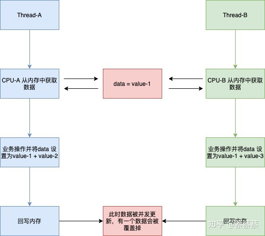
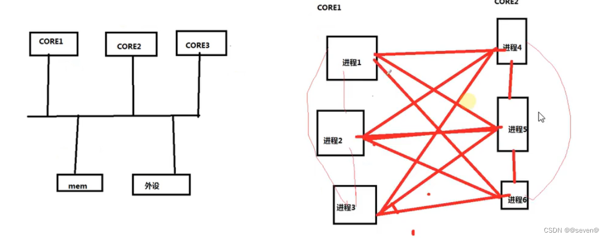

# 1.并发控制

## 1.1.并发概念

​    

**并发（concurrency）：**指的是多个执行单元同时、并行被执行，而并发的执行单元对共享资源（硬件资源和软件资源上的全局变量、静态变量等）的访问则很容易导致竞态（race condition）；

**竞态（race condition）：**简单来讲，竞态就是指多个执行序列同时访问同一个共享资源的状况；

**临界区（critical sections）：**访问共性资源的代码区域称为临界区，临界区需要被以某种互斥机制加以保护；

**临界资源：**是指一段时间内只允许一个进程访问的资源

在宏观上并行或者真正意义上的并行（这里为什么是宏观意义的并行呢？我们应该知道“时间片”这个概念，微观上还是串行的，所以这里称为宏观上的并行），可能会导致竞争； 类似两条十字交叉的道路上运行的车。当他们同一时刻要经过共同的资源（交叉点）的时候，如果没有交通信号灯，就可能出现混乱。

**在Linux内核中，主要的竞态发生于如下几种情况：**

1）对称多处理器（SMP）的多个 CPU

　　SMP是一种紧密耦合、共享存储的系统模型，它的特点是多个CPU使用共同的系统总线，因此可访问共同的外设和存储器。

2）单 CPU 内进程与抢占它的进程

　　一个进程在内核执行的时候可能被另一高优先级进程打断。

3）中断（硬中断、软中断、Tasklet、底半部）与进程之间

　　中断可以打断正在执行的进程，如果中断处理程序访问进程正在访问的资源，则竞态就会发生。此外，中断也有可能被更高优先级的中断打断，因此，多个中断之间本身也可能引起并发而导致竞态。

**Linux提供的竞态问题解决方式**

解决竞态问题的途径是保证对共享资源的互斥访问，所谓互斥访问时指一个执行单元在访问共享资源的时候，其他的执行单元被禁止访问。**中断屏蔽**、**原子操作**、**自旋锁**和**信号量**等是Linux设备驱动中可采用的互斥途径。

## 1.2.并发问题 

​    前面我们说到CPU 在执行的过程中，磁盘或者内存的数据已经发生改变，这个时候CPU在执行程序的时候，数据属于旧数据，此时计算出来的结果是不符合预期的；这个时候再将不符合预期的数据向内存和磁盘进行写入时就会造成数据错乱。



#  2.多CPU核心

多核问题，也存在数据不一致性 



# 3.解决

1.内存屏蔽    barrier----DMB DSB ISB三个指令实现的

> ARM处理器的屏障指令包括：
> DMB（数据内存屏障） ： 在DMB之后的显式内存访问执行前， 保证所有在DMB指令之前的内存访问完成；
>
> DSB（数据同步屏障） ： 等待所有在DSB指令之前的指令完成（位于此指令前的所有显式内存访问均完成， 位于此指令前的所有缓存、 跳转预测和TLB维护操作全部完成） ；
> ISB（指令同步屏障） ： Flush流水线， 使得所有ISB之后执行的指令都是从缓存或内存中获得的。
>
> 读写屏障mb（） 、 读屏障rmb（） 、 写屏障wmb（）
>
> 作用于寄存器读写的__iormb（） 、 __iowmb（）

2.中断屏蔽

3.[原子操作](https://so.csdn.net/so/search?q=原子操作&spm=1001.2101.3001.7020)

4.[自旋锁](https://so.csdn.net/so/search?q=自旋锁&spm=1001.2101.3001.7020)

5.自旋锁衍生读写自旋锁

6.读写自旋锁衍生顺序锁

7.RCU

8[信号量](https://so.csdn.net/so/search?q=信号量&spm=1001.2101.3001.7020)

9.互斥体（互斥锁）

10.完成量

# **4.中断屏蔽**

在单CPU范围内避免竞态的一种简单省事的方法是在进入临界区之前屏蔽系统的中断，这项功能可以保证正在执行的内核执行路径不被中断处理程序所抢占，防止某些竞态条件的发生。具体而言：

1）中断屏蔽将使得中断与进程之间的并发不再发生

2）由于Linux内核的进程调度等操作都依赖中断来实现，内核抢占与进程之间的并发就得意避免了。

```
注意：

(1)只能禁止和使能本地CPU的中断，所以不能解决多CPU引发的竞态
```

 (2）由于Linux的异步I/O、进程调度等很多重要操作依赖于中断，中断对于内核的执行非常重要，在屏蔽中断期间说有的中断都无法得到处理，因此产时间屏蔽中断是很危险的，有可能造成数据丢失乃至系统崩溃等后果，因此在屏蔽了中断之后，当前的内核执行路径应当尽快的执行完临界区的代码；

(3）单独使用中断屏蔽**不是一种值得推荐的避免竞态的方式**，它宜与自旋锁联合使用。

 

# 5.原子操作

用途：对整形数据临界区的区域进行保护

原子操作（整型原子操作和位原子操作）是在执行过程不会被别的代码路径所中断的操作，它在任何情况下操作都是原子的，内核代码可以安全的调用它们而不被打断，原子操作有相关api给我们使用。

对于arm来说，单条汇编指令都是原子的，多核smp也是，因为有总线仲裁所以cpu可以单独占用总线直到指令结束，多核系统中的原子操作通常使用内存栅障（memory barrier）来实现，即一个CPU核在执行原子操作时，其他CPU核必须停止对内存操作或者不对指定的内存进行操作，这样才能避免数据竞争问题。但是对于load update store这个过程可能被中断、抢占，所以arm指令集有增加了ldrex/strex这样的实现load update store的原子指令。

原子操作可以解决单核，多核（SMP）的竞争问题。

 

# 6.自旋锁

​    自旋锁最初是为了在多处理器系统（SMP）使用而设计的，但是只要考虑到并发问题，单处理器在运行可抢占内核时其行为就类似于SMP。因此，自旋锁对于SMP和单处理器可抢占内核都适用。可以想象，当一个处理器处于自旋状态时，它做不了任何有用的工作，因此自旋锁对于单处理器不可抢占内核没有意义，实际上，非抢占式的单处理器系统上自旋锁被实现为空操作，不做任何事情。 

​    在多核SMP的情况下， 任何一个核拿到了自旋锁， 该核上的**抢占调度也暂时禁止**了， 但是没有禁止另外一个核的抢占调度
​    尽管用了自旋锁可以保证临界区不受别的CPU和本CPU内的抢占进程打扰， 但是得到锁的代码路径在执行临界区的时候， 还可能受到中断和底半部（BH） 的影响。 为了防止这种影响，就需要用到自旋锁的衍生。 spin_lock（） /spin_unlock（） 是自旋锁机制的基础， 它们和关中断local_irq_disable（） /开中断local_irq_enable（） 、 关底半部local_bh_disable（） /开底半部local_bh_enable（） 、 关中断并保存状态字local_irq_save（） /开中断并恢复状态字local_irq_restore（） 结合就形成了整套自旋锁机制， 关系如下：

```cobol
spin_lock_irq() = spin_lock() + local_irq_disable()


spin_unlock_irq() = spin_unlock() + local_irq_enable()


spin_lock_irqsave() = spin_lock() + local_irq_save()


spin_unlock_irqrestore() = spin_unlock() + local_irq_restore()


spin_lock_bh() = spin_lock() + local_bh_disable()


spin_unlock_bh() = spin_unlock() + local_bh_enable()
```

在多核编程的时候， 如果进程和中断可能访问同一片临界资源， 我们一般需要在进程上下文中调用spin_lock_irqsave（） /spin_unlock_irqrestore（） ， 在中断上下文中调用spin_lock（） /spin_unlock（） 。 这样， 在CPU0上， 无论是进程上下文， 还是中断上下文获得了自旋锁， 此后， 如果CPU1无论是进程上下文， 还是中断上下文， 想获得同一自旋锁， 都必须忙等待， 这避免一切核间并发的可能性。
同时， 由于每个核的进程上下文持有锁的时候用的是spin_lock_irqsave（） ， 所以该核上的中断是不可能进入的， 这避免了核内并发的可能性。 

***\*自旋锁的注意事项：\****

1） 自旋锁实际上是忙等锁， 当锁不可用时， CPU一直循环执行“测试并设置”该锁直到可用而取得该锁， CPU在等待自旋锁时不做任何有用的工作， 仅仅是等待。 因此， 只有在占用锁的时间极短的情况下，使用自旋锁才是合理的。 当临界区很大， 或有共享设备的时候， 需要较长时间占用锁， 使用自旋锁会降低系统的性能。
2） 自旋锁可能导致系统死锁。 引发这个问题最常见的情况是**递归**使用一个自旋锁， 即如果一个已经拥有某个自旋锁的CPU想第二次获得这个自旋锁， 则该CPU将死锁

# 7.自旋锁衍生读写自旋锁

自旋锁（rwlock） 可允许读的并发

自旋锁不关心锁定的临界区究竟进行怎样的操作，不管是读还是写，它都一视同仁。即多个执行单元同时读取临界资源也会被锁住。读写自旋锁（rwlock）是自旋锁的衍生出来的、它允许读的并发操作。读写自旋锁是一种比自旋锁粒度（保护范围）更小的锁机制，它保留了“自旋”的概念。在读写操作时，允许多个读执行单元；写操作最多有一个写进程，且读和写不能同时进行

## **7.1.自旋锁与读写自旋锁的对比：**

| 操作  | 自旋锁（spin lock） | 读写自旋锁（rwlock） |
| ----- | ------------------- | -------------------- |
| 读    | 互斥                | 不互斥               |
| 写    | 互斥                | 互斥                 |
| 读+写 | 互斥                | 互斥                 |

# 8.读写自旋锁衍生顺序锁

顺序锁（seqlock） 是对读写锁的一种优化， 若使用顺序锁， 读执行单元不会被写执行单元阻塞， 也就是说， 读执行单元在写执行单元对被顺序锁保护的共享资源进行写操作时仍然可以继续读， 而不必等待写执行单元完成写操作， 写执行单元也不需要等待所有读执行单元完成读操作才去进行写操作。 但是， 写执行单元与写执行单元之间仍然是互斥的， 即如果有写执行单元在进行写操作， 其他写执行单元必须自旋在那里， 直到写执行单元释放了顺序锁。
对于顺序锁而言， 尽管读写之间不互相排斥， 但是如果读执行单元在读操作期间， 写执行单元已经发生了写操作， 那么， 读执行单元必须重新读取数据， 以便确保得到的数据是完整的。 所以， 在这种情况下， **读端可能反复读多次同样的区域才能读到有效的数据**。

# 9.RCU

读-复制-更新(Read-Copy-Update, RCU)

不同于自旋锁， 使用RCU的读端没有锁、 内存屏障、 原子指令类的开销， 几乎可以认为是直接读（只是简单地标明读开始和读结束） ， 而RCU的写执行单元在访问它的共享资源前首先复制一个副本，然后对副本进行修改， 最后使用一个回调机制在适当的时机把指向原来数据的指针重新指向新的被修改的数据， 这个时机就是所有引用该数据的CPU都退出对共享数据读操作的时候。等待适当时机的这一时期称为宽限期（Grace Period）
同步RCU

```scss
synchronize_rcu()
```

该函数由RCU写执行单元调用， 它将阻塞写执行单元， 直到当前CPU上所有的已经存在（Ongoing）的读执行单元完成读临界区， 写执行单元才可继续下一步操作。 synchronize_rcu（） 并不需要等待后续（Subsequent） 读临界区的完成

# 10.信号量

信号量（semaphore）是用于保护临界区的一种常用方法，它的使用方式和自旋锁类似，只有得到信号量的进程才能执行临界区代码。但也与自旋锁有不同之处，对于获取不到信号量的执行序列将会进入休眠状态而不是原地打转。

# 11.互斥体（互斥锁）

互斥体是进程级的， 用于多个进程之间对资源的互斥， 虽然也是在内核中， 但是该内核执行路径是以进程的身份， 代表进程来争夺资源的。 如果竞争失败， 会发生进程上下文切换， 当前进程进入睡眠状态，CPU将运行其他进程。 鉴于进程上下文切换的开销也很大，

 因此，只有当进程占用资源时间较长时， 用互斥体才是较好的选择。当所要保护的临界区访问时间比较短时， 用自旋锁是非常方便的， 因为它可节省上下文切换的时间。

## 11.1.互斥体和自旋锁选择的三大原则：

1） 当锁不能被获取到时， 使用互斥体的开销是进程上下文切换时间， 使用自旋锁的开销是等待获取自旋锁（由临界区执行时间决定） 。 若临界区比较小， 宜使用自旋锁， 若临界区很大， 应使用互斥体。
2） 互斥体所保护的临界区可包含可能引起阻塞的代码， 而自旋锁则绝对要避免用来保护包含这样代码的临界区。 因为阻塞意味着要进行进程的切换， 如果进程被切换出去后， 另一个进程企图获取本自旋锁， 死锁就会发生。
3） 互斥体存在于进程上下文， 因此， 如果被保护的共享资源需要在中断或软中断情况下使用， 则在互斥体和自旋锁之间只能选择自旋锁。 当然， 如果一定要使用互斥体， 则只能通过mutex_trylock（） 方式进行， 不能获取就立即返回以避免阻塞。

# 12.完成量

定义在头文件linux/completion.h中;
完成量(completion)是Linux系统提供的一种比信号量更好的同步机制,是对信号量的一种补充;它用于一个执行单元等待另一个执行单元完成某事;使用完成量等待时,调用进程是以独占睡眠方式进行等待的;不是忙等待;

completion是一种代码同步机制，比锁/信号量更可取。如果有一个或多个线程必须等待某个内核活动达到某个点或某个特定状态，那么completion完成量可以为这个问题提供一个无竞争的解决方案。当想使用yield()或msleep(1)循环来允许其他事情（线程）继续执行时，可以使用wait_for_completion()和complete()来代替。

使用完成量的优点主要有以下两个：

（1）使代码更容易阅读。

（2）产生更高效的代码，因为所有线程都可以继续执行，直到实际需要结果为止，而且使用低级别调度器sleep/wakeup，对完成量的等待和发送都非常高效。